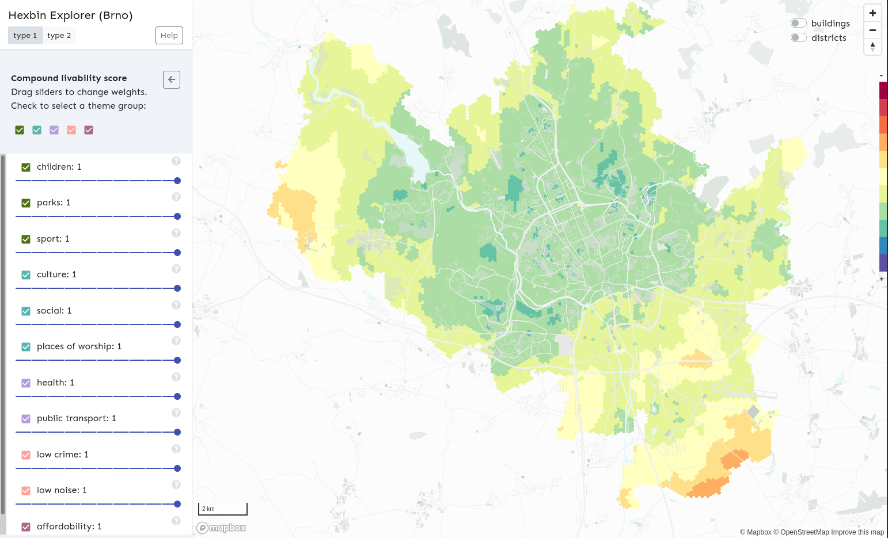
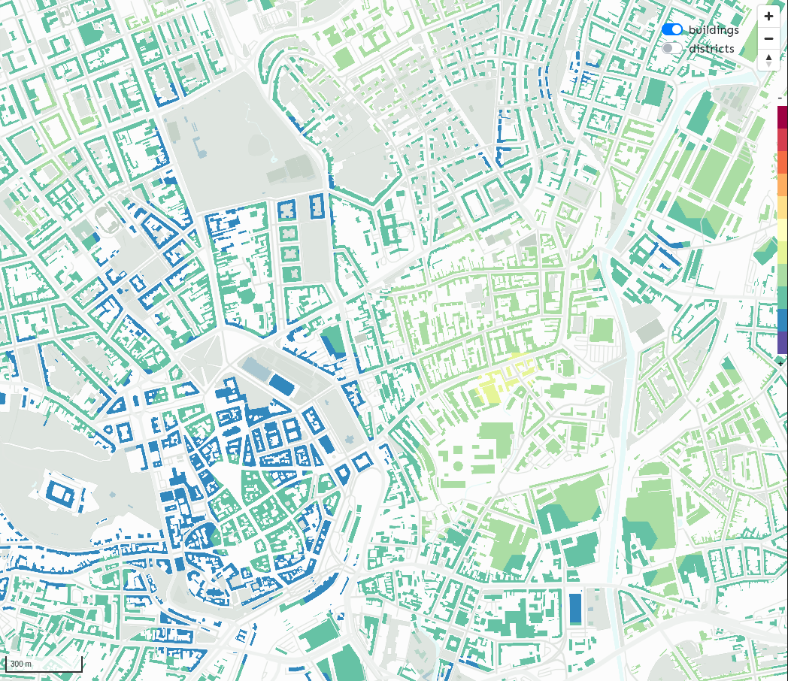

# Appendix C: Urban recommendation system

This appendix provides a brief overview of the interface of the map based web application created for the first case study. Not that the best way to explore the application is by viewing the live demo at <pondrejk.eu/hex> (the application has been tested on Firefox 90 and Chrome 92 browsers).

