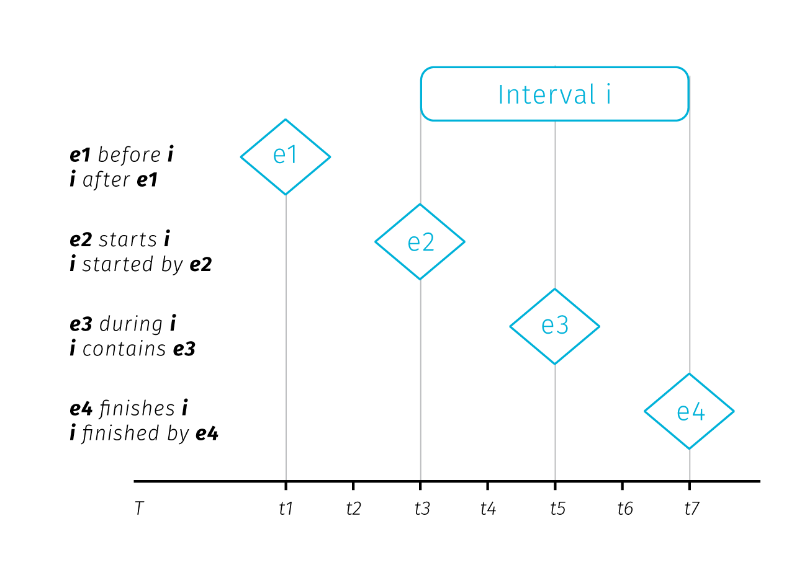

Making sense of spatial big data 
--------------------------------

> *Technology is the answer, but what was the question?* 
> Cedric Price

*This chapter looks more closely on the properties of data with point spatial reference that count for the majority of spatial big data. Then we will outline the tendencies in spatio-temporal knowledge discovery, and we will discuss general ways how cartography can support understanding the world trough the lens of big data. We will also discuss some objections to the idea of insight generation (or rather of certain naive ways in which data is interpreted) and speculate on how cartographic practice could overcome such risks.*

# Spatial big data classification: stations, events, and agents

The vast majority of what is presently understood as spatial big data has point spatial reference. This prevalence comes naturally if we realize that the "data point" location is described basically as a coordinate pair -- two digits that can be easily stored in standard database systems without the need to observe topological rules and other constraints that GIS vector data model enforces on line and polygon geometries. Point data are spatial data that are easily created and handled by non-spatial (meaning not GIS-enabled) systems that account for majority of data production. For this reason, and due to the scope limits of this thesis, we will almost exclusively focus on visualisation issues related to point data^[We'll use the term *point data* as a shorthand for "data with point spatial reference".].

Point spatial data are not a homogeneous group. We can describe three classes representing three kinds o objects differentiated by their behaviour in space and time, more precisely by the by how dynamic their *existence*, *location* and *attributes* are over the course of observation. These properties are determined largely by the source of data, so for convenience we can nickname the three types as *stations*, *agents* and *events*:

- stationary objects (*stations*) have static position and existence, meaning that they don't move or disappear during observation. What is dynamic is the set of attributes attached to the object -- in big data world these attributes can come as a continuously updated streams. Basic examples include weather stations, traffic cameras, and any kind of stationary sensors.
- moving objects (*agents*) move around, so their position changes during observation, also their existence can be dynamic, meaning they can enter or exit the area of interest. Various kinds of dynamic attributes can be attached. We can reconstruct the history of movement of these objects, which invites conversion to linear representation. Examples are vehicles or pedestrians carrying GPS devices and sensors. 
- episodic objects (*events*) have existence limited to a specific point in space and time. As they are short-lived, we can say that position and associated attributes are static. Prime example are data collected from social networks. 

Think of this distinction as a convenience model fit for the majority of big data related use cases that expect short time frame for data utilization. Technically speaking, the difference between stations and events is dependent on the frame of reference, as objects seen as stationary in shorter observation periods can become mere events if the observation time frame is significantly extended. The existence of a building usually spans over a long time period, though if we stretch the perspective to a century or a millennium, most buildings will become mere glimpses existing a tiny fraction of time^[see https://waitbutwhy.com/2013/08/putting-time-in-perspective.html for an excelent visualisation of perspectives changing with time frame]. Geographers would note that also the location of seemingly static environmental features doesn't hold over time (think of a meandering riverbed or a volcanic landscape). So again, longer time frame changes our assumptions of static location.

Furthermore, the spatial extent of the observed area and hence the scale of the map influences the distinction between moving and stationary objects -- if the movement is too limited to be recognized at a given scale, we can model it as a stationary object. Also, some events can be reimagined as moving objects with discrete presence across observation time frame, for example if social media events dislocated in space and time are traced back to a single moving source device^[See examples of such practice here https://www.nytimes.com/interactive/2019/12/19/opinion/location-tracking-cell-phone.html]. But let us not problematize any further, with most big data sources being temporally and spatially limited (to near real time and mostly urban environment)^[Again, as an exception from the rule, there are some impressive global-scale data projects: global fishing watch..., tracking ships...], the distinction to stations, agents and events would suffice. Judging by the real data samples we can say that stations are usually physically present in the environment while events are mainly records of something that happened at given location, either physically expressed in the environment and observable by onlookers ("I was at a restaurant") or not ("I was shopping online while waiting at the bus stop"). 

         existnece (records of spatial and temporal reference) | attribute collection      | location  
station  continuous                                            | continuous or discrete    | static
agent    continuous or discrete (can reappear)                 | continuous or discrette   | dynamic
event    discrete                                              | discrete                  | static

In the above image and a table we assume that the attribute collection is happening continuously for stations and agents. This does not mean that the attributes have to be collected continuously at all times. Some sensors can record at a regular time interval or only in case of an event. The data output can then contain several "no data" records or even no records at all if the event did not happen. It then depends on the goal of the analysis how such data are conceptualized. For example a traffic camera is a stationary object but some part of its data collection is episodic -- a photo is taken just when a speeding vehicle drives by. The classification introduced above differentiates between the existence of an object and the act of recording data by the object. We assume that the sensor's presence without recording has also some analytical potential as it proves the absence of event, while with no sensor in place we cannot say if the event did take place or not. 

Compared to stations and agents, events with episodic presence seem to be the least data-rich, but their analytic potential grows when lot of them is accumulated. Clusters of georeferenced point events, a.k.a. point clouds are at the core of spatial analysis based on data from mobile devices.

The gaps in data collection and the absence of abrupt changes hints how to optimize data storage from such sources. Even though storage optimization techniques are not within the scope of this thesis, they can pose a certain lesson for cartographic visual analysis. For cartographers, the utilized resource is a space within the map plane, that can only hold a certain amount of graphic elements to remain useful. The graphic fill reduction (or better optimizaiton) is an aspect that can enhance the knowledge discovery at the end of the visualisation pipeline (more about it in the practical part of thesis on aggregation).

TODO -- revisit when case studies are done and connect it better with the actual data used

# Spatio-temporal knowledge discovery and visual analytics

In this section we will briefly discuss techniques for exploring spatio-temporal data, with emphasis on practices that would benefit from enhanced cartographic visualisation.

People engaged in data-related practices are motivated by an expectation that their work can help to provide some insight into how the world works, that there is some knowledge that can be unlocked, mined, or distilled from otherwise untelling piles of data. Such insight seeking is the crux of the concepts such as *data mining*, *spatio-temporal knowledge discovery* and *visual analytycs* that we will explore furhter.

*Data mining* is exploring databases using low-level algorithms to find patterns. *Knowledge discovery* is then a higher-level extension of data-mining techniques that requires human-level intelligence and domain knowledge to guide the process and interpret the results (@miller2015spatio). In the knowledge discovery process, computation is seen as an extension of human force rather than its replacement, therefore the goal is to marry the best of both worlds. This is reconciled with the (current) capabilities of information technologies: there are tasks that are very simple for computers and very hard for humans (e.g. calculate the square root of 567789898) and vice-versa (e.g. recognize a cat on a picture TODO -- maybe obsolete example). *Visual analytics*, the science of analytical reasoning supported by interactive visual interfaces (@thomas2005illuminating), then zooms in at the interaction frontier between human and computer in order to find the best tools for visual interaction between the two. If we imagine a continuum ranging from "work done purely in human brain" towards "work done by machines", knowledge discovery places itsefl somewhere in the middle. 

![**Fig.** Human-machine continuun, knowledge discovery as the best from both worlds (the actual wording could be different, for example @keim2008visual lists on the "machine" side: statistical analysis, data management, data mining, compression and filtering; on the "human" side: cognition, perception, visual intelligence, decision making theory, information design; and in the "middle": human-centered computing, semantics-base approaches, graphics and rendering, and information visulaisation). With emphasis on cartography, I summarize the human cognitive tasks as "map reading".](imgs/man-machine-continuum.png)

We can draw the humman-machine continuum in the field of digital cartography as well. Here, the human cognitive abilities are applied to seek patterns, explore spatial context or make decisions, while computational aspects include data management and processing. Now, the computation heavy algoritms like optimal route calculation already step in to unburden humans from some decision-making so the destinction shouldn't be taken as something rigid (TODO see the disucssion at the end of the chapter on how the continuum might evolve and how it could affect cartography). For now, just note that cartography operates as an interface at the human side. Some authors go on to define *visual analytics for spatio-temporal data* as interlinked techniques in interfaces with map as a central metaphor (@guo2006visualization). We can think of it as map reading with robot assistants.

To develop further on the kinds of interaction with spatial data, we can explore the concept of *spatial* and *temporal* queries. On the general level we can search for spatial and temporal relations in all theree types of point objects mentioned in the first section. In addintion, moving agents can genrate specific relations not innate to stations and events.

1. **Spatial relations** are at the very basis of map reading for orientation clues, but are also vital for interpreting thematic information. We percieve these relations between the dominant themes (e.g. in weather maps of precipitation and atmospheric pressure zones) or between the theme and the topographical base map. The major classes of spatial realtions are: *set-oriented* (union, difference, intersecton, complement, etc.), *topological* (connectivity, interior, exterior, boundary), *directional* (cardinal, object-centered, ego-centered directons) and *metric* (e.g. Euclidean or network-based distance) (@worboys2004gis). 

Point spatial data of large extent complicate observng such relations. We rarely ask about a single specific point from the set, more often we seek to extract some tendency of the whole point cloud. The nature of some data sources can dictate some spatial relationships (such as vehicles being spatially bound the road network), but in many cases the density of point cloud obscures the base map and precludes reading of attribute variablity within the set.

As we are dealing mosty with point data clusters in two dimensional space it is worth to say that spatial relations between such sets are harder to conceptualize than it is with polygonal features. @egenhofer1991point describe 16 actual relations (9 if reduced to spatial regions relevant in GIS) in two dimensional space. Hovewer, in their approach @egenhofer1991point define the point sets by their exterior boundry and then effectively treat them as polygons. But delineating the exterior boundry is a challenge in itself, for example when dealing with smooth transitions in point density at the border, or with outliers. Any line would be in a sense an inaccurate approximation.

Spatial relations between point clouds in 3D are a subject of extensive research (e.g tran2017extracting or chen2019deep) however, the motivation is object identificaton. In this lines of research the point cloud is a monicker for distinct solid objects in the real space, not an object of research in intself. For cartography, the point sets already come with some assigned attributes, so there is no need to extract them. Point sets are more unruly in the wild, more like mulitihole toruses, and saying anything meaninful about relations of such things is increasingly hard. (TODO illustrate this difficulty, double check the paragraph)

TODO maybe some cluster shape measures from geostatistics?.

2. **Temporal relations** are measures of coincidence. There are thirteen possible relations between two temporal records described in @allen1984towards. As we have seen with stations, agents and events, the existence and data colection of any entity can be either continous or discrete in time, it is therefore useful to distinguish between *time point* and *time interval* when investigating temporal relations (see figures). Linear conceptialization of time can be supported with cyclical and branching time, there can be discrepances between the temporality of base map and the thematic overlay, or between the time interval of existence and representations. We'll untangle these complexities in chapter 5.

3. **Moving objects** have a specific set of properties comming from the combination of their spatiotemporal circumstances. These can be *instantenious* (actual position and speed), *interval-based* (e.g. travel distance from departure), *episodic* (related to extenal event) or *total* (related to entire trajectory). (@laube2007movement, andrienko2008basic). 

Havig described the fundamental spatio-temporal relations in big data sets, we can briefly describe some of the methods to uncover them. Recalling the human-machine continuum at Fig., we will start at the machine side with methods from the data mining group to eventually move towards the human side.

Several data mining concepts are of interest. **Association rule mining** is searning in databases for conditions ocurring together frequently: 

> *x => y (s%,c%)*

Where *x,y* are conditions, together forming an *itemset* and *s,c* are levels of support and confidence. Suport and confidence are basic rule performance measures, support being the measure of how often the itemset occurs in the whole database and confidence being the proportion of x being a memeber of an itemset x => y. For example: *park => school (4%, 55%)* means that 55 percent of parks are near schools, for 4% of items in the database (@han2011data). The measures of support and cofidence allow us to set tresholds for significantly frequent co-ocurrence.

*Spatio-temporal association rules* extend associtation rules to describe how objects move among a set of regions over time (@verhein2008mining). Inocorporation of spatiality into assotiation rules takes form of a simple binary condition telling if the items coocurred in the same predefined sets of regions or not.

*Sequence mining* is seraching for patterns in time and other sequences. Similarly to association rules, we search for events occuring frequently together by considering three parameters: the *duration* of the whole sequence, the *event window* (time-horizon for considering events as temporally coincident) and the *time interval* between events (@miller2015spatio). These parameters allow us to turn the temporal relations between two items into binary parameter telling if the items co-ocurred (that is when the time interval fits into the the event window). 

*Periodic pattern mining* is a type of sequence mining that searches for recurrent patterns in time sequences. Such patterns can be: *full periodic patterns*, *partial periodic patterns* (e.g. just on mondays), and *cyclic or periodic association rules* that associate events that occur periodically together (@han2011data).

Considering the breadth of posible spatial and temporal relations described earlier, the conceptualization of spatial and temporal coocurrence in the association rules may seem rather simplistic. Basically it is reduced to a yes/no parameter. Moreover, moving from the level of individual database entries towards assessing relations between compound entities such as spatial point clusters seems to be out of the scope of these methods. Of course, the way spatiality is inscribed into association rules could be made more sophisticated, though with inevitable implicatons for mining performance. With large datasets, mining even the simple rules forces us to consider performance. ( TODO maybe develop to say here simple visual comparison is cheaper, at least for clusters). 

At this point we can step back from mining algorithms to invite some human interpretation and to consider what conclusions we can actually draw from spatial and temporal co-ocurrence of events. The usual assumption is that such coocurrence can point to some form of causality. Drawing from approaches by @allen1995qualitative and @galton2012states; @bleisch2014mining distinguish between the trigger that apparently causes the event and the environmental conditions that have to be fulfilled for the effect to occur.

In this model, *state* is an environmental condition and *event* is a change of state. Events are caused only by other events, while states only affect causation by allowing events to cause other events. Events *initiate* and *treminate* states, while states *allow* causation. The *initiate*, *terminate* and *allow* relationships are then dubbed *causal-like* to distinguish them from the event-to-event causation. TODO example

In conceptual framework for finding *candidate* causal relationships in movement patterns @bleisch2014mining distinguish between three kinds of granularity at which the phenomena can be described: *spatial*, *temporal*, and *causal*. While the first two are defined by the the smallest spatial and temporal units, causal granularity is given by the kinds of events observed. Spatial and tempral granularities can be easily reduced to "see the bigger picture" (by changing the spatial scale, or extending the time range of observation), but causal granularity is more firmly defined by the data collection design. 

@el2002spatio note that alghough the general expectation would be that the effect occurs immediately after the cause, some delay between the effect and the cause can occur, possibly because the cause must attain some intensity treshold to trigger the event or because the effect and cause are spatially separated and it takes time until the influence of the cause reaches the location where it takes effect. @bleisch2014mining suggest that these apparent delays result from lower causal granularity of observation, i.e. there is some intermediary chain of effect and cause that happens during the delay but it is not recorded by the observation. (TODO: Example, fish, signall, make up something). Wheter we accept the effect delays as real or illusionary might be more of an academic question, tracing down the potential causal link between start and end events can yield predictive potential even when the intermediary causal chain remains undiscovered. 

Discussing the interpretation of spatiotemporal co-ocurence we have moved on the human-machine continuum towards the human end. At this point, visualisation becomes important as an interface between the user and the data. One of the general models describing how knowledge discovery proceeds via inference and interaction is the sense-making loop (fig).

Visual analytics extends the concept of visualisaton: not only it provides a visual interface to the database, but also makes the data processing piplines transparent for an analytic discourse. Keim2008visual in their introductory paper say the goal of visual analytics is the creation of tools and techniques to enable people to:

– Synthesize information and derive insight from massive, dynamic, ambiguous, and often conflicting data
– Detect the expected and discover the unexpected
– Provide timely, defensible, and understandable assessments
– Communicate assessment effectively for action

This is turly a long way from the low-level search for coocurrences, though it is not clear how should these grand goals materialize in practice.Keim2008visual call for broad inter-disciplinary collaboration between related fields (Visualisation, Data Management, Data Analysis, Perception and Coginition, Human-Computer interaction) and idetnify a range of application and technical challenges. 

To conclude this section, we can compare the data mining approaches with human interpretation...

TODO pros and cons of visual vs algorithmic pattern finding:
alg:
- hard to inscribe spatiality a and temporality, need to model coocurence beforehand, trial and error for changing the model
- search algorithms performace heavy
human:
- ablity to easily gain and overview of clusters beyond individual database entities
how to join alg + human?

Causation-related questions for cartography (TDOO process)

- finding spatio-temporal co-location that would suport causation hypotheseis is in currently realized by comparing spatial patterns. The causal delays may hamper such comparison, one approach is extend the time range of records (e.g. comparing cummulative data within two choroplets can smooth the volatilites in favor of the overall tendency). 
- Another approach is in looking for some general similarities between two sets of shapshots (spatial patterns) -- if there is some similarity ocurring at some interval then we have identified the delay interval. This is spatial but not temporal collocation. Problem: this assumes causal relationships across the whole area of pattern -- how to search for delay in just a sub area?
- Temporal but not spatial collocation -- is map a good tool for displaying this (rather a bar chart?)
- What amount of apparent spatio-temporal collocation allows to rule out epiphenomena? Can map alone rule out a hidden common variable?
- How to map causal-like relationships, e.g. potential for causation to happen via variations of state across the area?
- overall, the ability of dynamic maps to find these collocations and link them to causation is to be assesd, but how? :)

# The role of cartography

- challenges in finding causal relationships
- challenges stemming from the medium shift
- challenges in processing big data

### existing research agendas
### challenges of medium transition -- alternation of rules from static age, explorative cartography -- less is more? general problem areas (end of chapter?)
### on collaboration with other teams

Cartography has a long tradition of making data sets comprehensible to our visual minds. Beautiful and authoritative maps in school atlases explaining the formation of air masses affecting world's climate, or the positions of ocean streams have an air of definitiveness but were build upon a loads of messy data. These data had to be collected, brushed and analyzed for the presence of meaningful patterns, and than visualised in a way that would appeal to human comprehension. The process for creating such maps was by no mans real-time but allowed for fine tunnning all aspects of a map (from the appropriate method to visualise the ...TODO insert topic... to making the street connections visually pleasing). Analog map making allowed for perfectionism.

For digital cartography, it took a long time to come any closer to the visual quality of the best atlas works. There is still some unmined potential towards the graphic excellence in web mapping^(I will use therms digital cartography, web and interactive maps interchangebely) (though there are tools to get us there -- see later). Web mapping has though the obvious advatage of allowing interaction -- so the user can zoom, pan, change, filter and combine the displayed data. The second big advatage is allowning for displaying data real-time as the data source is updated. This is feature is used maybe surprisingly less then expected, not all interactive maps are dynamiclly updated, which is ok if the topic is historic (like medieval monasteries in France or 1991 election results in Yugoslavia). But this thesis focuses on interactive map interfaces based on dynamically updated data, which poses a new set of challenges on a poor cartographer. Not only does he need to ensure cartographic excellence in the map field (excellent map provides answers, helps to ask queations, supports understanding in an engaging way), but also to pertain this excelence for the changing data and user-induced modifications.

In other words, cartographer needs to design the map well, but also design it well for the data he din't see yet, and desing interactions and the map's behavior under various (countable but vast) number of states induced by these interactions. A hard task. 

The atlas maps mentioned above surved for presentation of knowledge, were confirmatory. Digital cartography allowed for exploratory cartography (or more precisely moved the exploratory part in the visualisation pipeline from before map creation to after, and from the map author to the map user). Visual analytics based on spatial data (definitions below) provide interfaces to process and visualise data. On the one hand it allows users to mine novel infomation, on the other hand it leaves him to create his own narration about, prone to owevhelming visual clutter, misinterpration, false correlations, lack of engagement and guidenance on where to start. Data manipulation interface, a window to the database is useful for those who know what questions they want to ask. Hypothesis formation support that these tools aim to provide is a property that is hard to measure (hard to prove it works, hard to compare which interface is better).

*VA for spatio-temporal data* includes interlinked techniques in interfaces with map as a central metaphor (@guo2006visualization)

User is left with a spiffy-looking front-end to a database, with no sense of narrative or framework for interpretation. Simmilar situation occuring in business analytic dashboards proliferating in enterprises that fail to make sense to users, or worse simulate insight with vaguely understood and hardly interpretable metrics.

Consither this somewhrere <http://norvig.com/experiment-design.html>

Here we need probably some inspiration from other fields. Aim is moving somewhere inbetween the presentation and exploratory interfaces, possibly to get the best of the both. Exploratory interfaces with some hinting, notifying which findings make sense and which not. 
Designers of exploratory interfaces could give greater thought to what questions users might want to ask about the portrayed data.

dynamic data examples:
Global fishing watch

See also: https://www.researchgate.net/publication/236993632_Illuminating_the_Path_An_RD_Agenda_for_Visual_Analytics 

**Two issues** (contradicting) tendencies arising from cartography moving to (digital/interactive/web) form. A change of medium used to disseminate cartographic products. 

a.) Cartogaphic quality of web maps are not yet on par with the (best) examples of static maps and atlases (regardles of the date production -- even though maps and atlases age in the sense of content, cartographic metods used in them often remain inspirational and valid, so for cartographer old map products doesn't have to be outdated). This might be a side effect of non-cartographically aware people producing maps (either amateur cartographer acessing easy to use tools, or people comming from graphic design backgrounds bringing 'creative' changes) ^[This is not intended to belittle such activities, as the eyesoreness of some maps is a little tax for democratization of mapping tools. In fact, efforts to help citizen cartographers have been made by more experienced practicioners, most notably in Wood, -- TODO cituj tu ich prirucku]. Another possible cause is that the web mapping frameworks tend to provide just an opinionated set of visualisation options (TODO: picture of the google map's point sign) and cartographers lack the skills to customize or extend these visualisation toolkits. Little to say that some of the classical cartographic techniques are quite demanding when transfered to variable-scaled enviroment. For exaple, the symbol collsions that needed to be resolved just once (as if that was not enough) have to be treated (perhaps algoritmically) in all zoomlevels. (TODO: examples of such methods in pictures -- call it "craftsmen" side of cartography) Cartographers who want to venture to raising the quality of web maps are then forced to dive into frond-end web development^[The situation is improving with rise of web-gl based mapping platforms such as Mapbox and CartoDB, which provide map design environments resembling the visualisation tiers of desktop GIS].  

b.) Apart from the limitations posed by opinionated mapping frameworks there are also certain mindset limitations that come from transfering a visual artifact from one medium to the other. Such transfer is not the same as if the visualisation was designed for the new medium from scratch as there are realized or unrealized ideas of how things should be done transrered from the practices required by the old medium. This was apparent for example the grid-like organization transferred from printed newspapers to web news portats initally and still lives there though responsivity required by small-screen devices pushed its rethinking. Simmilar case in cartography is the dichotomy between the topographic base and the tematic overlay. A good mental excercise for cartographers would be imagining map interaction unattached from any medium -- what would we design if anything was possible? 

Ford's quote: "If I asked people what they want, they would ask for a faster horse" (find exact.). Similarly, we can test the cognitive efficiency of the visualisation methods that already exist, and users would prefer the methods they know. Cartography's quest (in my opinion) is to extend the arsenal of visualisation methods. As we will see further, interaction and animation pose new challenges to cartographic visualisation, with possibly multiplied opportunities for method combinations and innovations for data exploration and possibly knowledge generation. Further, plenty of tricks from the rich history of cartographic practice did not make it to web mapping toolbox. Recent emerging technology owing much to the gaming industry promise to bring web cartography to the flexibility of the pen and paper ^[or brush, engraving tool etc.] of pre-digital cartographer. Only now the shifted role of cartographer would be in enabling data to paint the picture for us.  Much of the rest of this thesis will be exploring this truly exciting prospect.

notes from @tufte1998visual
---------------

-- on perils of dequantification of statistical images: "...when scietifiec images become dequantified, the language of analysis may drift toward credulous descriptions of form, pattern and configuration .. rather than answer to questions *How many? How often? Where? How much? At what rate?*".

-- on John Snow's map and method, it was good because of 4 points:
1. Placing data in appropriate context for assesing cause and effect
2. Making quantitative comparisons
3. Considering alternative explanations and contrary cases
4. Assesment of possible errors in the numbers reported in graphics

@jiang2017spatial
----------------
good stuff on GIS challenges with spatial big data
from toc:
- What is spatial Big Data
- Spaial and spatiotemporal BD Science

@lee2015geospatial

For interactive analytics, we have identified two main components: complex event processing (CEP) and spatial online analytical processing (SOLAP). Complex
event processing (CEP) is event processing that involves multiple data streams to infer events or patterns that imply more complex situations.
Spatial OLAP is a visual platform for analyzing spatio-temporal data quickly and easily as well as for exploring the data in a 79 Fig. 8. The Movebank service. multi-dimensional way with aggregation levels being available on cartographic displays and in tabular and diagram displays. The concept of Spatial OLAP, which tries to combine geographic in- formation systems (GIS) and OLAP, was invented in late 1990’s. Spatial olap not really functional for big data backend. 
-- though they identify these two topics as challenges, their imo better contribution is outlining the capabilities of spatial bd system:
3 layers: Geospatial big data integration and management, Geospatial big data analytics (batch or intercative), and, Geospatial big data service platform.

global challenges from  lee2015geospatial
-----------------
M. Marien, Global challenges for humanity, http://www.millennium-project.org/ millennium/challenges.html , accessed: 2014-08-30.

Geospatial big data or simply spatial big data are societal op- portunities [11,12] . The Millennium Project identified 15 global challenges that the human kind is facing as in Fig. 3 [13]. Many of them can benefit from geospatial big data. Shashi Shekhar [14] @shekhar2012spatial, a renowned computer scientist, says that the seven challenges are related to geospatial big data, as indicated by boxes in the figure.

# uncertainty and data quality
In this work, we will be using the theory of DiBiase[7] @dibiase1990visualization  (later revised by MacEachren and Kraak [8]) @maceachren1997exploratory

The quality of data in general can be evaluated in terms of completeness, consistency, positional and thematic accuracy and temporal quality [10]. <Iso I. 19157: 2013: Geographic Information—Data Quality. International Organization for Standardization (ISO). 2013;>

The reliability of a dataset is then associated with many types of uncertainty. One classification of uncertainty is defined by Fisher [11] @fisher1999models. On a basic level, he recognises three types of uncertainty: probability, vagueness, and ambiguity. We can also specify uncertainty based on the relevant domain - it may be spatial, temporal, or attributional. 

Hunter [15] @hunter1999managing defines two general possibilities. The first one, uncertainty reduction, is based on the idea that it is always possible to prepare a dataset of better quality anyway - for example by obtaining more information, doing further analysis or the model assessment. The second option is uncertainty absorption and consists of many options of how to work with uncertainty, some of which are relevant in the case of historical datasets. The first idea is to sensitively omit it, mainly when a domain expert finds the impact on the outcome minimal. The second option is to modify the visualisation method so this method displays both the features and their certainty - there are many examples of studies that show and compare these methods (see e.g. [16–19]). 
@senaratne2012usability
@maceachren1992visualizing
@kubivcek2012uncertainty
@kinkeldey2014assess

@goodchild2013quality
----
proposes for data quality: "Three methods of quality improvement and assurance are proposed. Only the third is sufficiently robust and rapid, especially in time-critical situations." 
Hardening Big Data:
-- observations in big data can be mutually reinforcing. "Theprinciple is often expressed as Linus’s
Law (Raymond, 1999), which originated in software
development, and is in essence the statement ‘The
larger the review group, the faster and more effective
the  convergence"
-- quality control of big data is sometimes
addressed by social hierarchies (orgs like wikipedia, or communities like in open source dev....)
-- here is the possibility of automated
assessment and synthesis, which is the only effective
way of achieving the velocity advantages of big data
withoutsacrificingvolume

# BD discussions from bollier2010promise
**Visualization as a Sense-Making Tool**
-- Stensrud agreed that visualization of Big Data gives you a way “to find things that you had no theory about and no statistical models to identify, but with visualization it jumps right out at you and says, ‘This is bizarre.’ ”
-- Or as Lise Getoor, Associate Professor in the Department of Computer Science at the University of Maryland, articulated, visualizations allows researchers to “ ‘explore the space of models’ in more expansive ways.  They can combine large data sets with statistical analysis and new types of computational resources to use various form functions in a systematic way and explore a wider space.”
-- Kim Taipale of the Center for Advanced Studies in Science and
Technology warned that visualization design choices drive results every bit as much as traditional “data-cleaning” choices.  Visualization techniques contain embedded judgments.
-- "“You need to make sure the pattern that you think is there, is actually there,” said Andersen.  “Otherwise, the problem gets worse the bigger your data is—and we don’t have any idea how to handle that in visualization because there is a very, very thin layer of truth on the data, because of tricks of the eye about whether what you see is actually there.  The only way that we can solve this problem right now is to protect ourselves with a model.”"
--If you’re trying to predict the weather in New England from looking at the weather patterns in California, you’ll have a problem.  That’s why you need the whole system.  You’re not going to need every molecule in that system; you might be able to deal with every weather station, or some degree of aggregation that’s going to make the analysis a lot easier. Hal Varian, Chief Economist at Google
-- Bill Stensrud took issue with this approach as a general rule:  “If you know what questions you’re asking of the data, you may be able to work with a 2 percent sample of the whole data set.  But if you don’t know what questions you’re asking, reducing it down to 2 percent means that you discard all the noise that could be important information.  What you really want to be doing is looking at the whole data set in ways that tell you things and answers questions that you’re not asking.”
-- For Joi Ito, the Chief Executive Officer of Creative Commons, the
search for correlations is a trap to be avoided, at least in his capacity of a computer security expert and a venture capitalist.  Ito says he is “always looking for unpredictable things that you can use opportunistically.”  As a venture capitalist, he is looking for the “subversive outlier” whose ideas could have a big upside.  From a security perspective, Ito says he wants to be alert to the unexpected forms of intrusion and deceit, not to the ones whose correlations can be easily discovered using computers.

When you do that kind of analysis on, say, terrorist networks, you have to understand that Hezbollah is actively trying to continuously come up with patterns that they think you won’t predict.” “Remember,” said Ito, “the same technology that we’re using to analyze Big Data enables these other actors to become more actively random.  The people who are outliers, who used to sort of behave randomly, now have access to the same tools as the rest of us and are looking at the same data.

“Big Data is about exactly right now , with no historical context that is predictive,” said Ito.  “It’s predictive of a linear thing—but you can use data collection to discover non-linearity as well. ... It’s important not to be obsessed with the old models that come from the old data. It’s more important to be ignorant enough to come up with a new model of the future.”

-- Many innovative uses of Big Data could be called “now-casting,”
said Varian. This term refers to the use of real-time data to describe contemporaneous activities before official data sources are available. “We’ve got a real-time variable, Google search queries, which are pretty much continuous,” said Varian.  “Even if all you’ve got is a contemporaneous correlation, you’ve still got a six-week lead on the reported values” for certain types of data.
--  “To make money, you’ve got to predict two things—what’s going to happen and what people think is going to happen.

# Big data -- agenda for cartography TODO
-- create appendices from agenda papers
-- notes from paper

# Collaboraton in practice 

Having described the ontological models of causation ans sensemaking as well as visions for the future of cartographic researc, we can now take an aside to dwell a bit on the nitty-gritty realities of map making in practice. Practical aspects of the profession are often overlooked in literature, as well as the fact that cartographer often needs to operate within a greater team. The smoothness of collaboration within a team is then a determining factor of the team's productivity. 

There is a (somewhat mythical) notion of “full-stack” visualization designer-developer capable of conducting the full broad range of tasks needed for a visulaisation project (@gray2012data). Though some such individuals do exist (possibly working on applications for PhD projects or small customers), it is clear that cartographer can take only so much of other roles (data analyst, UX designer, frontend developer, database administrator...) before getting on thin ice. Real-life visulaisation projects often include a range of team members or even teams with dissjoint skillsets. The question then arises on how to modularize the work. One possible model of decomosition is the information visualisation reference model (**Fig**).

Here the collaboration points lie at the transitions between the stages.
@heer2008design

Physical and temporal separation of teams and institutional and disciplinary divides lead to early-stage partitioning of tasks both in the *design* (data profilation, ideation, mockup creation and prototyping) and *development* (implementation, testing, deployment and maintenance) phase (@walny2019data). Such compartmentalizaton is not unique to dataviz projects, it could match any web development project.

@walny2019data formalize stages of data visualisation process based on experience with several assignments (Fig.). This is an itrative process where the division of labor gives rise to *handoff* events, when one team passes work products and requirements to the next team. Particularly the handoff between the design and development team is where issues can arise to affect the end result. Speaking from the postion of design team @walny2019data articulate several key challenges that affect the success of the handoff and in turn the smoothness of the whole project:

- Adapting to data changes -- changes in input data can have cascading effects throughout the stages of the process. Some breakages are inevitable, for example API alterations, and fixing them is a part of project maintenance. It is advisable to have data transformations automated as much as possible, it is likely there will be a need to reiterate them. In this sense, the scipts and the processing toolchain developed during the project can be more valuable to creators than its outputs.
- Anticipating edge cases -- though this is incredibly hard for real-time data inputs, best effort should be made to at least forsee the application states resutling from the user intercations, such as filtering, changes of scale, etc. 
- Understanding technical challenges -- knowledge of technical constraints helps to produce feasible design ideas. Development teams' constraints tend to differ form the design team, they include cross-browser compatibility, future code maintainablity. In some areas these can overlap e.g. in accessability considerations or performance optimization 
- Articulating data-dependent interactions -- prototyping interactions such as linking and brushing using conventional graphic tools is challenging, not to speak about articulaiting of animations and transitions between views. (either learn to code, or await a tool to support this specific wireframing)
- Communicating data mappings --  this is a concern when delivering static mockups for development team, the mapping between data and the interface controls may not be obvious, especially when the chomplexity of data does not allow to exemplify all possible views in mockups. Annotations within mockups are a way to mitigate this.
- Preserving data mapping integrity across iterations -- tracking implementation adherence to the design, finding errors, as well as chcking if change requests from previous iterations got implemented is solely a matter of visual inspection and therefore prone to error. (this could be fixed by automated testing, though not always feasible for all projects, more for long-running projects/products)

These challenges were formulated based on project experience with relatively static historical data inputs, which underlines why dynamic geovisualistaion of real-time data is hard: much of the advice would be impossible to follow (?). ...some conclusion to these practical issues

# General questions

1. What inspiraton can interactive web cartography take from the heritage of pre-digital mapping? What was lost in transition to digital? Are there methods and practices from tradition that could be used but aren't (because cartographers usually aren't software developers, and software developers are usually unaware of old map stocks). Danger: the perceived mantinels of the new technologies limit us in imaginig what we could do (e.g. what visualisation possibilities are provided by APIs like Leaflet).

2. limits of old media. Danger: processes of old media are transfered to new media, leaving possibilities in new tools unexplored.

3. Cartography and UX, designing an interactive map is also designing ways to interact with data. Saving space: coupling legends with controls.
Problematizing UX research, problems of cognitive testing (verification crisis in psychology) vs. A/B testing,  (data on tile usage from big providers)

4. Inspirations from product design (praktika lens, beat machines), photography (Muybridge and Marey), cinematography, video (youtube, other video services :P)

5. What is entirely specific and unique in map design apropriating the above inspirations?

# Recent objections to geospatial knowledge discovery

What is the role of cartography if:

1. It is not humans that make the decision (harrari, mayer-zukier)
2. Beyond the rational naivety about the models (taleb) -- prediction is not a goal, unpredictable events... risk mgmt...

Add 1:
- If human is dropped out of the equation, will we need visual 
- man has checking, and qa function
- man can direct search to speed up computations (interface needed)
- algorithms can have biases
- at least a proven communication tool (to pass on the results of computation to human, tailored to human cognitive capabilites)

- Add human cognition: not uniform (makes sense to look at otliers rather than the general populations, -- tailoring for elderly, disabled, visually impaired), evolves with media usage (some abilties strengthen, some weaken) 

data mining --> machine learning --> automated actions
-- no human interpretation, no need for insight? role of carto?

First do we event want to get there, best of both worlds is maybe better approach (TODO cite Thiel, also on Keeping up with machines, article on not replacing human labor) 
Second, hard vs easy problems -- ai can now do only "easy", will "hard" ever be possible? (general AI -- TODO cite Pinker)
-- here, are problems solvable by maps hard or easy, better: which are hard and which are easy? -- here, are problems solvable by maps hard or easy, better: which are hard and which are easy? Also the difference between AI in place of cartographers (which map-making tasks can be automated -- probably those tedious ones -- digitalization) and AI for cartographers (what can we now do better? Tooling and process improvements)

Causal relationships vs. epiphenomena. -- see Taleb 198-200. (Maps helping to tell?)

# vis for humans, machines do not need it
-- the societal responsibility of designers (first things first movement?, something for data visualists), and cartographers (harley, wood, crampton, -- radical cartography (Paglen?))

@meadows2008thinking
Donnela meadows on systems with delay -- good for describing systems with already known structure (man-made), maybe use something on complex systems

# weaponized design
@diehm2018weaponised

Weaponised design – a process that allows for harm of users within the defined bounds of a designed system – is faciliated by designers who are oblivious to the politics of digital infrastructure or consider their design practice output to be apolitical.

This is weaponised design: electronic systems whose designs either do not account for abusive application or whose user experiences directly empower attackers.

As platforms became more commodified – especially through mobile touch mediums – UX designers have progressively become more reliant on existing work, creating a feedback loop that promotes playfulness, obviousness and assumed trust at the expense of user safety.

A user story is “a very high-level definition of a requirement, containing just enough information so that the developers can produce a reasonable estimate of the effort to implement it". (definition from @ambler2014user)

When designing for the digital world, user stories ultimately determine what is or is not an acceptable area of human variation. The practice empowers designers and engineers to communicate via a common problem-focused language. But practicing design that views users through a politically-naive lens leaves practitioners blind to the potential weaponisation of their design. User-storied design abstracts an individual user from a person of lived experience to a collection of designer-defined generalisations. 

All intentionally-created systems have a set of things the designers consider part of the scope of what the system manages, but any nontrivial system has a broader set of impacts. Often, emergence takes the form of externalities — changes that impact people or domains beyond the designed scope of the system. @henriksenin2016frastructural 

Through inclusion, participatory design extends a design team’s focus beyond the hypothetical or ideal user, considering the interactions between users and other stakeholders over user stories.

In particular, security research and user experience design have significant practice and goal overlap and this relationship is often antagonistic. Both fields primarily focus on the systems of wide-scale interactions between users and technology, but the goals of the two fields are diametrically opposed; design is to create the best possible experience for a user, security is to create the worst possible experience for an attacker.

# Conclusion
BD are fast and n=all so we need to quickly make sense of it or quickly establish there is no sense present.

@van20133v on visulaisation: "Visualizing might not be the most technologically difficult part; it sure is the most challenging part. Telling a complex story in a graph is very difficult but also extremely crucial. Luckily there are more and more big data startups appearing that focus on this aspect and in the end, visualizations will make the difference. One of them is future this will be the direction to go, where **visualizations help organisations answer questions they did not know to ask."**

