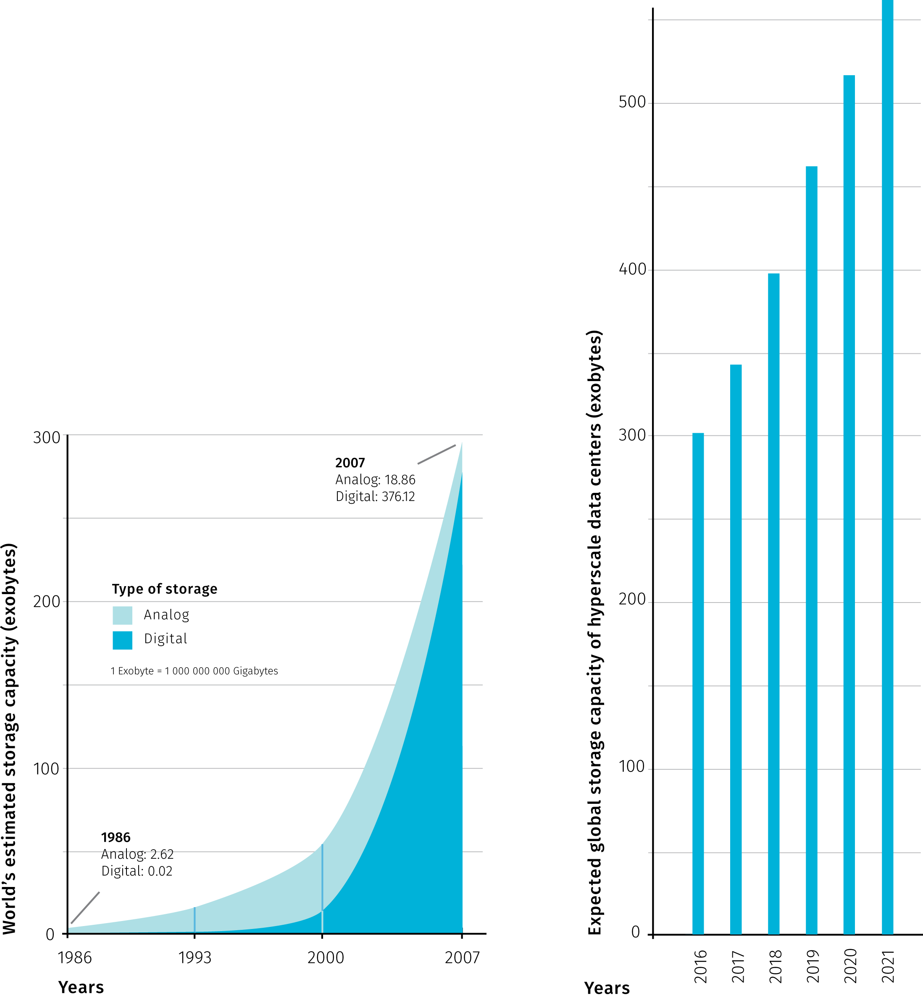

# Defining Big Data

> *Small data are slow and sampled. Big Data are quick and n=all.*

> @kitchin2016makes

*This chapter searches for defining properties of big data, focusing on characteristics with possible implications for cartographic practice. Review of related works outlines the main attitudes towards grasping the concept.*

## Ontological characteristics ("big" standing for "fast" and "exhaustive")

Despite the lively interest triggered by the subject, the explanation of the term *big data* ^[Big Data vs big data, data in plural or singular?] remains hazy and there is no widely accepted definition to the date. Perhaps the most systematic effort in this matter by @kitchin2014data (refined in @kitchin2016makes) summarizes the key properties attributed to big data. Kitchin critically assesses these properties and goes on to assign them relative importance in distinguishing big from "small" data. He also takes care to separate the concept in itself from accompanying social phenomena, hence he speaks of *ontological* characteristics.

This provides a useful starting point for our thinking of big data from the cartographic standpoint, so let us list the ontological characteristics including some of the Kitchin's comments:

* **Volume** – can be measured in storage requirements (terabytes or petabytes) or in number of records
* **Velocity** – data generation happens in real-time either constantly (e.g. CCTV) or sporadically (e.g. web search), we can distinguish the frequency of generation from the frequency of data *handling*, *recording*, and *publishing*, all three can be delayed from the time of generation
* **Variety** – heterogeneous in nature, though this property is rather weak as various levels of organization are allowed (*structured*, *semi-structured* or *unstructured*)
* **Exhaustivity** – an entire system is captured (*n=all*), rather than being sampled
* **Resolution and indexicality** – fine-grained (in resolution) rather than being aggregated and uniquely indexical (in identification) which enables linking with other datasets
* **Relationality** – containing common fields that enable the conjoining of different datasets
* **Extensionality and scalability** – flexibility of data generation, possibility to add or change new fields easily, possibility to rapidly expand in size

The above parameters, their relative importance, as well as their cartographic implications, will be discussed more in depth later, but straight from the start it is important to mention two open questions that for many people make attempts to define big data vague at best, sometimes to the point of questioning the existence of the phenomenon itself.

First, there are no quantitative thresholds that would define exactly how large the "big" volume is, how fast the "big" velocity is, and so on. Some properties would even be hard to describe in quantitative terms (for example extensionality). Other properties sound too general or vague to act as a sound defining parameter (scalability). What is more, one could extend the properties ad absurdum, for example *variety* could refer to differences in structure, origin, quality, or any other property of a dataset. Such depth of parameters and sub-parameters does not add to the overall comparability of datasets, especially when we consider that data-generation procedures may be unique to certain domains and not found in others. Finally, many datasets lack metadata detailed enough to allow to judge all mentioned properties. It is possible that these issues will clear out with time, but parameter thresholds may as well remain blurry and ever in flux.

The second problem is that even if we had a clearly defined set of criteria, in practice we could hardly find a dataset that would fit all of them. Therefore not all properties are deemed mandatory, which in turn leads to confusion and labeling almost anything as big data. To articulate the gist of the term, more work is needed on the relations of the parameters, some might be merged (resolution is a consequence of exhaustivity, indexicality enables relationality) or discarded (extensionality and scalability seem to describe the infrastructure rather than data).

Aware of these problems, @kitchin2016makes argues that *velocity* and *exhaustivity* are qualities that set big data apart and distinguish them from "small" data. We can add that these two characteristics also present the most interesting challenges to cartographic presentation of such data. So even though we will continue to use the established term in the following text, the little too simplistic adjective "big" will be meant as a proxy for **generated continuously in real time and containing an unreduced set of elements**.

## Other ways of understanding big data

In this section we briefly review the writing of authors striving to define big data. The term itself was fist used in context of dealing with massive datasets in mid-1990s by John Mashey (@diebold2012personal), but the heaviest circulation of the term in scientific and popular media takes place only in recent years. From the breadth of works, several tendencies can be identified, providing more or less illuminating interpretations of the subject (for an alternative summary of definitions see @gandomi2015beyond, for bibliometric analysis of related scientific literature see @nobre2017scientific).

### Vs and keywords

Kitchin's taxonomy mentioned in the previous section is based on a review of older definitions, starting with the often-cited three Vs (standing for *volume*, *velocity*, and *variety*) by @laney20013d. The notion of *exhaustivity* was added by @mayer2013big, concepts of *resolution* and *indexicality* came from @dodge2005codes, @boyd2012critical adds *relationality*, and the qualities of *extensionality* and *scalability* were taken from @marz2015big (in earlier 2012 MEAP Edition – how to cite? footnote?) .. citovat podla kitchina.

Other properties attributed to big data include *veracity* (data can be messy, noisy and contain uncertainty and error) and *value* (many insights can be extracted, data can be repurposed), both brought forward by @marr2014big. Moreover, *variability* (the meaning obtainable from data is shifting in relation to the context in which they are generated) was identified by David Hopkins in relation to text analysis (@brunnelli2011will).

Laney's 3 Vs were brought into commercial management-speak and became a slogan further powering the hype of big data. Nevertheless, it inspired a number of other authors to extend it quite creatively. For example @uprichard2013focus lists other v-words to be considered, both in positive (*versatility*, *virtuosity*, *vibrancy*...) and negative (*valueless*, *vampire-like*, *violating*...) light. @marr2014big describes five Vs of big data, @van20133v sees seven Vs, @boellstorff2015introduction propose three Rs and @lupton2015thirteen even uses thirteen p-words to describe the subject. As @kitchin2016makes notes, these additional v-words and new p-words are often descriptive of a broad set of issues associated with big data, rather than characterising the ontological traits of data themselves.

### A challenge for technical infrastructure

Several authors understand big data mainly as a management issue, which is probably due to the fact that handling large datasets is challenging. Hence, the computational difficulties of storing and processing a dataset on a single machine often act as a defining measure. One example for all is @storm2012big quoting Hillary Mason: “Big Data usually refers to a dataset that is too big to fit into your available memory, or too big to store on your own hard drive, or too big to fit into an Excel spreadsheet.” 

The problem with such definitions is determining exactly what size is "too big to fit". The computational power of hardware accessible for personal use is constantly increasing (by the Moore's law [^2]), not to mention the technical infrastructure accessible to large enterprises and governmental organizations (datacenter construction is steadily growing and is expected to almost double the current capacity in 2021 @statista2018data, @networking2018cisco).

At the same time, new technologies emerge to address the issue – virtualization of storage, networking, and memory make it possible to rent computational infrastructure from "cloud" providers, or to delegate workloads previously carried out by the operating system to remote platforms [^3]. Other innovations take place in data processing algorithms, analytic engines, and in database design (a whole range of No-SQL databases as well as enablement of distributed processing in traditional databases) [^4]. Some attempts to summarize technical solutions for big data can be found in @paakkonen2015reference, or @jin2015significance.

As we can see, the "too big to fit" definitions are highly dependent on the resources currently available, plus we need to take into account future improvements that are hard to predict. That being said, understanding the subject as *data that prevent local offline processing on common desktop in reasonable time* is a useful shorthand for judging big from "small" data. The threshold between local (offline) and remote (cloud-dependent) processing exists even though it is a blurry and a dynamic one. As the latter may be more and more accessible in the future, it can be best advised to consider the scalability of any data-processing workflows early on. In other words, any workflow designed as a potential big data process will likely have an advantage, as design limitations may prove to be overcome harder than the technical ones. 

### Showing example quantities

A very common description of big data goes along the lines of "I will give you some numbers and you will get what I mean". Such writing may not provide an exact understanding of the concept, but can put us into context about the scales we are moving at. Doubtlessly the mass of retained data is growing, as @mcnulty2014understanding put it, 90% of all data ever created was generated in the past 2 years (in 2014). In a notable attempt to estimate the World's overall data generation between 1986 and 2007, @hilbert2011world claim that more then 300 exabytes [^5] of stored data existed in 2007 (for the methodology of reckoning see @hilbert2012measure). The key insight is the growing domination of digital technologies accounting for the majority of the annual growth after year 2000. More recent accounts report on machines potentially capable of reporting brontobytes of data [^6] (@bort2014there).

Increasing the storage capacity itself does not speak of any qualitative change in what is stored, therefore some archives could indeed be described as big piles of small data. Under certain circumstances, new quality can arise from increased quantity, for example as @norvig2011unreasonable points out, an array of static images projected at a sufficient frame rate creates an illusion of movement also known as film. Multiplication of an old medium creates a new one. The remaining question is under what conditions this change of essence arises, and if such thing occurs or will occur in case of big data.

**Fig.** Comparison of the World's estimated data storage capacity between years 1968 and 2007 (modified after @hilbert2011world) and the expected storage capacity of large scale data centers in the period from 2016 to 2021 (modified after @networking2018cisco).

Rather than putting up to a gargantuan task of counting the mass of all existing data items, authors use the available statistics related to operations of large companies (@kambatla2014trends, @mcnulty2014understanding, @marr2014big and others). For example, Facebook was said to process 10 billion messages, 4.5 billion button clicks and 350 million picture uploads each day (@marr2014big). It goes without saying these numbers are outdated and certainly outgrown today. Other companies prominently mentioned in context of big data are Google, Wallmart, or Amazon. This connection is justified, as these companies have put user (or customer) data analytics to the core of their businesses, thus supporting the progress in the field. Social media, web search and browsing data, on-line or off-line shopping patterns, but also mobile devices, sensors and large scientific projects are mostly named as generators of big data.

^ sem este surveys s realnymi datami -- kitchina a tiez
UNECE (source: De Francisci, 2015, p. 16).

The United Nations Economic Commission for Europe (UNECE) in 2013 proposed a taxonomy to classify Big Data
based on the source of data; it is shown analytically in Figure 3 and can be summarised in three points (UNECE, 2013):

• Social Networks (human-sourced information): this information is the record of human experiences, previously
recorded in books and works of art, and later in photographs, audio and video.
• Traditional Business systems (process-mediated data): these processes record and monitor business events of
interest, such as registering a customer, manufacturing a product, taking an order, etc.
• IoT (machine-generated data): information is derived from the phenomenal growth in the number of sensors and
machines used to measure and record the events and situations in the physical world.

zdroje:

UNECE - United Nations Economic Commission for Europe (2013), Classification of Types of Big Data. Retrieved
from http://www1.unece.org/stat/platform/display/bigdata/Classification+of+Types+of+Big+Data
UNECE -United Nations Economic Commission for Europe (2014), How big is Big Data? Exploring the role of Big
Data
in
Official
Statistics.
Retrieved
from
http://www1.unece.org/stat/platform/pages/viewpage.action?pageId=99484307

### Metaphors

Metaphors rely on a notion of analogy between two dissimilar things, but can also become independent verbal objects, aesthetically appealing but not overly revealing. Despite that, we should not ignore metaphoric accounts, as they contribute to the mythology surrounding big data that reflects what many people expect. 

@puschmann2014big identified two prevailing ways of imagining the subject: big data seen as a natural force to be controlled and as a resource to be consumed. The utilitarian mindset comparing digital world to excavation of valuable minerals in far from new (think of "data mining" or more recently "cryptocurrency mining") bur it is tempting pursue this analogy further. For example, how to estimate the ratio of valuable information to "debris", and shouldn't such estimation be done before any data "mining" endeavour? The value of real-world analogies may be in provoking some common-sense reasoning often missing in proclamations of digital visionaries.

As @lupton2013swimming notes, by far the most commonly employed rhetorical descriptions of big data are those related to water or liquidity, suggesting both positive and negative connotations. For example @manyika2013open argues for unlocking data sources to become "liquid" in a sense of open and free-flowing, at the same time keeping privacy concerns in mind – what is liquid is also susceptible to unwanted leaks.

Of course, big data descriptions are not limited to verbal form, visual means can be much more expressive and informative – not a surprising claim to be found in a thesis on visual analytics.
We will discuss cartographic tools later, here we can mention artistic renderings that employ more free-form visual analogies. We should distinguish pursuits like *information visualisation* that are close to graphic design (for good overview see klanten2010data or @lima2011visual) from artistic projects that use data as a raw material and don't aim to convey information or comfort to general user's cognitive expectations (like some projects at @creative2018).
 
From the cartographer's standpoint, aspects of visual art can be inspiring (graphic quality, employment of computation and rendering software, creative uses of interaction and animation), though artistic means are often too different to be transposed. Without referring back to the source phenomenon, data-driven art becomes unrecognizable from the so called *generative art* that uses random numbers rather than any existing information (though generative approaches and data-mocking may prove some use for web cartography). 

### Holistic and process-oriented accounts

Multifaceted phenomena tend to provoke descriptions that contain words like "system" or "process". Somewhere behind that lies an idea that a whole more than a sum of its parts^[This is true for systems that express *synergy* or *emergent* behavior. Over the years, *systems theory* has been used to describe many natural and man-made phenomena in many fields, including geography and cartography.]. Experts from different fields notice aspects of phenomena that are close to their priorities, interdisciplinary definitions combine such  views. Naturally, listing holistic accounts will include topics already mentioned, so pardon some repetition in this section.

@murthy2014big prepared a taxonomy of big data comprised of:

- *data* – with various levels of temporal latency and structure 
- *compute infrastructure* – batch or streaming
- *storage infrastructure* – sql, nosql or newsql
- *analysis* – supervised, semisupervised, unsupervised or re-enforcement machine learning
- *visualisation* – maps, abstract, interactive, real-time 
- *privacy and security* – data privacy, management, security

On the other hand, @boyd2012critical define big data as a cultural, technological, and scholarly phenomenon that rests on the interplay of:

- *technology* – maximizing computation power and algorithmic accuracy to gather, analyze, link, and compare large data sets
- *analysis* – drawing on large data sets to identify patterns in order to make economic, social, technical, and legal claims
- *mythology* – the widespread belief that large data sets offer a higher form of intelligence and knowledge that can generate insights that were previously impossible, with the aura of truth, objectivity, and accuracy
 
As the two taxonomies above illustrate, there are many ways to slice a cake. The fate of overreaching definitions is being too intricate to explain the phenomena crisply, yet never complete as there is always a point of view that hasn't been included. So here we arrive at a trade-off between preciseness of a definition and its practicality.

One way out from this is simply rejecting the view of big data as a singular phenomenon. Big data is a non-specific covering term that could mean different things to different people. As @helles2013making observes, "[d]ata are made in a process involving multiple social agents — communicators, service providers, communication researchers, commercial stakeholders, government authorities, international regulators, and more. Data are made for a variety of scholarly and applied purposes [...]. And data are processed and employed in a whole range of everyday and institutional contexts."

## Spatial properties of big data

Apart from the general definitions mentioned above, there have also been field-specific efforts to contextualize big data. The fields include governance (@crampton2015collect), journalism (@lewis2015big), ecology (@shin2015ecological), social sciences (ovadia2013role), or business administration (wamba2015big), learning analytics (@wilson2017big), education (kabakchieva2015big) and doubtlessly many others.

how to contextualize bd within geograpy – maybe to the next section on science:
@graham2013geography
@kitchin2013big

Geospatial big data as a subset of big data. 

@lee2015geospatial
@li2016geospatial

A potential to geocode big data to become available to geospatial analysis.

Cartography (here represented by ICA) is no exception. ... Manifestos, etc... 

## No need for definitions, Motivation  (Rejecting definitions)
### A social phenomenon – toto uplne na koniec

Often times, big data is described indirectly by the impacts, real or imagined, it has on the society. Obstavanie...

Concluding with the societal impact. For some authors, the debate on perfect definition of big data may be dismissed as unproductive. The popularity of the term itself may diminish like many other new technologies that become part of the typical hype cycle (see Gartner repors 2017, 2016 etc.) [^5]. Even though the technological industry is largely fasion-driven, its societal impacts are real (even though unevenly distributed...). And just because something is hyped, it does not mean we can or should ignore it (see @jagadish2015big, also for debunking some common myths about big data).

To mayer2013big big data stands for "the ability of society to harness information in novel ways to produce useful insights or goods and services of significant value". Here, more than an exact definition, is important the societal impacts that are likely to stay even when the big data hype is over. About such impacts is the following chapter.

---zjednotit 

zaver a oslí mostík do dalsej kapitoly 

To those with resorces, technical facilites (that emerged in recent yers) allow storing data for future reuse even thought the utilization may be unclear at the moment of storing. There is an underlying hope that we can make sense of those data in the future. Data holders seek ways to monetize the information. BD are an attribute of interconnected society where individuals using ubiquitous technologies (web services, and mobile devices) create bigger and bigger digital footprints.

Beforce we move to describing the challenges and opportunities big data pose to cartography, first let us dwell on some societal and scientific impact of the phenomenon, as this can provide a motivation for cartography to take part in addressing those issues. 

The definition of big data is elusive perhaps also because the majority of involved actors (as they are positioned in business) is more focused on building productive big data ventures, without much conceptual attention to the subject in itself. Then of course, the underlying technologies become a subject of marketing and engage in the infamous hype cycle (the forecasting company). So far there is no settled consensus around Big Data definition in the academia either, but as @kitchin2016makes predicts, the "genus" of Big Data will be further delineated and its various "species" identified. The question is if the then such an umbrella term will be needed.

To conclude, we can speculate that the meaning of the term big data will either crystalize more clearly(?), or it will be abandoned like many buzz-words before. In either case, the fact is that more digital information gets created and it can be linked more easily, which has real social implications (effects in non-digital world, human lives... pick). 

TODOs:
– More granular stuff in kitchin2014opportunities, more properites for comparison -- read and use later. (maybe copy the whole table, or produce something similar for cartographic preproduction) - not BD specific
– also an appendix of graphical depiction of seven axes along witch selected datasets differ from "small data". **!!!** -- inspiration: <http://searchcloudcomputing.techtarget.com/definition/big-data-Big-Data> also read and proces also read and process. @rouse2014big
– appendix on platforms: hadoop - map&reduce, spark and alternative dbs -- see: figure 16 and review from @paakkonen2015reference, see also @jin2015significance

## Notes

[^2] Moore's law – explanation, critique (this idea must die)
[^3] *Cloud computing* enables companies to consume a compute resource, such as a virtual machine, storage or an application, as a utility rather than having to build and maintain computing infrastructures in house (@rouse2018cloud). The cloud models include providing infrastructure, platform or application as a service; main vendors of public cloud solutions are Amazon Web Services, Google Cloud Platform or Microsoft Azure.
[^4] Processing and analytical frameworks designed for big data inclued Apache Hadoop, Apache Spark, or Apache Flink. No-SQL databases use a collumn, graph, document, key-value, or multi-model solution as an alternative to tradional reltional database design. 
[^5] 1 exabyte = 1 000 000 000 gigabytes
[^6] 1 brontobyte = 1 000 000 000 exabytes) 

– Gartner's hype cycle
– scalability

## Sources

