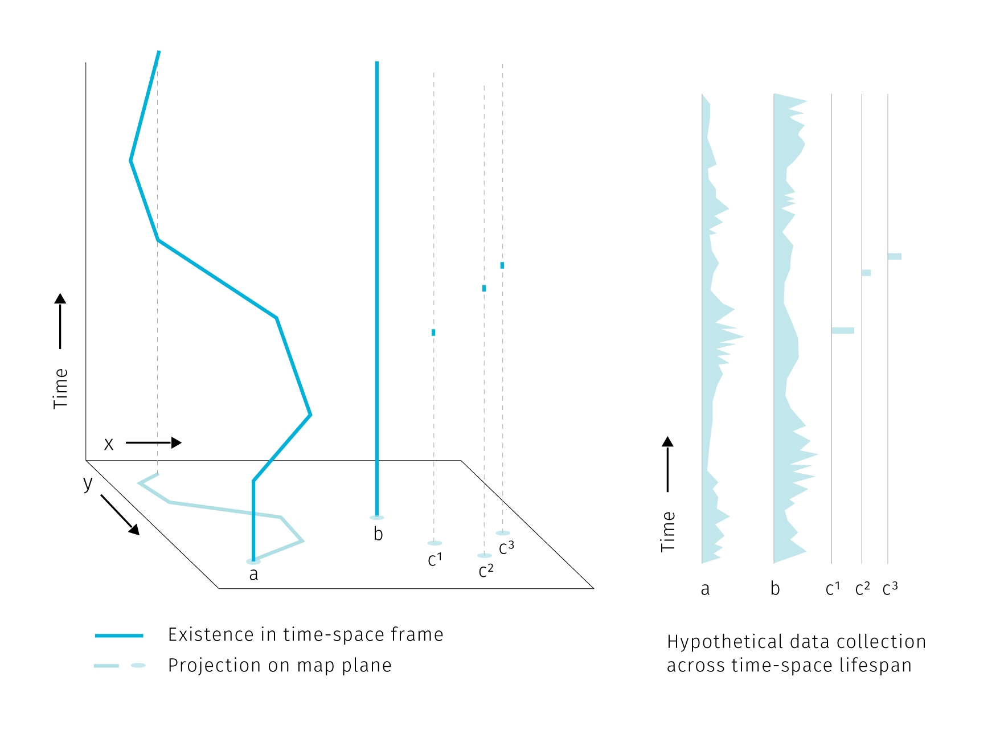
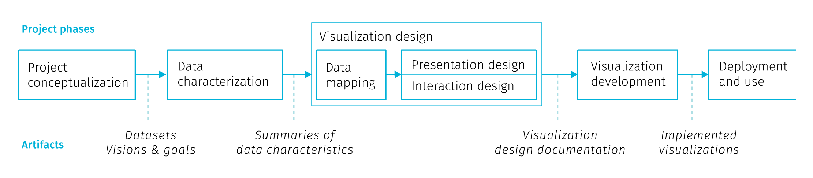

# 2 Making sense of spatial big data 

> *Technology is the answer, but what was the question?* 

> Cedric Price

*This chapter first outlines the types of point spatial data, then explores the methods of spatio-temporal knowledge discovery. Then we explore how cartography can support understanding the world trough the lens of big data. In conclusion, some objections to visualisation as an insight provider are discussed.* 

## 2.1 Spatial big data classification: stations, events, and agents

The vast majority of what is presently understood as spatial big data has point spatial reference. This prevalence comes naturally if we realize that the "data point" location is described basically as a coordinate pair – two digits that can be easily stored in standard database systems without the need to observe topological rules and other constraints that GIS vector data model enforces on line and polygon geometries. Point data are spatial data that are easily created and handled by non-spatial (meaning not GIS-enabled) systems that account for majority of data production. For this reason, and due to the scope limits of this thesis, we will almost exclusively focus on visualisation issues related to point data^[We'll use the term *point data* as a shorthand for "data with point spatial reference".].

Point spatial data are not a homogeneous group. We can describe three classes representing three kinds o objects differentiated by their behaviour in space and time, more precisely by the by how dynamic their *existence*, *location* and *attributes* are over the course of observation. These properties are determined largely by the source of data, so for convenience we can nickname the three types as *stations*, *agents* and *events*:
- stationary objects (*stations*) have static position and existence, meaning that they don't move or disappear during observation. What is dynamic is the set of attributes attached to the object – in big data world these attributes can come as a continuously updated streams. Basic examples include weather stations, traffic cameras, and any kind of stationary sensors.
- moving objects (*agents*) move around, so their position changes during observation, also their existence can be dynamic, meaning they can enter or exit the area of interest. Various kinds of dynamic attributes can be attached. We can reconstruct the history of movement of these objects, which invites conversion to linear representation. Examples are vehicles or pedestrians carrying GPS devices and sensors. 
- episodic objects (*events*) have existence limited to a specific point in space and time. As they are short-lived, we can say that position and associated attributes are static. Prime example are data collected from social networks. 

Think of this distinction as a convenience model for use cases that expect short time frame for data utilization. Technically speaking, the difference between stations and events is dependent on the frame of reference, as objects seen as stationary in shorter observation periods can become mere events if the observation time frame is significantly extended. The existence of a building usually spans over a long time period, though if we stretch the perspective to a century or a millennium, most buildings will become glimpses existing a tiny fraction of time^[see https://waitbutwhy.com/2013/08/putting-time-in-perspective.html for an excellent visualisation of perspectives changing with time frame]. Geographers would note that also the location of seemingly static environmental features doesn't hold over time (think of a meandering riverbed or a volcanic landscape). So again, longer time frame changes our assumptions of static location.

Furthermore, the spatial extent of the observed area and hence the scale of the map influences the distinction between moving and stationary objects – if the movement is too limited to be recognized at a given scale, we can model it as a stationary object. Also, some events can be reimagined as moving objects with discrete presence across observation time frame, for example if social media events dislocated in space and time are traced back to a single moving source device^[See examples of such practice here https://www.nytimes.com/interactive/2019/12/19/opinion/location-tracking-cell-phone.html]. But let us not problematize any further, with most big data sources being temporally and spatially limited (to near real time and mostly urban environment)^[Again, as an exception from the rule, there are some impressive global-scale data projects: global fishing watch..., tracking ships...], the distinction to stations, agents and events would suffice. Judging by the real data samples we can say that stations are usually physically present in the environment while events are mainly records of something that happened at given location, either physically expressed in the environment and observable by onlookers ("I was at a restaurant") or not ("I was shopping online while waiting at the bus stop"). 

**Tab1** Properties of point spatial object. Existence is marked by records of spatial and temporal reference. Agent can have discrete existence if exiting and reentering the area of interest.

| type of object | existence               | attribute collection   | location |
|––––––––|––––––––––––-|––––––––––––|–––––|
| station        | continuous              | continuous or discrete | static   |
| agent          | continuous or discrete  | continuous or discrete | dynamic  |
| event          | discrete                | discrete               | static   |

In the above image and a table we assume that the attribute collection is happening continuously for stations and agents. This does not mean that the attributes have to be collected continuously at all times. Some sensors can record at a regular time interval or only in case of an event. The data output can then contain several "no data" records or even no records at all if the triggering event did not happen. It then depends on the goal of the analysis how such data are conceptualized. For example a traffic camera is a stationary object but some part of its data collection is episodic – a photo is taken just when a speeding vehicle drives by. The classification introduced above differentiates between the existence of an object and the act of recording data by the object. We assume that the sensor's presence without recording has also some analytical potential as it proves the absence of event, while with no sensor in place we cannot say if the event did take place or not. 

Compared to stations and agents, events with episodic presence seem to be the least data-rich, but their analytic potential stems from large numbers. Clusters of georeferenced point events, a.k.a. point clouds are at the core of spatial analysis based on data from mobile devices.

The gaps in data collection and the absence of abrupt changes hints how to optimize data storage from such sources. Even though storage optimization techniques are not within the scope of this thesis, they can pose a certain lesson for cartographic visual analysis. For cartographers, the utilized resource is the space within the map plane that can only hold a certain amount of graphic elements to remain useful. Moderation o the graphic fill is an aspect that can enhance the knowledge discovery at the end of the visualisation pipeline (more about it in the practical part of thesis on aggregation).

## 2.2 Spatio-temporal knowledge discovery and visual analytics

In this section we will briefly discuss techniques for exploring spatio-temporal data, with emphasis on practices that would benefit from enhanced cartographic visualisation.

People engaged in data-related practices are motivated by an expectation that their work can help to provide some insight into how the world works, that there is some knowledge that can be unlocked, mined, or distilled from otherwise inconceivable piles of data. Such insight seeking is the crux of the concepts such as *data mining*, *spatio-temporal knowledge discovery* and *visual analytics* that we will explore further.

*Data mining* is exploring databases using low-level algorithms to find patterns. *Knowledge discovery* is then a higher-level extension of data-mining techniques that requires human-level intelligence and domain knowledge to guide the process and interpret the results (@miller2015spatio). In the knowledge discovery process, computation is seen as an extension of human force rather than its replacement, therefore the goal is to marry the best of both worlds. This is reconciled with the (current) capabilities of information technologies: there are tasks that are very simple for computers and very hard for humans (e.g. calculate the square root of 567789898) and vice-versa (basically any task requiring improvisation). *Visual analytics*, the science of analytical reasoning supported by interactive visual interfaces (@thomas2005illuminating), then zooms in at the interaction frontier between human and computer in order to find the best tools for visual interaction between the two. If we imagine a continuum ranging from "work done purely in human brain" towards "work done by machines", knowledge discovery places itself somewhere in the middle. 

![**Fig.** Human-machine continuum, knowledge discovery as the best from both worlds (the actual wording could be different, for example @keim2008visual lists on the "machine" side: statistical analysis, data management, data mining, compression and filtering; on the "human" side: cognition, perception, visual intelligence, decision making theory, information design; and in the "middle": human-centered computing, semantics-base approaches, graphics and rendering, and information visulaisation). With emphasis on cartography, I summarize the human cognitive tasks as "map reading".](imgs/man-machine-continuum.png)

We can draw the human-machine continuum in the field of digital cartography as well. Here, the human cognitive abilities are applied to seek patterns, explore spatial context or make decisions, while computational aspects include data management and processing. Now, the computation heavy algorithms like optimal route calculation already step in to unburden humans from some decision-making so the distinction shouldn't be taken as something rigid (TODO see the discussion at the end of the chapter on how the continuum might evolve and how it could affect cartography). For now, just note that cartography operates as an interface at the human side. Some authors go on to define *visual analytics for spatio-temporal data* as interlinked techniques in interfaces with map as a central metaphor (@guo2006visualization). We can think of it as map reading with robot assistants.

### 2.2.1 Spatio-temporal relations

To develop further on the kinds of interaction with spatial data, we can explore the concept of *spatial* and *temporal* queries. On the general level we can search for spatial and temporal relations in all there types of point objects mentioned in the first section. In addition, moving agents can generate specific relations not innate to stations and events.

**Spatial relations** are at the very basis of map reading for orientation clues, but are also vital for interpreting thematic information. We perceive these relations between the dominant themes (e.g. in weather maps of precipitation and atmospheric pressure zones) or between the theme and the topographical base map. The major classes of spatial relations are: *set-oriented* (union, difference, intersection, complement, etc.), *topological* (connectivity, interior, exterior, boundary), *directional* (cardinal, object-centered, ego-centered directions) and *metric* (e.g. Euclidean or network-based distance) (@worboys2004gis). 

Point spatial data of large extent complicate observing such relations. We rarely ask about a single specific point from the set, more often we seek to extract some tendency of the whole point cloud. The nature of some data sources can dictate some spatial relationships (such as vehicles being spatially bound the road network), but in many cases the density of point cloud obscures the base map and precludes reading of attribute variability within the set.

In this thesis we are mostly considering point data clusters in two dimensional space, so it is worth to say that spatial relations between such sets are harder to conceptualize than it is with polygonal features. @egenhofer1991point describe 16 actual relations (9 if reduced to spatial regions relevant in GIS) in two dimensional space. However, in their approach @egenhofer1991point define the point sets by their exterior boundary and then effectively treat them as polygons. But delineating the exterior boundary is a challenge in itself, for example when dealing with smooth transitions in point density at the border, or with outliers. Any line would be in a sense an inaccurate approximation. Spatial relations between point clouds in three dimensions are a subject of extensive research in the fields of computer vision and indoor navigation (e.g tran2017extracting or chen2019deep). However, the motivation here is object identification. In these lines of research the point cloud is hiding distinct solid objects in the real space that need to be extracted, so the point cloud itself is not an object of research. For cartography, the point sets already come with some assigned attributes, so there is usually no need to label them algorithmically (but maybe there could be some inspiration). Large point sets tend get unruly in the wild, and saying anything meaningful about spatio-temporal relations of multiple such clouds is increasingly hard using the basic set theory (see Fig ). 

**Temporal relations** are measures of coincidence. There are thirteen possible relations between two temporal records described in @allen1984towards. As we have seen with stations, agents and events, the existence and data collection of any entity can be either continuous or discrete in time, it is therefore useful to distinguish between *time point* and *time interval* when investigating temporal relations (see figures). Linear conceptualization of time can be supported with cyclical and branching time, there can be discrepancies between the temporal parameters of the base map and the thematic overlay, or between the time interval of existence and representations. We'll untangle these complexities in chapter 5.

**Relations specific to moving objects** – moving objects have a specific set of properties based on their spatiotemporal circumstances. These can be *instantaneous* (actual position and speed), *interval-based* (e.g. travel distance from departure), *episodic* (related to external event) or *total* (related to entire trajectory). (@laube2007movement, andrienko2008basic). 

### 2.2.2 From data mining to visualisation for human interpretation 

Having described the fundamental spatio-temporal relations in big data sets, we can briefly describe some of the methods to uncover them. Recalling the human-machine continuum at Fig., we will start at the machine side with methods from the data mining group to eventually move towards the human side.

Several data mining concepts are of interest. *Association rule mining* is searching in databases for conditions occurring together frequently: 

 *x => y (s%,c%)*

Where *x,y* are conditions, together forming an *itemset* and *s,c* are levels of support and confidence. Support and confidence are basic rule performance measures, support being the measure of how often the itemset occurs in the whole database and confidence being the proportion of x being a member of an itemset x => y. For example: *park => school (4%, 55%)* means that 55 percent of parks are near schools, for 4% of items in the database (@han2011data). The measures of support and confidence allow us to set thresholds for significantly frequent co-occurrence.

*Spatio-temporal association rules* extend association rules to describe how objects move among a set of regions over time (@verhein2008mining). Incorporation of spatiality into association rules takes form of a simple binary conditions telling if the items co-occurred in the same predefined sets of regions or not.

*Sequence mining* is searching for patterns in time and other sequences. Similarly to association rules, we search for events occurring frequently together by considering three parameters: the *duration* of the whole sequence, the *event window* (time-horizon for considering events as temporally coincident) and the *time interval* between events (@miller2015spatio). These parameters allow us to turn the temporal relations between two items into binary parameter telling if the items co-occurred (that is when the time interval fits into the event window). 

*Periodic pattern mining* is a type of sequence mining that searches for recurrent patterns in time sequences. Such patterns can be: *full periodic patterns*, *partial periodic patterns* (e.g. just on Mondays), and *cyclic or periodic association rules* that associate events that occur periodically together (@han2011data).

Considering the breadth of possible spatial and temporal relations described earlier, the conceptualization of spatial and temporal co-ocurrence in the association rules may seem rather simplistic. Basically it is reduced to a yes/no parameter. Moreover, moving from the level of individual database entries towards assessing relations between compound entities such as spatial point clusters seems to be out of the scope of these methods. Of course, the way how spatiality is inscribed into association rules could be made more sophisticated, though with inevitable implications for mining performance. With large datasets, mining even the simple rules forces us to consider time constraints. For such tasks, a simple visual exploration is more efficient and reliable then basic algorithmic solutions.

At this point we can step back from mining algorithms to invite some human interpretation and to consider what conclusions we can actually draw from spatial and temporal co-occurrence of events. The usual assumption is that such co-ocurrence can point to some form of causality. Drawing from approaches by @allen1995qualitative and @galton2012states; @bleisch2014mining distinguish between the trigger that apparently causes the event and the environmental conditions that have to be fulfilled for the effect to occur.

In this model, *state* is an environmental condition and *event* is a change of state. Events are caused only by other events, while states only affect causation by allowing events to cause other events. Events *initiate* and *terminate* states, while states *allow* causation. The *initiate*, *terminate* and *allow* relationships are then dubbed *causal-like* to distinguish them from the event-to-event causation. TODO example

In conceptual framework for finding *candidate* causal relationships in movement patterns @bleisch2014mining distinguish between three kinds of granularity at which the phenomena can be described: *spatial*, *temporal*, and *causal*. While the first two are defined by the smallest spatial and temporal units, causal granularity is given by the kinds of events observed. Spatial and temporal granularities can be easily reduced to "see the bigger picture" (by changing the spatial scale, or extending the time range of observation), but causal granularity is more firmly defined by the data collection design. 

@el2002spatio note that although the general expectation would be that the effect occurs immediately after the cause, some delay between the effect and the cause can occur, possibly because the cause must attain some intensity threshold to trigger the event or because the effect and cause are spatially separated and it takes time until the influence of the cause reaches the location where it takes effect. @bleisch2014mining suggest that these apparent delays result from lower causal granularity of observation, i.e. there is some intermediary chain of effect and cause that happens during the delay but it is not recorded by the observation. (TODO: Example, fish, signal, make up something). Whether we accept the effect delays as real or illusionary might be more of an academic question, tracing down the potential causal link between start and end events can yield predictive potential even when the intermediary causal chain remains undiscovered. 

Discussing the interpretation of spatiotemporal co-occurence we have moved on the human-machine continuum towards the human end. At this point, visualisation becomes important as an interface between the user and the data. One of the general models describing how knowledge discovery proceeds via inference and interaction is the sense-making loop (fig).

Visual analytics extends the concept of visualisation: not only it provides a visual interface to the database, but also makes the data processing pipelines transparent for an analytic discourse. Keim2008visual in their introductory paper say the goal of visual analytics is the creation of tools and techniques to enable people to:

– Synthesize information and derive insight from massive, dynamic, ambiguous, and often conflicting data
– Detect the expected and discover the unexpected
– Provide timely, defensible, and understandable assessments
– Communicate assessment effectively for action

This is truly a long way from the low-level search for co-occurrences, though it is not clear how should these grand goals materialize in practice. Keim2008visual call for broad inter-disciplinary collaboration between related fields (Visualisation, Data Management, Data Analysis, Perception and Cognition, Human-Computer interaction) and identify a range of application and technical challenges. 

The brief tour we just went trough lets us appreciate the prospect of gaining the best of both worlds, that is to support human analytical efforts with algorithmic power doing the heavy lifting around data manipulation. We have seen that inscribing spatiality a and temporality to data mining processes can be both cumbersome and simplistic. Furthermore, the co-ocurence we want to search for needs to be defined beforehand, so in many cases the data mining and transformation is insufficient to provide the required insight. Search algorithms can be performance heavy so some coordination with human observer that is able to easily gain an overview of clusters beyond individual database entities. Visualization and visual analytics provide this exploratory potential, especially for big data in situation where we don't yet know what questions we want to ask. Visualisation as a sense-making tool gives us a way to find things that we had no theory about and no statistical models to identify and to explore the space of models in more expansive ways (@bollier2010promise). Many possible data transformations may be applicable to a particular problem, but it is not necessarily clear which ones will be of most value in facilitating insight. Also, because visual analytics is qualitative as well as quantitative, there are no assumptions of exact parameters and well-defined boundaries between what is interesting and what is not. A priori criteria of significance may be manipulated based on the judgment of the analyst (@thomas2005illuminating).

Back to the machine to make additional queries and transformations to support a hypothesis or model outcomes.

The hybrid system is more powerful than either the machine or the analyst working alone.

Digital cartography has the potential to dynamically support cognitive tasks in described fashion, be it with simple visual higlighting, or with algorithmic assistance yet to be designed.

## 2.3 The role of cartography

Cartography has a long tradition of making data comprehensible to our visual minds. Beautiful and authoritative maps in school atlases explaining the formation of air masses or the positions of ocean streams give off and impression of definitiveness but were build upon a generalization of data from loads of observations. These data had to be collected, brushed and analyzed for the presence of meaningful patterns, and than visualised in a way that would appeal to human comprehension. The process for creating such maps was nowhere near "real-time" but allowed for fine-tuning of all aspects of the map: from carefully shading the outlines of water bodies to making the street connections visually pleasing. This process allowed for perfectionism, and the resulting maps remain beloved by collectors long after their 'utilitarian' function is gone.

For digital cartography^(Here and further we will use the term digital cartography as a shorthand referring to dynamic maps allowing user interaction, consumed almost exclusively through the web, viewed on screens of various sizes) it took a long time to come any closer to the visual quality of the best works in cartography in print. Arguably, there is still some unfulfilled potential in getting towards graphic excellence in web mapping, though recent improvements in available tools open new possibilities for innovation, but also risks of uniformity. Digital maps have the obvious advantage of allowing interaction – user can zoom, pan, change, filter and combine the displayed data. The second big advantage is the possibility to update the displayed data real-time as the data source is updated. Sure, many digital maps are not dynamically updated, simply because the topic does not require it (e.g. medieval monasteries in France or 1991 election results in Yugoslavia). But interactive maps based on dynamically updated data are of special interest as they pose a whole new set of challenges to authors. Ensuring cartographic quality in the map field now means designing for yet unseen changes in data also with user-induced modifications in mind.

School atlases served for presentation of knowledge, were confirmatory. Digital cartography allowed for exploratory mode of map interaction to emerge, or more precisely, moved the data exploration step down the production pipeline from *before* to *after*  map publication, and from the cartographer/author to the map user. Visual analytics based on spatial data provide interfaces to manipulate and visualize information, or better to say to pick from the pre-designed visualisation modes. This has implications for both the cartographer and the user.

The ability to interact with the map-based software application can surely be empowering for the user, triggering the sensation of exploring the unknown. On the other hand, things can go the wrong way as it is very hard to create an immersive experience from a complex dataset that would be immediately understandable to the newcomer. Exploratory map applications intend for general public can leave users overwhelmed with the amount of possible interaction points. Left to their own devices, without any stated framework for interpretation users need to create their own narration about what is displayed. Visual interfaces are prone to be terrifyingly cluttered, untroubled with the dangers of fostering misinterpretation. Lack of guidance on where to start results in poor engagement with the application, that is quickly abandoned. With specialized applications for professional audience, this can be mitigated by training as users are forced to work with the application as part of their job. Similar problems occur in business analytic dashboards proliferating in enterprises, which fail to make sense to users, or worse, fake insight with vaguely understood and hardly interpretable metrics. All these caveats pose a big responsibility on application designers.

### Map reading and interpretation

Interactive map as a data manipulation interface is useful for those who know what questions they want to ask, but also for those who want to find out what they might be asking. So what kind of inference should an interactive map support? We should start simple, with basic quantitative questions. A big advantage of interactive maps over print is that we can display the exact quantities on demand (e.g. with some pop-up window bound to cursor hover action) and not rely on the viewer's ability to infer quantities form the legend (especially if categorized to some interval scale). The ability to answer simple quantitative queries shouldn't be left in vain, because as @tufte1998visual warns: "when scientific images become dequantified, the language of analysis may drift toward credulous descriptions of form, pattern and configuration [...] rather than answer to questions *How many? How often? Where? How much? At what rate?*".

We can say that these questions are at the basic level of map reading. bertin1983semiology distinguishes three reading levels for the thematic map, and at each level, different sorts of questions can be asked:
- *elementary level* – questions introduced by a single element of the visualisation (What is the level of unemployment in this district?)
- *intermediate level* – questions introduced by a group of elements or categories in the visualisation (What are the five most populous districts in the region?)
- *overall or global level* – questions introduced by the whole visualisation (What are the spatiotemporal trends of traffic in this city?)

It is obvious that even a simple map has a potential to introduce countless possible combinations of questions at various levels. Although the importance of allowing for elementary-level questions, in thematic cartography we are often interested mainly in the global level of reading. Often times, just to *see* the overall level is a revelation, the kind of overreaching macroscope perspective unique to maps. But what else we can do with the overall patterns?

As we'll see in the next chapter, showing the basic quantities with cartographic means becomes more challenging with multiparametric visualisation, especially if we want to support both elementary and global levels of reading for individual topics.

Are there any examples of cartographic visualisation successfully supporting the analytical reasoning? Maybe the most frequent answer of this question would be the celebrated map of the cholera outbreak in London 1855 by John Snow, that helped to identify the source of the epidemics in a polluted water pump. This feat is lauded for launching spatial epidemiology and for bringing the thematic cartography to the fore (@clarke2015map). But what exactly made the Snow's method worth following? @tufte1998visual notes four key points:

1. Placing data in appropriate context for assessing cause and effect
2. Making quantitative comparisons
3. Considering alternative explanations and contrary cases
4. Assessment of possible errors in the numbers reported in graphics

TODO: elaborate ^ We can make this a motto also for current exploratory maps.

Hypothesis formation support that these tools aim to provide is however a property that is hard to measure: it is hard to prove the interface works, it is hard to compare solution to establish which interface is better.

^ TODO brush up the line of thought, more about the overall patterns (from paper Illuminating the path...)

@fisher2017making
- this is from the creator's point of view -- why are we doing this, what tasks does it support.

We believe that creating effective visualizations is itself a process of exploration and discovery. A good visualization design requires understanding of four components: Data, Tasks, Stakeholders, and Visualizations.

Close up on Tasks:
High-level questions need to be refined into specific, data-driven tasks. An analyst can refine a task by first breaking it down into four specific components. Identifying these components and how they do or do not directly reference the data becomes a template for choosing more specific tasks. The components are:

- *Objects*: When a task is specific enough, each object will be something that can be represented in or computed from, the data. Fairly often, when the task is at its most specific, an object will correspond to a single row in a database.
- *Measures*: The outcome variables that will be measured for the objects. In a sufficiently specific task, the measure is either an existing attribute in the dataset or one that can be directly computed from the data. A measure is sometimes aggregated across many items of data. 
- *Groupings (or partitions)*: Attributes or characteristics of the data that separate the data
items into groups. In a specific task, partitions are attributes of the objects or can be calculated directly from those attributes. 
- *Actions*: Words that articulate the specific thing being done with the data, such as compare, identify, characterize, etc. Actions guide the process of choosing appropriate visualizations.

A well-specified task, relative to the underlying data, fulfills
the following criteria:
• Can be computed based on the data
• Makes specific reference to the attributes of the data
• Has a traceable path from the high-level abstract questions to a set of concrete, actionable tasks

---------

TODO - other visualisation-related issues:
- don't know what questions I want to ask
- looking for ouliers (bet against the consensus and be right)

Problems with pattern interpretation around big data.

**BD discussions from bollier2010promise** TODO process  
(@bollier2010promise
– For Joi Ito, the Chief Executive Officer of Creative Commons, the
search for correlations is a trap to be avoided, at least in his capacity of a computer security expert and a venture capitalist.  Ito says he is “always looking for unpredictable things that you can use opportunistically.”  As a venture capitalist, he is looking for the “subversive outlier” whose ideas could have a big upside.  From a security perspective, Ito says he wants to be alert to the unexpected forms of intrusion and deceit, not to the ones whose correlations can be easily discovered using computers
When you do that kind of analysis on, say, terrorist networks, you have to understand that Hezbollah is actively trying to continuously come up with patterns that they think you won’t predict.” “Remember,” said Ito, “the same technology that we’re using to analyze Big Data enables these other actors to become more actively random.  The people who are outliers, who used to sort of behave randomly, now have access to the same tools as the rest of us and are looking at the same data.

“Big Data is about exactly right now , with no historical context that is predictive,” said Ito.  “It’s predictive of a linear thing—but you can use data collection to discover non-linearity as well. ... It’s important not to be obsessed with the old models that come from the old data. It’s more important to be ignorant enough to come up with a new model of the future.”
(@bollier2010promise
– Many innovative uses of Big Data could be called “now-casting,”
said Varian. This term refers to the use of real-time data to describe contemporaneous activities before official data sources are available. “We’ve got a real-time variable, Google search queries, which are pretty much continuous,” said Varian.  “Even if all you’ve got is a contemporaneous correlation, you’ve still got a six-week lead on the reported values” for certain types of data.

–  “To make money, you’ve got to predict two things—what’s going to happen and what people think is going to happen.

Talking about the human interpretation we can surely adress a wide range of use cases and motivations regarding to data. User roles (TODO move to cartographic part?), weaponization, uncovering secrets... entepreneurial approach. Large scale optimizations, smart city concepts etc. Let us not bloat here. 

Paying attention to the cognitive part of information processing (differences between users, influence of learining from the app,..)
– Kim Taipale of the Center for Advanced Studies in Science and
Technology warned that visualization design choices drive results every bit as much as traditional “data-cleaning” choices.  Visualization techniques contain embedded judgments.

###  2.3.2 What next? Research challenges 

Researchers in cartography and geovisualisation see big data as an opportunity and also as a certain call to action. The research agenda for geospatial big data and cartography laid down in @robinson2017geospatial shows the general interest of moving the field toward fulfilling its potential to make maps that "pique interest, are tacitly understandable and are relevant to our society". It is certainly reassuring that the community is aware that new sources of data "stretch the limits of what and how we map". Building on this, @robinson2017geospatial list several large-scale and long-term research challenges to face cartography in relation to big data as well as some short-term research opportunities for more concentrated investigation (see appendix A for the overview). Even though some of the points seem vague or repetitive, and the influence of the distinct ICA commissions is clearly visible, the agenda states some truly exciting challenges to tackle. In relation with the scope to this thesis we can highlight the following challenges for cartography:

- *Develop visual analytical reasoning systems that can help users add meaning to and organize what they discover form geospatial big data* – we need to move beyond naive exploration and focus attention on tools that help people reason about what they are seeing. Users need to be able to save, annotate and compare their findings as they work on complex problems.
- *Develop methods that embody the volume of geospatial big data* – we need cartography that can intelligently process and display big data at a size and a format that users can realistically handle. This will require solutions that support coupled analysis and visualisation as big data often need to be analysed before they are visualised (the order is reversed in exploratory visualisation). 
- *Create maps and map-oriented interfaces that prompt attention to important changes in dynamic geospatial big data sources* – We will need to work with global changes, local changes and combinations across scales. In addition, if we display every possible change at once, then the graphical displays become cluttered. Creating summaries of change may be the solution, but we do not yet know how to select important patterns and generalize to something that a user can understand.
- *Leverage what we know about map animation and interactive cartography to construct visual solutions for dynamic sources of geospatial big data* –  Conventional solutions for interactive mapping, animated mapping or geovisual analytics can be used for representing big data. However, because of the high velocity characteristic of big data, it is necessary to develop solutions that can automate map design decisions to support interactive design solutions that respond (or potentially precede based on modelled outcomes) as the data changes.

@thomas2005illuminating also provide a set of recommendations for research and development agenda for visual analytics. Particularly resonating with goals of this thesis is their account on new visual paradigms, that include:
- Organizing Large Collections of Information
- Reasoning about Space and Time
- Abstraction – Changing to the Appropriate Representation
- Integrating Powerful Analysis Tools with Visualization

@thomas2005illuminating

An emerging discipline progresses through four stages. It starts as a craft and is practiced by skilled artisans using heuristic methods. Later, researchers formulate scientific principles and theories to gain insights about the processes. Eventually, engineers refine these principles and insights to determine production rules. Finally, the technology becomes widely available. The challenge is to move from craft to science to engineering to systems that can be widely deployed. – my commentary: Cartography, being a university study field had arguably crossed the four stages in the past, though with interactive mapping it could benefit from returning to the craft stages as the tools and possibilities for mapping changed profoundly.

Cognitive scientists have studied visual representations and the larger class of external aids to cognition. An external aid to cognition is an artifact that helps us reason about the world.
A first step in developing principles for visual representations is to understand how
they enable cognition [Card, 1999; Norman, 1993]. Some basic principles for developing effective depictions include the following (adapted from [Norman, 1993]):

* *Appropriateness Principle* – The visual representation should provide neither more nor less information than that needed for the task at hand. Additional information may be distracting and makes the task more difficult.
* *Naturalness Principle* – Experiential cognition is most effective when the properties of the visual representation most closely match the information being represented. This principle supports the idea that new visual metaphors are only useful for representing information when they match the user’s cognitive model of the information. Purely artificial visual metaphors can actually hinder understanding.
* *Matching Principle* – Representations of information are most effective when they match the task to be performed by the user. Effective visual representations should present affordances suggestive of the appropriate action. Another prominent cognitive scientist has suggested the following two basic principles [Tversky et al., 2002]:
* *Principle of Congruence* – The structure and content of a visualization should correspond to the structure and content of the desired mental representation. In other words, the visual representation should represent the important concepts in the domain of interest.
* *Principle of Apprehension* – The structure and content of a The subjects of mental representations and reasoning are the main focus of cognitive science, so the principles for depicting information must be based on research in cognitive science. The apprehension principle underlies the importance of research in perception. These meta-principles underscore that the biggest challenge in choosing a visual representation is to find the right one (not just any one) for the reasoning task at hand. – naive scientism? lecturing birds how to fly...

TODO – science of interaction just as a preview for next chapters:
Too often in the visual analytic process, researchers tend to focus on visual representations of the data but interaction design is not given equal priority. We need to develop a “science of interaction” rooted in a deep understanding of the different forms of interaction and their respective benefits.
Then, R&D should be focused on expanding the repertoire of interaction techniques that can fill those gaps in the design space.

role of cartoman:
Creating effective visualization representations is a labor-intensive process that requires a solid understanding of the visualization pipeline, characteristics of the data to be displayed, and the tasks to be performed by the analyst. Current visualization software generally has been written in environments where at least some of this necessary information was missing.

––––

In addition to the aforementioned agendas, we conclude this section with formulating a number of low-level challenges that we feel are not widely discussed. This thesis does not have the ambition to imagine all paths cartography could take, so we subsequently pose several questions related to the practice of map making that would inform the rest of content of this thesis. A mini-agenda for adjusting mapmaking to post 2020 circumstances, if you please. As we have seen many times in history of innovation, progress is often hampered by the mental roadblock we don't even realize we have.
(here merge challenges with questions?)

**1. Is cartography fully exploiting the digital medium?**

Before hopping on the wagon of augmented reality and immersive experiences (that make a tenth of the population sick) cartographers could consider if they made the most of the previous medium shift. The same graphic technologies that power on the burst of imagination in web games, don't seem to bring much revolutionary changes to design in the map field (3D cartography being a honorary exception). 

- Challenges stemming from the medium shift

Desktop GIS mapping – struggling to transfer to web (basically front-end development, which is also always in flux), maybe in the future desktop tools will supommrt generation of web map interfaces, but wouldn't count on it. Interface as a part of cartographic experience.

TODO maybe look at the state of the art (opiniation/freedom) - leaflet, openlayers, mapbox, cartodb, arcgis online, self-hosted mapbox alternative... (in later chapter, also depends on who does the job – many creators just use the defaults)

Apart from the limitations posed by opinionated mapping frameworks there are also certain mindset limitations that come from transferring a visual artifact from one medium to the other. Such transfer is not the same as if the visualisation was designed for the new medium from scratch as there are realized or unrealized ideas of how things should be done transferred from the practices required by the old medium. This was apparent for example the grid-like organization transferred from printed newspapers to web news pages initially and still lives there though responsivity required by small-screen devices pushed its rethinking. Similar case in cartography is the dichotomy between the topographic base and the thematic overlay. A good mental exercise for cartographers would be imagining map interaction unattached from any medium – what would we design if anything was possible? 

Ford's quote: "If I asked people what they want, they would ask for a faster horse" (find exact.). Similarly, we can test the cognitive efficiency of the visualisation methods that already exist, and users would prefer the methods they know. Cartography's quest (in my opinion) is to extend the arsenal of visualisation and interaction methods. As we will see further, interaction and animation pose new challenges to cartographic visualisation, with possibly multiplied opportunities for method combinations and innovations for data exploration and possibly knowledge generation. Further, plenty of tricks from the rich history of cartographic practice did not make it to web mapping toolbox. 

Recent emerging technology owing much to the gaming industry promise to bring web cartography to the flexibility of the pen and paper ^[or brush, engraving tool etc.] of pre-digital cartographer. Only now the shifted role of cartographer would be in enabling data to paint the picture for us.  Much of the rest of this thesis will be exploring this truly exciting prospect.

Limits of old media. Danger: processes of old media are transferred to new media, leaving possibilities in new tools unexplored.

e.g. 

Narration as a workaround for cartographic rules – legibility, etc. Static map must adhere to the cartographic rules. In interactive maps (both presentational and exploratory) the argument is as follows: application doesn't need to be cartographically legit in all of it's states provided that it shows a path from the messy state to the cartographically treated state.

Also embedded devices?

2. **What inspiration can interactive web cartography take from the heritage of pre-digital mapping?** 

Cartographic quality of web maps are not yet on par with the (best) examples of static maps and atlases (regardless of the date production – even though maps and atlases age in the sense of content, cartographic methods used in them often remain inspirational and valid, so for cartographer old map products doesn't have to be outdated). This might be a side effect of non-cartographically aware people producing maps (either amateur cartographer accessing easy to use tools, or people coming from graphic design backgrounds bringing 'creative' changes) ^[This is not intended to belittle such activities, as the eyesoreness of some maps is a little tax for democratization of mapping tools. In fact, efforts to help citizen cartographers have been made by more experienced practitioners, most notably in Wood, – TODO cituj tu ich prirucku]. Another possible cause is that the web mapping frameworks tend to provide just an opinionated set of visualisation options (TODO: picture of the google map's point sign) and cartographers lack the skills to customize or extend these visualisation toolkits. Little to say that some of the classical cartographic techniques are quite demanding when transferred to variable-scaled environment. For example, the symbol collisions that needed to be resolved just once (as if that was not enough) have to be treated (perhaps algorithmically) in all zoomlevels. (TODO: examples of such methods in pictures – call it "craftsmen" side of cartography) Cartographers who want to venture to raising the quality of web maps are then forced to dive into frond-end web development^[The situation is improving with rise of web-gl based mapping platforms such as Mapbox and CartoDB, which provide map design environments resembling the visualisation tiers of desktop GIS].  

This question is complementary to the previous one and also arises from the conditions of the medium shift.
What was lost in transition to digital? Are there methods and practices from tradition that could be used but aren't (because cartographers usually aren't software developers, and software developers are usually unaware of old map stocks). Danger: the perceived barriers of the new technologies limit us in imagining what we could do (e.g. what visualisation possibilities are provided by APIs like Leaflet).

Overlays are solved lazyly: point clusters vs. offsets and insets
dynamic data examples:
Global fishing watch - https://globalfishingwatch.org/map/

3. **Cartography and UX, designing an interactive map is also designing ways to interact with data**

Saving space: coupling legends with controls.
Problematizing UX research, problems of cognitive testing (verification crisis in psychology) vs. A/B testing,  (data on tile usage from big providers)
Inspirations from product design (praktika lens, beat machines), photography (Muybridge and Marey), cinematography, video (youtube, other video services :P)
- Also dealing with dynamic data more of a problem of intracomposition but extracomposition affected too (different scales, etc.) 

Amount of hand-holding?
(move to one of the questions)
Here we need probably some inspiration from other fields. Aim is moving somewhere inbetween the presentation and exploratory interfaces, possibly to get the best of the both. Exploratory interfaces could do some hinting, notifying which findings make sense and which not. Designers of exploratory interfaces could give greater thought to what questions users might want to ask about the portrayed data. (But careful on generalization with user personas – see below on weaponization of design).

TODO: 
- discussion of presentational vs exploratory cartography – or better on building interfaces to support one of them. – exploratory interfaces seen loftier, most commercial assignments are presentational – in fact the threshold between presentational and exploratory capabilities is something that needs to be considered. 

4. **How to extend the spatio-temporal analysis faculty in digital maps.**

The range of possible future states of the application is only to be guessed. In other words, the task is to design the map well for previously unseen data.

- challenges in finding causal relationships
- challenges in processing big data

Causation-related questions for cartography (TDOO )
- finding spatio-temporal co-location that would support causation hypothesis is in currently realized by comparing spatial patterns. The causal delays may hamper such comparison, one approach is extend the time range of records (e.g. comparing cumulative data within two choroplets can smooth the volatility in favor of the overall tendency). 
- Another approach is in looking for some general similarities between two sets of snapshots (spatial patterns) – if there is some similarity occurring at some interval then we have identified the delay interval. This is spatial but not temporal collocation. Problem: this assumes causal relationships across the whole area of pattern – how to search for delay in just a sub area?
- Temporal but not spatial collocation – is map a good tool for displaying this (rather a bar chart? Yes e.g moving air masses – we infer the future state in place from the state in past elsewhere)
- What amount of apparent spatio-temporal collocation allows to rule out epiphenomena? Can map alone rule out a hidden common variable?
- How to map causal-like relationships, e.g. potential for causation to happen via variations of state across the area?
- overall, the ability of dynamic maps to find these collocations and link them to causation is to be assessed, but how? :)

### 2.3.2 How next? Challenges in collaborative practice

Having described the ontological models of causation ans sensemaking as well as visions for the future of cartographic research, we can now take an aside to dwell a bit on the nitty-gritty realities of map making in practice. Practical aspects of the profession are often overlooked in literature, as well as the fact that cartographer often needs to operate within a greater team. The smoothness of collaboration within a team is then a determining factor of the team's productivity. 

There is a (somewhat mythical) notion of “full-stack” visualization designer-developer capable of conducting the broad range of tasks needed for a visulaisation project (@gray2012data). Though some such individuals do exist (possibly working on small applications for PhD projects or small customers), it is clear that cartographer can take only so much of additional roles (data analyst, UX designer, front-end developer, database administrator...) before getting on thin ice. Real-life visualisation projects often include a range of team members or even teams with dissjoint skillsets. The question then arises on how to modularize the work. One possible model of decomposition is the information visualisation reference model (**Fig**).

In this model the collaboration points lie at the transitions between the stages and involve decisions on data management, visualisation and analytical capabilities (@heer2008design).  Physical and temporal separation of teams and institutional and disciplinary divides lead to early-stage partitioning of tasks both in the *design* (data profilation, ideation, mockup creation and prototyping) and *development* (implementation, testing, deployment and maintenance) phase (@walny2019data). Such divisions is not unique to dataviz projects, it could match any web development project.

@walny2019data formalize stages of data visualisation process based on experience with several assignments (Fig.). This is an iterative process where the division of labor gives rise to *handoff* events, when one team passes work products and requirements to the next team. Particularly the handoff between the design and development team is where issues can arise to affect the end result. Speaking from the postion of design team @walny2019data articulate several key challenges that affect the success of the handoff and in turn the smoothness of the whole project:

* *Adapting to data changes* – changes in input data can have cascading effects throughout the stages of the process. Some breakages are inevitable, for example API alterations, and fixing them is a part of project maintenance. It is advisable to have data transformations automated to the largest extent possible, as it is highly likely there will be a need to reiterate them. In this sense, the scripts and the processing toolchain developed during the project can be more valuable to creators than its outputs.
* *Anticipating edge cases* – though this is incredibly hard for real-time data inputs, best effort should be made to forsee at least the main application states resulting from the user interactions, such as filtering, changes of scale, etc. 
* *Understanding technical challenges* – knowledge of technical constraints helps to produce feasible design ideas. Development team's concerns differ form the design team, they include cross-browser compatibility or future code maintainablity. In some areas the goals can overlap, for example in accessibility considerations or performance optimization 
* *Articulating data-dependent interactions* – prototyping interactions such as linking and brushing using conventional graphic tools is challenging, not to speak about articulating of animations and transitions between views. There are wireframing tools that try to address this, though misunderstandings still occur. 
* *Communicating data mappings* – this is a concern when delivering static mockups for the development team. The mapping between data and the interface controls may not be obvious, especially when the complexity of data does not allow to exemplify all possible views in mockups. Annotations within mockups are a way to mitigate this.
* *Preserving data mapping integrity across iterations* – tracking implementation adherence to the design, finding errors, as well as checking if change requests from previous iterations got implemented is solely a matter of visual inspection and therefore prone to error. This can be fixed by automated testing, though it is not feasible for all types of projects, and even if implemented, the test coverage can rarely reach 100%.

These challenges were formulated based on project experience with relatively static historical data inputs, which underlines why dynamic geovisualistaion of real-time data is hard: much of the advice is almost impossible to follow for volatile real-time data inflow. TODO – something more

### 2.3.3 Who cares? Building user engagement

TODO – building engagement – uloha kartografa – najrv vzbudit zaujem – nejaka inspiraci av good practices dizajnových studii orientovaných na komunikáciu. Jak komunikovať jasne a pritom nie prvoplánovo (na druhej strane objem inoformácii v marketingu je neporovnatelne nizsi a cielom je skor vyvolat emocie – ale netreba tieto postupy podcenovat) 
– k engagementu diagramy z algorithms in art - DONE
– este k engagement a interface – explorable explanations (orig.: Bret Victor)
http://worrydream.com/ExplorableExplanations/
(also: his other essays – ladder of abstraction, learnable programming, a bref rant)
examples, elaborations:
https://canvas.uw.edu/courses/1370850/pages/explorable-explanations
https://github.com/sp4ke/awesome-explorables
https://explorabl.es/

TODO – procedurálne diadramy z designu (dual diamond diagram) – to je vlastne zoom in na návrhovú zložku v kolaboracných diagramoch nižsie (zdôrazniť cyklickosť procesu).
– iné príklady – user roles, user stories. Nezačínať od dát ale od používateľov
– protiargument: weaponization of design

** flow concept
relationship between skill and the difficulty of the task 
TODO diagrams – and where in frustration - flow - bored continuum your app lies.
https://en.wikipedia.org/wiki/Flow_(psychology)
@csikszentmihalyi1997flow

maybe more for the UX section in ch 3 ?
https://uxdesign.cc/7-steps-to-achieving-flow-in-ux-design-7ef28adb0de2

**weaponized design**
@diehm2018weaponised

Weaponised design – a process that allows for harm of users within the defined bounds of a designed system – is facilitated by designers who are oblivious to the politics of digital infrastructure or consider their design practice output to be apolitical.

This is weaponised design: electronic systems whose designs either do not account for abusive application or whose user experiences directly empower attackers.

As platforms became more commodified – especially through mobile touch mediums – UX designers have progressively become more reliant on existing work, creating a feedback loop that promotes playfulness, obviousness and assumed trust at the expense of user safety.

A user story is “a very high-level definition of a requirement, containing just enough information so that the developers can produce a reasonable estimate of the effort to implement it". (definition from @ambler2014user)

When designing for the digital world, user stories ultimately determine what is or is not an acceptable area of human variation. The practice empowers designers and engineers to communicate via a common problem-focused language. But practicing design that views users through a politically-naive lens leaves practitioners blind to the potential weaponisation of their design. User-storied design abstracts an individual user from a person of lived experience to a collection of designer-defined generalisations. 

All intentionally-created systems have a set of things the designers consider part of the scope of what the system manages, but any nontrivial system has a broader set of impacts. Often, emergence takes the form of externalities — changes that impact people or domains beyond the designed scope of the system. @henriksenin2016frastructural 

Through inclusion, participatory design extends a design team’s focus beyond the hypothetical or ideal user, considering the interactions between users and other stakeholders over user stories.

In particular, security research and user experience design have significant practice and goal overlap and this relationship is often antagonistic. Both fields primarily focus on the systems of wide-scale interactions between users and technology, but the goals of the two fields are diametrically opposed; design is to create the best possible experience for a user, security is to create the worst possible experience for an attacker.

## 2.4 Objections and Responses

Not surprisingly, data visualisation is seen as a good tool for achieving a desirable goal in most of the literature, this thesis included. But there are some objections that target naive justification of visualisation practice or it's future viability. Here we outline some of the objections and possible responses to them as they may shed light on possible tracks of future evolution of cartography.

––––-

### Hiding system complexity (and intervention risks)

**Obj1**: By reducing the complex system into comprehensible chunks, data visualisation invites unwarranted interventions that may produce disastrous effects.

- second order effects (taleb)
- impossibility of prediction of rare events (taleb)
- nature as complex system cascading effects (zizek) – nature melts into air and what to do about it 
- why systems surprise us (meadows) @meadows2008thinking
- system theory itself as a dangerous simplification (harvey) environment vs culture

Mapping complex systems? Beyond the rational naivety about the models (taleb) – prediction is not a goal, unpredictable events... risk mgmt...
spatial modelling 
(naive rationalism) - risky inference, risky prediction, harmful intrusions to complex
Pseudo-insights?

@meadows2008thinking
Donnela meadows on systems with delay – good for describing systems with already known structure (man-made), maybe use something on complex systems

**response**: 
- incorporate rather than hide the complexity, uncertainty
- implement model evaluation tools to maps where possible (e.g. visual e)
- cartography as a unique argument to support arguments 
- maps for risk management - embracing what we cann't know (via negativa) 
- maps for antifragility (convexity) detection, barbell venturing to seek unlimited payoff (taleb) – more of a side project

–––––

### Misinterpretation generators

**Obj2**: Human misinterpretation, false correlations, biases and limits of knowledge.

- epiphenomena vs correlation (taleb)
- statistical thinking is unintuitive (kahneman) 
- limits of comprehension (dennett) @dennett2017bacteria

Causal relationships vs. epiphenomena. – see Taleb 198-200. (Maps helping to tell?)

. Techniques are needed to (@thomas2005illuminating)
help analysts simplify their cognitive load without compromising the analyst’s
effectiveness and to help compensate for faulty memory.

• *Overcoming biases*. Biases affect the way data are interpreted. Biases about
the reliability of different sources may lead people to discount information
from sources that aren’t considered reliable. People often see what they expect
to see and tend to ignore evidence that is contradictory to a preferred theory.
If they form a preliminary judgment too early in the analytical process, they
may hold firm to it long after the evidence invalidates it [Heuer, 1999].

• *Satisficing*. People settle for a “good enough” answer, sometimes stopping
their analytical process before they identify critical information that would
lead them to a different conclusion [Heuer, 1999].
New interaction techniques are needed to support the user in evaluating evidence,
challenging assumptions, and finding alternatives. Analytical environments should
support the user in identifying and understanding all relevant information to reach
a solid conclusion rapidly. The tools we create need to establish a correct balance
between structure and intuition.

**response**:
- not all biases are actually biases (taleb)
- how comprehension is built – support it (dennett)
- maps for generating questions, spotting interesting phenomena, building enegagement

– the societal responsibility of designers (first things first movement?, something for data visualists), and cartographers (harley, wood, crampton, – radical cartography (Paglen?)) Designers creating manifestos for social change, being confronted with grudgy realities of their field being used in doubtful practices of attention economy.

– Add human cognition: not uniform (makes sense to look at otliers rather than the general populations, – tailoring for elderly, disabled, visually impaired), evolves with media usage (some abilities strengthen, some weaken) 

Paraphrased from @dennett2017bacteria

An argument from Cognitive Closure states that as in any other animal, human brain is necessarily limited and there are categories of issues that are simply beyond it, unimaginable and unfathomable. But unlike other animals, humans are equipped add-ons that multiply our cognitive powers. Language provides a medium for pooling knowledge across individuals and even generations. Group comprehension is a work-around to extend the limit.

– Cartography as a unifying language, map is a one of these extending tools

TODO – proti interpretácii (niekam zahrnúť??) – https://www.kinecko.com/proti-interpretacii/?fbclid=IwAR2Ms83cZyRofIbDOqhucPID9Qt9aOQyRKFExdxcb9_zhcKndrgPYNN53LQ (Susan Sontag) @sontag1994against – niečo v tom zmysle aj o pozorovaní reprezentácie (mapy) spôsobom akým pozorujeme prírodu – bez automatických hľadaní príčinných súvislostí medzi javmi. (možno odkaz na Kahneman kapitola o statistical thinking? – Jak tu zaváži kartografia?) @kahneman2011thinking (pohľad na denný rytmus mestskej dopravy ako pohľad na vlnobitie alebo iný prírodný jav)

–––––-

### Non-human decision makers

**Obj3**: For future: due to above, let's remove human decision making
- it is not humans that make the decision (harrari, mayer-zukier)

data mining –> machine learning –> automated actions
– no human interpretation, no need for insight?

**response**:
- technology is not ready (*pinker*, *shane*), maybe never will (computational limits, need for new paradigm)
- visulaisation needed for human arbiters, to understand machien reasoning.

- If human is dropped out of the equation, will we need visual analytics
- man for checking, and qa function
- man can direct search to speed up computations (interface needed)
- algorithms can have biases too
- at least a proven communication tool (to pass on the results of computation to human, tailored to human cognitive capabilites) – and we need communication for knowledge pooling to extend the threshold of the knowable (Argument from cognitive closure)

We would mostly welcome automatization of many tedious tasks, and in realm of decision-making and orientation by the map we already do. AI Inference could go around some well known limitations of human analysts such as information overload in complex situations, inherent and unrecognized biases or tendency to settle for convenient anwers (satisficing) (@thomas2005illuminating)

*briliant drudgery* – extremely talented people doing extremely repetitive but demanding work (@dennett) – example early disney animators 

Paraphrased from @dennett2017bacteria

AI without comprehension extracts statistical patterns from what *already happened*. Human imagination and ability to envision realities that are not accessible to us by extrapolating from where we currently are, allows for foresighted design

Strong AI is "possible in principle" but a negligible practical possibility, it would cost too much and not give us anything we need. 

There is fairly sharp boundary between machines that enhance our "peripheral" intellectual powers (memory, calculation) and those that purport to replace the "core" powers (imagination, planning, decision making).

Danger is not in AI usurping us, but rather over-estimating the comprehension of tools.

Design AI to be tools not collaborators.

Best to combine human as discerning, purposeful, foresighted agent to govern the process, but heavy lifting is left to inexorable pattern-finding algorithms in cascades of uncomprehending generate-and-test cycles that refine the search process.

– Now how to extend to maps

–––––––

First do we event want to get there, best of both worlds is maybe better approach (TODO cite Thiel, also on Keeping up with machines, article on not replacing human labor) 

Second, hard vs easy problems – ai can now do only "easy", will "hard" ever be possible? (general AI – TODO cite Pinker)
– here, are problems solvable by maps hard or easy, better: which are hard and which are easy? – here, are problems solvable by maps hard or easy, better: which are hard and which are easy? Also the difference between AI in place of cartographers (which map-making tasks can be automated – probably those tedious ones – digitalization) and AI for cartographers (what can we now do better? Tooling and process improvements)

@thompson2020computational:
Deep learning’s recent history has been one of achievement: from triumphing
over humans in the game of Go to world-leading performance in image recog-
nition, voice recognition, translation, and other tasks. But this progress has
come with a voracious appetite for computing power. This article reports on
the computational demands of Deep Learning applications in five prominent
application areas and shows that progress in all five is strongly reliant on in-
creases in computing power. Extrapolating forward this reliance reveals that
progress along current lines is rapidly becoming economically, technically, and
environmentally unsustainable. Thus, continued progress in these applications
will require dramatically more computationally-efficient methods, which will
either have to come from changes to deep learning or from moving to other
machine learning methods.

TODO - revisit after reading @shane2019you
Issues – human biases can get incorporated so AI is not extempt from the failings of its designers

Excellent map provides answers, helps to ask queations and supports understanding in an engaging way. It is perfectly OK if the conveyed message is a lack of pattern, lack of reagularity or inability to rasonably identify correlation.

It is always possible to say when not to use the map.  @robinson2017geospatial

@fisher2017making

Where Visualization Is Useful
Is visualization the silver bullet to help us make sense of data? Not
always. There are two questions to consider to help you decide if
your data analysis problem is a good candidate for a visualization
solution.
First, could the analysis tasks be supported with an algorithm? A
crisp task such as “I want to know the total number of users who
looked at Seattle” suggests that an algorithm, statistical test, or even
a table of numbers might be the best way to answer the question. On
the other hand, “How do users explore the map?” is much fuzzier.
Fuzzy tasks are great candidates for a visualization solution because
they require you to look at the data from different angles and per‐
spectives, and to be able to make decisions and inferences based on
your own knowledge and understanding.
The second question to consider is “Is all the necessary information
contained in the dataset?” If there is information about the problem
that is not in the dataset which requires an expert to interpret the
data that is there, then visualization is a great solution. Going back
to our fuzzy question about exploring a map, we can imagine that it
is unlikely that there will be an explicit attribute in the data that
classifies a user’s exploration style. Instead, answering this question
requires someone to interpret other aspects of the data to bring
knowledge to bear about what aspects of the data imply an explora‐
tion style. Again, visualization enables this sort of flexible and user-
centric analysis.

# Conclusion
BD are fast and n=all so we need to quickly make sense of it or quickly establish there is no sense present.

@van20133v on visulaisation: "Visualizing might not be the most technologically difficult part; it sure is the most challenging part. Telling a complex story in a graph is very difficult but also extremely crucial. Luckily there are more and more big data startups appearing that focus on this aspect and in the end, visualizations will make the difference. One of them is future this will be the direction to go, where **visualizations help organisations answer questions they did not know to ask."**

“Discovery consists of seeing what everybody has seen
and thinking what nobody has thought.”
—Albert von Szent-Gyorgyi (1893–1986)

