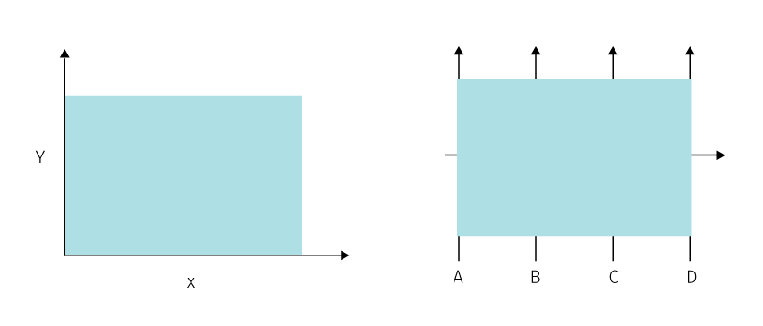

# Dealing with density in spatial data

*This chapter explores the possible solutions to high graphical density in maps with focus on hexbin aggregation and contextual interaction of map layers. Web rendering technologies that power these solutions are described afterwards. Chapter concludes with a case study report of urban recommendation system for the city of Brno.*

## Visualisation challenges of dense spatial data

As we have seen in the previous chapter, *objects*, *agents* and *events* with point spatial reference is by far the most common raw material fed to the visualisation pipeline for spatial big data. The *n=all* property of big data then generates a challenge of dealing with high graphic density in maps.

How to process a high number of data points for visual exploration, and why is it hard from the cartographic point of view? If we stick to the traditional understanding of visualization as "using visual tools to facilitate insight and support decision making of human recipients" then human cognitive capabilities are the main guiding factor to adhere to. Naturally, the are variances in graphic literacy across the population not to mention accessibility requirements for various sensory disabilities. There is no doubt that some classes of cartographic errors or visual artefacts are disqualifying for anyone, resolving these lowest common denominators is a prerequisite to resolving the corner cases (if they are ever thought about).   

There are also other limitations that take action in earlier stages of a generalized visualisation pipeline (see fig?). One thing to be aware of is that the simplification (aggregation, reduction, etc.) in the visual end product enforced by human cognitive capabilities should also propagate back down the pipeline to make the earlier stages of the process more efficient. Simply put, there is no need to retrieve every data point individually if (a) we cannot render it (screen barrier) and (b) we cannot comprehend it (visual barrier). This can mean a significant improvement when performance and scalability are of concern.

Hence the cartographic decisions made at the last stage in pipeline have impact on the overall performance of this pipeline. Not all challenges across the pipeline are visualisation/cartographic challenges -- those come usually at the end, but the cartographic stage cannot be separated from the data processing it stems from. Cartographer's decisions have impact outward to the reader but also backward to the previous stages of the pipeline. So far little has been done to asses cartographic methods from the point of view of the data-processing scalability, though in the era of dynamic source data, cartographers need to expand their awareness to that direction.

(TODO verify towards diagrams in section 2 -- visualisation pipeline (technical? organizational? describing process of creation? or describing a final working system? ))

So far we were mentioned just the presentation role of cartography, the interaction poses another set of challenges for the pipeline, though not all are cartograpic. For exploratory tools to support hypothesis generation, we should consider which tasks should be supported by interaction... (TODO) think through later...

-- some survey on visualisation pipelines @moreland2013survey
-- my own vis pipeline simply showing how data reduction occurs and for what reasons (technological reasons / cognitive reasons) -- technological limitations may be more flexible to deal with, but also visual capabilites evolve with higher exposition to various interfaces. On the other hand cognitive abilites may be varied per user persona... 

data -> technological filter -> coginitive filter -> idea/decision

TODO: image - dataflow via those filters (later).

processing difficulties ... technological filter - screen resolution limits, infrastructure limits -- not all datapoints can be shown.
cognitive filter -- not all can be processed, how to define and check automatically? 

but maybe better scheme for the shifting role of cartography:
data -> cartographic immagination -> technologic reapropriation/innovation 

In the following sections, whe will focus on two kinds of cartographic difficulties that arrise from processing heavy load of big data, namely dealing with density and dealing with change.

The visual problem posed by high density of point data is easy to imagine (for example from fig...). Some basc data visualisation methods may be immune to this (barcharts, pie charts), but positional types of visualisation like scatterplots and maps are hit heavily by this.

Similarly not all types of data are hit heavily on the cartographic visualisation side. If we circle back to types of point data, they are not equally difficult from the cartograhic view. Not all data processing challenges translate to cartographic challenges. Cartographic difficulties stem mainly from changes in position...? Stations, even if producing big data level loads of attributes are not so difficult cartographically if having low number and density, or better to say, it is nothing new for cartograhers...

Visual clutter in maps often comes from interaction of base and topic, application of labels, non of this gets better with dense thematic layer. Multiparametic visulaisation can make things worse or better. Interaction is the way to go brushing and manipulation (like sculpting a shape from a dense block). Some level of engagement is then required from viewer to play with the system long enoug (who has time to do that in the attention economy times?)

# Congestions + Data reduction methods

Why data reduction is necessary:
- quote Taleb about crossing the street and lots of info
- quote Dawkins on dimensionality reduction

## Avoiding aggregation

Visual conflicts of displayed symbology nothing uncommon in thematic cartography and there are several more or less scalable approaches to mitigating the issue without employing aggregation. 

Adjusting symbology properties is possibly the simplest first solution. Conflicts in the map field are often caused mainly by conflicting symbology rather than location. Especially for point features the symbology covers up more space than the real spatial extent of the phenomenon (which is plain x,y location), even more so if the symbol size conveys meaning, as in proportional symbol maps. Classical techniques to deal with the problem include adjusting the symbol scale to reduce overlaps, taking care of the drawing order so that the smallest symbols appear on top the larger ones, increasing fill transparency so that the overlap situation is explicitly visible, or displacing symbols and adding leading lines pointing to correct location. These methods have all their cons, to name just a few: scale modifications rarely work equally well across the whole map area and a break in scale (e.g. scaling down the largest outliers) works against intuitive inference of relationships from the map; drawing order enforcement fails if two similarly sized objects are close to each other; increased transparency can create distracting visual artefacts, and displacement effectively extends the problematic cluster area plus it is a quite daunting manual task. Needles to say that additional theme layers further complicate the situation as new cross-layer conflicts and overlaps arise. Congested areas in one layer generally preclude seeing trough to what is happening in lower layers.

TODO image about problems?

Now, to a seasoned cartographer this surely sounds like a content of an introductory course, though the question of classical de-cluttering techniques becomes more interesting if we turn our attention towards automating them. The automation is necessary because with dynamic systems we do not know beforehand how the data will look like -- the congestions will arise dynamically and will have to be resolved on the fly. It certainly helps if some data properties can be estimated beforehand (e.g. the atmospheric temperature in some location is unlikely to break out of its previously measured bounds by the order of magnitude). On the first glance, the majority of mentioned techniques are doable relatively easily with current tools for web mapping (maybe with the exception with the symbol displacement, chart rendering libraries like D3.js support collision resolving in bubble charts though that is not being widely used in the context of web maps). But if we put the current implementations under close scrutiny, even something as simple as changing the opacity of a proportional symbol can show some unexpected variants that point to the limitations on how we render maps on the web (see fig).

![**Fig.** A simple exploration of handling proportional symbol overlap. (a) The rendering order of symbols is from largest to smallest. This can prevent illegible symbols, but doesn't allow to see the underlying data. (b) Transparency alone can permit a glimpse trough, but the overlapping parts create a distractive visual artefact, and is suboptimal for heavily congested areas (see the illegible small symbol in the centre). (c) Darker outlines make all symbols visible, but contribute to the visual clutter in the overlapping parts. (d) One might attempt to omit fills altogether but that makes the irritation of overlaps even bigger. (e) This is not the variant of a. with white fills, here the fill s are blank but overlapping borders are removed. From now on we go beyond what is readily available in Leaflet and Mapbox symbolization. (f) Combination of b. and e. can be useful when having fills is important e.g. for added symbolization. Toned down non-overlapping outlines help to identify individual symbols. (g) Some displacement between the fill and the slightly transparent outline creates an interesting 3D accent. (h)  An example of how e. might work in combination with other symbol layer. (i) Multiple outlined layers are also possible. (j) Outlines can also be removed instead of fills. (k)(l) Additional symbolization is possible trough color.](imgs/img-circle-overlays.png)

* rant on symbol grouping in map APIS

Leaflet < desktop mapping (ArcGIS (TODO -- find out about what arcinfo can do) < graphical deskop (Adobe Illustrator)
Leaflet < Mapbox (in some aspects taking a different route -- e.g. scale based styling) < WebGl 
Web cartography is just too young yet and cartographer need to get their hands dirty with webgl and look around to fields where it is mastered like game development

* dynamic maps -- changing the order of layers, the symbology to get a glimpse of lower layers, 

Downplaying the basemap to reduce the conflict with spatial context.

* inset

Often the visually problematic areas do not span through the entire map field as suggested by the fig... Rather there are some clusters of concentrated symbols with high overlay and the rest of the field is distinguishable without treatment. Static (paper) maps deal with such clusters by inseting another fmap field with higher zoom level focused on the problematic area (which is a practice that could be imho applied also in web maps). For dynamic (web) mapping we are not confined by a fixed scale, therefor we can zoom in at the areas of interest. This might suggest that cartograher shoul leave such clusters without treatment, even though they are unreadable at the general resolution scale they suggest that there is something interesting going on it such areas ans invite user to zoom in.

In thematic cartography we are interested not only in displayin where individual objects are located but also we want to observe the associated attribute to study the spatial pattern. Highly concentrated areas...

- resolving conflicts -- long tradition in cartography, but how scalable and automatable? Spatial displacement techniques (non-cartographical) -- jittering @trutschl2003intelligently, topological distortion @keim2010generalized -- expanding (like cartogram for scatterplots)
- minification of symbols + downplaying or reducing the backgroud
- pixel-orientation -- maximizing screen utilization @keim2000designing 
- spatial distortions -- cartograms -- affects other spatial layers -- common distortion rule is needed to make sense for all layers -- population?
- filtering and sampling (below)
- alpha blending -- transparency (pros and cons)
- resigning on spatial presentaton: visualisaton of 1D event streams (using coordinated views: linking/brushing)
- 3rd dimension -- interaction and exploration of a time-space cube

@correll2017surprise:

One  approach  to  event  visualization  is  to  visualize  individual
streams  of  event  density  [@beard2008framework (no access, probably some coordinated views for explor. analysis),  @krstajic2011cloudlines -- multiple time series, density estimation in text streams].   While  streams  of  1D  event  den-
sity data are useful,  they require careful layout and sorting in order
to illustrate spatial patterns. Where both the temporal and spatial com-
ponents of the event data are important, other approaches seek to vi-
sualize the “space-time cube” [@bach2014review -- see for review of timespace cube approaches] directly, mapping events to points in
3D space [@gatalsky2004interactive -- just an description of an implementato of some 3D cube observer, @tominski20053d -- time-space cube inspired catographic symbols (pencil/helix icons) observable in the 3D space].  For many cases, we find this approach unsatisfac-
tory; projection and occlusion issues require interaction and 3D spatial
reasoning in order to discover patterns of interest. 

Other stuff to check:
@janetzko2018pixel

@keim2008visual -- original way to deal with display density --  get bigger screen (aka powerwall)
-- also see fig3 Varying degree of pixel overlap depending on screen resolution
-- basically a kind of cartogram solution

## Aggregation 

!Todo -- isn't this denying the base property of BD (no aggregation?). No. It is visual aggregation at the end of the visualisation pipeline -- has many advantages: choosing the aggragation properties (not dictated by data provider), combinig data sources into aggragation ...

Cartographic generalization model by McMaster and Shea (?) recognizes the following types of aggreation -- TODO

The type of priary interest for us is the one using the equal-shape tesallerations. This type appears to be most flexible as data are aggragated to the standardized shape that is defined *ex ante* and therefore not dependent on the character of aggregated data. Unlike (e.g. interpolation methods, heatmaps, etc.) the referential geometry does not adjust to the changed data, which makes the computation performace quite scalable and predictable across higher data loads.

When it comes to the shape of the referential geometry, we can chose from three types of tessaleration that completely divide space into units of same regular shape^[In fact there are x complete (currently known) shapes that produce complete tessaleration, but only regular convex shapes are interesting for cartographic use.]: square, hexagonal and triangular shapes.

--- ease of creation
Square grid is the simplest division of space.

- hexagonal -- centroids in hexagonal binning form a triangular grid, so an individual hexagon has the same distance from all it's neighbours (why is that good? not th case of rectangular grid).
- rectangular -- can create pyramids for hierarchical aggregation, that is a higher level shape can fully contain shapes of lower level wihch is not a case for hexagons. Rectangular shapes are also better fit for proportional scaling in two dimensions (width and height) which unlocks potential for displlaying an additional vable.

-- some literature with discussion: @unwin2006graphics -- compare 3 schemes, @carr1987scatterplot hexbins -- reduced bias in density estimation, but @scott2015multivariate -- showing marginal differences  

from https://www.meccanismocomplesso.org/en/hexagonal-binning/?fbclid=IwAR2IDJGQGed1rtLsoe0M_NVHqxZp6rdGfvUD370ccaO7_XsJmG989JqjQbQ

'''
The most evident is that hexagons are more similar to circle than square. This translates in more efficient data aggregation around the bin center. This can be seen by looking at some particular properties of hexagons and, especially, of the hexagonal tessellation.

Hexagon is the polygon with the maximum number of sides for a regular tessellation of a 2D plane.

This makes the hexagonal binning the most efficient and compact division of 2D data space.
hexibins-patterns

Fig.6: the hexagonal tessellation

In fact, although you can create many pattern using two or more types of polygons,  this is not possible if you are using the same polygon if this has more than 6 sides. Only triangles, squares and hexagon can create them.

    In an hexagonal binning, adjacent hexagons shares edge borders and not only vertex borders.

Instead in square and triangular binning, triangles and square share only a vertex border with some adjacent.
hexbins-patterns2

Fig:7. sharings of the borders in different tessellations

Considering polygons with equal area, the more similar to a circle this polygon is, the closer to the center the border points are (especially vertices).

Thus any point inside a hexagon is closer to the center of any given point in an equal area square or triangle would be. This is because square and triangles have more acute angles.
'''

## density vs. attribute visualisation
- implanation - classification techniques: classical, new: yiang - fractal breaks, bayesian surprise, uncertainty-adjusted scales
- shape, position, other options for multiple vis -- indiemaps article, other tesallerations

liu2013immens (done)
---

*Scalability of visual encodings* (how visualized) vs *interactive scalability* (how interaction works) -- both should be limited by the chosen resolution of visualized data not the number of records.

Aggregation methods ~= Data reduction methods:
- bridge to previous chapters regarding sampling: bd analytics may no longer require it, though visualisation needs it (unfortunately?)

a.) filtering & sampling: Subset of data is selected to wich we apply visualisation techniques. The key problem of sampling is selecting a subset that is representative of the whole dataset. Several types of sampling were designed to increcase the likelihood that a sample genralizes well to the whole population.

With simple random sampling each point has the same probability of being selected. Members of population are uniquely identified by consecutive positive integers and then pseudo-random number generator is used to select the subset of required size. As no other variables are considered, this technique can produce wildly unrepresentative samples from heterogeneous sets, where important structures or outliers can be omitted.
 
Systematic random sampling tries to avoid some limitations of the purely random approach to ensure main groups present in the population don't get omitted or oversampled in the subset. A random component is maintained by selecting randomly within the specified groups; the number of elements picked from each group doesn't have to be uniform, as groups can be weighted to preserve the relative importance of groups in the source dataset. Spatial equivalent of this approach is called geographically *stratified* sampling where we divide the area of interest into sub-areas (for example quadrat or hexagonal tessellation) and perform random selection within each cell. This is useful when we want an even coverage of the area of interest in the sample. Furthermore, for spatially uneven populations, we can employ *cluster* sampling, where we pick more samples from certain areas, for example from metropolitan areas -- which is effectively weighting the areas by population. The third class of spatial sampling, *systematic* spatial sampling, that takes samples from evenly distributed locations, is more suited for sampling from continuous data rather than from discrete point clouds that mainly interest us in this chapter.

A straightforward way to evaluate the sampling design is comparing distribution and basic statistics such as mean and variance of population and sample. @chun2013spatial compared random, systematic and stratified sampling on three kinds of simulated trend surfaces: linear (gradual increase from one side to another), quadratic (highest value in the centre gradually lowering radially to the sides) and oscillating (several sinusoidal bumps and pits). According to their findings, stratified spatial sampling generally better preserves mean of the population, systematic spatial sampling performs better at preserving variance.

Spatial sampling differs from regular sampling, often breaks i.i.d. (independent and identically distributed) assumption, see @wang2012review for review of spatial sampling.

Sampling has many uses to speed up analysis, when avoiding assessing the entire population is feasible. Advances of big data infrastructure reduce the need for sampling out of necessity. Not only a data reduction technique, but often (esp. in spatial sciences) a data collecting convenience (collecting data at discrete locations and interpolating). Also resampling techniques (bootstrap, jacknife, off-by-one ... others) are useful for testing and validating spatial models, Bootstrap is better for distribution estimation, jacknife is superior for variance estimation  @chun2013spatial. See @kleiner2013general for evaluation of the bootstrap techniques from the performance standpoint.

Elaborate sampling methods require specific dimensions are chosen ahead of time, requiring prior knowledge and often costly pre-processing (@liu2013immens). Moreover, in vast datasets the reduction would have to be too significant. Sampling to ease point cloud visualisation doesn't seem as an adequate approach.

b.) binned aggregation -- Binning aggregates data and visualizes density by counting the number of data points falling into each bin. (TODO terminology from the generalizaiton pov)

c.) model-based abstraction - describing data in terms of mathematical models or statistical summaries. -- basically meaning interpolation techniques in spatial world

d.) hybrid reduction methods -- combinations, eg. binning with displayed outliers in dataset as well as binned density (@novotny2006outlier use it in parallel coordinate plots), no reason not to apply in bins.
-- research on combining sampling and aggregation: BlinkDB -- builds fast approximate queries a multi-dimensional and multi-resolution stratified samples and computes aggregates over this reduced data. BlinkDB -- queries with bounded errors and bounded response times @agarwal2013blinkdb
-- online aggregation -- showing continuously updating aggregates and confidence intervals in response to a stream of samples -- hellerstein1997online, fisher2012trust

###Designing binned plots 

Why binned plots?
-- conveys to both global patterns (densities) as well as local features (e.g outliers)
-- multiple levels of resolution via varying cell size
-- they refrain from using additional visual variables such as texture or size as they believe it can interfere with interpretation (I don't). Mulitdimensional displys can solve it -- coordinated views, trellis plots ++ brushing and linking

###Interaction with binned plots

### Point aggregation
-- mostly don't like it -- difference between current applications and what should be acheived
-- loss of orientation between zoom levels -- smoother transition of collapsing/grouping ponts -- show paths/traces? 
-- point aggregation -- basically sampling with information on how many points are represented ...

## Tasks
* anderienko on tasks: (andrienko2003exploratory, and andrienko2006exploratory -- TODO revisit and compare how these accounts differ -- probably apply above)
- ultra brief @andrienko2003exploratory: 
Analytical tasks ivolving event data can be characterized at some combination of *what* + *when* + *where* 
To support these tasks, event visualisation must, at a minimum, *illustrate spatial patterns*, and, if a temporal axis is present, *afford navigation or summariaztion through time*.

- notes from hierarchical aggregation paper @elmqvist2010hierarchical
On conept hiercharies -- hierarchies can exist in spatial (state > province > disctrict ...), temporal (month > week > day) and attribute relations .. changes in level of hierarchical aggregation is reffered to as *roll-up* or *drill-down* (@elmqvist2010hierarchical).
- inmems papaer -- interactive scalability for panning, zooming, brushing and linking.

mulitple attributes
figure vs. ground - comparison with spatial context

# parameters of binned visualisation

Cell sizes: staisticians proposed several heurisics to select bin sizes -- applicability to big data unclear (some explanation and critique on Sturges in @hyndman1995problem): Struges's formula @sturges1926choice, Scott's reference rule @scott1979optimal 
Color encodings --density can be encoded to hue, luminance or opacity

@liu2013immens use frumula for hue intensity in bins: y = alpha + ((x - xmin)y/xmax-xmin)(1-alpha)
Y comes betw 0 and 1, x is the data value
-- what other libraries use?

notes from @tufte1985visual
----------

data-ink ratio: data-ink non erasable core of the graphic that presents data information.
`data-ink / total ink on graphic` = proportion of ink used to convey non-redundant information -- the number we want to maximize (within reason)

another tufte sparklines @tufte2006beautiful
---------------
https://www.edwardtufte.com/bboard/q-and-a-fetch-msg?msg_id=0001OR

A sparkline, as defined by Tufte, is “a small intense, simple, word-sized graphic with 
typographic resolution. Sparklines ... can be everywhere a word or number can be: embedded in a sentence, table, headline, map, spreadsheet, graphic.”

@correll2017surprise
Biases in thematic maps:
- base rate bias
- sampling error bias
- renormalization bias

# app -- binning playgound
-- timeline to simulate movement
-- bins / hexagons
-- varying size of bin -- some statistics for size selection
-- moving the bin around area
-- couple/decouple bin resize with map zoom
-- various color shemes -- for density
-- usage of transparency

-- multidimensional:
-- using relative size, in squares use two size changes
-- inscribe proportional circles (both), squares -- only rectangular grid

-- more dimentions:
-- inscribe marimekko charts / pie charts - split charts for 2 densities
-- hachures over bins ...
-- outlier in bins, etc...
-- try selfhosted mapbox for 3D view? -- or check uber glsl wrapper
 
 A friendly introduction to Bayes Theorem and Hidden Markov Models
-----------------------------------------------------------------
<https://www.youtube.com/watch?v=kqSzLo9fenk>

example of hidden markov model
-- from one variable (persons mood) we infer the other "hidden" variable (weather)
-- we have to have some training dataset of previous runs of both variables from which we calculate transition probabilities (change from one state to another in the hidden var, e.g. from sunny weather to rainy) and emisshin probabilities (probability of a state in hiiden var causing state in other var -- e.g. sunny weather makes me happy in 80% of cases)
-- bayes theorem -- calculating the probability of a state in hidden var based on -- prior probability (percentage of sunny days in training set) + emission probabilties + state of known variable --- this calcualtes posterior porbability of a state of hidden var

-- also we can calculate the transition in hidden var based on transition of known var -- this gets more complicated in longer sets -- *Viterbi algoritm* simplifies by storing just the most probable path throughout the run

# on UX, interaction and beyond
---------------------------------

- cartographic concepts applicable in UI design and vice versa (TODO some reading on UX)
-- visual weight, negative space, generalization of ui components 

- tighter coupling of intra and extracomposition
-- legend 
-- do some design and usability reading (don't make me think, check some books on product design...) <https://www.fastcompany.com/1292961/30-most-important-books-product-designers>
-- user personas, user stories...

- Iteraction strategies
Andrejenko's view of tasks

- responsivity challenges
https://codeburst.io/the-challenges-of-responsive-web-design-9d64971921fb

- TODO: image 2 kinds of weather roses - wind diagrams (more and less complex), data from slovenská lavínová služba.

- animation and movement: how does it support usability (blog creating usability )
- strategies for density reduction in controls
- combining functions (legend and histogram and brushing control) - (využiť návrh na baptisteries, legendy aj timeline z toho proposalu )

# Visual storytelling vs dashboards
Data journalism helps to interpret the map and poses the argument leaving a passive role for the viewer, consequently making it harder for her to restate the qustion. Dataviz dashboards tend to give a stack of options but no clues on where to start, which is like leaving a person in the cockpit to figure out how to fly herself. In both cases there is a silence about a possibility of no discernable pattern. 

What is the audience - some notes from the field:
https://medium.com/@tophtucker/doing-enterprise-financial-data-visualization-after-data-journalism-3c68861b7f4c

# more
https://www.microsoft.com/en-us/research/project/user-experience-with-big-data/#!publications

# Comparison of rendering technologies
--------------------------------------

How is the cartographic design influenced by the rendering technology applied? 
What technology (or combination of technologies) is suitable for cartographic visualization of dynamic data sets?

# SVG vs. Canvas vs. WebGL

- table of parameters (cartographic standpoint)
- graphic -- browser to GPU continuum (see Dominikus Baur) 
- history see @williams2012learning, chapter on HTML5 drawing APIs

## SVG
pros:
- vector
- accessability of elements trough DOM
cons:
- not suitable for large number of elements and animations ()

## canvas
pros:
cons:

## WebGL
pros:
- speed - uses client's GPU
cons:
- raster
- programmer's experience
- what can be done with pixi.js, why are game programming libraries good or bad for creating inteactive maps (e.g. bad: too focused on redndering pre-created raster images..., limitations of pixi v4 particle container (explained in Medium blog on global fishing watch))

https://blog.mapbox.com/how-i-built-a-wind-map-with-webgl-b63022b5537f
- a trip trough the graphics pipeline

### explanation of CPU vs GPU rendering
-- image in appendix

# UX and interaction (TODO maybe to the next section)
----------------------
@thomas2005illuminating

Visual analytics is not simply about presenting information. Rather, an analysis session is more of a dialogue between the analyst and the data, where the visual representation is simply the interface or view into the data.
-- my note: the dialog metaphor is somewhat assuming that both sides have actually something to say... rephrase: Analysis session is like tuning a radio, sometimes you get a crystal clear reception, but often it's just a noise and often you can't say if you really hear something articulate behind  the walls of noise or if it's just a trick of your immagination.

Too often in the visual analytic process, researchers tend to focus on visual representations of the data but interaction design is not given equal priority. We need to develop a “science of interaction” rooted in a deep understanding of the different forms of interaction and their respective benefits.

The mantra by Shneiderman [1996] of “Overview first, zoom and filter, details on demand” is well-accepted, but what are the next steps, or additional different steps? -- my note: noisy overview can be a good overview too.

There are at least three ways to look at the science of interaction. 
* we can look at interaction from the point of view of human time constants. This is an important viewpoint because all interaction is constrained and driven by what the user is cognitively and perceptually capable of doing. (see next chapter) 
* we can look at how interaction is used to accomplish tasks such as data manipulation, manipulation of visual mappings, navigation, and dialogue.
* we can look at the nature of the interaction itself, including the differences between interactions in 2-dimensional (2D) and 3-dimensional (3D) environments and the effects of the devices used for interaction. -- And also across different devices (responsive web design).

point 2 more precisely:
-- *Interactions for modifying data transformation (filtering)*. Several common techniques are in use today, including direct manipulation, dynamic queries [Ahlberg, 1994], brushing [Cleveland & McGill, 1984], and details-on-demand.
-- *Interactions for modifying visual mappings.* Dataflow systems [Haeberli, 1988] and Pivot Tables are two examples of techniques that allow the user to interactively change mappings between the data and their visual representations.
-- *Interactions for modifying view transformation (navigation).* Interaction techniques range from simple approaches like direct selection for selecting and highlighting objects of interest, to more complex camera control techniques in 3D environments. They also include techniques for panning and zooming [Bederson et al., 1996] as well as for achieving a balance between overview and detail [Plaisant et al., 1995].
-- *Interaction for human-information discourse.* The least well understood use of interaction is to support a true human-information discourse in which the mechanics of interaction vanish into a seamless flow of problem solving. Interactions are needed to support processes such as comparing and categorizing data, extracting and recombining data, creating and testing hypotheses, and annotating data.

Goals for interactions:

Similarly, combining or merging interactions and controls with visible represen- tations can also speed access, control, and manipulation operations. Often, users experience a cognitive separation between the task they want to accomplish and the mechanics for accomplishing the task. New techniques can be invented that do away with the separation of “what I want and the act of doing it” [Van Dam, 2001]. Integrating views, interactions, and analytics provides significant productivity improvement for the combined human, analytical, and data system.

focus-and context across scales
Analysts working with large data sets want to gain a global understanding of the data and then focus on particular data items and their attributes. Alternating among levels of detail generates moment-to-moment insights and spurs new questions. A number of visualization and user interface techniques have been developed to sup- port coordinated views of both overview and detail. Greene et al. [2000] found that previews and overviews help users quickly understand the scope of their data set and discriminate between interesting and uninteresting content. Existing techniques include the use of multiple coordinated windows at different focus levels, panning and zooming operations, and so-called “fisheye” views [Plaisant et al., 1995; Furnas, 1986]. Fisheye techniques are “focus+context” views, i.e., one in which both the overview and detail are presented side by side in the same view. The power of “focus+context” comes from the ability to subjugate unimportant information for contextual navigation while using attentive focus for effectively communicating information. While existing techniques in this area are very useful, new methods must be developed that take advantage of multiple and large-area computer displays to assist analysts with inquiries on the massive data sets evident in visual analytics.

data abstraction vs visual abstraction
There are two interrelated issues in dealing with abstraction. The first is the development of an analytic capability to transform data from one representation to another. Selecting relevant information, filtering out unneeded information, performing calculations, sorting, and clustering are all components of data abstraction. Second is the development of techniques for visual abstraction. Visual abstraction involves developing effective representations for different types of information. Visual abstraction also involves the control of emphasis and level of detail. Different representations of the same object may be needed at different levels of detail, depending on the importance of that object for the given task. Secondary visual attributes can also be used to connote additional attributes that are important in reasoning,
such as the quality of the data or the confidence in the assessment.

Develop visual representation methods for complex information that provide
the appropriate level of abstraction.
Research is necessary to:
• Identify alternative visual representations of data that best support different
analytical tasks
• Develop transformation methods that allow the user to move among alter-
native visual representations to facilitate exploration and discovery
• Provide level of emphasis and detail appropriate to the user’s data and task.

# Figures and grounds 
---------------------

Two tautologic definitions:

"Topographic map is a set of entangled thematic maps"
"Thematic map is a topographic map with one layer disproportionally enhanced"

In this chapter, and actually in the whole thesis, I explore how to create thematic maps from Big data.
Lets (reiterate) start with the distinction between the topographic and thematic cartography, as those arise from different practical motivations that translate into different design implications.

The starting point for a **topographic map** is a given territory, that is to be interpreted on a blank page/screen. In topographic maps we create a model of the surface, and we want to include all environmental characteristics that we believe to be relevant to the task -- and the task is usually to help with orientation in the given territory. The real alchemy of the topographic practice is to depict all layers without clutter -- the layers must be equally separable/retrievable. This is because we do not know beforehand which features or combination of features will become useful for orientation. Map creates a *taxonomic space* of what is to be known about the territory (let us set aside the power-related difficuties of what is being omitted and who does the selection on who's benefit) and puts these species to relationships. This synthetic aspect is for @wood2010rethinking one of the most important features of the map -- the sign systems (layers) are in constant dialog, allowing us to extract meaning from those relations that would be hardly obtainable without using the map. Here, "the whole is greater than the sum of its parts.” -- Aristotle.

In **thematic maps**, the starting point is is a phenomenon. We want to learn something about it by studying its spatial distribution, by searching spatial correlations with other features, and also by mapping how the internal structure of the phenomenon changes across space. 

Find the distinction in bertin... 

In both cases we overlay comprehensive sign systems (rivers, settlements, mountains...), though what differs is their relative visual prominence: we can say a thematic map is a topographic map that gives asymetric prominence to one layer of interest (though often richly differentiated in its cartographic presentation) and pushing the remaining layers to the role of toned down "base" merely aimed to provide geographical context for the reading of the topic. Sometimes things go as far as the base is reduced to the minimum (often administrative boundaries) or omitted alltogether (in such case the topographic context stems from the distribution of the signs in thematic layer -- from what @wood2010rethinking calls a *tectonc* code of the map). 

Let us make an aside about the limitations of the concept of layers (succesfully used in graphic programs such as Illustrator or Photoshop) in cartography. Example of railroads and highways -- when working with raw spatial data in a mapmaking system, say qGIS, we can easily switch the order of layers, however on all intersections the same layer will be the one overlaying/crossing the other -- we can switch the order but we can not treat the intersections differently per instance. So its ether *all* railroads passing over *all* highways or the other way around, but of course in reality both situations are likely. Of course, cartography has its ways to deal with this -- to entangle (mostly line) layers with each other (some more manual than others -- cituj prezentaciu švajčiarov s ich generovanými národnými mapami), but this points us to the fact that layers of the real world are not cleanly separable -- our experience of reality creeps in to remind us we are playing with a model.

So the layers in a topographic map are not merely overlayed, they are entangled, integrated with each other. We can turn the definition around and say the topographic map is woven from a collection of collection of thematic maps.

In Wood's words if the *sign systems are talking to each other* and *each sign system is potentially figure and every sign system is potentially a ground*. The thematic cartography is reducing the dialog, toning down the base layers in favor of the dominant voice of the main layer.   

In thematic maps, the thematic layer *is* overlayed on the base, no entangling is done. For years before we could rather say the topic is overprinted. The alchemy of the thematic cartography is to make the topic in its complexity stand out, and paradoxically this is done by manipulating the base. For example, if we look at subtle palette of 6 colour tones used in Czech ZM maps, it's clear that future thematic overlays were considered (and done, as overprints or web map overlays). There is a clear and solid border between topic and base, partly due to the technical limitations but also given by understanding base as something solid and rather fixed and the topic as abstract, fluid and driven by data with high frequency of change.  

The border between the topic and the base has transcended also to modern web cartography. Here, the standard around year 2010 is a base given by some pluggable tile service (predominantly stored remotely and not open to style changes) overlayed by some SVG vector shapes. WMS services are often designed as topographic maps, though there are examples of toned down style fit for a base map.

The interplay between the topographic base and the thematic overlay is at scrutiny on the following lines. The question is whether there is any value in breaking this border, now the technology that could facilitate this has arrived.

This means trasferring from the SVG overlay to canvas or webGL. Canvas allows for filtering of the overlayed matter -- so it is possible to "manipulate" the coloring of the external base maps -- it should be possible to extend those filters to make them more selective. Recently emerged base maps based solely on WebGL provide options for figure and ground.

Strategies:
- simple: pushing theme to the base (underlay)
- harder: data driven styling based on overlay -- overlay algebra that is done without touching the source data (like overprint, of multiexposure shots in photography but really beyond these analogies). It is solely based on web-gl filtering

# Case Study: Urban recommendation system

The origins for this case study stem from a 2018's demonstration application for a hackathon competition that this author attended. The intent was to develop an urban recommendation system that would help dwelling seekers to identify areas in the Brno city that best match their needs and expectations. The original implementation using Leaflet front end has been fully reworked by the author into Mapbox based application for the purpose of this thesis. Aside from the primary goal of spatial optimization tool, the application aims to demonstrate the ideas presented earlier in this chapter -- the use of hexbin grid and layer entanglement to battle visual clutter, some recommendations for map UI design are also showcased. In terms of software implementation, the benefits of the React front-end framework for creating interactive maps are discussed, and comparison of solutions based on Leaflet and Mapbox map rendering libraries is provided.

## 1. Data sources and transformations
- data from osm 
- interpolation to the grid 
- leaflet + db vs mapbox
- data for buildings 

The application allows users to select several parameters and assign weights to them. Based on the selected parameters and weights a map is rendered dividing the city to areas of high to medium to low desirability. Changes to weights and parameters is reflected in the map as the desirability surface is recalculated on the fly. 

The parameters include both attractive and repulsive factors: proximity to schools and nurseries, parks and greenery, places of worship,  healthcare, sport, cultural and social facilities on one side, noise, crime and prices on the other side. The majority of the source layers is taken from the OpenStreetMap database, that allows for easy automated updates via it's API. The input data were harvested for the area of the city including a 5 Km buffer to prevent undesirable interpolation effects on the area borders. The table outlines the input layers with sources.

(TODO table) -- name, group, source, what is incueded (notes), spatial reference
-- todo -- check the actual data

culture
health
church
parks
social
sport
transport
crime
prices
noise

Sources come with both point and polygon spatial reference. To harmonize the sources into one common spatial format that would allow to apply weights and would allow dynamic re-classification based on scaled we created a 100 m point grid covering the area of Brno (the grid was spread in such a fashion that the spatial coordinates of individual points are rounded -- so that the storage footprint is minimized). The point layers where then used to create distance surfaces using IDW interpolation in QGIS desktop tool. Data from these interpolations where then combined with existing zonal layers (noise, crime, property prices) to generate input for the attribute table of the point grid. This was done using the standard spatial join feature in QGIS (illustrated on fig). In the resulting point grid, each point contains an attribute containing a distance from the given point to a nearest facility of interest, or the given index for some layers (crime, noise...). Furthermore, these attributes have been normalized to fit into 0-1 scale across the city area.

This allows for meaningful comparison of data and application of weights. (TODO -- another tables -- what means zero, what means one for various layers). 

TODO -- how weights are applied

## 2. App architecture (react redux mapbox)

Old version:
posgres + node on backed -- React + Leaflet + Turf on the frontend

New version 
Mapbox for layer storage -- React + Mapbox on the frontend

## 3. User interface design

Type 1 - see comopound livability score
map field:
- ability to 'prepend' transport layer for orientation
- same for brno districts layer (optional dotted overlay with labels)
- select building mask
- histogram on Legend (TODO)
.. think of something else...

controls:
- select groups, select layers, change weights

Type 2 - see the distribution of selected layers both separately and together
map field:
- various types of symbol sizing within the grid

controls:
- inset map TODO
- dynamic legend brackets

Type 3 ? -- square or triangle grid, better smooth appearance? 

## 4. Notable findings
- what spatio-temporal queries are enabled by this kind of visualisation? Which are not? (see chapter 2)

## 5. Possible extensions

Possibility of regular updates to keep the content true to reality.
Possible Extensions to other cities .. automated data processing pipeline

notes:

-- sdf icons required for recolorable icons,
notes: https://github.com/mapbox/mapbox-gl-style-spec/issues/97
https://halisavakis.com/my-take-on-shaders-ui-sdf-icon-shader/ (creating in pdf)
https://habr.com/en/post/215905/
https://github.com/elastic/kibana/issues/39715

https://github.com/mapbox/mapbox-gl-js/issues/1817#issuecomment-497446984 (workaroud to enable coloring by editing the sprite's json)
-- sprite editing via api

https://weekly-geekly.github.io/articles/215905/index.html

-- problems -- how to create, how to tell if it was created?
-- how to upload -- studio doesn't support it
-- only single-color icons

-- pros: can define color dynamically
-- can set halo
-- solution add programmatically as one time import:
https://stackoverflow.com/a/53998098

- nakoniec som nepouzil -- normalne prefarbene svg

------
- aleterntativa -- iba high wedge pre vsetky kategorie ale zmeny opacity... to nie
- zmeny sirky, alebo odsadenie od stredu
