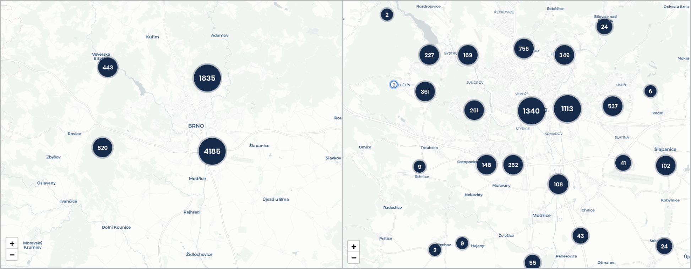

# 3 Mapping spatial big data

This chapter explores possible cartographic solutions to high graphical and temporal density in spatial data. Focus lies on hexbin aggregation and contextual interplay of map layers. Web rendering technologies that power these solutions are described afterwards. 

## 3.1 Visualisation challenges: spatial and temporal density

How to process a high number of data points for visual exploration, and why is it hard from the cartographic point of view? If we stick to the traditional understanding of visualization as using visual tools to facilitate insight and support decision making of human recipients, then human cognitive capabilities are the main guiding factor to adhere to. There are variances in graphic literacy across the population, not to mention accessibility requirements for various sensory conditions and disabilities, but to even start addressing those issues, we first need to focus on the *legibility* as the base requirement common to every recipient.

Legibility in maps enables readers to separate signs from each other and to distinguish steps of visual variables. @bertin1983semiology names three parameters that determine legibility in information graphics: *graphic density*, *angular separation* and *retinal separation*. Graphic density is a number of marks per cm2, angular and retinal separation describe the perceptible differentiation in angles (e.g. to compare shapes or segments in line charts) and in visual variables (like hue or size). The joke charts in fig illustrate the visual problem posed by the high graphic density caused by high data load. Unlike angular and retinal separation that to a high degree result from the author's choice of symbolization, the graphic density is largely determined by constraints that cannot be influenced by the mapmaker. In the next section we will look closer on what these are.

Aside from graphic density that causes illegibility in map symbolization, another direct impact of big data on cartographic visualisation stems from changes in data that happens through time. With accelerated change frequency two problems arise — the data needs to be processed "real-time" in order to keep the picture up to date plus there is a rapidly growing log of historical data that needs to be processed. Digital map interface then needs to adjust visualisation to the most recent version, appropriately notify the user of important changes, and enable historical analysis and reasoning about the upcoming trends.

### 3.1.1 Design constraints

Let us consider the parameters that determine the graphic density in digital maps. The graphic density may vary along three axes (fig):

1. *Axis of scale* determines the land area displayed in the map view. Unlike print, web map interfaces support dynamic change of scale (zoom in and out) and focus (panning). This is a great capability for exploring data and can help to mitigate some graphic fill issues, but also complicates cartographic design as the chosen symbolization should work on every scale level. This requires dynamic adjustment of symbology: for example, if point symbol size is kept constant across scales (default in many web mapping libraries) a larger point cluster soon becomes illegible due to overlaps. However, plain linear size adjustment can lead to empty-looking maps if the symbol size gets too small in larger scales. For the majority of projects, there is a range of meaningful scales. Until recently, web mapping libraries supported only limited number of discrete zoom levels (from 0 to 19, a limitation dictated by tiled raster base map sources), so there was a limited predictable range of zoom levels that cartographer needed to consider for a project. As we will describe further in this chapter, vector tiles allow for fractional levels so the zoom experience is smoother, therefore it is now more efficient to define a scale based function for symbology adjustment rather designing specifically for discrete steps.

2. *Axis of screen space* determines how the map view reacts to varying screen sizes. The standard requirement for modern websites is responsivity, which means the site should adjust the browsing experience to reflect the size and capabilities of the viewing device (desktop, tablet, or mobile nowadays, plus whatever comes next in the future). For many map based web applications, responsivity to small mobile screens is not pursued as the resulting experience is suboptimal. But this niche is certainly worth exploring in the field of thematic cartography, mainly because the proportion of mobile-first users is likely to rise^[<http://mobilev.is/> aims to collect good examples of data interaction design for small screens].

In a responsive web map, the screen size and aspect ratio influences the size and shape of the map view which in turn needs to be reflected in the initial map scale (zoom level). The so-called *visual information seeking mantra* states "overview first, zoom and filter, then details-on-demand" (@shneiderman2003eyes), which translates well to digital thematic maps — we naturally expect to see the whole extent of the mapped area to be able see the general spatial pattern first. However, to provide the initial overview consistently across devices, the responsive map application needs not only to adjust the map view size but also to calculate the correct initial zoom level to fit the area of interest into that view. Fractional zoom levels in mapping libraries are a significant help in this, because the differences in whole number zoom levels often lead to insufficient fit.

3. *Axis of data change* describes how application reacts to changes of displayed data. These changes can be far more complex than in case of the previous two axes as the number of possible data layers, configurations within them and interrelations between them is countless. The changes may be triggered by *user interaction* or in case of continuous data streams by *changes in data itself*. Users can change the visibility of data layers, modify visual variables, adjust the temporal scale, or change the aggregation level (drill-down and roll-up actions elmqvist2010hierarchical). The range of supported interactions is defined by application authors, but the actual outcomes of these interactions can be quite surprising, especially when combined with dynamic data. Real time visualisation then brings true unpredictability to the design process (dubbed "blindfolded cartography" @woodruff2015blindfolded) and has implications on data processing pipelines and on abstractions in data and visual space. 

Navigation and other problems that involve reasoning about space are well studied; however, reasoning
about sequence of events is not as well understood. Dynamic data visualisation needs to be informed about human time constraints. Four distinct cognitive bands are of interest (@thomas2005illuminating): *~100 milliseconds* — rate necessary to produce the perception of a smooth animation or immediate response in interaction design; *~1 second* — necessary rate of response to simple user actions. If the response might take more time, it is important to provide some kind of feedback in the 1-second timeframe to reassure the user that something is happening. This time constant is also useful for user-initiated transition animations; 
*~10 seconds* — time within which users expect more complex user-initiated activities to complete; *~100 seconds* — time frame for higher-level reasoning processes

The fourth constraint is the axis of cartographer's ability — for example, failure to adjust symbolization to scale changes can result in illegibility even in cases when the screen space is sufficient and the data load is moderate. Choice of symbolization can greatly support angular an retinal separation and also battle graphic fill. The three aforementioned axes are in fact inseparable and combined together they determine how effective will the digital map be in different situations. Delineating the space of possibilities and then designing the application's behaviour accordingly requires lot of imagination, effort and testing.

The axis of data change is the one that is mostly affected by the big data properties. Let us consider the data processing pipelines.

### 3.1.2 Data processing pipelines

Earlier in chapter 2 we presented the information visualisation reference model that describes the series of transformations that lead from raw data to actionable views. The actual *data transformations*, *visual mappings* and *view transformations* are unique for each project, and are likely to get reevaluated along the course of development. Applications based on dynamic data bring an additional difficulty — the transformations need to be re-executed with inflow of new data after the application is already published and used. So the transformation rules should be designed so that they can react to unprecedented changes in input data properties. If there is a requirement for real-time processing, this needs to happen ideally without any manual intervention of application maintainers. 

The reference model then becomes less of a description of the application production process, rather it describes the data flow through the working system — the application's data processing pipeline if you will. From the cartographic standpoint, we find it useful to split the pipeline into the *data space* and the *visualisation space* (fig.). The main area of concern for cartographers lies in the visualisation space, in choosing appropriate visualisation methods and graphic variables (visual mappings) and in designing user interaction modes (view transformations).

This all has to cope with the limitations that come from the characteristics of the viewing environment (the combination of screen space, scale and data density outlined above) and also from the cognitive predispositions that favor certain pairings of data to visualisation method and disqualify others. As we discussed at length in chapter 1, big data pose a challenge for scaling the data processing infrastructure. The issues and solutions in big data processing are well described and understood. However, the implications of big data on the design decisions in the visual space are less researched. Furthermore, what is happening in the visual space should have implications on the data space, there is a large potential in treating the processing pipeline as a whole.

For example, any aggregations in the visual end product enforced by human cognitive capabilities should get propagated back down the pipeline to make the earlier stages of the process more efficient. Simply put, there is no need to retrieve every data point individually if (a) we cannot render it (screen barrier) and (b) we cannot comprehend it (cognitive barrier). This can mean a significant improvement when performance and scalability are of concern.

Hence the cartographic decisions made for the later stages in the processing pipeline have impact on the overall performance of this pipeline. The choice of visualisation and interaction methods has impact outward to the user but also backward to the previous stages of the pipeline. So far little has been done to asses cartographic methods from the point of view of the data-processing scalability, though in the era of dynamic source data, cartographers need to expand their awareness to that direction.

Challenges of dynamic data lie both in the data space — where it is a question of efficient encoding, storing, transferring and decoding long time series of records, and in the visual space — where we are interested in depicting evolving spatio temporal relations and correlations. Again, the nature of temporal-analytic features designed for the map interface have impact on the data processing pipeline. 

Not all data processing challenges translate to cartographic challenges. Some basic data visualisation methods are fairly immune to challenges of real time data inflow (e.g. pie charts are not less readable when based on massive number of observations), but positional types of visualisation suffer from graphic density. This can be worsen by a cluttered base layer, labels, or unexpected interaction results. Let us look at some ways of addressing graphic density in dynamic maps. 

## 3.2 Reducing graphic clutter in digital maps

The majority of real-life phenomena is very complex, therefore the amount of presented information needs to be reduced to be able to analyze them by visual means. Consequently, effective visualization should make the displayed phenomenon more comprehensible to viewers without occluding too much input data. Large point datasets tend to generate hardly interpretable congestions covering significant portions of the mapped area, therefore additional processing may be needed to extract the density of point occurrence as well as spatial patterns formed by point attributes.

The process of controlled reduction of information complexity presented on a map is called generalization. Within cartographic processing, generalization can occur at the level of real objects, inside the data model but also within the cartographic product (@grunreich1985computer). The model created by @mcmaster1992generalization defines geometric conditions that may determine the need for  generalization — congestion, coalescence, conflict, complication inconsistency and imperceptibility. There are several methods of cartographic generalization, for example the aforementioned model recognizes simplification, smoothing, aggregation, amalgamation, merging, collapse, refinement, exaggeration, enhancement and displacement. For the purpose of this thesis, we are interested in large point datasets that when mapped, mostly suffer from *congestion* (too many graphic elements need to be represented in a limited space on the map) that is best battled by *aggregation*.

Aggregation is a generalization method that groups multiple individual objects and forms a new composite object (@egenhofer1992object). There are more possible options how this grouping can be created. We can define the rule how the area for aggregation is selected, how the composite object will be displayed or how the user can interact with this composites. The aggregation method has also its disadvantages and limits that has to be considered.

### 3.2.1 Variants of spatial aggregation

The variants of spatial aggregation can be differentiated by the type of the *composite shape* that in turn affects how the aggregation supports exploratory analysis, observing spatial patterns and searching correlations with other datasets. By defining the spatial extent to which all the individual objects will be aggregated we can recognize three strategies: data-driven aggregation, binning with arbitrary regular shapes and arbitrary with irregular regions defined by a polygon dataset.

- Data-driven aggregation (clustering) is based on the idea that only objects that are congested need to be aggregated. This results in a map layer that consists of two types of objects — those representing clusters of points (composite objects) and single point objects. In most point cluster implementations in mapping libraries the composite object is visually differentiated from base objects and the number of aggregated objects is usually indicated by a number.

- Spatial binning divides the space into regularly shaped grid so that every point can be assigned to a bin. Triangular, square or hexagonal tiling can be used. In addition to the shape, also the proper bin size has to be considered.

- Aggregation defined by a different dataset is essentially a transformation of point data to arbitrary polygons in order to make a choropleth map. The granularity of the aggregating dataset influences the pattern perception.

Both point clustering and binning are implemented in client mapping libraries in some form, either natively, via plug-ins or with combination of other libraries.^[For example Leaflet implements clusters via the Leaflet.MarkerCluster plugin, hexagonal binning is available in combination with D3.js or Turf.js libraries.]

From the point of big data visualisation it is important to note how is the aggregation performed — whether on the client, or via some preprocessing on the server. Recalling our distinction from the img (TODO link) aggregation performed on the client is positioned more in the visual space. It has some advantages — possibility to show original data along with the aggregates or scale dependent aggregation without reloading the data from the server. Though, with large datasets theses virtues quickly turn to burdens — with high point density, showing the original points may not aid the map reading and recalculation of aggregates with every zoom change might pose a performance toll on the client.

In point clusters, the scale dependent processing allows to create just as many aggregates as it is needed by the existing congestions.

TODO (img) — some description how the leaflet binning algorithm works and how it could be improved to incorporate also attribute information along with density (dynamic zone perimeter — so that unnecessary clusters are not formed, scale dependent and density dependent rules, cluster symbols as pie charts (adamov plugin),  offload count information on some administrative polygons that wouldn't change with scale) sources:

https://blog.mapbox.com/clustering-millions-of-points-on-a-map-with-supercluster-272046ec5c97
https://regionbound.com/region-aware-marker-clustering-for-maps

Scale dependent binning (fig) keeps the bin shapes constant relative to the map window — with zoom changes the number of data points falling into each bin changes, so does the area covered by the individual bin, which both influences the spatial pattern. The size of the bin is the parameter that needs to be specified so that it is granular enough for the desired scale interval. If the bin size is too large, the variance in the spatial pattern is smoothed, if bins are too small several no data gaps can appear (see fig.). With the discrete number of zoom intervals the number of aggregations is limited and small which is a good situation to support caching, on the other hand continuous zoom makes the number of possible aggregations much higher.  

The per-scale visualisation changes are also problematic form the cognitive point of view. Changes in spatial pattern cause a loss of orientation between zoom levels. It is not possible to easily trace how the aggregations in some zoom level match to what is displayed in higher or lower zoom levels. For example on fig (TODO above) it is hard to match the clusters between two zoom levels — their number, size, position and point count changes. Point clusters are especially taxing as they occlude the position of source points, their attribute values as well at the spatial extent of the cluster. Some implementations try to battle this by showing the spatial extent of the cluster on demand^[<https://github.com/Leaflet/Leaflet.markercluster>] or by the ability to expand the cluster to see the values of its members^[<https://github.com/adammertel/Leaflet.MarkerCluster.PlacementStrategies>]. Scale dependent hexbins also cause this problem, though they are better at communicating densities within one zoom level.

These client implementations expect point data on the input and calculate clusters or bins on the fly based on some (limited) configuration parameters to determine the visualisation. As we haves seen, there are perceptual arguments for keeping the aggregation constant across the zoom levels — in case of binning it means keeping the true spatial coverage of the bin consistent across scales — so that the bin size on the screen adjusts with the zoom level. Such approach aligns well with the demands of big data processing that favor creating the aggregation on the server (most likely in the spatial database) and pass it to the client in some vector form. This way the client doesn't need to load any data points that eventually won't be displayed. Real time data inflow can be processed on the server where all kinds of optimizations can take place (e.g. just updating the bind that actually changed, parallel processing, etc.). On the other hand, this approach can hit some storage size limits in vector tiles (we will describe soon) as increasingly more data will be included ind higher level tiles.

![**Fig.** Maintaining the same aggregation unit area across scales can lead to hitting the recommended tile size constraints in in some vector tile implementations. Note that with one step in tile hierarchy the number of contained mosaic cells (and associated attributes) is quadrupled. This may limit the zoom range for using the aggregated layer in vector tile format. Choosing the right bin size then requires weighing between the desired granularity of a mosaic, required zoom range, size constraints per tile and the attribute load per mosaic cell.
](imgs/img-hex-zoomlevels.png)

For several reasons mentioned above, we find binning superior to point clustering for visualisation of big data sets both from perceptual and technical standpoint. We also find this method more flexible and extensible from the cartographic point of view. In the following section we will look more closely at some interesting properties of hexagonal mosaics. 

### 3.2.2 Some aspects of hexagonal aggregation

In terms of big data visualisation we are interested in spatial aggregation to predefined shape that is not dependent on the character of aggregated data. Unlike other methods (clustering, interpolation), the referential geometry does not adjust to the changed data, which makes the computation performance quite scalable and predictable across higher data loads. Using arbitrary shape instead of any existing spatial unit (e.g. administrative districts) then brings flexibility in balancing the feature size and count in the mosaic.

When it comes to the shape of the referential geometry, we can chose from three types of convex shapes that completely divide space into units of same regular shape: square, hexagonal and triangular shapes. In practice, the hexagonal mosaic takes precedence, there are several aspects to why.

Considering polygons with equal area, the more similar to a circle this polygon is, the closer to the center the border points are (especially vertices — see fig). Thus any point inside a hexagon is closer to the center of any given point in an equal area square or triangle would be. This is because square and triangles have more acute angles. This makes the hexagon the best space filling mosaic, which also contains only one type of neighborhood (fig.) Centroids in the hexagonal mosaic form a triangular grid, so an individual hexagon has the same distance from all its neighbours.Hexagonal mosaic is therefore the most efficient and compact division of two-dimensional plane.

The vertex type of neighbourhood can cause visual ambiguity about the compactness of the regions in the grid — edge neighbors of the same value in a rectangular grid may be perceived as members of the same region or as separate entities. In that matter having no vertex neighbourhoods in a grid supports contiguous spatial patterns. Furthermore, the straight orthogonal borders of the rectangular grid form a mesh that may attract more visual attention than the values or the cells. Hexagonal cells, on the other hand, are grouped along three axes rather than two which yields more varied, less  rectilinear shapes. Single type of neighborhood is also efficient for defining nearest neighbourhood when modelling paths in a grid. As a disadvantage, unlike rectangles, hexagonal grids cannot form nested grids of the same shape. Grid hierarchy in hexagons is treated either by using partial hexagons or forming non-hexagonal higher level grids (@sahr2003geodesic). For more thorough comparison of rectangular and hexagonal grids see @birch2007rectangular.

From the cartographic point of view, there are other aspects of hexagonal grids that are interesting. If the grid is used for collecting spatial samples, it should be projected to the cartographic projection so that each cell really covers equal area. This may become a problem when the grid is used as an un-projected graphic overlaid over a large area influenced by distortions of the cartographic projection (see e.g. hexagons in the image in fig *Hexbin aggregation using Leaflet with leaflet-d3* cover gradually smaller area from south to north especially on the left image — due to the distortion of Mercator projection).

The assignment of value to the mosaic cell is another topic to consider. The composite objects communicate the information via assigned visualization method. Predominantly, the fill color is used to denote the point count or density within the region. If we are more interested in the attribute variation, we can assign color based on some statistic of member point attributes — mean, median, variance, etc. Each of these choices come with a toll (like hiding outliers) and should be tailored to the context of the visualisation or user-adjustable. Also any classification method will also have impact on the overall visualisation. Apart from the classical selection (equal interval, Jenks, quantile, logarithmic...) there are also newer promising contributions to the classification problem like *head/tail breaks*(@jiang2018complex), bayesian weighting (@correll2017surprise) or uncertainty-adjusted scales (@correll2018value). There is also a possibility to split cells to make them work similarly to pie or stacked charts^[<https://cran.r-project.org/web/packages/hextri/vignettes/hexbin-classes.html>].

^Hexbin as a placement grid to include symbol visualisations — relation to overlays —TODO img some discussion on masking (dasymetric method) — http://wiki.gis.com/wiki/index.php/Dasymetric_map

Then there are approaches that try to combine the density and attribute visualisation either by employing a bipolar color scale or by placing supplementary signs to the grid^[see e.g. <https://github.com/adammertel/Leaflet.RegularGridCluster>]. If the proportion of various parameters within the cell is of interest, pie charts can be neatly placed to fit the hexagonal grid. This way we can also compare densities of multiple point datasets. Trying to visualize both the density and attribute information of one dataset leaves little room for comparison of multiple datasets, but then the interaction or multiple map views can be employed. Another approach to multiparametric visualisation is in proportionally scaling the grid cells themselves^[<https://geo.rocks/post/hexbins-js-hll/>]. Also 

Another parameter to consider is the cell size in the hexagonal grid. If the bins are designed too big relative to the map scale, the pattern of phenomenon can become unrecognizable. On the other side, very small bins can lead to gaps in the grid in some implementations (see fig). Statisticians proposed several heuristics to select bin sizes for to aid sampling (@sturges1926choice, @scott1979optimal, @hyndman1995problem), though for visualisation purposes we usually prefer the finest grid that is technically possible simply because it yields most informative and aesthetically rewarding maps.

There are many other interesting aspects to hexagonal grids that are not directly related to visualisation but may have some applicability in digital maps, for example coordinate systems, coordinate ranges or reflections withing the grid (for more see https://www.redblobgames.com/grids/hexagons/) 

TODO If dataflow is too high to suport backend aggregation in real time:

— research on combining sampling and aggregation: BlinkDB — builds fast approximate queries a multi-dimensional and multi-resolution stratified samples and computes aggregates over this reduced data. BlinkDB — queries with bounded errors and bounded response times @agarwal2013blinkdb

— online aggregation — showing continuously updating aggregates and confidence intervals in response to a stream of samples — hellerstein1997online, fisher2012trust

### 3.2.3 Symbology fine tuning

Having described the aggregation for addressing congestions within point layers, we must note that there is a whole range of other issues that contribute to the visual clutter and that cannot be easily tackled by mere aggregation. For example visual conflicts of symbology between map layers is nothing uncommon in thematic cartography and there are several strategies we can employ to the rescue. Digital environment makes some things easier and complicates the others. 

Adjusting symbology properties is possibly the simplest first solution. Conflicts in the map field are often caused more by conflicting symbology rather than location. Especially for point features the symbology covers up more space than the real spatial extent of the phenomenon (which is plain x,y location), even more so if the symbol size conveys meaning, as in proportional symbol maps. Classical techniques to deal with the problem include adjusting the symbol size scale to reduce overlaps, taking care of the drawing order so that the smallest symbols appear on top the larger ones, increasing fill transparency so that the overlap situation is explicitly visible, or displacing symbols and adding leader lines pointing to the correct location. These methods have all their cons, to name just a few: symbol size adjustments rarely work equally well across the whole map area and a break in the symbol size function (e.g. scaling down the largest outliers) works against intuitive inference of relationships from the map; drawing order enforcement fails if two similarly sized symbols are very close to each other; increased transparency can create distracting visual artefacts, and displacement effectively extends the problematic cluster area plus it is a quite daunting manual task. Needles to say that additional theme layers further complicate the situation as new cross-layer conflicts and overlaps arise. Congested areas in one layer generally preclude seeing trough to what is happening in lower layers.

The question of classical de-cluttering techniques becomes more interesting if we turn our attention towards automating them. The automation will increasingly become necessary because with dynamic systems we do not know beforehand how the data will look like — the congestions will arise dynamically and will have to be resolved on the fly. It certainly helps if some data properties can be estimated beforehand (e.g. the atmospheric temperature in some location is unlikely to break out of its previously measured bounds by the order of magnitude). On the first glance, the majority of mentioned techniques is achievable with current tools for web mapping^[maybe with the exception of symbol displacement, chart rendering libraries like D3.js support collision resolving in bubble charts though that is not being widely used in the context of web maps]. But if we put the current implementations under close scrutiny, even playing with something as simple as symbol transpareny can yield some unexpected variants that highlight the limitations of how we currently render maps on the web (see fig).

![**Fig.** A simple exploration of handling proportional symbol overlap. (a) The rendering order of symbols is from the largest to smallest. This can prevent hidden symbols, but doesn't allow to see the underlying layers. (b) Transparency alone can permit a glimpse trough, but the overlapping parts in the symbology create a distractive visual artefact, also it can be suboptimal for heavily congested areas (the small symbol in the centre is now illegible). (c) Darker outlines ensure all symbols are visible, but also contribute to the visual clutter in the overlapping parts. (d) One might attempt to omit fills altogether but that tends to make the irritation of overlaps even bigger — the artefacts created by intersections now visually compete with the actual symbols. (e) This is not the variant of *(a)* with white fills, here the fills are blank but overlapping borders are removed, which means the fills act as opaque when clashing with symbols in the same layer (removing the problem in *(d)*) but are fully transparent towards lower layers. From now on we move beyond what is readily available in client mapping libraries. (f) Combination of *(b)* and *(e)* can be useful when having fills is important e.g. for added symbolization. Toned down outlines help to identify individual symbols. We can say there are two modes of transparency within one symbol layer: while outlines are self-opaque (not visible in the self-overlapping areas of the symbol layer) the fills are self-transparent (overlaps are shown). Both fills and outlines are transparent towards the lower layers. (g) Variation of *(f)* — some displacement between the fill and the slightly transparent outline creates an interesting 3D effect. Though this is mainly a toy effect as it is highly dependent on the clean background — for the small symbols in the center it is not visible. (h) An example of how *(e)* might work in combination with another symbol layer. (i) A reversal of *(e)* where fills are solid towards lower layers but outlines are fully transparent. The progression of the border in the underlying layer is observable through transparent outlines in the symbol layer. (j)(k)(l) Additional complexity arises from using color scale to visualize an additional data attribute. Both fill and outline can be used to carry color. In theory, there are several possibilities to ensure legibility even for two overlaying bi-parametric symbol layers. The assignment of fill and the outline width determine which layer will seem dominant. In interactive environments the user could change symbolization to visually reorder layers while maintaining the overall picture.](imgs/img-circle-overlays-2.png)

The images in fig were created in a desktop vector graphic programme (Adobe Illustrator) by manually playing with shapes not linked to any data or coordinate system. Adobe Illustrator features like *flatten transparency* were used to combine multiple layers to create the impression of dual transparency and other effects in pictures (f)—(l) of fig. As such, the process is not translatable to interactive maps based on dynamic data. To our knowing, graphic effects (e)—(l) would not be achievable neither in current web nor desktop mapping platforms. (TODO not true — in svg it is posible — check stack overflow post)

It seems that current cartographers have to split their energy between three types of tools that are each good for some tasks but fairly deficient in other areas. Desktop graphic software like Adobe Illustrator or Inkscape allows for graphic idea profiling and advanced vector manipulation, desktop GIS programs like QGis or ArcGis provide a whole arsenal of spatial data manipulation tools, and web mapping solutions like Leaflet or Mapbox are great for interactive data presentation. These tools are not very interoperable and the synthesis is nowhere near^[TODO check ArcGis + ArcOnline alebo jak sa to vola]. 

Often the visually problematic areas in the thematic layer do not span through the entire map field. Rather there are some clusters of concentrated symbols with high self-overlap and the rest of the field is distinguishable without treatment. Static maps deal with such clusters by insetting another map field in larger scale focused on the problematic area (common for example in socio-economic maps of Poland where the densely inhabited region of Silesia almost always exhibits symbol clutter). Although technically nothing prevents adding insets to dynamic web maps, it is not often seen in practice. Maters would be worse in real time visualisation of dynamic data as the position problematic areas is not known beforehand. Here the automatic cluster detection would make sense not only for inserting inset maps as needed but also for tracking the spatial and temporal distribution of clusters.

For dynamic (web) mapping we are not confined by a fixed scale, therefore we can zoom in at the areas of interest. In such interactive environment leaving congested clusters without treatment might not be such a big problem even though they are unreadable at the general resolution scale — the congestions suggest that there is something interesting going on in the area and invite users to place their focus there. However, as we zoom in we loose sight of the overall pattern, which is another possible opportunity for using inset map, this time for statically displaying the full area of interest as well as dynamically showing the sub-area that is currently displayed in the main view. As we'll see further, modern front-end development frameworks (like React, Angular or Vue) support modularized reusable components that can share state, which provides excellent tools for implementing multiple co-ordinated map views.

Zooming and panning are interaction modes that for many users basically define what interactive map is. But it is peculiar that beyond these modes we don't see much more dynamic interaction options in web maps. WebGL based client libraries added the change of orientation and tilt around the z axis but when it comes to interacting with the thematic layer, we are usually left with some selection, filtering and on-hover pop-up bubbles that act as on-demand labels for selected features. Rarely the user is allowed to tamper with the actual symbolization. The linked view interfaces like GeoDa or more recently dashboards like Grafana rely on amassing several visualisation types for displaying various aspects of the same dataset, but the actual cartography in these interfaces is very simple (usually a choropleth). But for interacting with massive dynamically rendered datasets there must be more options for the user to moderate the cognitive load, including change of symbolization, visual weight and order of thematic layers.

To minimize the risk of conflict between the base map and the thematic layer, web map developers use toned down base maps often stripped down to the bare visual minimum (e.g. Carto Positron is an example of popular base tile layer). But base map is not only a background canvas for thematic layer, in reality the spatial phenomena are in part a product of other spatial relations that constitute the overall environment and we feel there is an unexplored potential to portray this relationship in the interplay of figure and ground in the thematic maps (TODO see further in chapter).

## 3.3 Rendering Spatial Data  

How is the cartographic design influenced by the rendering technology employed? What technology (or combination of technologies) is suitable for cartographic visualization of dynamic data sets on the web? In this section we will describe the tree main technologies the current web development toolbox offers for showing interactive graphic information. We will mostly focus on WebGL with brief description of how it governs the GPU rendering pipeline. Then we will describe how are these technologies baked into web mapping libraries, in particular, we will look closer at the vector tiles specification.

### 3.3.1 SVG, Canvas, WebGL

**SVG** is a well known and much loved format for displaying two-dimensional vector graphics on the web. Since the start of development in 1999 it has become an often used alternative to bitmaps with wide browser support. Unlike the remaining two technologies, SVG is a vector format, which implies scalability^[the acronym stands for Scalable Vector Graphics after all], constant graphic quality across devices, and smaller storage size. The straightforward XML syntax allows for easy integration with JavaScript and CSS. SVG files can be easily autogenerated, searched, compressed or indexed by web crawlers. SVG is an example of the "retained mode" graphics model, were graphic library constructs a scene from primitives defined by a declarative API and keeps the model of the scene in memory. Elements of an SVG graphic exist in the site's DOM which allows for attaching JavaScript event handlers to sub components of a graphic. This feature makes SVG a good choice for implementing interactive graphics — it powers popular web charting libraries like D3.js. Also, it is a default technology for data overlays in web mapping library Leaflet.

On the flip side, SVG graphics being a part of the DOM quickly becomes a bottleneck when working with large dynamic data sets or when animation is required. @eberhardt2020rendering reports that SVG charts can typically handle around 1,000 datapoints, @baur2015weighing mentions a maximum limit of 10,000 static elements and 1,000 animated elements^[For a simple benchmarking site to do your own experiments (with caution) visit <http://dominikus.github.io/stars/>].

There are several ways one can animate SVG graphics: CSS, a handful of JavaScript libraries or the native SMIL animation specification^[See <https://css-tricks.com/weighing-svg-animation-techniques-benchmarks/> for performance comparison]. However, SVG performance decreases quickly with growing number of items to display, which disqualifies it for visualizing live data streams when we don't have know the load beforehand.

**The Canvas API** provides a means for drawing graphics via JavaScript and the HTML5 *canvas* element. Among other things, it can be used for animation, game graphics, data visualization, photo manipulation, and real-time video processing^[https://developer.mozilla.org/en-US/docs/Web/API/Canvas_API]. The canvas element exposes a bitmap surface where you can programatically draw rasterized images. It is an example of the "immediate mode" graphics model, were the scene is rendered directly based on procedural API and no object representation of graphics is stored in memory^[https://en.wikipedia.org/wiki/Immediate_mode_(computer_graphics)]. This makes it harder to debug (as for the browser the canvas is just an image) but for visualising dynamic data streams it shields us from the risk of bloating the DOM. Canvas supports only resolution-dependent (raster) visualisation which might be an issue when displaying type or if scalability is a concern.

Compared to SVG, Canvas allows for more low-level control of the rendering process, the API is powerful but may be demanding on developer when it comes to defining objects and user interaction with rendered elements.^[ Canvas is an engine for drawing pixels, natively there are no objects to attach event handlers to. For such capabilities it is possible to choose form the broad range of wrapper libraries that can improve the developer experience, see the list at https://developer.mozilla.org/en-US/docs/Web/API/Canvas_API#libraries] The animation performance for large number of objects is definitely a virtue compared to SVG, you can expect to render around 10,000 datapoints whilst maintaining smooth 60fps interactions (@eberhardt2020rendering). In terms of mapping libraries, the canvas is a supported alternative option for rendering data overlays for example in Leaflet. 

**WebGL** (Web Graphics Library) is a JavaScript API for rendering high-performance interactive 3D and 2D graphics within any compatible web browser without the use of plug-ins^[https://developer.mozilla.org/en-US/docs/Web/API/WebGL_API]. WebGl is younger than SVG and Canvas, though it's browser support has already grown broad.

WebGL API is based on OpenGL ES. Originally developed in the late 1980s, OpenGL has been an industry-standard API for programming 3D graphics. OpenGL ES (for “embedded systems”) is the version of OpenGL developed to run on small devices such as set-top TVs and smartphones (paris2012webgl). OpenGL provides a special C-like language — GLSL (OpenGL Shading Language) to write programs that are directly executed by the GPU (Graphical Processing Unit), a specialised processor which is specifically designed for high-performance graphics.

Like the Canvas API described above, WebGL uses the HTML5 canvas element as the rendering output, and also belongs to the immediate mode style of graphic APIs. Unlike SVG and Canvas, WebGL employs hardware acceleration on the client machine, which allows for high rendering speed that has been mainly used for powering online gaming, but is also more than suitable for real time visualisation of large datasets. 

On the other hand, the complexity of the developer experience is seen as the main obstacle (drawing a simple coloured triangle in plane GLSL takes around 40 lines of code). The WebGL JavaScript API does not provide any form of abstraction over the underlying GLSL language (@eberhardt2020rendering). There are wrapper JavaScript libraries that provide some object oriented features (three.js, pixi.js^[Even though these libraries are primarily intended for game development, they are not without potential fro cartographic visualisation. Three.js provides a toolbox for rendering 3D scenes, pixi.js is focused on creating 2D games by rendering pre-created raster images (sprites) but it has also been successfully used for cartographic visualisation in @escoffier2017how]), designed predominantly for developing games. But from the cartographic standpoint the greatest improvements lie in the onset of the vector tile model and related WebGL-based mapping libraries headed by Mapbox-gl. But before diving to these advances we need to briefly describe how the GPU renders graphics, and how GLSL allows us to control that process.   

### 3.3.2 GLSL and the GPU rendering pipeline

As we outlined above, WebGL provides a JavaScript API that allows to create and manipulate GLSL constructs (called shaders) that access pixels and vertices the graphics card works with (see Fig). In the simplest terms, the graphics card or GPU decides how to use the pixels on the screen to create the image. GPU is a piece of hardware designed specifically for performing the complex mathematical and geometric calculations that are necessary for graphics rendering. These calculations are done in a massively parallel and hardware accelerated manner (math operations are resolved directly by the microchips instead of by software), which makes the computations many orders of magnitude faster than an equivalent computations performed on the CPU. The GPU understands vertices, textures, and little else; it has no concept of material, light, or transform. The translation between those high-level inputs and what the GPU puts on the screen is done by the shader, and the shader is created by the developer (@parisi2012webgl).

![**Fig.** An attempt to illustrate the basic WebGL concepts. A triangle is the base graphic primitive from which the more complex graphics are built. The canvas provides a drawing context where the viewport is initialized. The viewport delimits the operating space and coordinate system. Vertices A,B,C hold coordinates and color (besides other data), the triangle fill is interpolated from vertices. The close-up circle shows the fragments (pixels) that make up the overall image. Both vertices and fragments can be directly manipulated by GLSL.](imgs/img-webgl-elements2.png)

Shaders are pieces of GLSL code that define how vertices, transformations, materials, lights, and the camera interact with one another to create an image. There are two kinds of shaders:

* The *vertex shader* provides the code for converting object coordinates to the 2D rendering space. It will run once for every coordinate that is passed to WebGL. It can be used to transform, scale, or otherwise mutate a shape.

* The *fragment shader* provides the code for determining the color of each drawn pixel. It is run separately for each pixel (possibly in multiple passes) to generate the final color value based on input data such as color, texture, lighting, and material values.

To understand shaders a bit clearer, let us describe what an application needs to do to render WebGL graphics as well as what are the steps the GPU performs to make it possible. The factual base for this section is owed to @parisi2012webgl, @agafonkin2017how, @vivo2015book, @ademovic20163d, and @oconnor2017gpu.

In order to render WebGL into a page, an application must first obtain a drawing context for the canvas and then initialize the viewport in it. To WebGL, viewport is conceptually a 3D space, spanning between -1 and 1 on the x, y, and z axis (z axis is used even for 2D graphics to perform depth checks). Within this space, drawing is done with use of primitives — types of geometric objects (mostly triangles but also points and lines). Primitives use arrays of data, called buffers, which define the positions of the vertices. The application creates one or more vertex buffers and passes them to the GPU RAM. Next, the (simplified) graphic pipeline goes as follows (see also Fig):

* *Input Assembly.* The GPU reads the vertex buffers from memory (the general purpose RAM) and generates the vertex buffer objects (VBOs) within the GPU memory. VBOs in general store an array of coordinates for vertex positions (sometimes also normal positions ^[Normal refers to a vector perpendicular to the surface that informs about the orientation of the surface facet. Storing normal vectors for vertices allows to calculate the lightning of the scene.]). GPU determines how the vertices are connected to form triangles, and feeds the rest of the pipeline.

* *Vertex Shading.* The vertex shader gets executed once for every vertex. Its main purpose is to transform the vertex coordinates from the object space to the viewport. This is done by applying matrix operation on each vertex taking into account the current camera and viewport settings to calculate where it will end up on the screen. There are three types of variables that go in and out of a vertex shader: *attribute* — variables that hold specific properties of a vertex like position or normal. These variables are subject to matrix transformations; *uniform* — variables that are the same for every vertex within the same rendering call (values that describe the whole object, pointers to textures); *varying* — variables will later get passed to the fragment shaders, like color or transparency. These variables describe describe surfaces between vertices.^[There are many optional operations like tessellation or clipping that can be done to vertices before reasterization, we omit them for brevity.].

* *Rasterization*. Once the vertex shader has been run on each vertex of a triangle and the GPU knows where it will appear on screen, the triangle is rasterized – converted into a collection of individual fragments^[Fragment is a term used for "pixel in the making" as not all fragments get actually rendered as pixels on the screen. But the terms fragment and pixel are often used interchangeably]. Per-vertex values (coordinates, vertex color, normal, etc.) are interpolated across the triangle’s fragments. After reasterization and interpolation an early depth test is performed, which is basically a comparison of z coordinates of fragments form overlapping objects. Fragments that would be eventually occluded are removed to save time.

* *Fragment shading.* Each rasterized fragment is then run through the fragment shader. This gives the fragment a color by combining material properties, textures, lights, depth and other parameters in the programmed way to get a particular look. Since there are many fragments and each one needs to be shaded at least once, the fragment shader is usually where the GPU spends a lot of its time. Input values from the rasterization steps processed to a single output value per each fragment — an RGBA array that defines the fragment color and opacity.

* *Rendering target Output*. Finally the fragment is written to the render target – which is usually a frame buffer (memory object storing values pixels in the canvas). Before that, several validation tests are performed, depth check discards occluded fragments and transparent fragments are blended.

The fact that shaders are executed on the GPU means that developers cannot rely on console output for testing and debugging as they are used to with programs run on the CPU. Instead they need to find a way to express your test or debugging condition in terms of color that is the only output of shader programs. Moreover, shaders are run for every vertex of fragment in parallel. Running in parallel means that the execution thread "blind" to what other threads are doing. There is no way to check the results of execution in one thread form the other parallel thread or pass data between threads. Also there is no persitent memory that would store of the previous computation results for fragments, so with changes the whole scene is rendered anew.  

Besides the abstraction required to code a general function that changes the result pixel by pixel depending on its position, the blind and memoryless constraints make shaders not very popular among beginning programmers (@vivo2015book).

TODO — how to import bitmaps (spritesheet) and svg to webgl canvas? — how to do it in MapboxGL? — library takes care of it — in pipeline bitmaps can be drawn during vertex shading.

— also a sidenote on how to use GPU for other claculations (like python for big data — there is some library, python coda)

  extra: GPU utilizaiton in computation:
  https://www.geeksforgeeks.org/running-python-script-on-gpu/ numba (only NVIDIA GPUs supported)
  - computation heavy solutions https://pytorch.org/docs/stable/notes/cuda.html
  - https://www.tensorflow.org/guide/gpu

??
Each library does things a bit differently, but they share the goal of implementing high-level, developer-friendly features on top of raw WebGL. The fact that toolkits like Three.js exist at all is due, in no small part, to how powerful web browsers’ JavaScript virtual machines (VMs) have become in recent years. A few years back, VM performance would have made implementing such libraries prohibitive, and perhaps even made WebGL a nonstarter for practical use. Thankfully, today’s VMs scream, and, with libraries like Three.js, WebGL has been made accessible to the millions of web developers on the planet. ^VM = Javascript engine (https://en.wikipedia.org/wiki/JavaScript_engine)

also reliance on implementations — eg mapbox.gl didn't choose to implement blending modes

### 3.3.3 Tour of Vector Tiles

How is WebGL useful for cartographic visualisation? While it is certainly possible to develop spatial interfaces directly using WebGL scripting, many of the advances in client rendering has been already utilized in a format known as *vector tiles*.

Vector tiles build on some concepts inherent to raster tiles that were until recently the main tool for serving spatial information online. In many other aspects the two technologies are far apart. Let us now briefly describe the raster tiles to be able to compare and contrast later on.

*Raster tiles*

Traditionally, the large majority web maps were based on raster tiles technology and it is still used very often. The idea of raster tiles is basically to divide the world map 
into manageable sections (tiles) that can be easily served over the network. In the browser, these tiles are assembled to create a seamless impression of the map for the specified area.    

Tiles are squared images (usually PNGs in 256×256 pixel dimensions), each with a fixed geographical area and scale. Each tile is assigned a quadratic key that determines its position in the scale hierarchy, tile coordinates and the zoom level.^[Tile coordinates are based on a hierarchical square net over the Mercator projection. As such, coordinates differ per zoom level: x goes from 0 (left edge 180 °W) to 2zoom − 1 (right edge is 180 °E); y goes from 0 (top edge is 85.0511 °N) to 2zoom − 1 (bottom edge is 85.0511 °S). The upper and lower bounds are cut off so that the whole world is encoded as one square. To explore these parameters see <https://labs.mapbox.com/what-the-tile/>]. Tiles are stored in a file structure or a database, so that the server can select and serve the needed files upon request.

To consume raster tiles, the client mapping library (say Leaflet.js), based on initial parameters ( viewport size, initial coordinates of the central point and the zoom level, requests the tiles that are needed from the tile server. User interactions like pan and zoom trigger requests for additional tiles. The tiling keeps the amount of transferred data at bounded and predictable levels. On the flip side, the tiles being plain raster images have no concept of what data they display — feature rich tiles have the same storage size as the "empty" tiles (e.g. single-color ocean areas). Furthermore, tiles for the feature-empty areas need to be generated for all zoom levels the map supports. 

There are several tools generate raster tiles form any source spatial data (Mapnik is the most used open source engine to do that). Styling the data and rendering the tiles is the first step in the process, which is not very flexible when there is a need to recreate tiles based on changing data (tile caching servers aim to ease the need for tile recreation TODO true?). Client is merely a consumer of the tiles that are not easily adjustable to client-specific needs, for example translation of labels based on browser locale is not possible unless there is a parallel language-specific version pre-rendered on the server.

From the cartographic point of view, the raster tile technology brings several specifics. Fixed tile size means discrete zoom steps we discussed earlier. The cartographic decisions regarding the map appearance are done at the side of the tile provider. For client-based thematic mapping, the tiles are mainly used as a base map from an external source that is beyond cartographer's control^[That is if we exclude hacking with CSS and Canvas filters like in <http://humangeo.github.io/leaflet-tilefilter/demo.html>]. Mapping libraries natively allow for SVG and Canvas overlays for custom data, the mapmaker's task is to select a base map from wide array of providers^[For continuously updated overview see <https://leaflet-extras.github.io/leaflet-providers/preview/>] that fits the theme with the style and information content and doesn't clash too much with the overlaid data.

We will now focus on the advantages of vector tiles, but that is not to say that raster tiles are no longer used or useful. Even though there are no utilization statistics available, with large map providers like Google Maps moving to vector tiles (in larger scales) we can assume that vector tiles are in majority when it comes to page views. That being said, raster tile sources are still demanded and used in many thematic map projects, not to mention legacy implementations. Also, some data sources warrant raster encoding, e.g. aerial photography or scans of heritage maps.

*Vector tiles*

As the name suggests, vector tiles are comprised of vector data instead of the rendered raster image. What remains unchanged is encoding into tile coordinates and zoom levels. Vector tiles build on a data exchange format called *protocol buffer* (or protobuff). Protobuff is a binary format that enforces schema on encoded data, which makes it a much more efficient in storing structured data compared to human-readable formats like JSON, XML or CSV.

The tile scheme, the addressing system, extents and scale levels for common implementations of vector tiles are the same as for raster tiles described above. The geometries are encoded within the extent of individual tiles^[For details see <https://docs.mapbox.com/vector-tiles/specification/#encoding-geometry>], the tile itself contains no information about the geographic bounds and projection. The individual tiles are then stored as protobuffs in a hierarchical folder structure for serving based on zoom levels^[Mapbox implementation supports a wrapper format .mbtiles that is essentially an sqlite database file.].

(TODO — note about features split between the tiles? — reconstructing geometry)

Unlike raster tiles, vector tile also encodes feature attributes. Internally, the tile is structured so that it contains one or more layers comprised of features with defined geometry type, geometry and attributes.^[To dive deeper into vector tile schema definition and the internal structure see <https://github.com/mapbox/vector-tile-spec/tree/master/2.1#4-internal-structure>] The protobuff format supports concatenation, which means we can easily add or combine layers from various tile sources. 

In contrast to raster tiles, rendering happens at the very end of the data exchange process between the server and the client. The client library is responsible requesting the tiles form the server, applying the style information and passing the instructions to the rendering pipeline on the client (geometry and styling information from tiles is fed to GPU in form of vertex buffers — see FIG, one draw per tile per layer.).
https://github.com/mapbox/mapbox-gl-js/issues/6791

There are several types of software that is used to manage various aspects of vector tiles. We can distinguish the following main groups that each have different roles:^[There are several concurrent implementations for each of theses groups, for an updated list see <https://github.com/mapbox/awesome-vector-tiles>] 

* *Parsers and generators*: libraries that read and encode vector tiles. They vary by the implementation language, supported input formats, type of interface and so on. The main utility is to generate vector tiles from more traditional data sources like SHP or GeoJSON or to easily preview existing vector tiles
* *Clients*: tools that render vector tiles in the context of the device. Most widely used web-based client is probably Mapbox GL JS (though recent open source fork MapLibre GL may change this). Implementations vary by the language, offered developer tools, or by rendering contexts — those include web-based (WebGL), native to mobile and other devices (OpenGL), even terminal consoles (ASCII)
* *Style editors*: tools for creating, reviewing and testing styles for vector tiles. Styles can be defined in vector tiles that are then served as a base maps or it can be set by the client library when rendering (which assumes the style schema of the server and client match) TODO — mention somewhere that styles are a big selling points for servicesa like mapbox or cart — years of fine tuning — big win for cartography (proof of functional, estethic and economic value) 
* *Servers*: support rendering and serving vector tiles as map API. Some server solutions provide also tile generation and styling functionalities in one application.

The properties of vector tiles bring several advantages, caveats and implications for cartographic visualisation of big data.

Using protobuff encoding, the tile size is highly compressed. The size stems from the actual data content on the tile, so the feature-poor tiles are not such a burden. In most cases, vector tiles are fairly small, which turns into small storage footprint and network bandwidth consumption, enabling global high resolution maps, fast data delivery, fast map loading, and efficient caching^[For benchmarking and comparison to raster tiles see <https://www.giscloud.com/blog/realtime-map-tile-rendering-benchmark-rasters-vs-vectors/>]. Vector tiles are also faster to generate and as they are rendered only when requested by a client, they are more suited to keeping the data on the server continuously updated with data changes.

Being a vector file format, tiles can be styled upon request. Separating rendering from the data storage allows for creating many variant map styles based on the same global data source without significant storage footprint. Client side rendering also supports easier style customizations, e.g. font changes, label translations, showing and hiding elements, changing the layer ordering and combining data sources. Vector tiles style specification is powerful for example when it comes to scale specific styling — e.g. applying various scaled-based functions on sign properties like size and color.

Vector tiles can contain attribute data which elevates the format beyond mere display techonology of the raster tiles. With raw data included, several types of interactions are possible — from basic pop-up info over points of interest towards advanced querying and filtering for in-browser analysis. Apart from changing feature visibility and layer order there is data driven styling that opens possibilities for thematic cartography. Once tiles are loaded, any user-induced filtering and style changes is executed on client without additional requests to the server (on-the-fly), which may support offline functionality. 

For cartographer, the format and the capabilities of the client libraries opens several possibilities:
- Vector tiles are good for both basemaps and also for thematic interactive overlays, also allows for better entanglement of the layers as the custom data layer can be put anywhere in the layer hierarchy, not only on the top.
- Application of textures — clever clipping per feature (done in GPU) TODO example screenshot from elwar.
- The client library supports additional actions like camera tilt or orientation change that were not possible with raster tiles. 
- Also the smooth continuous zoom is supported as the vector tiles within one zoom level are not fixed in size by raster resolution, so smooth impression can be achieved by scaling tiles between zoom steps. This fixes the problem of initial area extent described in section — TODO
- the 3D features can be added, and the 3D interaction is enabled out of the box. So the application can jump from 2D to 3D view without additional tools
- data and scale driven styling allow form fine-grained control over how both the basemap and the thematic layer is displayed across scales
- data within source — good for styling, tooltips, other users (machine learning?)
- dynamic ordering of layers
- dynamic generalization (well, simplification)

 TODO — also show examples of swatches

Other advantages — various rendering contexts, depends on client implementation. In this thesis we will focus on web-based but there is a potential for much greater coverage — cars, IoT devices, or lower fidelity periferals (eg ascii renedering for ebook readers). Most of the cartographic implication we will discuss later are universal across devices.

*issues*

https://www.youtube.com/watch?v=savQWL0kq_g

Various schema flavors and software implementations that need to act in accordance enlarges the risk of vendor lock-in.

Schema consists of layer names, attribute names and values, feature selection, other cartographic choices
- protobuff schema
- not style definition
- e.g.:
https://openmaptiles.org/schema/
- can I combine 2 schemas in one view?

Not interchangable tile schemas: Thunderforest, Mapbox Streets, OpenMapTiles, Mapzen Tilezen
- different priorities, different classification of roads that appear at various zoomlevels
- not one schema for everyting
- these are for displaying a map, not for analysis
- need to port style to a different schema
- no mature standardized tools

Clients and styling: 
- Mapnik (raster only, styles in mapnik xml or CartoCSS)
- Tangram (js, C++ versions, styles in tangram scene files)
- Openlayers, Leaflest (in browser only, OpenLayers supports mapboxgl format)
- MapboxGL (JS, C++ versions, syles in Mapbox GL JSON)

- tiling precludes some types of analysis (where you need to look at adjacent tiles)
- in context of BD maybe not such a problem as these are mainly point clouds.

The map is rendering on the client’s side and requires a bit more powerful hardware. Data are generalized and therefore not suitable for direct edits

Some size limitations on vector tiles — TODO find recommendations. The way the format deals with it (during encoding) may not be optimal — dropping vertices in abrupt simplification, dropping data points. 

Filtering (several syntax types) - also some performance limits. Tile by tile change (known too well from network lags in raster data sources — missing and delayed tiles) can return with vector tiles with high data load on small machines as vertex buffers are supplied to the GPU tile by tile.

- how to connect to dynamic data source? Join with db? (just points — dynamic data overlay straight genreation of tiles within pipeline , )
- identification of items spannig through multiple tiles (tippecanoe generates the id that mapbox-gl reconnects — coordonation of toolchains is required)

*standardization is on the way*
<http://docs.opengeospatial.org/per/>
OGC Vector Tiles Pilot 2 (VTP2)
    OGC Vector Tiles Pilot 2: Summary Engineering Report (19-088r2) PDF
    OGC Vector Tiles Pilot 2: Tile Set Metadata Engineering Report (19-082r1) PDF
    OGC Vector Tiles Pilot 2: Vector Tiles Filtering Language Engineering Report (19-084) PDF

Thesis on vecctor tiles:
<https://prism.ucalgary.ca/bitstream/handle/11023/2666/ucalgary_2015_shang_xiaohong.pdf;jsessionid=2B918A8E8B58693A9CF79058F07241AC?sequence=3>

TODO — vector tiles + big data (pros/cons now + future extensions)

VT don't support gis-style database joins post creation (maybe qgis supports it — TODO find out), all data processing operations should happen before tile generation (in the db or in gis sw).

## 3.4 Figures and grounds

Finally we will attempt to summarize the design possibilities the combination of vector tiles and direct WedGL offers mean for cartographic visualisation of big data.

Vector tiles bring new possibilities for combining data layers in digital maps. To see how to best utilize this, let us take an aside to think about distinctions between topographic and thematic cartography.

I explore how to create thematic maps from Big data.

"Topographic map is a set of entangled thematic maps"
"Thematic map is a topographic map with one layer disproportionally enhanced"

The starting point for a **topographic map** is a given territory, that is to be interpreted on a blank page/screen. In topographic maps we create a model of the surface, and we want to include all environmental characteristics that we believe to be relevant to the task — and the task is usually to help with orientation in the given territory. The real alchemy of the topographic practice is to depict all layers without clutter — the layers must be equally separable/retrievable. This is because we do not know beforehand which features or combination of features will become useful for orientation. Map creates a *taxonomic space* of what is to be known about the territory (let us set aside the power-related difficulties of what is being omitted and who does the selection on who's benefit) and puts these species to relationships. This synthetic aspect is for @wood2010rethinking one of the most important features of the map — the sign systems (layers) are in constant dialog, allowing us to extract meaning from those relations that would be hardly obtainable without using the map. Here, "the whole is greater than the sum of its parts.” — Aristotle.

In **thematic maps**, the starting point is is a phenomenon. We want to learn something about it by studying its spatial distribution, by searching spatial correlations with other features, and also by mapping how the internal structure of the phenomenon changes across space.

In both cases we overlay comprehensive sign systems (rivers, settlements, mountains...), though what differs is their relative visual prominence: we can say a thematic map is a topographic map that gives asymetric prominence to one layer of interest (though often richly differentiated in its cartographic presentation) and pushing the remaining layers to the role of toned down "base" merely aimed to provide geographical context for the reading of the topic. Sometimes things go as far as the base is reduced to the minimum (often administrative boundaries) or omitted alltogether (in such case the topographic context stems from the distribution of the signs in thematic layer — from what @wood2010rethinking calls a *tectonc* code of the map).

Let us make an aside about the limitations of the concept of layers (successfully used in graphic programs such as Illustrator or Photoshop) in cartography. Example of railroads and highways — when working with raw spatial data in a map making system, say QGIS, we can easily switch the order of layers, however on all intersections the same layer will be the one overlaying/crossing the other — we can switch the order but we can not treat the intersections differently per instance. So its ether *all* railroads passing over *all* highways or the other way around, but of course in reality both situations are likely. Of course, cartography has its ways to deal with this — to entangle (mostly line) layers with each other (some more manual than others — cituj prezentaciu švajčiarov s ich generovanými národnými mapami), but this points us to the fact that layers of the real world are not cleanly separable — our experience of reality creeps in to remind us we are playing with a model.

So the layers in a topographic map are not merely overlayed, they are entangled, integrated with each other. We can turn the definition around and say the topographic map is woven from a collection of collection of thematic maps.

In Wood's words if the *sign systems are talking to each other* and *each sign system is potentially figure and every sign system is potentially a ground*. The thematic cartography is reducing the dialog, toning down the base layers in favor of the dominant voice of the main layer.

In thematic maps, the thematic layer *is* overlayed on the base, no entangling is done. For years before we could rather say the topic is overprinted. The alchemy of the thematic cartography is to make the topic in its complexity stand out, and paradoxically this is done by manipulating the base. For example, if we look at subtle palette of 6 colour tones used in Czech ZM maps, it's clear that future thematic overlays were considered (and done, as overprints or web map overlays). There is a clear and solid border between topic and base, partly due to the technical limitations but also given by understanding base as something solid and rather fixed and the topic as abstract, fluid and driven by data with high frequency of change.

The border between the topic and the base has transcended also to modern web cartography. Here, the standard around year 2010 is a base given by some pluggable tile service (predominantly stored remotely and not open to style changes) overlayed by some SVG vector shapes. WMS services are often designed as topographic maps, though there are examples of toned down style fit for a base map.

The interplay between the topographic base and the thematic overlay is at scrutiny on the following lines. The question is whether there is any value in breaking this border, now the technology that could facilitate this has arrived.

This means trasferring from the SVG overlay to canvas or webGL. Canvas allows for filtering of the overlayed matter — so it is possible to "manipulate" the coloring of the external base maps — it should be possible to extend those filters to make them more selective. Recently emerged base maps based solely on WebGL provide options for figure and ground.

Strategies:
- simple: pushing theme to the base (underlay)
- harder: data driven styling based on overlay — overlay algebra that is done without touching the source data (like overprint, of multiexposure shots in photography but really beyond these analogies). It is solely based on web-gl filtering

— masking

## 3.5 Aside on UX, interaction and beyond
————————————————-

Controls are inevitable, need to be legible same as the map view. Moreover, users need to be able to intuitively grasp how they work (TODO norman — affordances, and signifiesrs.)

Dan Norman — affordances and signifiers being confused terms in regular use (norman2013design)
affordance (realtionship between objects and users, what is possible)
signifiers (tells users about what is possible — it is important to design them)

Dan Norman — complexity (norman2016living)
Living with complexity: Complexity is inevitable (asking for simplicity is in fact asking for understandability, simple looking things can actually be quite confusing)

They both contribute and are affected by the graphic fill. Contribute, as they need to share the same screen space with the map view (side note — specialized hardware controls exist, but usable only regular access for stable interfaces — TODO, there are devices used to control graphic programsi (like photoshop) with knobs and sliders, custom interfaces of online maps are out of scope, but maybe some day to day professionals interacting with maps could use them.) and sometimes has to compete for it, affected because the variability of data translates to variability of symbolizations which then complicates the legend and controls.

How many affordances are viable? (Map controls coupled with legend need to signify both the meaning of the map symbol as well as the affordance — in practice the signification of affordance is often hidden, and we often rely on users to find it out — e.g. by cursor change...)

Looking at UI controls with a prism of design constraints described in chapter (TODO), all three axes affect the UX as well, thogh the screen space is naturally the most significant factor (fig).

- cartographic concepts applicable in UI design and vice versa (TODO some reading on UX)
— visual weight, negative space, generalization of ui components

- tighter coupling of intra and extracomposition
— legend
— do some design and usability reading (don't make me think, check some books on product design...) <https://www.fastcompany.com/1292961/30-most-important-books-product-designers>
— user personas, user stories...

- Iteraction strategies
Andrejenko's view of tasks

- responsivity challenges
https://codeburst.io/the-challenges-of-responsive-web-design-9d64971921fb

- some datavis responsivness talk, interaction challenges etc:
http://dominikus.github.io/jsconfeu_2014/#/29
- best practices and examples collection
http://mobilev.is/
- apple's human interface guidelines
https://developer.apple.com/design/human-interface-guidelines/ios/overview/themes/

- TODO: image 2 kinds of weather roses - wind diagrams (more and less complex), data from slovenská lavínová služba.

- animation and movement: how does it support usability (blog creating usability )
- strategies for density reduction in controls
- combining functions (legend and histogram and brushing control) - (využiť návrh na baptisteries, legendy aj timeline z toho proposalu )

**Visual storytelling vs dashboards (TODO — I'm not doing it, should be removed or moved to previous chapter?)**

Data journalism helps to interpret the map and poses the argument leaving a passive role for the viewer, consequently making it harder for her to restate the qustion. Dataviz dashboards tend to give a stack of options but no clues on where to start, which is like leaving a person in the cockpit to figure out how to fly herself. In both cases there is a silence about a possibility of no discernable pattern.

What is the audience - some notes from the field:
<https://medium.com/@tophtucker/doing-enterprise-financial-data-visualization-after-data-journalism-3c68861b7f4c>

more

https://www.microsoft.com/en-us/research/project/user-experience-with-big-data/#!publications

scrollytelling

https://medium.com/nightingale/from-storytelling-to-scrollytelling-a-short-introduction-and-beyond-fbda32066964
https://webflow.com/blog/scrollytelling-guide?fbclid=IwAR3yRP5GAYtrHgNcN_njPk-5HwW3_ppH6sloQpna5CpxEmOm5qjQCoXBeoY

arcgis storymaps

Naration is quite underused 
Narration as a workaround for cartographic rules – legibility, etc. Static map must adhere to the cartographic rules. In interactive maps (both presentational and exploratory) the argument is as follows: application doesn't need to be cartographically legit in all of it's states provided that it shows a path from the messy state to the cartographically treated state.

TODO: 
- discussion of presentational vs exploratory cartography – or better on building interfaces to support one of them. – exploratory interfaces seen loftier, most commercial assignments are presentational – in fact the threshold between presentational and exploratory capabilities is something that needs to be considered. 

Amount of hand-holding?
(move to one of the questions)
Here we need probably some inspiration from other fields. Aim is moving somewhere inbetween the presentation and exploratory interfaces, possibly to get the best of the both. Exploratory interfaces could do some hinting, notifying which findings make sense and which not. Designers of exploratory interfaces could give greater thought to what questions users might want to ask about the portrayed data. (But careful on generalization with user personas – see below on weaponization of design).

– este k engagement a interface – explorable explanations (orig.: Bret Victor)
http://worrydream.com/ExplorableExplanations/
(also: his other essays – ladder of abstraction, learnable programming, a bref rant)
examples, elaborations:
https://canvas.uw.edu/courses/1370850/pages/explorable-explanations
https://github.com/sp4ke/awesome-explorables
https://explorabl.es/

### UX and interaction (TODO maybe to the next section)
———————————
@thomas2005illuminating

Visual analytics is not simply about presenting information. Rather, an analysis session is more of a dialogue between the analyst and the data, where the visual representation is simply the interface or view into the data.
— my note: the dialog metaphor is somewhat assuming that both sides have actually something to say... rephrase: Analysis session is like tuning a radio, sometimes you get a crystal clear reception, but often it's just a noise and often you can't say if you really hear something articulate behind  the walls of noise or if it's just a trick of your immagination.

Too often in the visual analytic process, researchers tend to focus on visual representations of the data but interaction design is not given equal priority. We need to develop a “science of interaction” rooted in a deep understanding of the different forms of interaction and their respective benefits.

The mantra by Shneiderman [1996] of “Overview first, zoom and filter, details on demand” is well-accepted, but what are the next steps, or additional different steps? — my note: noisy overview can be a good overview too.

There are at least three ways to look at the science of interaction.
* we can look at interaction from the point of view of human time constants. This is an important viewpoint because all interaction is constrained and driven by what the user is cognitively and perceptually capable of doing. (see next chapter)
* we can look at how interaction is used to accomplish tasks such as data manipulation, manipulation of visual mappings, navigation, and dialogue.
* we can look at the nature of the interaction itself, including the differences between interactions in 2-dimensional (2D) and 3-dimensional (3D) environments and the effects of the devices used for interaction. — And also across different devices (responsive web design).

point 2 more precisely:
— *Interactions for modifying data transformation (filtering)*. Several common techniques are in use today, including direct manipulation, dynamic queries [Ahlberg, 1994], brushing [Cleveland & McGill, 1984], and details-on-demand.
— *Interactions for modifying visual mappings.* Dataflow systems [Haeberli, 1988] and Pivot Tables are two examples of techniques that allow the user to interactively change mappings between the data and their visual representations.
— *Interactions for modifying view transformation (navigation).* Interaction techniques range from simple approaches like direct selection for selecting and highlighting objects of interest, to more complex camera control techniques in 3D environments. They also include techniques for panning and zooming [Bederson et al., 1996] as well as for achieving a balance between overview and detail [Plaisant et al., 1995].
— *Interaction for human-information discourse.* The least well understood use of interaction is to support a true human-information discourse in which the mechanics of interaction vanish into a seamless flow of problem solving. Interactions are needed to support processes such as comparing and categorizing data, extracting and recombining data, creating and testing hypotheses, and annotating data.

Goals for interactions:

Similarly, combining or merging interactions and controls with visible represen- tations can also speed access, control, and manipulation operations. Often, users experience a cognitive separation between the task they want to accomplish and the mechanics for accomplishing the task. New techniques can be invented that do away with the separation of “what I want and the act of doing it” [Van Dam, 2001]. Integrating views, interactions, and analytics provides significant productivity improvement for the combined human, analytical, and data system.

focus-and context across scales
Analysts working with large data sets want to gain a global understanding of the data and then focus on particular data items and their attributes. Alternating among levels of detail generates moment-to-moment insights and spurs new questions. A number of visualization and user interface techniques have been developed to sup- port coordinated views of both overview and detail. Greene et al. [2000] found that previews and overviews help users quickly understand the scope of their data set and discriminate between interesting and uninteresting content. Existing techniques include the use of multiple coordinated windows at different focus levels, panning and zooming operations, and so-called “fisheye” views [Plaisant et al., 1995; Furnas, 1986]. Fisheye techniques are “focus+context” views, i.e., one in which both the overview and detail are presented side by side in the same view. The power of “focus+context” comes from the ability to subjugate unimportant information for contextual navigation while using attentive focus for effectively communicating information. While existing techniques in this area are very useful, new methods must be developed that take advantage of multiple and large-area computer displays to assist analysts with inquiries on the massive data sets evident in visual analytics.

data abstraction vs visual abstraction
There are two interrelated issues in dealing with abstraction. The first is the development of an analytic capability to transform data from one representation to another. Selecting relevant information, filtering out unneeded information, performing calculations, sorting, and clustering are all components of data abstraction. Second is the development of techniques for visual abstraction. Visual abstraction involves developing effective representations for different types of information. Visual abstraction also involves the control of emphasis and level of detail. Different representations of the same object may be needed at different levels of detail, depending on the importance of that object for the given task. Secondary visual attributes can also be used to connote additional attributes that are important in reasoning,
such as the quality of the data or the confidence in the assessment.

Develop visual representation methods for complex information that provide
the appropriate level of abstraction.
Research is necessary to:
• Identify alternative visual representations of data that best support different
analytical tasks
• Develop transformation methods that allow the user to move among alter-
native visual representations to facilitate exploration and discovery
• Provide level of emphasis and detail appropriate to the user’s data and task.

 Aside on UX — enhancing usability with motion  

