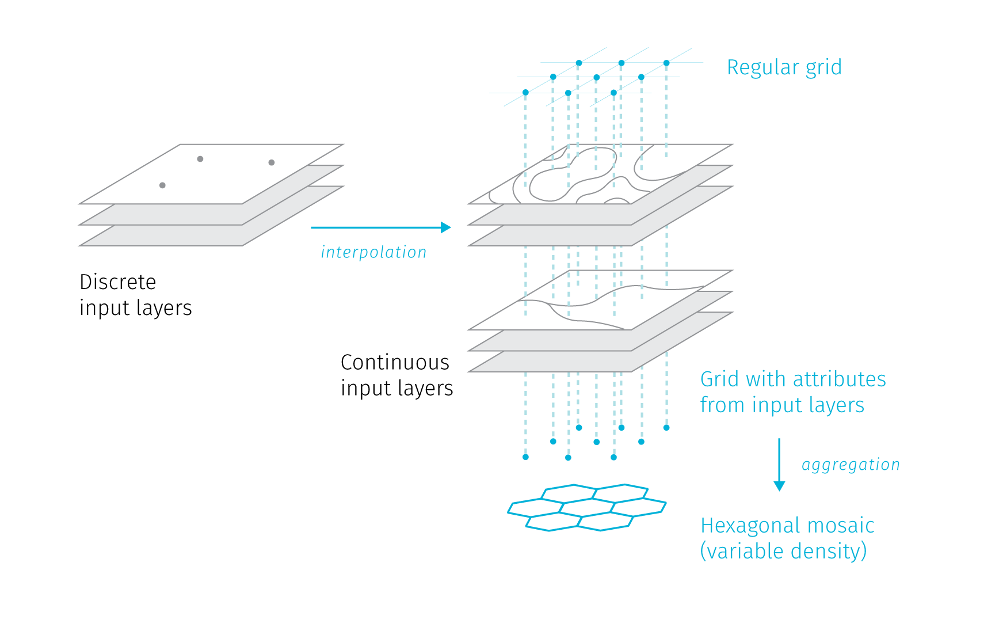
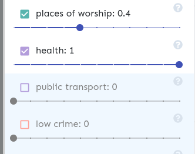

# 4 Case Study: Urban recommendation system

Throughout the previous chapter we took a rather winding path trough various concepts: data processing pipelines, hexagonal aggregation, rendering technologies, vector tiles and user interface design. In this and the next chapter we present two experimental case studies that aim to bring the previously described concepts and ideas together, hopefully to demonstrate how they could enrich thematic cartography in practice.

The first case study is a prototype of an urban recommendation system — a map-based web application that could help dwelling seekers to identify areas in the city that best match their needs and expectations^[Live demo of the application is accessible at <pondrejk.eu/hex>, screenshots of the interface can be found in Appendix B.]. Such system would allow users to assign weights to different spatial factors to recalculate a simple preference map to show which areas in the city could be desirable for them.

The benefits of interactive preference controls are manifold: users can reason about various alternative scenarios, observe how even slight changes in their preferences influence their potential action area, they can seek compromise between conflicting views, or model how their options would alter should their life situation change. The selected spatial factors are aiming to suit civic user, however, inclusion of additional parameters could extend the target group to municipal planners or property developers^[The origins of this idea date back to the 2018's hackathon that the author attended as a member of a competing team. The original demo application has been fully reworked by the author for the purpose of this thesis, though the input spatial data pre-processed at that time have been reused here.].

Aside from its primary use, the application also aims to demonstrate the ideas presented earlier in this thesis — the use of hexbin aggregation and layer ordering to battle visual clutter, the benefits of vector tile technology, or the power of scale-based styling. Some recommendations for map interface design are also showcased. In terms of software implementation, the benefits of the React front-end framework for creating interactive maps are discussed.

## 4.1 Data sources and transformations

- data from osm
- interpolation to the grid
- leaflet + db vs mapbox
- data for buildings

The application allows users to select several parameters and assign weights to them. Based on the selected parameters and weights a map is rendered dividing the city to areas of high to medium to low desirability. Changes to weights and parameters is reflected in the map as the desirability surface is recalculated on the fly.

The parameters include both attractive and repulsive factors: proximity to schools and nurseries, parks and greenery, places of worship,  healthcare, sport, cultural and social facilities on one side, noise, crime and prices on the other side. The majority of the source layers is taken from the OpenStreetMap database, that allows for easy automated updates via it's API. The input data were harvested for the area of the city including a 5 Km buffer to prevent undesirable interpolation effects on the area borders. The table outlines the input layers with sources.

(TODO table) — name, group, source, what is incueded (notes), spatial reference
— todo — check the actual data

culture
health
church
parks
social
sport
transport
crime
prices
noise

Sources come with both point and polygon spatial reference. To harmonize the sources into one common spatial format that would allow to apply weights and would allow dynamic re-classification based on scaled we created a 100 m point grid covering the area of Brno (the grid was spread in such a fashion that the spatial coordinates of individual points are rounded — so that the storage footprint is minimized). The point layers where then used to create distance surfaces using IDW interpolation in QGIS desktop tool. Data from these interpolations where then combined with existing zonal layers (noise, crime, property prices) to generate input for the attribute table of the point grid. This was done using the standard spatial join feature in QGIS (illustrated on fig). In the resulting point grid, each point contains an attribute containing a distance from the given point to a nearest facility of interest, or the given index for some layers (crime, noise...). Furthermore, these attributes have been normalized to fit into 0-1 scale across the city area.

This allows for meaningful comparison of data and application of weights.

Problems of selecting the grid density — zoom level limitation tile layer in Mapbox infrastructure (500 KB per tile max).

## 4.2 Application architecture 

The vector tile sets were stored on the Mapbox tile server, the client application uses the mapbox-gl library to render tiles in the WebGl context. The front-end user interface was build using React and Redux libraries.

Let us take an aside on technologies not mentioned yet. *React* is a UI building library that enables defining UI components as self-contained reusable modules containing definitions of structure, styling and interactions (that were traditionally separated as HTML, CSS and JavaScript). Modules are defined so that their appearance is dependent on the input data (so called *state*). Once the state changes, all modules that consume it are re-rendered accordingly (@mardan2017react).
In larger interfaces it may become challenging to keep track of all module states, *Redux* library can then be used to implement a *state container* a single data object that contains all application's data. Redux also provides methods to make changes in the state container in a predictable way^[Though at the time of writing, React itself already contains features (React Hooks) that allow to manage state globally]. 

When developing map-based web applications the ability to define modules that react to changes in shared data has many benefits. Often the map interfaces contain several linked components that need to adjust to changes in map view and vice versa (think of interactive legends, supplementary charts, or inset maps that). For example, the weights for topics in our application are stored in global state container, once they are changed (by using sliders on the panel module), the map module that also consumes the global state is re-rendered based on changed parameters. Having global state makes it also easier to persist data in multiple view applications, in our case -- if user makes changes in mode 1 of our application, then changes to mode 2 and subsequently revisits module 1, the previously made changes are persisted. 

## 4.3 Cartographic decisions

To showcase the potential use of hexagonal grids to visualize complex datasets, we designed two visualisation modes for the resulting application. 

*Mode 1*

The first mode uses a color range to visualize the "livability score", which is a compound metric composed from the selected theme layers. The resulting layer is a weighted average of the proximity layers. As the values for each layer span from zero to one, the compound layer is also limited by these bounds. The variance of the values in the compound layers depends on the number of topics included in the average calculation. When viewing just a single layer, the whole variance tends to be exploited (with the exception of layers not calculated from proximity surfaces, which is affordability and crime stats). However, with inclusion of more layers the resulting variance tends to shrink and concentrate more around the average (see fig). This is due to the fact that the individual layers have often dissimilar spatial patterns, so the highs and lows tend to cancel each-other out in the final calculation. Lowering weight for a layer further contributes to flattening out of its variance.

In such a situation we are unable to adhere to the cartographic rule saying that all legend items should be visible in the map field. The color scheme needed to be granular enough and have sufficiently versatile hues to show the spatial pattern in different variances. Even in small variance the color hue needs to communicate clearly if the area leans toward the more or less favourable end of the diverging spectrum. All hues needed to to sufficiently stand out from the background, which is even more necessary when the building mask is applied (see below).

Within the confinement of the hexagonal grid it is straightforward to re-calculate the average value per each hexagon once user selects or deselects a topic or adjusts weights. Technically, the calculation of the average is defined in the mapbox-gl style definition language that consumes the weight attributes from the application's state, an is recalculated and re-rendered upon any state change (once user interacts with the interface). This process does not require pulling any additional data from the tile server, it is working solely with data already available on the client.

Additional layers were added for spatial context: road network, water bodies and green spaces. All these layers sit on top of the hexagonal grid in the layer structure. This demonstrates one of the advantages of using vector tiles in WebGl-based rendering environment: the order of base layers can be freely chosen freely by the application developer. Had we been using a raster tile base layer, we would not be able select which layers we wanted to include, plus we would have to lower the opacity of the thematic layer even visible, with all implications to overall legibility.

The supplementary layers not only ease the orientation in the area, but also help to understand the spatial patterns of some layers, e.g. the dependence of the noise or public transport layers on the road network is obvious, also the development potential in the area south to the center in apparent on many compound layers in the application. 

Styling the supplementary layers is also impacted by the changing variance of the mapped values, the legibility of road network suffers in compound layers (see fig). While not currently available in mapox-gl, assigning a  transparency blend mode to the top layers could help here, e.g. the difference blend mode would make sure would stand out on any background, however this might distract the viewer from the main theme.   

Additional spatial clues are provided by an overlay district layer with labels that can be enabled on demand. Another on demand layer provides a building mask. This comes from the original intent of the application to support dwelling seekers — by reducing the geographic field of the hexagon grid to the built area we provide a more realistic picture of where the potential home-seeking opportunities are. The building mask  effectively turns the map dominated by the hexagon grid to a dasymetric map. The building layer is however impacted by the rendering efficiency measures that hide smaller buildings and drop vertices at smaller scales. As such, the building mask fits more to exploring the city at the district level, especially when the user can still tweak the hexagon layer parameters with the mask on.

*Mode 2*

The second visualisation mode of the demo application aims to support observing the spatial patterns of theme layers individually and at the same time being able to identify areas where the patterns match or differ. While in the previous mode the individual patterns blended within the average layer, in the second mode we use graduated size symbols to keep the layers visually separated.

The aim here is more experimental — three types of graduated symbols are available for user to compare how efficient or inefficient are they for pattern visualisation at various scales. Hexagonal grid now acts more as guide for symbol placement. Each hexagon can be divided into six triangles that provide a space for graduated symbol placement. For this reason we selected a subset of six topics for visualisation and assigned four categories to each. We experimented with several symbol shapes and numerous size gradations were tested to come up with the three variants showcased in the application. 

Technically, the layers were implemented using the same source hexagon layer as for mode 1 map. The mapbox-gl library supports symbol type layers and allows to set parameters like fill-color and the orientation of the symbol. This is convenient, as only three .PNG images per symbol type need to be reused to visualize all six layers. The mapbox-gl rendering engine supports using Signed Distance Field (SDF) to encode images for symbol layers. SDF allows to preserve sharp shape edges even when the symbol is enlarged past its original resolution. It also allows to set the color hue and orientation angle programmatically at runtime. On a flip side, variable transparency is not supported for icons in SDF mode. The symbol size was configured to change dynamically base on the zoom level so that the symbols are correctly placed at the hexagonal grid across the scale range. 

To compare the three selected shapes:

* *Wedges* — A number of wedge variants were tested. The aim was to minimize contact of the symbols in the map field, therefore the wedge symbols "grow" gradually from the sides of the hexagons and not from the center. This limits the symbol contact to three touching wedges from neighbouring hexagons, whereas symbols anchored in the hexagon center would yield six possible contacts. These considerations do not apply to the largest wedges in the size progression that are bound to contact. While this variant works reasonably well across scales, its resemblance to the pie chart may misguide users to think symbols represent the relative proportions of values in each hexagon.    

* *Bar* — Less space-filling than the previous variant, it leaves more space to see the base layers, but is less legible at smaller scales. This time, the symbols "grow" from the center of the hexagon which can resemble the. This layout tends to create a visually pleasing impression of hatched surfaces, though due to frequent use of similar in wind maps, some users might be tricked to think that the map aims to depict directions.

* Circle — This Bertin inspired variant is least prone to be confused with a proportional diagram like a pie chart. This is the only variant that allows symbol overlap. In smaller scales it seems to be most prone to triggering optical color mixing and moiré-like effects. 

We can conclude that the combination of scaled symbol layers placed on the hexagonal grid generally succeeds in presenting where the hotspots are for individual layers, as well as how similar or dissimilar the layers are. Not surprisingly, the visual burden imposed on the reader rises with the number of layers, in ideal case an interactive environment should allow to compare just two or three layers at once. 

## 4.4 User interface design

The user interface in mode one revolves around various ways of selecting the layers and adjusting weights. To utilize the screen space efficient, we tried to couple the controls with signifiers of the application state as much as possible. In case of the mode 1 view, the selected weight is signified by the slider position and the number next to the topic title. Topic can be disabled by unchecking the checkbox or by pulling the slider to zero, disabled topic is grayed out. The color of the checkbox demonstrates group membership (See fig). Groups can be enabled and disabled at once using the checkbox row at the top of the panel.

In mode 2 the control panel is simpler, user can select the symbol type and enable or disable topics to be shown. Again, the checkbox color acts as a legend, and all four symbol size levels are shown for each topic. This legend is build programmatically by coloring and rotating a small set of SVGs based on topic parameters. 

While responsiveness was not the main concern for the application and it could certainly be improved, we took some necessary steps to make the application usable on small screens. Legend in mode 1 is turned to vertical position and fixed on the right edge of the map view. The control panel can be minimized to the left in both application modes. This ensures that even thought the map and the panel can not be viewed both at once on small screens, user can at least jump between them easily.

## 4.5 Evaluation and possible extensions

One of the obvious extensions would be automating the described data processing solution so that hexagonal layer could be kept up to date. This could be done by regularly checking for data changes for the selected topics, updating the database and recalculating the distance layers. Then the updated hexagonal grid could be exported as .mbtiles file and re-uploaded the Mapbox tile server. Alternatively a self-hosted solution serving tiles directly from the database (using tool like Tegola^[<https://tegola.io/>]) could be used. When it comes to updating layers based on distance interpolation, a problem arises on how to efficiently update only the parts of the mesh that are affected by the change. Fig details one possible solution using Voronoi diagrams.

The range of included datasets could be extended as there are loads of municipal data that get collected and published, often times in the disconnected form. A grid layout proves to be a plausible way how to integrate such disjoint datasets.

A lot could be done to improve the user experience with the application, either in explaining the controls and logic behind them using an interactive wizard or by adding more functions. One possible extension would be defining some example "personas" with predefined selection of included layers and assigned weights.

