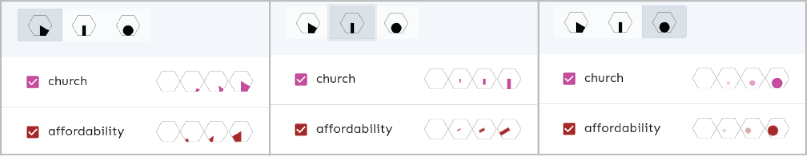

# 4 Case Study: Hexbin explorer

Throughout the previous chapter we took a rather winding path through various concepts: data processing pipelines, hexagonal aggregation, rendering technologies, vector tiles or user interface design. In this and the next chapter we present two experimental case studies that aim to bring these concepts and ideas together, hopefully to demonstrate how they could enrich thematic cartography in practice.

The first case study is a prototype of a map-based web application that could help dwelling seekers to identify areas in the city that best match their needs and expectations.^[Live demo of the application is accessible at <https://pondrejk.eu/hex>, screenshots of the interface can be found in Appendix B.] Such system would allow users to assign weights to different spatial factors to draw a simple preference map showing which areas in the city could be desirable for them.

The benefits of interactive preference controls are manifold: users can reason about various alternative scenarios, observe how even slight changes in their preferences influence their potential action area, they can seek compromise between conflicting views, or model how their options would alter should their life situation change. The selected spatial factors are aiming to suit civic user, however, inclusion of additional parameters could extend the target group to municipal planners or property developers.^[The origins of this idea date back to the 2018's hackathon that the author attended as a member of a competing team. The original demo application has been fully reworked by the author for the purpose of this thesis, though the input spatial data pre-processed at that time have been reused here.]

Aside from its primary use, the application also aims to demonstrate the ideas presented earlier in this thesis—the use of hexagonal aggregation and layer ordering to cope with hight spatial density, the benefits of the vector tile format and the WebGL rendering environment, or the power of scale-based styling. Some recommendations for map interface design are also showcased. In terms of software implementation, the benefits of the React front-end framework for creating interactive maps are discussed.

## 4.1 Data sources and transformations

The application allows users to select several parameters and assign weights to them. Based on the selected parameters and weights the map is rendered to show areas from high to low desirability. Changes to weights and parameters are reflected in the map as the desirability surface is recalculated on the fly.

The parameters include both attractive and repulsive factors: proximity to schools and nurseries, parks and greenery, places of worship, healthcare facilities, sport, cultural and social facilities on the one hand, noise model, crime incidence and property prices on the other. Layers were sourced from the Open Street Map (OSM) database. The input spatial layers were collected for the area of the city including a 5 Km buffer to prevent undesirable interpolation effects on the city borders. The following list describes what belongs under thematic categories in greater detail:

* culture—theaters, cinemas, music clubs
* health—hospitals and ambulances
* church—places of worship for various religions
* parks—parks, forests, green spaces
* social—cafés, pubs, restaurants
* sport—sport grounds, gyms 
* transport—public transport stops 

These layers were obtained from the OSM and have point spatial reference, with the exception of parks that are defined as polygons. Some complementary layers from different sources were also included:  

* crime (source: project Mapa kriminality^[<https://mapakriminality.cz>]) 
* affordability (source: Brno municipal office)
* noise (source: Brno municipal office) 

The spatial detail of these additional layers is coarser than in the previous group, especially in case of crime statistics that were interpolated from a district-level polygon layer. 

The data preparation process then continued as follows (see also Figure 31). To harmonize the varying sources into one spatial layer that would allow for dynamic re-classification, we created a point grid covering the area of Brno in 100 m intervals. The input layers from the OSM were used to create distance surfaces using IDW interpolation in QGIS. Data from these interpolations where then combined with existing zonal layers (noise, crime, property prices) to generate input for the attribute table of the point grid. This was done using the standard spatial join feature in QGIS.  In the resulting point grid, each point has attributes containing distance from the given point to the nearest facility of interest, or an index for some layers (crime, noise...). Furthermore, these attributes have been normalized to fit into 0-1 scale across the city area.

The reasoning behind using a point grid as a harmonization layer was guided by the original intent to enable variable cell size for the final hexagonal grid that could be manipulated by the user. This idea was eventually abandoned and a fix-sized hexagonal grid was created by averaging the point values per cell. The aim was to find the smallest possible cell size that would still pass through the tile size limitation imposed on vector tiles by the Mapbox infrastructure (500 KB per tile, see also Figure 21).

## 4.2 Application architecture

The vector tile set with the hexagon layer is stored on the Mapbox tile server, the client application uses the mapbox-gl library to render tiles in the WebGL context. The front-end user interface was built using React and Redux libraries.

Let us briefly describe the technologies not mentioned yet. *React* is a UI building library that enables defining UI components as self-contained reusable modules with definitions of structure, styling and interactions (that were traditionally separated in different files as HTML, CSS and JavaScript). Modules are defined so that their appearance is dependent on the input data (so called *state*). Once the state changes, all modules that consume it are re-rendered accordingly [@mardan2017react].

In larger interfaces it may become challenging to keep track of all module states, *Redux* library then comes handy. Redux implements a *state container* a single data object that contains all data needed by the application UI. Redux also provides methods to make changes to the state container in a predictable way.^[Though at the time of writing, React itself already contains features (React Hooks) that allow to manage state globally]

When developing digital maps, the ability to define modules that react to changes in shared state has many benefits.^[Also note that React integrations exist for popular client mapping libraries, e.g. *react-leaflet* or *react-map-gl*] Map interfaces often contain several linked components that need to adjust to changes in map view and vice versa (think of interactive legends, supplementary charts, or inset maps). For example, the weights for topics in our application are stored in a global state container, and once they are changed (by using sliders on the panel module), the map module that also consumes the global state is re-rendered based on changed parameters. Having a global state container makes it also easier to persist data in multiple-view applications, in our case: if user makes changes in mode 1 of our application, then switches to mode 2 and subsequently revisits module 1, the previously defined settings are persisted. 

## 4.3 Cartographic decisions

To showcase the potential of hexagonal grids to visualize complex data sets, we designed two visualization modes for the resulting application. 

*Mode 1*

The first mode uses a diverging color scheme to visualize the livability score within the hexagonal grid layer. The score is a weighted average of proximity values of selected topics. As the values for all topics span from zero to one, the compound layer is also limited by these bounds. The variance of values in the compound layer depends on the number of topics included in the calculation. When viewing just a single topic, the variance tends to span across the whole range. However, with inclusion of more layers the resulting variance shrinks to concentrate around the central value (see Figure 32). This is due to the fact that the individual topics have dissimilar spatial patterns, so the highs and lows tend to cancel each other out. Lowering topic weights further contributes to flattening of variance.

In such a situation we are unable to adhere to the cartographic rule saying that all legend items should be visible in the map field. The color scheme needs to have sufficiently versatile hues to show the spatial pattern in different variances. All hues need to sufficiently stand out from the background, which is even more crucial when the building mask is applied.

Within the confinement of the hexagonal grid it is straightforward to re-calculate the average value per each hexagon once user selects or deselects a topic or adjusts weights. Technically, the calculation is defined using the mapbox-gl style definition language that consumes the weight attributes from the application's state, an is recalculated and re-rendered upon any state change (once user interacts with the interface). This process does not require pulling any additional data from the tile server, it is working solely with data already available on the client.

Additional layers were included to provide spatial context: road network, water bodies and green spaces. All these layers sit on top of the hexagonal grid. This demonstrates one of the advantages of using vector tiles in WebGL-based rendering environment: the order of layers can be chosen freely by the application developer. Had we been using a raster-tile base layer, we would have to put the grid on top of it. Then to make the base even visible, we would have to lower the opacity of the thematic layer, with implications to the overall legibility.

The supplementary layers not only ease the orientation in the area, but also help to understand some spatial patterns, for example the dependence of noise or public transport layers on the road network is obvious. Also, the development potential in the area south to the center is apparent on several map variants.

Additional spatial clues are provided by a district overlay with labels that can be enabled on demand. Another on-demand layer is a building mask. This comes from the original intent of the application to support dwelling seekers—by reducing the geographic field of the hexagon grid to the built area, we provide a more realistic picture of where the potential home-seeking opportunities are. The building mask turns the map dominated by the hexagon grid to a dasymetric map. However, the building layer is impacted by the rendering efficiency measures that hide smaller buildings and drop vertices at smaller scales. As such, the mask works best when exploring the city at the district level—the user can still alter the hexagon layer underneath by tweaking weights.

*Mode 2*

The second visualization mode aims to support observing the spatial patterns of theme layers individually. At the same time, user should be able to identify the areas where the patterns match or differ. While in the previous mode the individual patterns blended, in the second mode we use graduated symbol size to keep the layers visually separated.

The aim here is more experimental—three types of graduated symbols are available for user to compare how efficient or inefficient they are for pattern visualization at various scales. Hexagonal grid now acts more as guide for symbol placement. Each hexagon can be divided into six triangles. For this reason we selected a subset of six topics for visualization and assigned four size categories to each of them. We experimented with several symbol shapes and numerous size gradations to come up with the three variants showcased in the application. 

Technically, the layers were implemented using the same source hexagon layer as for the mode 1 map. The mapbox-gl library supports symbol type layers and allows to set parameters like *fill-color* and *orientation*. This is convenient, as only three PNG images per symbol type are reused for all six layers. The mapbox-gl rendering engine supports using Signed Distance Field (SDF) to encode images for symbol layers. SDF allows to preserve sharp shape edges even when the image is enlarged past its original resolution. It also allows to set the color hue and orientation angle programmatically at runtime. On the flip side, variable transparency is not supported for icons in SDF mode. The symbol size was configured to change dynamically based on the zoom level so that the symbols are correctly placed within the hexagonal grid across scales. 

To compare the three selected shapes (Figure 33):

* *Triangles*—Several triangle variants were tested. The aim was to minimize the contact of the symbols in the map field, therefore the triangles "grow" gradually from the sides of the hexagons and not from the center. This limits the symbol contact to three touching triangles from neighbouring hexagons, whereas symbols anchored in the hexagon center would yield six possible contacts. While this variant works reasonably well across scales, its resemblance to the pie chart may misguide users to think that the symbols represent relative proportions of values in each hexagon, which is not true. This variant also works best when tested with colorblind simulation filters.    

* *Bars*—Less space-filling than the previous variant, it leaves more room to see the base layers, but is less legible at smaller scales. This time, the symbols "grow" from the center of the hexagon which can resemble a radial chart. This layout tends to create a visually pleasing impression of hatched surfaces, which might also be a disadvantage as the opposite symbols in the hexagon tend to meld. Due to a frequent use of similar techniques in wind maps, some users might be tricked to think that the map shows directions.

* *Circles*—This Bertin inspired variant is least prone to be misunderstood as a compound shape representing proportions within a grid cell. It is the only variant that allows symbol overlap which lets the hotspots in the layer stand out more. In smaller scales it seems to be most prone to triggering optical color mixing and moiré-like effects. 

We can conclude that the combination of scaled symbol layers placed on the hexagonal grid generally succeeds in presenting where the hotspots are for individual layers, as well as how similar or dissimilar the layers are. Recalling Section 2.3.1 the map supports reading at both the elementary and global levels. Not surprisingly, the visual burden imposed on the reader rises with the number of layers. Here the interactive environment helps users to tune the cognitive load by enabling and disabling layers. For comparison tasks, the map works best with just two or three layers enabled at once. 

## 4.4 User interface design

The user interface in mode 1 revolves around various ways of selecting the layers and adjusting the weights. To use the screen space efficiently, we coupled the controls with signifiers of the application state as much as possible. In case of the mode 1 view, the selected weight is signified by the slider position and the number next to the topic title. Topic can be disabled by unchecking the checkbox or by pulling the slider to zero, disabled topic is grayed out. The color of the checkbox demonstrates group membership (Figure 34). Groups can be enabled and disabled at once using the checkbox row at the top of the panel.

In mode 2 the control panel is simpler, user can select the symbol type and enable or disable topics to be shown. Again, the checkbox color also acts as a legend box. Four symbol size levels are shown for each topic. This legend is built programmatically by coloring and rotating a small set of SVGs based on topic parameters (Figure 35). 

While responsiveness of the application was not the main concern and it could certainly be improved, we took some necessary steps to make the application usable on small screens. Legend in mode 1 is turned to vertical position and fixed to the right edge of the map view. The control panel can be minimized in both application modes. This ensures that even though the map and the panel cannot be viewed at once on small screens, user can at least jump between them easily. A simple onboarding is also implemented to explain the main application interaction modes on startup.

## 4.5 Evaluation and possible extensions

One of the obvious extensions would be automating the described data processing solution so that the hexagonal layer is kept up to date. This could be done by regularly checking for data changes for the selected topics, updating the database and recalculating the distance layers. Then the updated hexagonal grid could be exported as mbtiles file and re-uploaded to the Mapbox tile server. Alternatively a self-hosted solution serving tiles directly from the database (using tool like Tegola^[<https://tegola.io/>]) could be used. Recalling Figure 17, these would be data space improvements that are not the main focus of this thesis. 

The range of included data sets could be extended—there is a wide variety of municipal data collected and published, often times in a not very interoperable form. A grid layout can be a plausible way to integrate such disjoint data sets. A lot could be done to improve the user experience with the application, either in explaining the controls and logic behind them using some interactive wizard or by adding more functions and state signifiers. One possible extension would be defining example "personas" with predefined selection of layers and weights.

