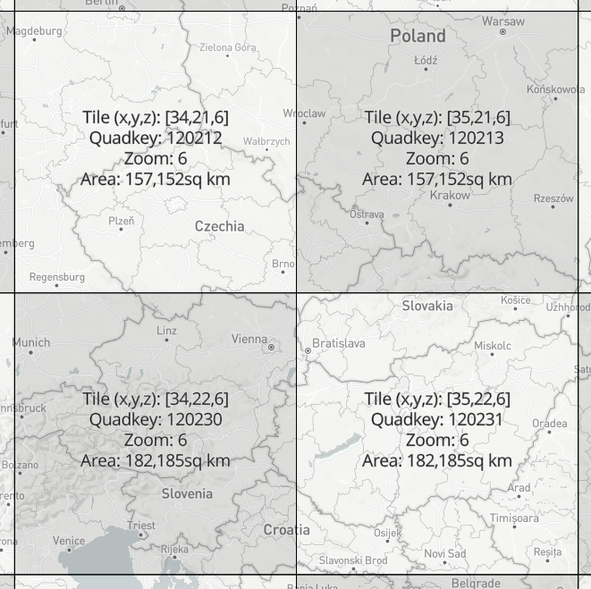

# 5 Case study: Traffic speeds

In this case study we explore the possibilities and limitations of vector tiles to accommodate the temporal density of a dataset originally published as a live stream. For this purpose we chose to visualize changes in traffic speeds in the city of Brno. The temporal range of the source dataset is between the 16th of March to the 10th of May 2020^[The author would like to thank Mapbox, Inc. for generously providing the traffic data sample for the purpose of this case study.]. This time period coincidentally matches with the first period of government restrictions in Czech Republic to prevent the spread of the COVID-19 pandemic. The size, spatial and temporal detail of the dataset posed a challenge both in terms of data processing as well as in terms of designing the interactive cartographic visualisation^[Live demo of the application is accessible at <pondrejk.eu/traffic>, screenshots of the interface can be found in Appendix C.].

## 5.1 Data sources and transformations

The source raw data were formatted as (compressed) CSV files containing an estimate traffic speeds at a specific location, at a specific time, based on historical observations. One such file showed the expected traffic speeds during one week^[The official description of the data source can be found at <https://docs.mapbox.com/traffic-data/overview/data/>].

Spatially, one file covered the area of a zoom level 6 tile, which meant that the data files for our problem area also covered a significant part of the Czech Republic (see Fig). 

As for the original CSV structure, one line in the file represents one road segment. Each segment was identified by a pair of OpenStreetMap node IDs representing a start node and the end node of a road segment. Note that the node ordering also determines the direction of the recorded traffic, which means that bidirectional routes were recorded twice in the file — one row for direction from node A to node B and another row for speeds in direction from B to A. Following the two columns containing node identifiers, there were 2016 columns containing speed estimates in 5 minute intervals per each segment (7 days × 24 hours × 12 five-minute periods). An example row in a CSV file could look like: *113054533,113096757,54,54,...57*, where the first two digits are node identifiers followed by an array of traffic speeds. All speeds were recorded in kilometers per hour. The starting speed record corresponds with Sunday 00:00 AM of the given week in the files time zone. The records continue in 5 minute increments until the concluding record marking the end of the week.

This gives us an idea of the data volumes that needed to be processed. One file for the zoom level 6 tile (see fig.) contained approximately 1 086 958 lines representing the line segments (the line count could differ across the files as speeds were not provided for segments for which the volume and quality of data did not allow a high confidence estimate). Each row contained 2018 records (speeds + identifiers) which exceeds the default maximum column count per table in a PostgreSQL database (250 — 1600 based on column type)^[Just for completion, the column limit can be extended, but this requires re-compiling the database from the source code. See <https://www.postgresql.org/docs/current/limits.html> for the overview of PostgreSQL limits]. Data was provided for eight weeks, so there were eight files files of these proportions to be processed.

There were several tasks to be completed in the initial phase of data processing. As the OpenStreetMap node IDs do not directly contain the spatial information, the actual coordinates for each node needed to be obtained. This was done in the following steps. First, to minimize redundant API calls later, we extracted the unique node IDs form the first two columns. As we have seen earlier, the node IDs can appear several times as route identifiers, either in bi-directional segments or in crossroads and other structures^[The python script based on the *numpy* library that was written to perform the unique node extraction can be found at <https://github.com/pondrejk/dizzer/blob/master/misc/scripts/01-get_unique_nodes.py>]. For each of the unique nodes the spatial coordinates were obtained by querying the Open Street Map API^[The script to do that using the *osm* Python library is available at <https://github.com/pondrejk/dizzer/blob/master/misc/scripts/02-get_node_coordinates.py>].

With spatially defined unique nodes it was possible to filter out the subset of the nodes that belonged to the Brno municipal area. The most straightforward way to do that was to load the nodes to QGIS desktop to perform *select by location* against the polygon of the city area (with five kilometer buffer to provide some context of immediate surroundings). Armed with a collection of Brno nodes (the count was 131 257), we returned to the original traffic speed CSVs to extract the nodes from Brno, this time with speed attributes. The challenge was in searching for 131 257 nodes in the superset of 1 086 958 lines and then extracting the matching lines, each with all of its 2018 attributes^[The script to perform this action (using the *dask* Python library) is available at <https://github.com/pondrejk/dizzer/blob/master/misc/scripts/03-select_segments.py>].

Such task is reminiscent of situations described in the *Small big data manifesto* (@voss2017small) — even though the big data is mainly associated with large scale clustered infrastructure, individuals increasingly come across situations when they need to process large dataset only with a single machine at their hands. Setting up a cluster of machines is not viable for many applications  due to financial, time or skill set demands. For one-time processing of data that does not fit into memory, we are left with a range of simple but often efficient computing tools and approaches (@turner2020process). One of them is reading input data in chunks that can fit to memory, applying a processing function to these chunks and using a reducer function that can combine the processed chunks into a final result. This way the memory size limitation is bypassed, however, computation time of the processing function can still become a bottleneck. Multi-threaded execution can ease the problem by running the execution function in parallel on individual CPU cores. The size of chucks and the number of threads needs to be fine tuned to fit the capabilities of given hardware, but in general these techniques can significantly reduce the processing time even on modest machines. Cycling back to our speed files, a simple script combining chunking and parallelization (using the Dask Python library) was able to complete the extraction of  Brno segments from one week file in 3 min 32.8s (on Intel i7 8 cores, 30 GiB RAM).

The output of the previous operation was a list of eight CSV files in the original structure showing the estimated speeds for road segments in Brno. These weekly files where split into smaller chunks representing individual days to avoid hitting the database column length limitations^[Using this Python script <https://github.com/pondrejk/dizzer/blob/master/misc/scripts/04-split_by_day.py>]. The resulting set of 56 files with 288 columns of speed data were finally loaded to the PostgreSQL database. At this point, the tables of Brno node pairs and node coordinates were also imported in order to create a line segment layer from the point coordinates using PostGIS plugin^[The query using PostGIS's ST_MAKELINE available at <https://github.com/pondrejk/dizzer/blob/master/misc/queries/01-create_lines>]. From now on, the daily speed tables could be joined with the table of line segments to create futures spatial layers^[Example query at <https://github.com/pondrejk/dizzer/blob/master/misc/queries/03-streets_join>]. During this process various visualisation experiments have been done using QGIS connected to the database. As a result of these experiments a decision has been made to reduce the temporal granularity of the speed layers from 5 minute intervals to one hour averages^[Example query at <https://github.com/pondrejk/dizzer/blob/master/misc/queries/02-generate_hourly_averages>]. This significantly reduce the storage overhead in generated vector tiles while maintaining sufficient information density for visualisation purposes. 

A database loaded with road spatial layers with associated hourly speed attributes provides a solid starting point from which many avenues could be taken, either in analytical or visualisation direction. Our focus is on interactive cartographic visualisation with vector tiles, therefore we created the necessary amount of vector tiles from GeoJSON exports from the database using the tippecanoe command line tool^[<https://github.com/mapbox/tippecanoe>]. The batch of resulting *.mbtile* files was then uploaded to the Mapbox server via API^[The batch upload script is available at <https://github.com/pondrejk/dizzer/blob/master/misc/scripts/05-mapbox_upload.py>].

## 5.2 Application architecture

The building blocks of the application are basically the same as with the case study described in the previous chapter. Even though the PostgreSQL database played a vital role in the data preparation phase, the final application does not use it for back-end data storage. Instead, the vector tiles have been uploaded to Mapbox to act as a vector tile server. The front-end interface is build using React library with Redux for state management, mapbox-gl.js is used as a rendering engine on the client. 

## 5.3 Cartographic decisions

The main requirement for the map view was the ability to display the whole dataset at the zoom level 10 so that the municipal traffic network can be observed as a whole. For vector tiles to be served on a Mapbox server a size limit of 500 KB per tile is enforced. While this is a reasonable limitation to ensure fast rendering, it is hard to adhere to it especially with denser datasets in smaller scales where individual tiles cover larger area. One way to work around this is by limiting the number of features displayed across scales (see fig), which obviously has a downsize in loosing some resolution of the visualized data.

The other way to grapple with this problem without abandoning the Mapbox infrastructure is to break the data up into several different tile sets. This is the approach we chose to achieve full data resolution at the zoom level 10 — we decided to divide tile layers with daily speed coverage into halves, so that each tile layer covers twelve hours. This got us below the tile size limit but also comes with some implications to the smoothness of the user experience. When displaying the layer with a data driven style, any user-induced changes to displayed attribute are rendered smoothly wile the attribute change is within the same layer. Once a different layer needs to be loaded, there always is a visible gap between hiding the previously displayed layer and enabling the new one, which unfortunately can not be treated by any ease in effect in mapbox-gl. One way to work around this is in keeping all the layers in the visible state and change their order dynamically so that the selected layer is on top — however our testing proved this approach inefficient for large number of layers, in our case it was two layers per day, so 2 x 7 (days) x 8 (weeks) = 112 layers. 

A color scale was selected to visualize traffic speeds, it spans from 0 to 140 kilometers per hour in 10 kilometer intervals. The color selection was guided by the need for sufficient contrast on the dark background. The break between the two hues used in the color scale rests at 60 km which should ensure the variability of speeds within the slower inner-city routes is visible while the distinction from fast transit highways is apparent. 

An offset styling parameter allows to displace a line symbol from its spatial delineation by a certain distance to the side relative to the routes direction. This parameter had to be applied so that the symbols for bi-directional routes are both visible — otherwise the lines would overlap as the start and end nodes of these segments have the same coordinates, it's only the orientation that differentiates them. Styling across the zoom range has been applied to both the line width and the line offset to secure a reasonable graphic fill across scales (see fig.).

There is a range of cartographic methods that would allow comparison between the state of the traffic network in two moments. Two map view or a difference layer would be both viable options, though we wanted to employ some specific features of a WebGL based environment that would not be readily available in SVG or Canvas overlays. For that matter, we chose to apply fill-extrusion combined with tilted camera view. Fill-extrusion is a method intended for use with polygon features mainly to create 3D building models. But it is well applicable also to line layers, the base height extrusion parameter allows to lift the shape off the ground, which allows to stack multiple stripes on top of each other (Fig). Colour coding is still dynamically adjustable to allow simultaneous comparison of the progressions of speed levels in same day and time across two weeks. This method certainly has its limitations: it is not well suited for global comparison, tilted camera view is necessary as well as user activity to pan and change the view angle. This is necessary for observing the bi-directional routes, as each direction determines the colour for one side of the 3D stripe.

## 5.4 User interface design

The resulting map based application works in two modes, the default mode supports displaying the traffic situation in a selected date and time. The comparison mode then allows to view differences between selected weeks. The main points of interaction in the default mode are the controls for selecting time, day and week. There is a certain redundancy in those controls: user can either click the back and forward arrow buttons (right to the map in the large screen view), which allow to "jump" back and forth in time in set intervals. This enables observing speed changes throughout the day (by moving in the hourly interval), comparing the situation in a given time across days (daily interval) or see the difference between the weeks (weekly interval). The currently selected date, time and week are displayed in the numerical form on the right pane and are also visualised using the table below the map field where rows represent weeks and columns represent days. The selected day is highlighted by the table field color. The table not only shows the temporal extent of the dataset and the current selection but also offers an alternative way to select the day and week by clicking the respective field. The slider below the map field is coupled and aligned with the table and provides a way to select an hour within the given week and also allows for smoother transition between map states.

In the comparison mode, which can be enabled by clicking the "compare" checkbox, some of the mentioned controls behave a bit differently. This mode allows for selecting two weeks which is facilitated by two drop-down menus. Hour and day selectors on the right pane remain active, whereas the week selector is disabled in favor of the drop-donwns. The hour slider also remains active as it allows to change hour and day for both selected weeks simultaneously. It is also possible to change the observed day by clicking columns in the overview table (that has got two fields highlighted to denote the selected weeks). 

A care has been given to ensuring the responsiveness of the interface layout. The map field, selection slider and table are sized dynamically by the screen size. On small screens the right control pane is moved below the map field to leave sufficient screen width for the map. The legend is fixed at the right side of the interface, which on the one hand places it out of the spotlight on large screens, but on the other hand it makes sure that the legend is placed next to the map field on small screen devices.

## 5.5 Evaluation and possible extensions

During the preparation phase, the tile sizes limit of 500 KB appeared as an unforeseen driving factor that influenced our decision making both in data and visualisation space. While there are alternative solutions like setting up a custom tile server, we chose to split vector tiles into chunks of same spatial coverage but shorter time intervals to reduce the attribute count. This is a proven solution within the selected infrastructure, however more experimental approaches were tested over the course of the work. One of them based on the fact that many road segments exhibited consequent runs of same speed values. The idea was to use an run length encoding algorithm to compress the attributes, which was successfully done on the database side^[Script using pandas and sqlalchemy Python libraries available at <https://github.com/pondrejk/dizzer/blob/master/misc/scripts/06-run_length_encode.py>] — the encoded values were stored in an array type column in PostgreSQL and then exported as vector tile layer. However, decoding the values on the client side showed to be beyond the scope of the mapbox-gl style definition language. There is also a question of the rendering performance as decoding the run length array and finding the right value for the selected time would have to be done for each displayed segment.

Another solution would be to classify the streets in the dataset, mainly to separate the segments with low speed variability that could be represented by a single value for a longer then just the hour period. Overall, there are three types of road segments in our problem area:

- Routes with low average speed and very low speed variability throughout the day. These are typically short segments with low traffic, cul-de-sacs leading to residential areas 
- Routes with medium speeds and visible daily variability. These are mainly the inner-city veins
- Routes with high average speeds and small daily speed variability. These are transit highways with high allowed speeds. 

In this setting it is hard to make any confident statements about the impact of the COVID-induced lockdown in the area, as only the second type of road segments could be influenced by government restrictions. Also the traffic speed is only an indirect indicator of traffic volumes. Lowered number 
of vehicles during the lockdown period could have contributed to higher speeds in otherwise notoriously congested areas on the main city lines and near highway entrance ramps. Another impact could be in evening out the daily changes in traffic speeds and lowering the significance of peak hours.

There are of course many areas in which the application could be extended. For example, summary data on individual road segment could be displayed upon selection. Additional modes of comparison could be added as well as ability to search and filter the mapped data e.g. by the street name. A capability to explore the speed changes across the itinerary form point a to b could be implemented as well as comparison of such itineraries. Reader may surely think of other extension. To conclude, the application points out the vector tiles combined with WebGl based rendering as a promising avenue to display and explore temporally dense data. Depicting subtle changes in traffic speeds lets us appreciate the city as a collective organism. 

TODO — connect with previous chapters: What spatio-temporal queries are enabled by this kind of visualisation? Which are not? (see chapter 2)

The visual analysis tool should work equally well regardless of the velocity of data generation or the cadence of change. For that matter, the temporally dense dataset should serve well for designing a cartographic interface even though the dataset is not itself consumed "real-time". 

caveats
Traffic speed does not bear information on car density? — what is the relation? in pandemic it should be higher?
