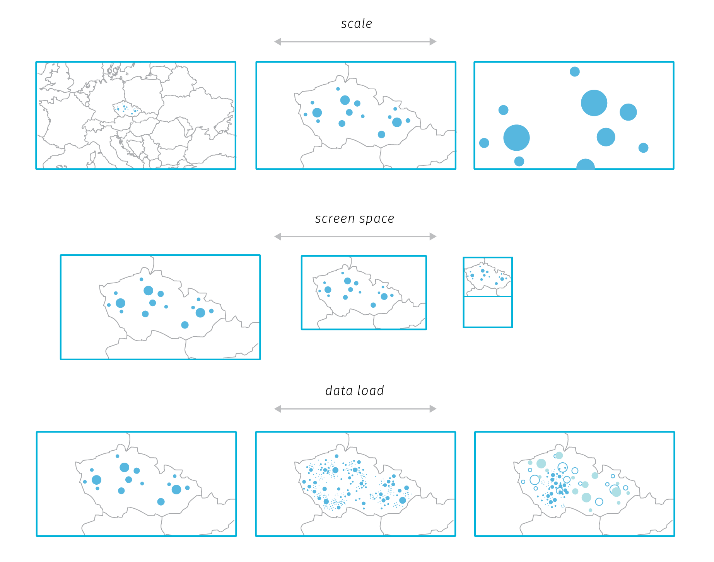
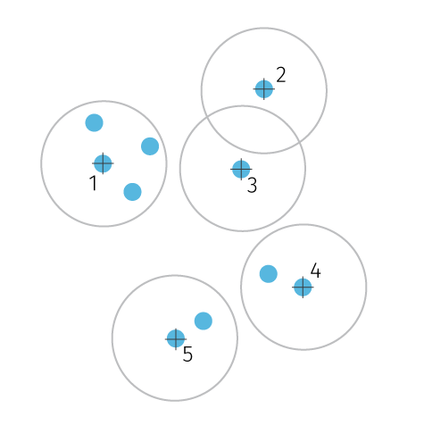
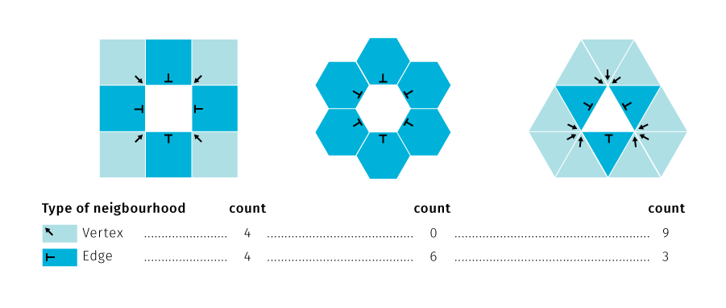
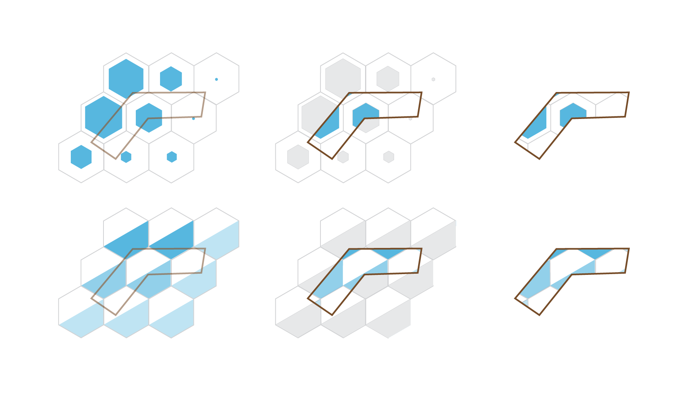
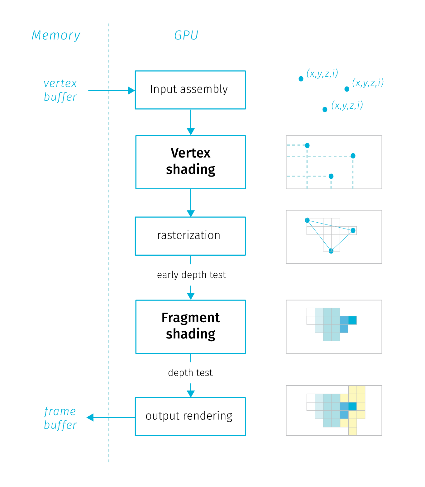

**Bibliographic Entry**

|||
|--|--|
|**Author**:              | Mgr. Peter Ondrejka                             |
|                         | *Faculty of Science Masaryk University Department of Geography* |
|**Title of Thesis**:     | Cartographic Visual Analysis of Big Data Sets   |
|**Degree Programme**:    | Geography                                       |
|**Field of Study**:      | Cartography, Geoinformatics and Remote Sensing  |
|**Supervisor**:          | Mgr. Karel Staněk, Ph.D.                        |
|                         | *Faculty of Science Masaryk University Department of Geography* |
|**Academic Year**:       | 2020/2021                                       |
|**Number of Pages**:     |                                                 |
|**Keywords**:            | Big Data; Cartographic Visualization; Hexagonal Aggregation; Vector Tiles; WebGL                |
                                                                            
                                                                            
                                                                            
                                                                            
                                                                            
                                                                            
                                                                            
**Bibliografický záznam**

|||
|--|--|
|**Autor**:              | Mgr. Peter Ondrejka                             |
|                        | *Přírodovědecká fakulta Masarykova univerzita Geografický ústav* |
|**Název práce**:        |  Kartografická vizuální analýza masivních datových sad  |
|**Studijní program**:   | Geografie                                       |
|**Studijní obor**:      | Kartografie, geoinformatika a dálkový průzkum Země |
|**Vedoucí práce**:      | Mgr. Karel Staněk, Ph.D.                        |
|                        | *Přírodovědecká fakulta Masarykova univerzita Geografický ústav* |
|**Akademický rok**:     | 2020/2021                                       |
|**Počet stran**:        |                                                 |
|**Klíčová slova**:      | Velká data; Kartografická vizualizace; Hexagonální mozaiky; Vektorové dlaždice; WebGL                |
                                                                            
                                                                            
                                                                            
                                                                            
                                                                            
                                                                            
                                                                            
# 1 Defining Big Data

In this chapter we search for what defines big data. We describe the main attitudes towards grasping the concept. Special consideration is given to the notion of spatial big data and the related works from the Cartography and GIS community.

## 1.1 Ontological characteristics

Despite the lively interest in the subject, the explanation of the term *big data* ^[Throughout the text we will treat the term as plural, without capitalization. Although there are strong arguments for "data" as singular and some authors do capitalize, we chose to match with the majority of big data related literature. This does not apply to direct citations where we preserve the original author's formulation. For arguments for singular data see @widman2014when, @nunberg2013data, for counterargument @wilson2017big] remains hazy. The term is often used without clarity, as there is no widely accepted definition to the date. Perhaps the most systematic effort in this matter by @kitchin2014data (refined in @kitchin2016makes) summarizes the key properties attributed to big data. Kitchin critically evaluates these properties and goes on to assign them a relative importance in distinguishing "big" from "small" data. He also takes care to separate the concept in itself from the accompanying social phenomena, hence he speaks of *ontological* characteristics.

Kitchin's taxonomy provides a useful starting point for our thinking of big data from the cartographic standpoint, so let us list the ontological characteristics including some of the Kitchin's comments:

- **Volume** — can be measured in storage requirements (terabytes or petabytes) or in number of records
- **Velocity** — data generation happens in real-time either constantly (CCTV) or sporadically (web search); frequency of generation can differ from the frequency of data *handling*, *recording*, and *publishing*
- **Variety** — data are heterogeneous in nature, though this property is rather weak as various levels of organization are allowed (*structured*, *semi-structured* or *unstructured*)
- **Exhaustivity** — the entire system is captured (*n=all*), rather than subset created by sampling
- **Resolution and indexicality** — data are fine-grained rather than being aggregated; data are uniquely indexical, which enables linking to other datasets
- **Relationality** — data contain common fields that enable the conjoining of different datasets
- **Extensionality and scalability** — data generation is flexible, it is possible to add or change fields easily, data can rapidly expand in size

In relation to these characteristics it is important to mention two open questions that for many people make attempts to define big data vague at best, sometimes to the point of questioning the existence of the phenomenon itself.

First, there are no quantitative thresholds that would define exactly how large the "big" volume is, how fast the "big" velocity is, and so on. Some properties would even be hard to describe in quantitative terms (for example extensionality). Other properties sound too general or vague to act as a sound defining parameter (scalability). What is more, one could extend the properties ad absurdum, for example *variety* could refer to differences in structure, origin, quality, or any other property of a dataset. Such multilevel hierarchy of parameters and sub-parameters does not add to the overall comparability of datasets, especially when we consider that data generation procedures may be unique to certain domains and not found in others. Finally, many datasets lack metadata detailed enough to allow to judge all mentioned properties. It is possible that these issues will clear out with time, but parameter thresholds may as well remain blurry and ever in flux.

The second problem is that even if we had a clearly defined set of criteria, in practice we could hardly find a dataset that would fit all of them. Therefore not all properties are deemed mandatory, which in turn leads to confusion and labeling almost anything as big data. To articulate the gist of the term, more work is needed on the relations of the parameters, some might be merged (resolution is a consequence of exhaustivity, indexicality enables relationality) or discarded (extensionality and scalability seem to describe the infrastructure rather than data).

Aware of these problems, @kitchin2016makes argue that *velocity* and *exhaustivity* are qualities that set big data apart and distinguish them from "small" data. We can add that these two characteristics also present the most interesting challenges to cartographic visualisation of such data. If we adopt this view, we can treat the rather too simplistic adjective "big" as a short name for *generated continuously in real time and containing an unreduced set of elements*.

## 1.2 Other ways of understanding big data

In this section we briefly review the writing of authors that seek to define big data. The term itself was fist used in context of dealing with massive datasets in mid-1990s by John Mashey [@diebold2012personal], but the heaviest circulation of the term in scientific and popular media took place only in recent years. Some general tendencies keep reappearing in the plethora of works.^[For an alternative summary of definitions see @gandomi2015beyond, for bibliometric analysis of related scientific literature see @nobre2017scientific.]

### 1.2.1 Vs and keywords

Kitchin's taxonomy mentioned in the previous section is based on a review of older definitions, starting with the often-cited three Vs (*volume*, *velocity*, and *variety*) by @laney20013d. The notion of *exhaustivity* was added by @mayer2013big, concepts of *resolution* and *indexicality* came from @dodge2005codes, @boyd2012critical add *relationality*, and the qualities of *extensionality* and *scalability* were taken from @marz2012big.

Other properties attributed to big data include *veracity* (data can be messy, noisy and contain uncertainty and error) and *value* (many insights can be extracted, data can be repurposed), both brought forward by @marr2014big. One could argue that these properties are just aspects of variety, as data vary not only in type and structure but also in quality. This is can be the case for small data as well, @marr2014big argues that "the volumes often make up for the lack of quality or accuracy", which is surely debatable.

Moreover, *variability* (the meaning obtainable from data is shifting in relation to the context in which they are generated) was identified by David Hopkins in relation to text analysis [@brunnelli2011will]. @li2016geospatial name also *visibility* (efficient access to data via cloud storage and computing) and more curiously *visualistation* as big data properties.

@suthaharan2014big, dealing with early recognition of big data characteristics in computer network traffic, argues that three Vs do not support such early detection in continuous data streams. Instead he proposes three Cs: *cardinality* (number of records), *continuity* (meaning both representation of data by continuous functions, and continuous growth of size with time), and *complexity* (which is again a combination of three parameters: *large varieties of data types*, *high dimensionality*, and *high speed of processing*). One might ask why the author seeks to propose parameters in triples, even at the cost of occluding additional properties as sub-parameters. Suthaharan's approach is though interesting in observing the rate of change in parameters in real time.

Laney's 3 Vs were brought into commercial management-speak and became a slogan further powering the hype of big data. Nevertheless, it inspired a number of other authors to extend it quite creatively. For example @uprichard2013focus lists other v-words to be considered, both in positive (*versatility*, *virtuosity*, *vibrancy*...) and negative (*valueless*, *vampire-like*, *violating*...) light. @marr2014big describes five Vs of big data, @van20133v sees seven Vs, @boellstorff2015introduction propose three Rs and @lupton2015thirteen even uses thirteen p-words to describe the subject. But as @kitchin2016makes note, "these additional v-words and new p-words are often descriptive of a broad set of issues associated with big data, rather than characterising the ontological traits of data themselves".

### 1.2.2 A challenge for technical infrastructure

Several authors understand big data mainly as a management issue, which is probably due to the fact that handling large datasets is difficult. Hence, the computational difficulties of storing and processing a dataset on a single machine often act as a defining measure. Consider for instance @storm2012big quoting Hillary Mason: “Big Data usually refers to a dataset that is too big to fit into your available memory, or too big to store on your own hard drive, or too big to fit into an Excel spreadsheet.” Or similarly @shekhar2012spatial state that “the size, variety and update rate of datasets exceed the capacity of commonly used spatial computing and spatial database technologies to learn, manage, and process the data with reasonable effort”. 

The problem with such definitions is in determining exactly what size is "too big to fit" and what is the "reasonable effort". The computational power of hardware accessible for personal use is constantly increasing ^[Gordon Moore's 1965 paper (reprint @moore2006cramming) stated that the number of transistors on integrated circuits will double every two years. The prediction has proven accurate for several decades and became known as *Moore's law*. The pace has slowed down with smaller transistors, which might mean we are reaching a technological limit, though opinions here vary. The overuse of the therm as a synonym of progress has been criticized as too simplistic for example by @kreye2015moores], not to mention the technical infrastructure accessible to large enterprises and governmental organizations — data center construction is steadily growing and is expected to almost double the 2016's capacity in 2021 (@statista2018data, @networking2018cisco, see also Figure 1).

At the same time, new technologies emerge to address the issue — virtualization of storage, networking, and memory make it possible to rent computational infrastructure from "cloud" providers, or to delegate workloads previously carried out by the operating system to remote platforms ^[*Cloud computing* enables companies to consume a compute resource, such as a virtual machine, storage or an application, as a utility rather than having to build and maintain computing infrastructures in house [@rouse2018cloud]. The cloud models include providing infrastructure, platform or application as a service; most popular public cloud solutions to date are Amazon Web Services, Google Cloud Platform and Microsoft Azure.]. Other innovations take place in data processing algorithms, analytic engines, and in database design (a whole range of No-SQL databases as well as enablement of distributed processing in traditional databases) ^[Processing and analytical frameworks designed for big data include Apache Hadoop, Apache Spark, or Apache Flink. No-SQL databases use a column, graph, document, key-value, or multi-model solution as an alternative to traditional relational database design.]. Some attempts to summarize technical solutions for big data can be found in @paakkonen2015reference, or in @jin2015significance.

As we can see, the "too big to fit" definitions are highly dependent on the resources at hand, plus we need to take into account future improvements that are hard to predict. That being said, understanding the subject as *data that prevent local offline processing on common desktop in reasonable time* is a useful shorthand for judging big from "small" data. The border between local (offline) and remote (cloud-dependent) processing exists, even though it is blurry and dynamic. Cloud processing will likely be increasingly accessible, one should consider the scalability of any data-processing workflows early on. In other words, any workflow designed as a potential big data process will likely have an advantage, as design limitations may prove to be overcome harder than the technical ones. 

One reoccurring point of confusion for readers of big data related literature is mixing the characteristics of the subject (stored information) with the technologies used to process it (storage, analytics, visualisation, etc.). If this is a fallacy is debatable, depending on to what degree we consider digital data independent from the surrounding technical infrastructure^[Real world analogies may not be helpful here: for example the properties of gold are independent of the tools used to mine it. On the other hand, many forms of interaction with digital data are inseparable from the technical infrastructure.]. To illustrate the difference, compare the following two definitions. Fist by @gartner2018what:

*Big data is high-volume, high-velocity and/or high-variety information assets that demand cost-effective, innovative forms of information processing that enable enhanced insight, decision making, and process automation.*

The second by @gantz2011extracting defines big data as:

*A new generation of technologies and architectures designed to economically extract value from very large volumes of a wide variety of data by enabling high-velocity capture, discovery, and/or analysis.*

The understanding of big data as an asset prevails, though the second type portraying big data as an ecosystem is not uncommon (e.g. @demchenko2014defining or @olshannikova2015visualizing). Eventually, this division may lead to dual understanding of big data in narrow sense as a fuel or raw material and in broad sense as an ecosystem, architecture, or  framework. A good example of broader thinking is @demchenko2014defining that proposes a "Big Data Architecture Framework" comprised of big data infrastructure, big data analytics, data structures and models, big data life cycle management, and big data security.^[This is close to holistic definitions discussed later in this chapter, though these tend to be less confined in technology realm, mixing in procedural aspects and wider societal implications.] 

### 1.2.3 Showing example sources and quantities

A very common description of big data goes along the lines of "I will give you some numbers and you will get what I mean". Such writing may not provide an exact understanding of the concept, but can give us some context about the scale of things. Doubtlessly the mass of retained data is growing, as @mcnulty2014understanding puts it, "90% of all data ever created was generated in the past 2 years" (that was in 2014). In a notable attempt to estimate the World's overall data generation between 1986 and 2007, @hilbert2011world claim that more then 300 exabytes ^[1 exabyte = 1 000 000 000 gigabytes] of stored data existed in 2007 (for the methodology of reckoning see @hilbert2012measure). The key insight is the growing domination of digital technologies accounting for the majority of the annual growth after year 2000. More recent accounts report on machines potentially capable of processing brontobytes ^[1 brontobyte = 1 000 000 000 exabytes] of data [@bort2014there].

Increasing the storage capacity itself does not speak of any qualitative change in what is stored — archives and libraries could be described as big piles of small data. Under certain circumstances, new quality can arise from increased quantity, for example as @norvig2011unreasonable points out, an array of static images projected at a sufficient frame rate creates an illusion of movement, and hence the new medium also known as film. Multiplication of an old medium creates a new one. The remaining question is: under what conditions this change of essence arises, and if such thing occurs or will occur in case of big data. The cartographic version of this question would be: *would a digital map based on big data (fast and n=all) be essentially different from digital maps based on static and sampled data sources?*.

Rather than putting up to a gargantuan task of counting the mass of all existing data items, authors use the available statistics related to operations of large companies [@kambatla2014trends; @mcnulty2014understanding; @marr2014big and others]. For example, Facebook was said to process 10 billion messages, 4.5 billion button clicks and 350 million picture uploads each day [@marr2014big]. It goes without saying these numbers are outdated and certainly outgrown today. Other companies prominently mentioned in context of big data are Google, Wallmart, or Amazon. This connection is justified, as these companies have put customer data analytics to the core of their businesses, and to a degree also fuel research in the field. Social media, web search date, web browsing data, online or offline shopping patterns, mobile devices, sensors and large scientific projects are mentioned as generators of big data.

Market value is another metric of interest. For example @kayyali2013big modelled a reduction in health care costs of 12 to 17 percent thanks to emerging big data related initiatives in USA. On the other hand, the use of poor data is also estimated to have vast impacts on businesses, mainly in form of unrealized opportunities [@mcnulty2014understanding]. Another financial aspect is the cost of creating and maintaining big data itself — it is sound to remind that apart from all the promise, big data also have the potential to cost unlimited amounts of money [@fischer2015why].

Type of data source is another classification property. Authors distinct "traditional" ways of collecting data from the new, technology-powered sources. The definition of big data then comes as simple as "data coming from these new sources". The United Nations Economic Commission for Europe proposed a taxonomy that recognizes three main sources of big data [@unce2013]:

- *Social Networks (human-sourced information)* — this information is the record of human experiences
- *Traditional Business systems (process-mediated data)* — these processes record and monitor business events of interest
- *IoT (machine-generated data)*^[Internet of Things (IoT) can be described as a vision of a network of devices, vehicles and home appliances that can connect, interact and exchange data. Similarly to big data, there are manifold definitions of the concept, for overview see @atzori2010internet] — information is derived from sensors and machines used to measure and record the events and situations in the physical world

Data sources labeled as "big" differ from traditional sources such as surveys and official administrative statistics — @florescu2014will and @kitchin2015opportunities closely examine those differences as well as the potential for big data to extend the official statistics. The authors point out that volume is not a distinctive property as governmental offices also store large volumes of data. What makes the difference is that classical data sources have the statistical products and by-products specified beforehand, while big data tend to be reused beyond the original intent. On the other hand, big data sources tend to be volatile and unstructured, therefore their representativeness is harder (if possible) to assess.

The estimation in Figure 1 couldn't have predicted the spread of COVID-19 pandemic. According to International Data Corporation (IDC), more than 59 zettabytes (ZB) were to be created, captured, copied, and consumed around the world in 2020. The COVID-19 pandemic contributed to this figure by causing an abrupt increase in the number of work from home employees and changing the mix of data being created to a richer mixture including video communication and consumption of downloaded and streamed video. IDC also measures the amount of data created and consumed in the world each year. The ratio of unique data (created and captured) to replicated data (copied and consumed) is roughly 1:9, and it is expected to move to 1:10 by 2024. This trend was also fuelled by increased consumption of replicated data due to COVID-19 pandemic [@idc2020global].

### 1.2.4 Metaphors

Metaphors rely on a notion of analogy between two dissimilar things, but can also turn into independent verbal objects, aesthetically appealing but not overly revealing. Despite that, we should not ignore metaphoric accounts as they contribute to the mythology surrounding big data that reflects what many people expect. 

@puschmann2014big identified two prevailing ways of imagining the subject: big data seen as a *natural force* to be controlled and as a *resource* to be consumed. 

The utilitarian mindset comparing digital world to excavation of valuable minerals in far from new. Though it is tempting to pursue this analogy further. For example, how to estimate the ratio of valuable information to "debris", and shouldn't such estimation be done before any data "mining" endeavour? The value of real-world analogies may be in provoking some common-sense reasoning often missing in visionary proclamations. 

For example, quoting @mayer2013big: "Data was no longer regarded as static or stale, whose usefulness was finished once he purpose for which it was collected was achieved [...]. Rather, data became a raw material of business, a vital economic input, used to create a new form of economic value. Every single dataset is likely to have some intristic, hidden, not yet unearthed value...". So what is yet to be unearthed is not the data itself but new way of using it.

As @lupton2013swimming notes, by far the most commonly employed rhetorical descriptions of big data are those related to water or liquidity, suggesting both positive and negative connotations. For example @manyika2013open argue for unlocking data sources to become "liquid" in a sense of open and free-flowing, while, of course, keeping privacy concerns in mind — what is liquid is also susceptible to unwanted leaks.

Big data have also been described as a *meme* (a unit of cultural transmission) and as a *paradigm* (a set of thought patterns), in both cases not without concerns. @gorman2013danger explores big data as a technologic meme: "[t]he reductionist methods of understanding reality in big data produce new knowledge and methods for the control of reality. Yet it is not a reality that reflects the larger society but instead the small minority contributing content." To @graham2013geography "big data could be defined as representing a broader computational paradigm in research and practice, in which automated algorithmic analysis supplants domain expertise".

Of course, big data descriptions are not limited to verbal form, visual means can be much more expressive and informative — not a surprising claim to be found in a thesis on visual analytics. We will discuss cartographic tools later, here we can mention artistic renderings that employ more free-form visual analogies. We should distinguish pursuits like *infographics* that are close to graphic design (for good overview see @klanten2010data or @lima2011visual) from artistic projects that use data as a raw material and don't aim to convey information or comfort to general user's cognitive expectations (like some projects at @creative2018). From the cartographer's standpoint, aspects of visual art can be inspiring (graphic quality, employment of computation and rendering software, creative uses of interaction and animation), though artistic means are often too other-worldly to be transposed. Without referring back to the source phenomenon, data-driven art can be confused with the generative art that uses artificially generated data rather than any existing information.

### 1.2.5 Holistic accounts

Multifaceted phenomena tend to provoke descriptions that narrowly focus on some components, ignoring other parts as well as relationships between them. Experts of different specializations notice aspects of phenomena that are close to their research interests and priorities, cross-disciplinary definitions then try to combine these views to paint the full picture. Naturally, listing holistic accounts will include topics already mentioned, therefore pardon some repetition.

For instance @murthy2014big prepared a taxonomy of big data comprised of:

- *data* — with various levels of temporal latency and structure 
- *compute infrastructure* — batch or stream processing
- *storage infrastructure* — distributed, sql or nosql databases 
- *analysis* — supervised, semisupervised, unsupervised or reenforcement machine learning
- *visualisation* — maps, abstract, interactive, real-time 
- *privacy and security* — data privacy, management, security

As another example, @boyd2012critical define big data as a "cultural, technological, and scholarly phenomenon that rests on the interplay of":

- *technology* — maximizing computation power and algorithmic accuracy to gather, analyze, link, and compare large data sets
- *analysis* — drawing on large data sets to identify patterns in order to make economic, social, technical, and legal claims
- *mythology* — the widespread belief that large data sets offer a higher form of intelligence and knowledge that can generate insights that were previously impossible, with the aura of truth, objectivity, and accuracy
 
As the two taxonomies above illustrate, there are many ways to slice a cake. The fate of overreaching definitions is that they are often too intricate to explain the phenomena crisply, yet they are never complete as there is always a point of view that hasn't been included yet. So here we arrive at a trade-off between preciseness of definition and its practicality. One way out of this is simply in rejecting the view of big data as a singular phenomenon. Big data is then a non-specific covering term that could mean different things to different people. As @helles2013making observe, "[d]ata are made in a process involving multiple social agents — communicators, service providers, communication researchers, commercial stakeholders, government authorities, international regulators, and more. Data are made for a variety of scholarly and applied purposes [...]. And data are processed and employed in a whole range of everyday and institutional contexts." The process, the actor, the purpose and the context then determine what big data "is" in that given constellation. 

We can conclude the section on holistic approaches with a historical view that is rarely taken in commentaries on the nature of big data, probably because the perceived novelty of the concept. For @barnes2013big "[b]ig data has been made possible because of the particular conjuncture of different elements, each with their own history, coming together at this our present moment. But precisely because these different elements have a history, the issues, problems and questions that were there in their earlier incarnation can remain even in the new form". We can add that some issues can get worse in the new incarnation and totally new set of problems can arise. For example, as @mayer2013big note, current anonymization techniques can be rendered ineffective as combining several "data traces" of online activity can still identify the person. Or, as @taleb2012antifragile realizes, if big data come with too many variables but with too little data per variable, it becomes nearly impossible not to find high but spurious correlations, which can tempt researchers to cherry-pick the results that "support" their hypothesis. Considering wider implications of technology can potentially make such unintended effects less surprising, which is certainly a virtue of holistic thinking.

## 1.3 Spatial big data

Apart from the general definitions mentioned above, there have also been field-specific efforts to contextualize big data. The fields include governance [@crampton2015collect], journalism [@lewis2015big], ecology [@shin2015ecological], social sciences [@ovadia2013role], business administration [@wamba2015big], urban studies [@thakuriah2017big], learning analytics [@wilson2017big], education [@kabakchieva2015big], health informatics [@herland2014review] and doubtlessly many others. Authors consider the existing data processing and analytical practices in their respective disciplines in light of possibilities created by big data. Some expect forthcoming changes such as enrichment in available methods (e.g. analysing social networks in epidemiology), others analyze the adaptability of currently used processes to conditions of higher data load. With some generalization, the overall mood of these works seems to be welcoming towards big data as a possible toolbox extension, though doubting that the core scientific methods could be deeply altered by it. When it comes to defining big data, field-specific accounts use one or more of the aforementioned definitions (by *keywords*, *constraints*, *examples*, *metaphors* or combination of all in a *holistic* description). 

Within geography, @kitchin2013big highlights possible opportunities, challenges and risks posed by big data, encouraging geographers to engage in big data related case studies. He also lays some groundwork for definitions he later developed into ontological characteristics cited at the beginning of this chapter. @gonzalez2013big understands big data predominantly as a rich set of observations of intricate and nested social life that can improve theories of human geography, for example by exposing diversity that would otherwise go unnoticed in scientific models. @barnes2013big reminds us of the so called *quantitative revolution* in geography (starting from 1950's) that besides bringing many good to the discipline has also been criticized on various levels. Some of this critique, Barnes argues, "continue[s] to apply to the *über* version of the quantitative revolution that is big data". For @goodchild2013quality geography provides a distinct context for discussion about what kinds of science might be supported by big data. He is also concerned with the potential for building rigorous quality control and generalizability into big data operations, because so far "instead of relying on the data producer to clean and synthesize, in the world of big data these functions are largely passed to the user". We could go on much further with how geographic thought internalizes big data, those interested in the topic may refer to @thatcher2018thinking.

Cartographers and GIS practitioners like to say that 80% of all data is geographic, and even though such claim is hard to prove^[see @morais2012phrase for discussion and @hahmann201180 for a validation attempt], few would doubt that spatial reference can unlock additional value, if only as a platform for joining otherwise un-joinable datasets. Much of data in the world is or can be georeferenced, which underlines the importance of geospatial big data handling.

Cartography and geographic information science have both developed distinct and elaborate notions of data in general. Scientists and practitioners from these fields are in good position to contribute to the way big data is understood and utilized, given their focus on the space as a unifying factor and with visual analysis being at the core of their practice. For these reasons, we will first take an aside to briefly outline how cartography and geoinformatics conceptualize spatial data, before moving on to how the disciplines contended with the adjective big. We consider the following points important:

* Data describing spatial phenomena used in GIS are traditionally divided into *spatial* and *non-spatial* (thematic, attribute) components. Spatial component holds information on location and geographic extent of an entity and can be thought of as a geometry that is visualized on a map or used for spatial analysis (spatial querying, overlay algebra, network analysis, etc.). Attribute information can be used to set visual parameters of geometries on a map as well as in spatial analysis. Visualising attributes lets us observe the variability of a phenomenon across the area of interest. @andrienko2006exploratory offer more general view of data as a correspondence between referential and characteristic components. Referential components (or referrers) are described as independent variables — mostly employed referrers are *location*, *time* and *population*. Referrer or a combination of referrers provides context and unique identification for dependent variables — attributes.

* Literature distinguishes two approaches to representing the spatial component of data in GIS: *object-based* and *location-based* [@peuquet1994s]. The object-based approach arranges spatial and non-spatial information into discrete geographic objects (features). In the location-based approach, attribute information is stored relative to specific locations. With this approach, a territory is divided into same-size elements that represent locations to assign attributes to. Object-based approach is manifested in *vector data model*, location-based approach corresponds to *raster data model*. In vector data model objects have either point, line or polygon representation. Objects are usually grouped into layers of same theme and geometry type. In raster data model, representation is defined by the size of the element (almost always being a rectangular pixel). Raster model suits better for displaying spatially continuous phenomena, whereas vector model tends to be more appropriate for discrete objects, though reverse situation is not uncommon and transformation between models is a frequent practice.  

* Attributes are typically distinguished according to the levels of measurement introduced by @stevens1946theory: *nominal* (named variables), *ordinal* (allow ordering), *interval* (allow measuring difference), and *ratio* (having natural zero). @jung1995knowledge proposed an alternative classification more tailored to spatial data handling: *amounts* (absolute quantities), *measurements* (quantities requiring units of measurement), *aggregated values* (amounts or measurements summarized by area), *proportional values* (normalised by a fixed value), *densities* (divided by corresponding area), *coordinates* (position in some coordinate system). 

* The temporal aspect of a phenomenon includes the existence of various objects at different moments, and changes in their properties (spatial and thematic) and relationships over time [@andrienko2006exploratory]. Including the temporal aspect into the data model is problematic as it is treated separately from spatial and attribute components despite having influence on both. For the attribute part, the time changes can be stored by adding table columns with new values. However, changes in the spatial component are not easily stored, which complicates linking the past forms of geometries with corresponding past values of attributes^[This is most pressing when handling spatial data in discrete files (e.g. in Shapefile or GeoJSON formats). Using versioning systems like Git, which has become incredibly popular for handling software source code and text files, is not suitable for spatial data files as these often exceed repository size limits (though there is a project attempting to solve this called *geogig* <http://geogig.org/>). Handling spatial data within relational database provides more options for spatial data versioning, also there is a range of database project specialized on storing time series like InfluxDB or TimescaleDB.]. Incorporating flexible time changes into GIS data model remains a challenge for spatialization of big data.

* Spatial component of data may be displayed at various scales. The scale along with the purpose of the map influences the level of comprehensible detail in displayed geometry. Cartographic generalisation is the process of adjusting the map geometry to the spatial scale in which the area is displayed. This goes beyond mere simplification, as factors as *highlighting the important*, *maintaining the object relationships* and *preserving the aesthetic quality* come to play. The dynamic change of scale comes naturally to users of digital interfaces, the generalization is however hard to automate as it involves complex reasoning and considerations of object relationships that span through the strict topic-based separation of layers common in spatial datasets^[For more on efforts in automated generalisation see for example @burghardt2016abstracting]. The same phenomenon can be studied at various levels of detail even without changing the scale of the map. Some spatial datasets, such as administrative units, exhibit the nesting property that allows to vary the granularity of the displayed spatial pattern.

The above summary is inevitably simplistic as there are many other research areas in cartography and GIS that are relevant to big data efforts. Some will be touched on later in the thesis, others are unfortunately out of its scope. One such case for all is spatial imagery that is an example of truly big data source that is inherently spatial. "Big" in this case means unprecedented spatial, temporal and spectral resolutions brought about by improvements in global monitoring systems.

In light of big data advent, authors form spatial fields consider what difference does it make to conceptualize a specifically *spatial* big data as opposed to big data per se. Is spatial big data a subset or an extension of big data? From the GIS point of view there are two ways of understanding spatial big data: either as (a) *adding spatial reference to big data* or as (b) *adjusting the current spatial data models and processes to higher data load*. We can say that these two approaches arrive at the concept of spatial big data form the opposite sides, in the first case the path is *from big data to spatial big data*, whereas in the second case it is *from spatial data to spatial big data*.

Authors from the first group use some of the previously mentioned definition styles. For example to @jiang2017spatial, spatial big data refer to "georeferenced data whose volume, velocity, and variety exceed the capacity of current spatial computing platforms". This combines definitions by V-words and computational difficulties. @lee2015geospatial, on the other hand, combines definition by constraints and by example. In this context we can mention some early critique that condemned narrow understanding of big data, aiming mainly at analyzing geotagged social media content (labeled as "burger cartographies" by @crampton2013beyond and @shelton2017spatialities). As @leszczynski2016introduction note, social media content covers just a limited facet of the data productions, presences, and practices that fall under spatial big data.

Representing the second group, @yao2018big recognizes five categories of spatial big data (while admitting some intersections): *remote sensing data*, *large data from surveying*, *location-based data from mobile devices*, *social network data*, and *Internet of Things (IoT) data*. Yao and Li then focus on a subgroup they name *big spatial vector data* (BSVD), and provide a comprehensive survey of techniques applicable for managing such data. In short, adjusting the vector spatial data model for distributed storage impacts how the data is indexed^[Spatial indices are used to optimize retrieval of spatial data from database. They decrease the time it takes to locate features that match a spatial query.] and queried for processing and application. @yao2018big also provide an overview of other authors' approaches to thinking about GIS in the era of big data. 

In context of transportation, @shekhar2012spatial distinguish between *traditional* and *emerging* spatial big data. "Traditional" stands for topological vector data representing transportation infrastructure, "emerging" represents sensor and positional data from large number of vehicles — termed as *spatio-temporal engine measurement data*. @shekhar2014benchmarking call for performance testing of the existing and new algorithms to assess proper comparison between spatial big data processing techniques.

To @li2016geospatial, the main sources of spatial big data are in *volunteered geographic information (VGI)*^[VGI is defined as "the harnessing of tools to create, assemble, and disseminate geographic data provided voluntarily by individuals" [@goodchild2007citizens]. This description fits for example the contributions to the Open Street Map project very well, but is less applicable to social media, where users are more likely indifferent to their data being collected.] and in *geo-sensor networks* (with extended understanding of sensor including CCTV and mobile devices). @li2016geospatial also touche on a wide range of topics, ranging from quality assessment (big data properties invalidate the current error propagation methods) to the importance of parallel processing of data streams (where the advantages of functional programming languages are recognized). @van2014spatial mention *Internet of Things* a main future source of big data — here understood as a sum of sources from "smart" devices. Geospatial technologies are considered a binding principle that would eventually help to meaningfully combine data from devices to bring about the rise of smart city^[Smart city is a concept of urban area that uses digital information to make more efficient use of physical infrastructure, engage effectively with people in local governance, and respond promptly to changing circumstances. For more information see @mclaren2015sharing]. 

In relation to big spatial data processing, we should mention the work of Bin Jiang that is somewhat isolated from the categories mentioned above, but provides interesting thought on how the current GIS processes could be altered. @jiang2018spatial recognizes the following dichotomies and potential paradigm shifts: 

- *Gaussian* vs *Paretian statistics*^[Named after Vilfredo Pareto who more than century ago noticed that in 20% of people in Italy owned 80% of land. The ratio of 20% of causes leading to 80% of consequences has been observed in many systems, though the distributions can be far more uneven, like that 99% of Internet traffic is attributable to 1% of sites [@taleb2012antifragile].] — the first suits better for sets with elements of more or less similar size and expects normal distribution, the latter is based on the notion of far more "smalls" than "larges" and expects Poisson or other fat-tailed distribution. 
- *Tobler's law* vs *scaling law* — complementary concepts, where the first expects inverted proportionality between the distance and similarity of objects, which is often justified locally but does explain the abrupt spatial heterogeneity brought about by fat-tailed distributions. Scaling law, as Jiang formulates it, accounts for uneven distributions across scales. 
- *Euclidean* vs *fractal (natural) geometry* — the first is needed "to measure things", the second can help us to "develop new insights into structure and dynamics of geographic features". [@jiang2016fractal]
- *data quality* vs *data character* — Jiang defines data character mainly as topological relationships between meaningful geographic objects (e.g. connectivity of street network), which for many purposes can be more important than the precision of geometric primitives.
- *mechanistic thinking* vs *organic thinking* — the latter promotes the understanding of geographic space as a living structure shaped by the interaction of elements at various scales.

Though some of Jiang's distinctions may seem unclear and he is silent about how to incorporate organic approaches to GIS data models, he recognises that big data would be vital in changed GIS practices. For example in his notion of natural cities, social media data are used to define the "natural" extent of the city, so a city is understood more as a bottom-up emergence rather than a top-down administrative demarcation.

As we have seen in this section, geospatial authors rarely diverge from general definitions of big data, but when it comes to spatial big data, they consider the topic from the standpoint of pre-existing theory generated in the field. This conscious assessment of current data models and processes and possible creation of new ones can bring interesting developments in the future. 

The potential role of cartography will be examined in more detail later in the thesis, here let us briefly go over the big data properties listed at the beginning of the chapter to see the most obvious cartographic concepts and challenges that could possibly tie to them:

- *Extensionality & Indexicality* — spatial reference in itself is a unifying platform to combine data from various sources and  map is a proven tool to explore spatial interrelations. From the perspective of data processing workflows, spatial extensionality presents a task for geocoding services to spatialize previously unchartable data. From the map design perspective the task is to support recognition of spatial co-ocurrence in dense displays. Indexicality is a natural prerequisite for thematic mapping.
- *Volume* — from the cartographic standpoint, the number of records is the most interesting measure of volume (compared to storage size or attribute length). Extensive volume does not necessarily present a problem for effective visualisation, especially if it plays out in the attribute space and the spatial reference is static. Maps that use the right visualisation methods naturally support information compression and clarification.
- *Scalability & Resolution* — adjusting visualisation to different scales both in terms of spatial extent and in terms of data load is a domain of cartographic generalization. Effects of varying time, space, and attribute resolution on displayed information has long been studied within cartography.
- *Variety* — digital mapping requires some structure in data, though it is not a requirement for attributes as long as the spatial reference is valid. There is though a gap in incorporating unstructured data to digital mapping, for example in adjusting metadata profiles (e.g. by moving from hierarchical classification to messier but more flexible methods like tagging), or in determining data quality from spatial context. Cartography is in a good position to search for ways to combine structured and unstructured data in a meaningful way. 
- *Velocity & Exhaustivity* — these parameters will be dealt with in more detail in chapter 3, they relate to a large set of topics internal to cartography. Velocity is connected for example with the rate of visualization update and the time span of the depicted theme. Cartography is ideal for depicting time-space regularities and relationships within and between datasets. Exhaustivity then projects into the problem of graphic fill and the need to tailor cartographic visualisation to human cognitive capabilities.

It is not within the scope of this thesis (and within the author's powers) to consider all areas where cartography and geographic information science may be impacted by big data. The whole project of GIS might need to to be rethought again, but this is not unprecedented. From the desktop GIS (1960s) to the web GIS (1980s), and the distributed GIS (1990s), to the cloud GIS (2010s), it is well known that the development of GIS is greatly influenced by computer science technology @[yang2010geospatial]. Another turn might come as a response to big data.

## 1.4 Assessing impacts, threats and opportunities

Big data can also be described indirectly by the impacts (real or imagined) they have on the society. For some authors, the debate around the definition of big data may be dismissed as unproductive. The popularity of the term itself may diminish like many other buzzwords that went through the technology hype cycle ^[Hype cycles describe how expectations from emerging technologies evolve with time. Stages in the cycle are:  *innovation trigger*, *peak of inflated expectations*, *trough of disillusionment*, *slope of enlightenment*, and *plateau of productivity*. The expected duration of the cycle differs per technology, and some technologies may not reach productivity in the foreseeable future. Hype cycles are a construction of the Gartner consultancy that issues regular reports, see for example @gartner2018]. Many ideas in the IT industry exist under changing or concurrent names, and big data have indeed a lot in common with concepts such as *data mining*, *business intelligence* or *visual analytics* to name just a few. For many the term is just too underdefined and overused. But we should not forget that even though the technological industry is largely fashion-driven, its societal impacts are real, even though at times unevenly distributed. 

It is beyond the scope of this thesis to consult all of these impacts in detail (for such discussions see @bollier2010promise, @swan2015philosophy, or @mayer2013big), though the puzzle of big data definitions would miss some important pieces without touching on some of the consequences in *scientific inference* and *knowledge-based decision making* — the areas cartography aims to support. Closely related are the issues of *surveillance* trough big data and the *emerging digital divides*.

The scientific reflection of big data revolves around the question if the advances in data acquisition change the definition of knowledge. The anticipated mindset changes voiced in @mayer2013big can be summarized into the following points:

- Reduced need for sampling with accessibility of n=all datasets
- Loosened requirements for exactitude as minimized sampling errors would leave room for more relaxed standard for measurement error (a bit of accuracy sacrificed in return for knowing the general trend faster)
- Departure from the search for causality: "big data is about *what* not *why*." Multi factor correlation with large data enables decision making even without understanding the mechanisms behind the relationship. In words of @anderson2008end: "Who knows why people do what they do? The point is they do, and we can track it and measure it with unprecedented fidelity. With enough data, the numbers speak for themselves."

Correlation does not necessarily imply causation, though if we do not aim for understanding the phenomenon and just want to obtain some instruction for action, correlation might be enough to provide some backing. For the optimistic commentators, this abandoning of theory can open doors to iterative experimentation and building of useful heuristics that are not burdened by preconceptions and biases of our thinking. To others, this sounds scary at best, as such naive data appreciation can dangerously rationalize incompetent guesswork. As @silver2012signal puts it, most of the data is just noise, as most of the universe is filled with empty space.

Claims about objectivity and accuracy of big data are criticized as misleading, as there is almost always a need for human interpretation. For such interpretation bigger data are not automatically better. For example, multidimensionality of datasets can increase the probability of spurious correlations. Data-driven rhetoric can be suspicious as it allows decision makers to evade responsibility or to ignore alternative solutions. Furthermore, in decision making under opacity, over-reliance to historical records can catch us ill-prepared for unprecedented large scale events. Despite the air of progress and innovation @barnes2013big sees big data as an inherently conservative project: "By utilizing the numbers as they are given, big data is stuck with what is rather than what should be". In both innovation and risk management, *imagination* is a vital virtue that big data cannot supplant. 

The proposition of theory-free science that uses the powerful exploratory potential of big data to opportunistically exploit new avenues as they appear sounds promising to many. But hypotheses are inevitably formed and also can be flexibly modified during the research process. In words of P. Gross: “In practice, the theory and the data reinforce each other. It’s not a question of data correlations versus theory. The use of data for correlations allows one to test theories and refine them” [@bollier2010promise].
          
Apart from the problem of naive assumptions (like *more is better* or *big data = smart data*), there is a philosophical concern of *representational authenticity* [@swan2015philosophy] — the degree to which the representation (in this case big data) corresponds to the represented as well as how to measure this correspondence. Any mode of interacting with big data is a representation and not necessarily reality, and the reality gap may be so big that data, however big, might not be relevant [@siegfried2013big]. In words of @uprichard2013focus: "If we are creating a mess by generating so many haystacks of big data that we are losing all the needles, then we need to figure out a different kind of way of doing things, as we cannot sew new cloth without any needles. Whatever else we make of the ‘big data’ hype, it cannot and must not be the path we take to answer all our big global problems. On the contrary, it is great for small questions, but may not so good for big social questions."

The critical accounts do not negate big data as a tool, rather they dismiss the shallow reflection of its usage. Such discussions can strip bare our conceptual gaps and turn our attention to the right direction. Big data can then be leveraged to support an optimistic goal, for example to create *overreaching predictive mathematical frameworks for complex systems* [@west2013big]. Big global issues in ecology, pandemics or financial markets exhibit traits of complex systems^[Complex system's collective characteristics cannot be easily predicted from underlying components: the whole is greater than, and often significantly different from, the sum of its parts. A city is much more than its buildings and people. Our bodies are more than the totality of our cells. This quality is called *emergent behavior* [@west2013big]]. "The trouble is, we don't have a unified, conceptual framework for addressing questions of complexity. We don't know what kind of data we need, nor how much, or what critical questions we should be asking. 'Big data' without a 'big theory' to go with it loses much of its potency and usefulness, potentially generating new unintended consequences" [@west2013big]. All things considered, "[...] the arrival of Big Data should compel scientists to cope with the fact that nature itself is the ultimate Big Data database. Old style science coped with nature’s complexities by seeking the underlying simplicities in the sparse data acquired by experiments. But Big Data forces scientists to confront the entire repertoire of nature’s nuances and all their complexities" [@fan2014challenges].

The aforementioned discussions highlight the lock-step evolution of science and technology, and the strong reflection and self-correcting mechanisms inherent to science that are set in motion when innovation is accompanied with some troubling signals^[For other examples of such reflections see @lipton2018troubling, @norvig2012warning]. In broader society we also need such a reflection of new realities created by big data and the accompanying ethical issues.

One set of ethical issues revolves around data collection without giving people the choice to opt out, or without asking for explicit and informed consent. Even if consent is solicited, for users it is often impossible to audit the secondary uses that the collected data will cater to. It is hard to track what additional sources and analytical engines will be applied on collected user data and what third parties will get hold of it through reselling. At the time of writing, the legislation to address these issues is catching up^[Legislation varies around the world, for European Union, the General Data Protection Regulation (GDPR), which governs how personal data of individuals in the EU may be processed and transferred came into being in 2018. For an overview of digital privacy rules see <https://europa.eu/youreurope/citizens/consumers/internet-telecoms/data-protection-online-privacy/index_en.htm>.], but it is unsurprising that it lags behind the new kinds of abuse stemming from the extended scope of personal information that can be collected. Even with legislation in place, the enforceability is low and even learning about misuse is difficult without help from whistleblowers.

Furthermore, the anonymization methods may no longer work as combining digital traces from several sources allows for re-identification of an individual. Another topic is the ability of user to access the collected data, either to use it for own self-analysis, or to issue its removal (though how to verify it has actually happened?). In an alternative vision of big data economics, individuals may gain power to sell their data themselves or through intermediaries.

Penalties based on propensities — a short description of the following concern: using surveillance and predictive analytics, there will be a possibility to issue preventive penalties for offences that did not happen yet, solely based on individual's observed tendencies [@mayer2013big]. It is a fact that the technical infrastructure for close personal scrutiny and behaviour enforcing has been already implemented at the scale of a warehouse [@head2014worse] as well as a country (most (in)famously in China), with little room for individuals to object. At the time of writing, the global pandemics of COVID-19 created a justification for public scrutiny at unprecedented levels. On the other hand it also laid bare the inability of some state apparatuses to use their data stacks for meaningful action.  

Social media are a platform that apart from positive effects also created unexpected avenues for illicit actions, sometimes at a scale that can shake up a state. Fake news, troll farms, data breaches used to manipulate elections are all examples of the *weaponization* of the platform. Data literacy is then one of the prerequisites for defence against malicious effects. In words of @d2017creative: "[...] although there is an explosion of data, there is a significant lag in data literacy at the scale of communities and individuals. This creates a situation of data-haves and have-nots. But there are emerging technocultural practices that combine participation, creativity, and context to connect data to everyday life. These include citizen science, data journalism, novel public engagement in government processes, and participatory data art." 

The definition of big data is elusive perhaps also because the majority of involved actors, being positioned in the business world, is more focused on building productive big data ventures without much conceptual attention to the subject itself. Then of course, the underlying technologies become a subject of marketing which often uses inflated overstatements based more on expectations than on reality. So far there is no settled consensus around big data definition in the academia either, but as @kitchin2016makes predict, the "genus" of big data will probably be further delineated and its various "species" identified. The question is if then such an umbrella term will be necessary. Anyways, the lack of common ground in understanding what big data is (illustrated by this chapter) may be a good predictor of the term's future relevance. Problems with the definition is exactly what leads @davenport2014big to predict "a relatively short life span for this unfortunate term”. Indeed, the peak of big data excitement took place around 2014, and the hype moved towards *machine learning* that gets inflated nowadays. On the other hand, the number of researchers and practitioners willing to invest their time in big data related endeavours is relatively high^[*Journal of Big Data*, *Big Data Research*, *International Journal of Data Science and Analytics*, *Big Data & Society*, *Big Data* and *Big Data Analytics* are examples of scientific journals tracking cross-disciplinary efforts in the field.], which sheds some positive light on the future vitality of the concept. 

To @mayer2013big big data stand for "the ability of society to harness information in novel ways to produce useful insights or goods and services of significant value". Focus of this definition is on the real-life impacts that are likely to stay even when the big data hype is over. Even if we dismiss the term as a buzzword, the fact that more digital information gets created and can be linked more easily has many implications on the way we live. Together with that, there are changing attitudes to putting data to work. In the next chapter, we will look at how we can derive insight from big data as well as on the possible role for cartography in these endeavours.

# 2 Making sense of spatial big data 

In this chapter we classify spatial big data and explore the methods of spatio-temporal knowledge discovery. Then we focus on the possible ways how cartography can support understanding the world trough the lens of big data.

## 2.1 Spatial big data classification: stations, events, and agents

To look closer at the properties of spatial big data, we can recall the two modes of spatial big data generation mentioned in the previous chapter — either as *big data with added spatial reference* or as *spatial data with boosted attribute volume*. The specifics of processing and visualisation slightly differ between these modes.

In the first mode, the vast majority of what is understood as spatial big data has *point spatial reference*. This prevalence comes naturally if we realize that the location of "data point" is described basically as a coordinate pair – two digits that can be easily stored in standard database systems without the need to observe topological rules and other constraints that GIS vector data model enforces on line and polygon geometries. Point data are spatial data that are easily created and handled by non-spatial (meaning not GIS-enabled) systems that account for majority of data production.

Point spatial data are not a homogeneous group. We can describe three kinds of objects based on their behaviour in space and time. More precisely, the difference is in how dynamic the object's *existence*, *location* and *attributes* are over the course of observation. These properties are largely determined by the data source, so for convenience we can label the three object types as *stations*, *agents* and *events* (see also Figure 2):

- stationary objects (*stations*) have static position and existence, meaning that they don't move or disappear during observation. What is dynamic is the set of attributes attached to the object – in big data world these attributes can come as continuously updated streams. Basic examples include weather stations, traffic cameras, or any kind of stationary sensors.
- moving objects (*agents*) move around, so their position changes during observation, also their existence can be dynamic, meaning they can enter or exit the area of interest. Various kinds of dynamic attributes can be attached. We can reconstruct the history of movement of these objects, which invites conversion to linear representation. Examples are vehicles or pedestrians carrying GPS and sensor equipped devices. 
- episodic objects (*events*) exist in a specific point of space and time. As they are short-lived, we can say that their position and associated attributes are static. Prime example are data collected from social networks (tweets, posts, comments, etc.) 

The difference between stations and events is dependent on the frame of reference, as objects seen as stationary in shorter observation periods can become mere events if the observation time frame is significantly extended. For example, the existence of a building usually spans over decades, though if we stretch the perspective to a century or a millennium, most buildings will become glimpses existing a tiny fraction of time^[See @urban2013putting for a visualisation of perspectives changing with time frame]. Geographers would note that also the location of seemingly static environmental features doesn't hold over time (think of a meandering riverbed or a volcanic landscape). So again, longer time frame changes our assumptions of static location.

Furthermore, the spatial extent of the observed area and the scale of the map influence the distinction between moving and stationary objects – if the movement is too limited to be recognized at given scale, we can model it as a stationary object. Also, some events can be reimagined as moving objects with discrete presence across observation time frame, for example if social media events dislocated in space and time are traced back to a single moving source device (see the report of such practice in @thompson2019one). 

These notes underline that the classification to stations, agents and events is just a convenience model that works because most big data sources are temporally and spatially limited to near real time and urban environment)^[There are notable global-scale exceptions like <https://globalfishingwatch.org/map/> or <https://www.shipmap.org/>]. Judging by the real data samples we can say that stations are usually physically present in the environment while events are mainly records of something that happened at the location, either physically expressed in the environment and observable by onlookers ("I was at a restaurant") or not ("I was shopping online while waiting at the bus stop"). 

In Figure 2 image we assume for simplicty that the attribute collection is happening continuously for stations and agents. This does not mean that the attributes have to be collected continuously at all times. Some sensors can record at a regular time interval or only in case of an event. The data output can then contain several "no data" records or even no records at all if the triggering event did not happen. It then depends on the goal of the analysis how such data are conceptualized. For example a traffic camera is a stationary object but some part of its data collection is episodic – a photo is taken just when a speeding vehicle drives by. The  above classification differentiates between the existence of an object and the act of recording data by the object. We assume that the sensor's presence without recording has also some analytical potential as it proves the absence of event, while with no sensor in place we cannot say if the event did take place or not. 

Compared to stations and agents, events with episodic presence seem to be the least data-rich, but their analytic potential stems from their large numbers. Clusters of georeferenced point events (a.k.a. point clouds) are at the core of spatial analysis based on mobile data.

This is not to say that the above classification covers the full extent of spatial big data. Cycling back to the second mode of spatial big data generation mentioned in the section introduction, the big data properties can be expressed in large attribute volume while the spatial aspect of data remains static. For example, the road network density is not changing very fast in terms of adding and removing new road segments, but our ability to record vehicle speed on these segments in the real time makes handling the attributes attached to these segments a big data problem. So apart from the point spatial reference, we can have line, polygon or complex multipart spatial objects with big data attributes, all open to GIS-powered spatial analysis. However, looking at the three aforementioned classification parameters (location stability, existence in time, and attribute collection) we can describe these data as stations with other than point spatial reference. Table 1 than provides a more general view of spatial big data types and their attributes.

**Tab. 1** Types of objects in spatial big data. Existence is marked by records of spatial and temporal reference. Agent can have discrete existence if exiting and re-entering the area of interest. Objects with other than point spatial reference usually fall under stations, agent and events are usually recorded as points.

| **type of object** | **existence** | **attribute collection**   | **location** | **spatial reference** |
|-|-|------------------|----------|--------------|
| station        | continuous              | continuous or discrete | static   | point, line, polygon |
| agent          | continuous or discrete  | continuous or discrete | dynamic  | point             |
| event          | discrete                | discrete               | static   | point             |

From the point of cartographic visualisation there are two kinds of challenges tied with spatial big data: the graphic density generated by spatial data and the attribute density caused by frequent change recording. Both of these problems will be further observed in Chapter 3.

## 2.2 Spatio-temporal knowledge discovery and visual analytics

People engaged in data-related practices are motivated by the assumption that their work can help to provide some insight into how the world works, that there is some knowledge that can be unlocked, mined, or distilled from otherwise inconceivable piles of data. Such insight seeking is the crux of *data mining*, *spatio-temporal knowledge discovery* and *visual analytics*.

*Data mining* is exploring databases using low-level algorithms to find patterns. *Knowledge discovery* is a higher-level extension of data-mining techniques that requires human-level intelligence and domain knowledge to guide the process and interpret the results [@miller2015spatio]. In the knowledge discovery process, computation is seen as an extension of human force rather than its replacement — the goal is to marry the best of the both worlds. This is in line with the (current) capabilities of information technologies: there are tasks that are very simple for computers and very hard for humans to solve (e.g. calculate the square root of 567789898) and vice-versa (basically any task requiring imagination and improvisation).

If we imagine a continuum ranging from "work done purely in human brain" towards "work done by machines", knowledge discovery places itself somewhere in the middle. *Visual analytics*, the science of analytical reasoning supported by interactive visual interfaces [@thomas2005illuminating], then zooms in at the human-machine frontier in order to find the best tools for *visual* interaction. 

![**Fig. 3** Human-machine continuum, knowledge discovery as the best from the both worlds. Note that the wording here could be different, for example @keim2008visual list on the "machine" side: *statistical analysis, data management, data mining, compression and filtering*; on the "human" side: *cognition, perception, visual intelligence, decision making theory, information design*; and in the "middle": *human-centered computing, semantics-based approaches, graphics and rendering, and information visualisation*. With emphasis on cartography, we summarize the human cognitive tasks as "map reading".](imgs/img-man-machine-continuum.png)

We can very well imagine the human-machine continuum in the field of digital cartography. Here, the human cognitive abilities are applied to seek patterns, explore spatial context or to make decisions, while computational aspects include data management and processing. The computation heavy algorithms like optimal route calculation already step in to unburden people from some decision making so the distinction shouldn't be taken as something rigid. Cartography provides an interface at the human side. Some authors go on to define *visual analytics for spatio-temporal data* as interlinked techniques in interfaces with map as a central metaphor [@guo2006visualization]. We can think of it as map reading with robot assistants.

### 2.2.1 Spatio-temporal relations

To develop further on the kinds of interaction with spatial data, we can explore the concept of *spatial* and *temporal* queries. On the general level we can search for spatial and temporal relations in all there types of point objects mentioned in the first section. In addition, moving agents can generate specific relations not innate to stations and events.

**Spatial relations** are at the very basis of map reading for orientation clues, but are also vital for interpreting thematic information. We perceive these relations between the dominant themes (e.g. in weather maps of precipitation and atmospheric pressure zones) or between the theme and the topographical base map. The major classes of spatial relations are: *set-oriented* (union, difference, intersection, complement, etc.), *topological* (connectivity, interior, exterior, boundary), *directional* (cardinal, object-centered, ego-centered directions) and *metric* (e.g. Euclidean or network-based distance) [@worboys2004gis]. 

Point spatial data of large extent complicate observing such relations. We rarely ask about a single specific point from the set, more often we seek to extract some tendency of the whole point cloud. The nature of some data sources can dictate some spatial relationships (such as vehicles being spatially bound the road network), but in many cases the density of point cloud obscures the base map and precludes depicting the attribute variability within the set.

Spatial relations between point clusters are harder to conceptualize than it is with polygonal features. @egenhofer1991point describe 16 types of spatial relations (9 if reduced to spatial regions relevant in GIS) in two-dimensional space. However, in their approach these authors define the point sets by their exterior boundary and then treat them as polygons. But delineating the exterior boundary is a challenge in itself, for example when dealing with smooth transitions in point density at the border, or when outliers are present (see Figure 4b). Spatial relations between point clouds in three dimensions are subject of extensive research in the fields of computer vision and indoor navigation (e.g @tran2017extracting or @chen2019deep). Though, the motivation here is object identification. In these lines of research the point cloud is representing distinct solid objects in the real space that need to be extracted, so the point cloud itself is not an object of research. For cartography, the point sets already come with some assigned attributes, so there is usually no need to label them algorithmically. Large point sets tend to get unruly, and saying anything meaningful about spatio-temporal relations of multiple such clouds is increasingly challenging for the basic set theory (see Figure 4c). 

**Temporal relations** are measures of coincidence between temporal events. A taxonomy of temporal events is helpful to understand the possibilities of cartographic visualisation of time. From the perspective of location, three types of events can be identified -- *appearance or disappearance*, *mutation*, and *movement* [@blok2005dynamic]. In temporal domain we can distinguish *moment*, *sequence*, *duration*, *pace*, and *frequency* [@ott2001time]. There are thirteen possible relations between two temporal records described in @allen1984towards. As we have seen with stations, agents and events, the existence and data collection activity of any entity can be either continuous or discrete in time. It is therefore useful to distinguish between *time point* and *time interval* when investigating temporal relations (see Figures 5, 6,7).

Though we perceive time as a linear sequence of events, other conceptualizations are possible (see Figure 8). *Cyclical time* refers to the fact that that many events around us repeat in some stable intervals (such repetition is in fact the basis of time measurement units). *Branching time* is another concept that relies on our ability to model alternative future outcomes. @hazelton1992developments speaks of bi-directional time structure as we can also retrospectivelly model past words. We encounter branching time in our interaction with artificial systems where a sort of time travel is possible (think of the undo and redo buttons) -- for example if I move back in the history of my changes in a text editor and at some point I start to make new changes, I effectively created a new branch of the document history (and in most editors, the changes in the abandoned branch become inaccessible). For even more elaborate taxonomic model of time see @frank1998different.

**Relations specific to moving objects** – moving objects have a specific set of properties rooted in their spatio-temporal circumstances. These can be *instantaneous* (actual position and speed), *interval-based* (e.g. travel distance from departure), *episodic* (related to external event) or *total* (related to entire trajectory) [@laube2007movement; @andrienko2008basic]. 

### 2.2.2 From data mining to visual analytics

Having described the fundamental spatio-temporal relations in big data sets, we can briefly describe some of the methods to uncover them. Recalling the human-machine continuum from Figure 3, we will start at the machine side with methods from the data mining group to eventually move towards the causality interpretation on the human side. Several data mining concepts are of interest. *Association rule mining* is searching in databases for conditions occurring together frequently. We can describe an association rule as: 

 *x => y (s%,c%)*

Where *x,y* are conditions, together forming an *itemset* and *s,c* are levels of *support* and *confidence*. Support and confidence are basic rule performance measures, support being the measure of how often the itemset occurs in the whole database and confidence being the proportion of items from the whole x set being members of an itemset x => y. For example: *park => school (4%, 55%)* means that 55 percent of parks are near schools, for 4% of items in the database [@han2011data]. The measures of support and confidence allow us to set thresholds for significantly frequent co-occurrence.

*Spatio-temporal association rules* extend association rules to describe how objects move among a set of regions over time [@verhein2008mining]. Incorporation of spatiality into association rules takes form of simple binary conditions telling if the items co-occurred in the same predefined sets of regions or not.

*Sequence mining* is searching for patterns in time and other sequences. Similarly to association rules, we search for events occurring frequently together by considering three parameters: the *duration* of the whole sequence, the *event window* (time-horizon for considering events as temporally coincident) and the *time interval* between events [@miller2015spatio]. These parameters allow us to turn the temporal relations between two items into binary parameter that tells if the items co-occurred (that is when the time interval between them fits into the event window). 

*Periodic pattern mining* is a type of sequence mining that searches for recurrent patterns in time sequences. Such patterns can be: *full periodic patterns*, *partial periodic patterns* (e.g. just on Mondays), and *cyclic or periodic association rules* that associate events that occur periodically together [@han2011data].

Considering the breadth of possible spatial and temporal relations described earlier, the conceptualization of spatial and temporal co-occurrence in the association rules may seem rather simplistic. Basically, it is reduced to a yes/no parameter. Moreover, moving from the level of individual database entries towards assessing relations between compound entities such as spatial point clusters seems to be out of the scope of these methods. Of course, the way how spatiality is inscribed into association rules could be made more sophisticated, though with inevitable implications on mining performance. With large datasets, mining even the simple rules forces us to consider time constraints. For such tasks, a simple visual exploration is more efficient and reliable then basic algorithmic solutions.

At this point we can step back from mining algorithms to invite some human interpretation and to consider what conclusions we can actually draw from spatial and temporal co-occurrence of events. The usual assumption is that such co-occurrence can point to some form of causality. Drawing from approaches by @allen1995qualitative and @galton2012states, @bleisch2014mining distinguish between the trigger that apparently causes the event and the environmental conditions that have to be fulfilled for the effect to occur.

In this model (Figure 9), *state* is an environmental condition and *event* is a change of state. Events are caused only by other events, while states only affect causation by allowing events to cause other events. Events *initiate* and *terminate* states, while states *allow* causation. The *initiate*, *terminate* and *allow* relationships are then dubbed *causal-like* to distinguish them from the event-to-event causation.

In conceptual framework for finding *candidate* causal relationships in movement patterns @bleisch2014mining distinguish between three kinds of granularity at which we can describe phenomena: *spatial*, *temporal*, and *causal*. While the first two are defined by the smallest spatial and temporal units, causal granularity is defined by the kinds of events observed. Spatial and temporal granularities can be easily reduced to "see the bigger picture" (by changing the spatial scale, or extending the time range of observation), but causal granularity is more firmly determined by the data collection design. 

@el2002spatio note that although the general expectation would be that the effect occurs immediately after the cause, some delay between the effect and the cause can occur, possibly because the cause must attain some intensity threshold to trigger the event or because the effect and cause are spatially separated and it takes time until the influence of the cause reaches the location where it takes effect. @bleisch2014mining suggest that these apparent delays result from lower causal granularity of observation, i.e. there is some intermediary chain of effect and cause that happens during the delay but it is not recorded by the observation. Whether we accept the effect delays as real or illusionary might be more of an academic question, tracing down the potential causal link between the initial and the final event can yield predictive potential even when the intermediary causal chain remains undiscovered. 

Discussing the interpretation of spatio-temporal co-occurrence we have moved on the human-machine continuum towards the human end. At this point, visualisation becomes important as an interface between the user and the data. One of the general models describing how knowledge discovery proceeds via inference and interaction is the sense-making loop (Figure 10).

Visual analytics extends the concept of visualisation: not only it provides a visual interface to the database, but also makes the data processing pipelines transparent for an analytic discourse. @keim2008visual in their introductory paper say the goal of visual analytics is the creation of tools and techniques to enable people to:

* Synthesize information and derive insight from massive, dynamic, ambiguous, and often conflicting data
* Detect the expected and discover the unexpected
* Provide timely, defensible, and understandable assessments
* Communicate assessment effectively for action

This is truly a long way from the low-level search for co-occurrences, though it is not clear how should these grand goals materialize in practice. @keim2008visual call for broad inter-disciplinary collaboration between related fields (Visualisation, Data Management, Data Analysis, Perception and Cognition, Human-Computer interaction) and identify a range of application and technical challenges. 

The brief tour we just went trough lets us appreciate the prospect of gaining the best of the both worlds — to support human analytical efforts with algorithmic power doing the heavy lifting around data manipulation. We have seen that inscribing spatiality and temporality to data mining processes can be both cumbersome and simplistic. Furthermore, the co-occurrence we want to search for needs to be defined beforehand, so in many cases data mining is insufficient to provide the required insight. Search algorithms can be performance heavy, which invites some coordination with human observer that is able to easily gain an overview of clusters beyond individual database entities. Visualization and visual analytics provide this exploratory potential, especially for big data in situations where we don't yet know what questions we want to ask. Visualisation as a sense-making tool gives us a way to find things that we had no theory about and no statistical models to identify and to explore the space of models in more expansive ways [@bollier2010promise]. As we will see next, digital cartography has great potential and means to dynamically support cognitive tasks in the manner of visual analytics.

## 2.3 The role of cartography

Cartography has a long tradition of making data comprehensible to our visual minds. Beautiful and authoritative maps in school atlases explaining for example the formation of air masses or the flows of ocean streams make an impression of exactitude and definitiveness. But the fact is that these maps are based on data from loads of observations. These data had to be collected, brushed and analyzed for the presence of meaningful patterns, and than visualised in a way that would appeal to human comprehension. The process for creating such maps is nowhere near "real-time" but allows for fine-tuning of all aspects of the map: from carefully shading the outlines of water bodies to making the street connections visually pleasing. This process allows for perfectionism, and the resulting maps remain beloved by collectors long after their "utilitarian" function is gone.

For digital cartography^[For brevity, we will use the term *digital maps* as a shorthand for "maps allowing user interaction, consumed almost exclusively through the web, viewed on screens of various sizes". With the term *digital cartography* we will refer to the theory and practice of creating such maps.] it took a long time to come any closer to the visual quality of the best works of cartography in print. Arguably, there is still some unfulfilled potential in getting towards graphic excellence in web mapping, though recent improvements in available tools open new possibilities. Digital maps have the obvious advantage of allowing interaction – user can zoom, pan, change, filter and combine the displayed data. The second big advantage is the possibility to update the displayed data real-time as the data source is updated. Sure, many digital maps are not dynamically updated, simply because the theme does not require it (e.g. medieval monasteries in France or 1991 election results in Yugoslavia). But digital maps based on dynamically updated data are of special interest as they pose a whole new set of challenges to authors. Ensuring cartographic quality now means designing for yet unseen changes in data with user-induced modifications in mind.

School atlases serve as a presentation of knowledge, are *confirmatory*. Digital cartography allowed for *exploratory* mode of map interaction to emerge, or more precisely, the data exploration step moved from *before* to *after* map publication, and from the cartographer/author to the map user. Visual analytics based on spatial data provides interfaces to manipulate and visualize information, or better to say to pick from the pre-designed visualisation modes. This has implications for both the cartographer and the user.

In the following few sections we will describe what kinds of inference digital cartography aims to support, then we will outline big data related research challenges for cartography, as well as issues of collaboration and user engagement.

### 2.3.1 Maps for answering questions, maps for asking them

Digital map as a data manipulation interface is useful for those who know what questions they want to ask, but also for those who want to find out what they might be asking. So what kind of inference should a digital map support? 

We can start simple, with basic quantitative questions. A big advantage of digital maps over print is that we can display the exact quantities on demand (e.g. with some pop-up window bound to a cursor hover action) and not rely on the viewer's ability to infer quantities form the legend (especially if categorized to some interval scale). The ability to answer simple quantitative queries shouldn't be left in vain, because as @tufte1998visual warn: "when scientific images become dequantified, the language of analysis may drift toward credulous descriptions of form, pattern and configuration [...] rather than answer to questions *How many? How often? Where? How much? At what rate?*".

We can say that these questions are at the elementary level of map reading. @bertin1983semiology distinguishes three reading levels for the thematic map. On each level, different sorts of questions can be asked:

* *elementary level* – questions introduced by a single element of the visualisation (What is the level of unemployment in this district?)
* *intermediate level* – questions introduced by a group of elements or categories in the visualisation (What are the five most populous districts in the region?)
* *overall or global level* – questions introduced by the whole visualisation (What are the spatio-temporal trends of traffic in this city?)

It is obvious that even a simple map has potential to introduce countless possible combinations of questions at various levels. As we will see in the next chapter, showing the basic quantities gets complicated in the context of big data, when the number of records to be displayed precludes displaying them individually. Another challenge comes with multiparametric visualisation, especially if we want to support both elementary and global levels of reading for individual parameters.

Besides the importance of supporting elementary-level questions, in thematic cartography we are often interested mainly in the global level of reading as it is hardly achievable with non-cartographic means. Often times, just to *see* the overall level is a revelation — an overreaching macroscope perspective unique to maps. But what else we can do with the overall patterns?

Are there any examples of cartographic visualisation successfully supporting the analytical reasoning? Maybe the most frequent answer to this question would be the celebrated map of the cholera outbreak in London 1855 by John Snow that helped to identify the source of the epidemics in a polluted water pump. This feat is lauded for launching spatial epidemiology and for bringing the thematic cartography to the fore [@clarke2015map]. But what exactly made the Snow's method worth following? @tufte1998visual note four features:

* Placing data in appropriate context for assessing cause and effect
* Making quantitative comparisons
* Considering alternative explanations and contrary cases
* Assessment of possible errors in the numbers reported in graphics

These characteristics describe Snow's thought process which both resulted in and was guided by the map in the making. Indeed, creating effective visualizations is itself a process of exploration and discovery. Working on an digital map is an iterative action that often yields new questions about the data that were not asked during the early analysis, which enhances the resulting map for the user's benefit. 

Modelling what kinds of tasks can be supported by the data is one of the first steps towards a successful visualisation. As @fisher2017making note, high-level questions need to be refined into specific, data-driven tasks. To do this, we can break down the question into four specific components: objects, measures, groupings, and action. Ability to discern those components is a good indicator of weather the task is specific enough and can be computed from data:

- *Objects*: when a task is specific enough, each object will be something that is represented in data.
- *Measures*: In a sufficiently specific task, the measure is either an existing attribute in the dataset or one that can be directly computed from the data. 
- *Groupings (or partitions)*: Attributes or characteristics that separate the data items into groups. In a specific task, partitions are attributes of the objects or can be calculated directly from those attributes. 
- *Actions*: Specific operation being done with the data such as compare, identify, characterize, etc. Actions guide the process of choosing appropriate visualizations.

When obtaining data sources for the digital map, there has to be a traceable path from the high-level abstract questions to a set of concrete, actionable tasks, otherwise some additional data may be needed for the questions at hand.

Maps allow for basic quantitative questions on the elementary level, pattern descriptions on the global level. There is much we can do to quantify the pattern descriptions using GIS tools and geostatistics and we can observe spatial correlations between datasets. Spatial patterns in the real world are rarely independent from the geographic context, usually there is some observable non-random tendency or some visible or quantifiable relationship with other data layers.

However, the search for patterns and correlations is not the full picture of the feasible use cases. Searching for outliers is interesting for ventures looking for unobvious opportunities. Similarly, finding areas where the mapped phenomenon is absent can point to development potential. Another use case is searching for deliberate randomness when illicit actors attempt to operate in a fashion that is not predictable from large datasets [@bollier2010promise]. And then there is a modeling faculty of digital maps that enables what-if questions and comparison of various scenarios. As we have seen, the types of analysis that maps support is broad and each project can yield its own specific kinds of observations, to which we can adjust custom-made digital maps.

###  2.3.2 What next? Research challenges 

Researchers in cartography and geovisualisation see big data as an opportunity and also as a certain call to action. The research agenda for geospatial big data and cartography laid down in @robinson2017geospatial shows the general interest of moving the field toward to fulfill its potential to make maps that "pique interest, are tacitly understandable and are relevant to our society". It is certainly reassuring that the community is aware that the new sources of data "stretch the limits of what and how we map". Building on this, @robinson2017geospatial list several large-scale and long-term research challenges to face cartography in relation to big data as well as some short-term research opportunities for more concentrated investigation (see Appendix A for the full overview). Even though some of the points seem vague or repetitive, and the influence of distinct ICA^[International Cartographic Association] commissions is clearly visible in some points, the agenda contains some truly exciting challenges to tackle. In relation to the scope to this thesis we can highlight the following challenges for cartography (citing form @robinson2017geospatial):

- *Develop visual analytical reasoning systems that can help users add meaning to and organize what they discover form geospatial big data* – we need to move beyond naive exploration and focus attention on tools that help people reason about what they are seeing. Users need to be able to save, annotate and compare their findings as they work on complex problems.
- *Develop methods that embody the volume of geospatial big data* – we need cartography that can intelligently process and display big data at a size and a format that users can realistically handle. This will require solutions that support coupled analysis and visualisation as big data often need to be analysed before they are visualised (the order is reversed in exploratory visualisation). 
- *Create maps and map-oriented interfaces that prompt attention to important changes in dynamic geospatial big data sources* – We will need to work with global changes, local changes and combinations across scales. In addition, if we display every possible change at once, then the graphical displays become cluttered. Creating summaries of change may be the solution, but we do not yet know how to select important patterns and generalize to something that a user can understand.
- *Leverage what we know about map animation and interactive cartography to construct visual solutions for dynamic sources of geospatial big data* –  Conventional solutions for digital mapping, animated mapping or geovisual analytics can be used for representing big data. However, because of the high velocity characteristic of big data, it is necessary to develop solutions that can automate map design decisions to support interactive design solutions that respond (or potentially precede based on modelled outcomes) as the data changes.

As @thomas2005illuminating describe, "an emerging discipline progresses through four stages. It starts as a craft and is practiced by skilled artisans using heuristic methods. Later, researchers formulate scientific principles and theories to gain insights about the processes. Eventually, engineers refine these principles and insights to determine production rules. Finally, the technology becomes widely available. The challenge is to move from craft to science to engineering to systems that can be widely deployed". Cartography, being a university study field had arguably crossed the four stages, though with constant advances in tools for data processing and building interactive applications, the field could benefit from regularly revisiting the craft stages to see how the new tools alter our concepts of mapmaking.

This thesis does not have the ambition to imagine all the paths cartography could take in the future. However, in addition to mentioned agendas, we would like to highlight three overreaching questions that we feel are not widely discussed within cartography. Much of the work described in the remaining chapters of this thesis is rooted in pondering on the following questions about the practice of digital mapmaking:

*(a) Is cartography fully exploiting the digital medium?*

Before hopping on the wagon of augmented reality and immersive experiences (that make roughly a tenth of the population sick) cartographers could consider if they made the most of the previous medium shift. Even in the plain world of regular screens and everyday web traffic there is still a lot to be achieved for cartography to be truly useful for everyone.

Web is inherently a map-friendly platform where map products will be increasingly commonplace. Yet from the cartographic perspective, the great portion of thematic maps on the web seems rather underwhelming. Default-style markers for points of interest and numbered marker clusters to "solve" high point densities are just the tiny portion of what could be done. Cartographers should be the first to go beyond the pre-set graphic means. 

Apart from the limitations posed by opinionated mapping frameworks there are also certain mindset limitations that come from transferring a visual artifact from one medium to another. Rules and practices that were to a large degree dictated by the old medium of transmission (print) get involuntary transposed to the new medium that may not require them at all. This was apparent for example in the grid-like organization of the web news pages transferred initially from the design of printed newspapers. Are there such taken-for-granted givens that linger meaninglessly in digital cartography?

There are of course many limitations that are not imaginary, like data interoperability issues and vendor lock-ins. The skill sets needed for data analysis, desktop GIS operation and web development seem to be painfully detached. But all the problems apart, a good mental exercise for cartographers would be to imagine map creation and interaction detached from any medium – what would we design if anything was possible? 

In cartographic research, we often test the cognitive efficiency of the visualisation methods that already exist. This is all good, but we should not assume that the cartography's quest to *extend* the arsenal of visualisation and interaction methods is completed. User interaction and increasing data load pose new challenges to cartographic visualisation, with opportunities for creative inclusion and combination of new methods.

*(b) What inspiration can digital cartography take from the heritage of pre-digital mapping?* 

Same as we asked about the preconceptions of the old medium, we can reverse the question and ask if there are any good tricks from the rich history of cartography that did not make it to digital mapping toolbox. What was lost in transition to digital? Even though paper maps and atlases age in the sense of content, cartographic methods used in them often remain inspirational and valid — the old map products many not be outdated for cartographers.

Some of the classical cartographic techniques may be demanding to implement in the variable scale environment, but some other may provide solutions to visualisation issues of high density data sets. Again, we arrive at the problem of opinionated web mapping libraries that are not easy to customize or extend. Cartographers usually aren't software developers, and software developers are usually unaware of the old map stocks, but there are already some positive trends towards richer visualisation in digital maps.

*(c) Should cartography focus more on interaction design?*

Creating digital maps is not only about assigning appropriate visualisation type to the data at hand. The practice becomes increasingly about designing user interactions with map elements. The ways how digital maps enable user actions, the way how map controls and map elements react to user-induced changes, the way how the whole map composition adapts to screen space constraints, this all weaves a complex net of interdependent design decisions that will become an inherent part of digital cartography. What is more, the challenges of high data density affect both map intra-composition (more data in the map) as well as extra-composition (greater complexity of the user interface).

As @robinson2017geospatial note, too often in the visual analytic process, researchers tend to focus solely on visual representations of the data while interaction design is not given equal priority. Furthermore, they stress the need to develop a “science of interaction” rooted in a deep understanding of the different forms of interaction and their respective benefits.

The IT industry is witnessing raising prominence of UX (user experience) design. This discipline could provide some inspiration for example in accessibility evaluation, though most of its methods does not fit very well to the specifics of digital maps. At the same time, large web map providers most likely collect some user interaction data that could power cartographic research if they were accessible.

But we should not limit our sight to software interfaces to get inspiration. There is a breadth of well designed devices in the physical world that could serve as an example of clever interface design. There is a potential on expanding the repertoire of interaction techniques for digital maps. As the mapped themes vary greatly, the interactions could be tailor-fit as it often is with visualisations. As we have seen many times in history of innovation, progress is often hampered by mental roadblocks we don't even realize we have.

### 2.3.2 How next? Challenges in collaborative practice

Having described the ontological models of causation as well as visions for the future of cartographic research, we can now take an aside to dwell a bit on the realities of mapmaking in practice. Practical aspects of the profession are often overlooked in literature, as well as the fact that cartographer often needs to operate within a greater team. The smoothness of collaboration within the team is then a determining factor of its productivity. 

There is a (somewhat mythical) notion of “full-stack” visualization designer-developer capable of conducting the broad range of tasks needed for a visualisation project [@gray2012data]. Though some such individuals do exist (possibly working on smaller applications for customers or on Ph.D. projects), it is clear that cartographer can take only so much of additional roles (data analyst, UX designer, front-end developer, database administrator...) before getting on thin ice. Real-life visualisation projects often include a range of team members or even teams with disjoint skill sets. The question then arises on how to modularize the work. One possible model of decomposition is the information visualisation reference model (Figure 11).

In this model the collaboration points lie at the transitions between the stages and involve decisions on data management, visualisation and analytical capabilities [@heer2008design]. 

Physical and temporal separation of teams and institutional and disciplinary divides lead to early-stage partitioning of tasks both in the *design phase* (data profilation, ideation, mockup creation and prototyping) and *development phase* (implementation, testing, deployment and maintenance) [@walny2019data]. Such divisions are not unique to data visualisation projects, they could arise for example in any web development project.

@walny2019data formalize stages of data visualisation process based on experience with several assignments (Figure 12). In the iterative process the division of labor gives rise to *handoff* events, when one team passes work products and requirements to the next team. Particularly the handoff between the design and development team is where issues can arise to affect the end result. Speaking from the position of design team, @walny2019data articulate several good practices that can contribute to the successful handoff and in turn to the smoothness of the whole project:

* *Adapting to data changes* – changes in input data can have cascading effects throughout the stages of the process. Some breakages are inevitable (e.g. API changes) and fixing them is a part of project maintenance. It is advisable to have data transformations automated to the largest extent possible, as it is highly likely there will be a need to reiterate them. In this sense, the scripts and the processing tool chain developed during the project can be actually more valuable to creators than the project outputs.
* *Anticipating edge cases* – though this is incredibly hard for real-time data inputs, best effort should be made to foresee at least the main application states resulting from the user interactions such as filtering, changes of scale, etc. 
* *Understanding technical challenges* – knowledge of technical constraints helps to produce feasible design ideas. Development team's concerns differ form the design team's, but in some areas the goals can overlap, for example in accessibility considerations or performance optimization.
* *Articulating data-dependent interactions* – prototyping interactions such as linking and brushing using conventional graphic tools is hard, not to mention animations or transitions between views. There are wireframing tools that try to address this, though misunderstandings  are bound to occur. 
* *Communicating data mappings* – this is a concern when delivering static mockups for the development team. The correspondence between data and the interface controls may not be obvious, especially when the complexity of data does not allow to exemplify all possible application states. Annotations within mockups try to ease this.
* *Preserving data mapping integrity across iterations* – tracking implementation adherence to the design, finding errors, as well as checking if change requests from previous iterations got implemented is solely a matter of visual inspection and therefore prone to error. This can be fixed by automated testing, though it is not feasible for all types of projects, and even if implemented, the test coverage can rarely reach 100%.

Project examples form @walny2019data show that the above challenges were formulated based on project experience with relatively static data inputs. This underlines why interactive cartographic visualisation of real-time data is difficult: much of the advice is hard to impossible to follow when the real-time data inflow is volatile. One emerging approach to battle this problem is to generating synthetic data sets that match the statistical properties of the data stream the future application will consume^[See the Synthetic Data Vault project <https://sdv.dev>].

### 2.3.3 Who cares? Building user engagement

The ability to interact with a digital map can surely be empowering for the user, triggering the sensation of exploring the unknown. On the other hand, things can go wrong as it is very hard to create an immersive experience from a complex dataset that would be immediately understandable to the newcomer. Exploratory map-based applications intended for general public can leave users overwhelmed with the amount of possible interaction points. Left to their own devices and without any stated framework for interpretation, users need to create their own narration about what is displayed. Visual interfaces are prone to be terrifyingly cluttered, untroubled with dangers of fostering misinterpretation. Lack of guidance on where to start results in poor engagement with the application that is quickly abandoned. With specialized applications for professional audience, this can be mitigated by training, because users are basically forced to work with the application as part of their job. Similar problems occur in business analytic dashboards proliferating in enterprises, which fail to make sense to users, or worse, fake insight with vaguely understood and hardly interpretable metrics. All these caveats pose a challenge for application designers.

Building engagement with an application is mainly about sparking curiosity in users. Previously in this chapters we discussed what kinds of questions can digital maps answer, assuming that there is someone who wants to ask them. But this assumption shouldn't be taken for granted. The practice of adding hints and motivations to map interfaces should get more interest from cartographers, not only because it is a way to make our work resonate in general public but also it provides some options to work around the cognitive issues of big data visualisations.

So how to trigger curiosity in the first place? According to @stanova2016algorithms (Figure 13), to set off the thrill, one needs to first get from the "I don't know that I don't know" zone to the "I don't know and I'm curious" zone. Here we realize that there is something missing in our mental model of the world and we want to discover it. Crossing the border from "I don't know" to "I know" creates pleasure and motivates further exploration (which is crossing back and forth between "I don't know" and "I know"). Note that the "I know" zone doesn't need to correspond to reality — exploring fictional worlds, gossips or conspiracy theories triggers pleasure just as well.

From the cartographic point of view, when we create maps for specialized audience, we target people who already are in the "don't know + curious" zone. But when working for general audience, it is important to think about how to move users to the curious zone so that they are encouraged to interact with the map. Sometimes the compulsory education makes the mistake of revealing how something works before making pupils interested in the topic, resulting in low levels of engagement and remembering. The same problem can occur when the user lands straight at a complex web interface with intricate cartographic visualisation.

The thrills can arise also when crossing the "I don't know" barrier, that is when the ambiguity is triggered (Figure 14). The pleasure here comes from the expectation of the potentially upcoming reward — resolving the ambiguity. However, note that the ambiguity doesn't need to be resolved to set off thrills — for example, when watching a magic trick we don't get to know how the magician does it but we can entertain ourselves in speculations. Similarly in exploratory cartographic interfaces the stimulation comes from exploring various aspects of the displayed data, fostering our curiosity about the nature of the phenomenon.

The related concept of *flow* describes the relationship between the skill of the user and the difficulty of the task at hand [@csikszentmihalyi1997flow]. Flow is the mental state resulting form the right balance between the task difficulty and the user's skills. The flow channel is rather narrow — if the difficulty is too high, anxiety arises, if it's too low, user is bored. The task of the interface designer is not to dumb down the displayed content, but also not to create additional roadblocks with incomprehensible interaction modes. 

Shaping the initial experience with an application is sometimes referred to as *user onboarding* [@baur2017death]. The onboarding stage is far too often omitted in information visualisations on the web, though there is no wide consensus on how it should work, the basic aim should be at a minimum a short textual introduction to the presented data and the knowledge around it. Complex interfaces can offer an initial tour of controls that usually explains what individual UI elements do, less often it ventures into teaching people how to read and understand the presented visualizations. There are also approaches like *scrollytelling* [@amabili2019storytelling] or *explorable explanations* [@victor2011explorable] that basically embed interactive visualisations into larger body of text that gradually explains the topic.

The task is further complicated by the obvious fact that different people have different interests and understanding of the world. UX designers try to address this by researching and documenting *user personas* to represent the interests and values of the imagined target audience and *user stories* to list supported user actions. However, user stories are often too removed from the real life circumstances to perceive and prevent abusive uses of the system (so called *weaponisation* of design [@diehm2018weaponised]).

Tailoring the map visualisation and interaction to the intended users is definitely something digital cartography should aim for. While some customizations are technologically possible (e.g. the dark mode in transportation maps switching on for tunnels or night travel), the topic of accessibility of digital maps is still fairly unexplored. 

## 2.4 Objections and responses

Data visualisation is seen as a great tool for achieving a desirable goal in literature, this thesis included. We can though imagine possible objections to some naive expectations about data visualisation that may even get worse with incorporation of big data sets. Debates about these issues may shed some light on the future evolution of digital cartography, so let us briefly present three objections and possible responses to them.

### 2.4.1 Hiding system complexity

The first objection is related to modelling and visualizing complex systems. By reducing a complex system into comprehensible chunks, data visualisation encourages confident predictions and estimates that may lead to decisions and interventions with harmful effects. The datasets and models may not include all aspects of reality relevant to the examined topic, though *absence of evidence is not evidence of absence*. Incomplete models may rationalize decisions that despite claiming to be "data-driven", actually stand on thin legs. This can lead to unpleasant surprises (for example, loosening of pandemic-related restrictions in Czech Republic before Christmas 2020 was based on models that did not account for the presence of a COVID-19 variant with increased transmissibility, leading to exponential increase in confirmed cases soon afterwards). Visualisation based on a bad model then acts as an accomplice, no matter how well crafted it is.

Apart from missing relevant information in models, there are some aspects of complex systems that render prediction efforts highly problematic. Nonlinear relationships between system parts produce disproportional responses to change in input parameters. The boundaries between system components may be hazy or even arbitrarily imposed by researchers. When the relationships between system components are vaguely understood (which is often the case in complex systems), any naive intervention can trigger a chain of cascading second order effects that can accelerate harm [@meadows2008thinking; @taleb2012antifragile]. Moreover, extracting trends from historical data offers no preparation for the so called *black swan* events — large-scale unpredictable and irregular events of massive consequence [@taleb2007black].

What can be done in response to these concerns? Models and visualisations could be more explicit about their own limits — properties of data, statistical assumptions, margins of error, sources of uncertainty and possible other explanations. Incorporation of uncertainty into visualisations should be done in a way that cannot be easily ignored by users [@kale2020visual, @correll2018value]. Visualisations should not simplify the depiction of data if it could lead to hiding important aspects of the system. Overall, visualising interdependencies and feedback loops within a complex system poses an interesting challenge for visualisation community and for cartographers as well.

When it comes to reasoning about complex systems, visualisations can support a *non-predictive* approach that aims more at risk evaluation and moderating exposure to the possible harm coming from unprecedented events. In relation to man made systems in general, we could strive to make them more akin to natural systems that are not only robust to error, but can also adapt and benefit from certain doses of volatility (so called *antifragile systems* [@taleb2012antifragile]). 

### 2.4.2 Misinterpretation

The second objection is related to the first one, but rather than looking at limits of models and visualisations, it is concerned with user's ability to interpret them. It is long known that our intuitive thinking tends to be biased in many tasks, such as assigning probabilities to events, forecasting the future, assessing hypotheses and estimating frequencies [@kahneman2011thinking]. There is a long list of cognitive biases, which corrects the assumption of people being fully rational agents.

For example, biases about the reliability of different sources may lead us to discount information from sources we don't associate with [@thomas2005illuminating]. When we form a preliminary judgment too early in the analytical process, we may hold firmly to it long after the evidence invalidates it. Sometimes we settle for a “good enough” answer, stopping our analytical process before identifying critical information that would lead us to a different conclusion [@heuer1999psychology]. We are also challenged to think statistically compared to our abilities to think associatively, metaphorically or causally. Furthermore, there is our overconfidence in what we think we know, and inability to acknowledge the full extent of what we don't know [@kahneman2011thinking]. We also underestimate the role of chance in events, we tend to assume causality between events that just happen to occur at the same time [@taleb2012antifragile], and so on, and so on.

To make the matters worse, experts who create visualisations are also susceptible to various biases. The design choices can drive results every bit as much as traditional “data-cleaning” choices. Hence visualization techniques contain embedded judgments [@bollier2010promise]. Then there is the "curse of knowledge": the difficulty in imagining what it is like for someone else not to know something you know [@pinker2015sense]. On the side of visualisation author, it can lead to expecting the user to have same skills and knowledge, but also the same values and views of the world.

What can be done in response to these concerns? First of all, we might benefit from a more realistic view of the powers of data visualisation. Insight comes from knowledge and experience and no data-driven tool can compensate for their lacking. Visualisation is a supporting tool, a mediator that can stimulate and amplify the thought process, but cannot act as a shortcut if no thinking is being done. Expecting to become an expert by looking at a picture is a false promise.

That being said, acknowledging the cognitive biases in the visualisation design process is definitely the right way to go. Visualisation designers have often little information on what judgements are triggered by their work. There is a growing body of research on user interactions with complex visualisation that could help. Applications could incorporate tools to collect feedback from users, even evaluate usage data to find issues. Overall, judgement biases are systematic errors, therefore to some extent predictable, although maybe not preventable. The task is then to explore how to adjust the visual language to warn users that they might be biased.

### 2.4.3 Non-human decision makers

The third question is directed more at the future relevance of data visualisation in the face of artificial intelligence (AI). If more and more decisions will be carried out by algorithms, the need for visualisations may diminish in many areas where it is deemed crucial nowadays, merely because computers, unlike human analysts, do not need to visualize things to gain insight and understand the problem. 

Having described the range of cognitive biases one might welcome computational assistance, and in many areas we already rely on it (navigation being a prominent example). One the other hand, we can point out the current deficiencies of machine learning algorithms. Contrary to popular beliefs, the technology is not ready to step in for humans for the majority of tasks. Current machine learning is about extracting rules from vast training data sets, which is susceptible to various kinds of issues: sensitivity to gaps and errors in data, confinement to the specifics of training data, or the tendency to take unwanted shortcuts [@shane2019you]. Furthermore, it is not certain that some breakthrough in artificial intelligence will come in the foreseeable future, either because its already large appetite for computing power will become economically, technically, and environmentally unsustainable [@thompson2020computational], or because the demand for artificial collaborators will perish — we will simply want to design AI as tools not as collaborators [@dennett2017bacteria].

In a realistic view, the danger of AI is not in usurping us, but rather in us putting too much confidence into uncomprehending tools. But even if we will get to non-human decision makers, it wouldn't mean a demise of visualisation. Contrary, it could open new opportunities for using visual artefacts: either as a communication interface between humans and machines or as a way to inspect and verify the workings of decision-making algorithms. It is not possible to check upon a black box, nor to negotiate with it, so gaining insight into how and why automated systems arrived at a particular decision may become a new frontier for the data visualisation community.

# 3 Mapping spatial big data

This chapter explores possible cartographic solutions to high spatial and temporal density in spatial big data. Rendering technologies that power these solutions are described afterwards. The impact of big data on the digital map UI design is also discussed.

## 3.1 Visualisation challenges: spatial and temporal density

How to process a high number of data points for visual exploration, and why is it hard from the cartographic point of view? If we want our maps to be understood and used, then the human cognitive capabilities are the main guiding factor to adhere to. Graphic literacy varies across the population, not to mention accessibility requirements for various sensory conditions, but to even start addressing those issues, we first need to focus on the *legibility* as the base requirement common to every recipient.

Legibility in maps enables readers to separate signs from each other and to distinguish gradations of visual variables. @bertin1983semiology names three parameters that determine legibility in information graphics: *graphic density*, *angular separation* and *retinal separation*. Graphic density is a number of marks per square centimeter, angular and retinal separation describe the perceptible differentiation in angles (e.g. to compare shapes or segments in line charts) and in visual variables (like hue or size). The joke charts on Figure 15 illustrate the problem of extreme graphic density caused by high data load. Unlike angular and retinal separation that to a high degree result from the author's choice of symbolization, the graphic density is largely determined by constraints that cannot be influenced by the mapmaker. In the next section we will look closer on what these are.

Aside from graphic density that causes illegibility in map symbolization, another direct impact of big data on cartographic visualisation stems from changes in data that happen through time. With accelerated update frequency two problems arise — data need to be processed in the "real time" in order to keep the picture up to date, plus there is a rapidly growing log of historical data that needs to be processed. Digital map interface then needs to adjust visualisation to the most recent version, appropriately notify the user of important changes, and enable historical analysis and reasoning about the upcoming trends.

### 3.1.1 Design constraints

Let us consider the constrains that determine the graphic density in digital maps. The graphic density may vary along three axes (Figure 16):

1. *Axis of scale* determines the land area displayed in the map view. Unlike print, digital map interfaces support dynamic change of scale (zoom in and out) and focus (panning) at a minimum. This is a great capability for exploring data and can help to mitigate some graphic fill issues, but also complicates cartographic design as the chosen symbolization should work on every scale level. This requires dynamic adjustment of symbology: for example, if point symbol size is kept constant across scales (default in many web mapping libraries) a larger point cluster soon becomes illegible due to overlaps. However, plain linear size adjustment can lead to empty-looking maps if the symbol size gets too small in smaller scales. For the majority of projects, there is a range of meaningful scales. Until recently, web mapping libraries supported only a limited number of discrete zoom levels (from 0 to 19, a limitation dictated by tiled raster base map sources), so there was a limited predictable range of zoom levels that cartographer needed to consider for a project. As we will describe further in this chapter (see section 3.3.3), vector tiles allow for fractional levels so the zoom experience is smoother, therefore it is now more efficient to define a scale based function for symbology adjustment rather designing specifically for discrete steps.

2. *Axis of screen space* determines how the map interface reacts to varying screen sizes and aspect ratios.. Modern websites are required to be responsive, which means they should adjust the browsing experience to reflect the size and capabilities of the viewing device (desktop, tablet, or mobile nowadays, plus whatever comes next in the future). In many digital maps, full-featured performance on small screens is not pursued as the resulting experience is suboptimal. But this niche is certainly worth exploring in the field of thematic cartography, mainly because the proportion of mobile-first users is likely to rise. In a responsive digital map, the screen size and aspect ratio influences the size and shape of the map view which in turn needs to be reflected in the initial map scale (zoom level). The so-called *visual information seeking mantra* states "overview first, zoom and filter, then details-on-demand" [@shneiderman2003eyes], which translates well to digital thematic maps — we naturally expect to first see the whole extent of the mapped area. To provide the initial overview consistently across devices, the application needs to adjust the map view size and also calculate the correct initial zoom level to fit the area of interest into that view. Fractional zoom levels are a significant help in this, as the limitation of whole-number zoom levels often leads to an insufficient fit.

3. *Axis of data change* describes how digital map reacts to changes of displayed data. These changes can be far more complex than in case of the previous two axes as the number of possible data layers, configurations within them and interrelations between them is countless. The changes may be triggered by *user interaction* or in case of continuous data streams by *changes in data itself*. Users can change the visibility of data layers, modify visual variables, adjust the temporal scale, or change the aggregation level (drill-down and roll-up actions [@elmqvist2010hierarchical]). The range of supported interactions is defined by map authors, but the actual outcomes of these interactions can be quite surprising, especially when combined with dynamic data. Real time visualisation then brings true unpredictability to the design process (called "blindfolded cartography" by @woodruff2015blindfolded). 

The fourth constraint is the axis of cartographer's ability — for example, failure to adjust symbolization to scale changes can result in illegibility even in cases when the screen space is sufficient and the data load is moderate. Choice of symbolization can greatly support angular an retinal separation and also battle graphic fill. The three aforementioned axes are in fact inseparable and combined together they determine how effective will the digital map be in different situations. Delineating the space of possibilities and then designing the application's behaviour accordingly requires lot of imagination, effort and testing.

The axis of data change is the one that is mostly affected by the big data properties. Let us consider the closely related subject of data processing pipelines.

### 3.1.2 Data processing pipelines

Earlier in chapter 2 we presented the information visualisation reference model that describes the series of transformations that lead from raw data to actionable views. The actual *data transformations*, *visual mappings* and *view transformations* are unique for each project, and are likely to get re-evaluated along the course of development. Applications based on dynamic data bring an additional difficulty — the transformations need to be re-executed with inflow of new data after the application is already published and used. If there is a requirement for real-time processing, this needs to happen ideally without any manual intervention of application maintainers. 

The information visualisation reference model is than no longer a description of the production process, rather it describes the data flow through the working system — the application's *data processing pipeline* if you will. From the cartographic standpoint, we find it useful to split the pipeline into *data space* and *visual space* (Figure 17). The main area of concern for cartographers lies in the visual space, in choosing appropriate visualisation methods and graphic variables (visual mappings) and in designing user interaction modes (view transformations).

Visual mappings and view transformations have to cope with the design constraints described in the previous section and also with the cognitive predispositions that favor certain visual mappings and disqualify others. As we discussed at length in Chapter 1, big data pose a challenge for scaling the data processing infrastructure. The issues and solutions in data space are well described and understood, but the implications of big data on the design decisions in visual space are less researched. Furthermore, design space choices may have impacts on the processes in data space, so there is a large potential in treating the processing pipeline as a whole.

For example, any visual aggregations in the resulting digital map can get propagated back down the pipeline to make the earlier stages of the process more efficient. Simply put, there is no need to retrieve every data point individually if (a) we cannot render it (*screen barrier*) and (b) we cannot comprehend it (*cognitive barrier*). This can mean a significant improvement when performance of the application is of concern.

Hence the cartographic decisions in the later stages of the processing pipeline have impact on the overall performance of this pipeline. The choice of visualisation and interaction methods has impact outward to the user but also backward to the previous stages of the pipeline. So far little has been done to asses cartographic methods from the outlook of data-processing scalability, though in the era of dynamic source data, cartographers need to expand their awareness in that direction.

Challenges of dynamic data lie both in the data space — where it is a question of efficient encoding, storing, transferring and decoding long series of records, and in the visual space — where we are interested in depicting the evolving spatio temporal relations and correlations. Again, the nature of the analytic features designed for the map interface have impact on the whole processing pipeline. 

Not all data processing challenges translate to cartographic challenges. Some basic data visualisation methods are fairly immune to challenges of real-time data inflow (e.g. pie charts are not less readable when based on massive number of observations), but positional types of visualisation suffer from graphic density. Cluttered base layer, labels or unexpected interaction results can all make the matters worse. Let us look at some ways of addressing graphic density in digital maps. 

## 3.2 Reducing graphic density in digital maps

Effective visualization should make the displayed phenomenon more comprehensible to viewers without occluding too much from the input data. Large point datasets tend to generate hardly interpretable congestions covering significant portions of the mapped area, therefore additional processing is needed to extract the density of point occurrence as well as spatial patterns formed by point attributes.

The process of controlled reduction of information complexity presented in the map is called generalization. Within cartographic processing, generalization can occur at the level of real objects, inside the data model but also within the cartographic product [@grunreich1985computer]. The model created by @mcmaster1992generalization define geometric conditions that may determine the need for  generalization — congestion, coalescence, conflict, complication inconsistency and imperceptibility. There are several methods of cartographic generalization, for example the aforementioned model recognizes simplification, smoothing, aggregation, amalgamation, merging, collapse, refinement, exaggeration, enhancement and displacement. For the purpose of this thesis, we are interested in large point datasets mostly suffer from *congestion* (too many graphic elements to be represented in a limited space on the map) that is best battled by *aggregation*. Aggregation is a generalization method that groups multiple individual objects and forms a new composite object [@egenhofer1992object]. 

### 3.2.1 Variants of spatial aggregation

The variants of spatial aggregation can be discerned by the type of the *composite shape*. We can recognize three strategies of defining composite shapes: data-driven aggregation, binning with arbitrary regular shapes and arbitrary with irregular regions defined by a polygon dataset.

- Data-driven aggregation (clustering) is based on the idea that only objects that are congested need to be aggregated. This results in a map layer that consists of two types of objects — those representing clusters of points (composite objects) and single point objects. In most point cluster implementations, the composite object is visually differentiated and the count of aggregated objects is usually indicated by a number.

- Spatial binning divides the plain into regularly shaped grid so that every point can be assigned to a bin. Triangular, square or hexagonal tiling can be used. In addition to the shape, the proper bin size has to be considered.

- Aggregation defined by a different dataset is essentially a transformation of point data to arbitrary polygons in order to make a choropleth map. The granularity of the aggregating dataset influences the pattern perception.

Both point clustering and binning are implemented in popular client mapping libraries in some form, either natively, via plug-ins or by combination of other libraries.^[For example Leaflet implements clusters via the Leaflet.MarkerCluster plugin, hexagonal binning is available in combination with D3.js or Turf.js libraries.]

From the point of big data visualisation it is important to note where the aggregation is performed — whether on the client, or via some preprocessing on the server. Both variants have their pros and cons. Aggregation performed on the client gets us a possibility to show original data along with the aggregates or perform scale dependent aggregation without reloading data from the server. Though, with large datasets these virtues quickly turn into burdens — with high point density, showing the original points may not add any value and recalculation of aggregates with every zoom change might pose a performance toll on the client.

In point clusters, the scale dependent processing allows to create just as many aggregates as it is required by the existing congestions. The most widely used point clustering algorithm called *hierarchical greedy clustering* (see Figure 18) starts with a random point and selects all the points that are within a certain specified radius — these points are marked as cluster members. Then the algorithm jumps to a different random point that is not part of the cluster, and the process is repeated until all points in the dataset have been visited. This is done with the source point locations only in the highest zoom level. In other zoom levels the same process is repeated using centroids of the clusters from the previous zoom level [@agafonkin2016clustering].  

Although the described algorithm proceeds fast (as the number points to be processed decreases exponentially with each zoom level), it leaves little room to adjusting the outcomes — the only configurable parameter is the cluster radius. There are some implementations that allow to set additional constraints, for example to make sure that clusters are not formed across some defined boundaries [@region2020aware]. 

Scale dependent binning (Figure 19) keeps the bin sizes constant relative to the map window — with zoom changes the number of data points falling into each bin changes, so does the area covered by a single bin. This alters the appearance of the spatial pattern with every zoom change. The bin size needs to be specified so that it ensures sufficient detail across the desired scale interval. If the bin size is too large, the variance in the spatial pattern is smoothed, if bins are too small several "no data" gaps can appear (Figure 19). Statisticians proposed several heuristics to select bin sizes for to aid sampling [@sturges1926choice; @scott1979optimal; @hyndman1995problem], though for visualisation purposes we usually prefer the finest grid that is technically possible simply because it yields most informative and aesthetically rewarding maps.

Per-scale visualisation changes are problematic form the cognitive point of view both in binning and clustering. Changes in spatial pattern cause a loss of orientation between zoom levels. It is not possible to easily trace how the aggregations relate to what is displayed in higher or lower zoom levels. For example on Figure 2O it is hard to match the clusters between two adjacent zoom levels — their number, size, position and point count changed. Point clusters are especially taxing as they occlude the position of source points, their attribute values as well at the spatial extent of the cluster. Some implementations try to battle ease this by showing the spatial extent of the cluster on demand [@leaver2020leaflet] or by the ability to expand the cluster to see the values of its members [@mertel2020leaflet]. Scale dependent hexbins also suffer from this problem, though they are better at communicating densities within a single zoom level.

As we have seen, there are perceptual arguments for keeping the true spatial coverage of the bin consistent across scales — so that the bin size on the screen changes with zoom. Such approach aligns well with the demands of big data processing that favor creating the aggregation on the server (most likely in spatial database) and pass it to the client in some vector form. This way the client doesn't load any data points that won't be displayed. Real-time data inflow can be processed on the server where all kinds of optimizations can take place (e.g. just updating the bins that actually changed, parallel processing, etc.). On the other hand, this approach can hit some storage size limits in vector tiles (we will describe in section 3.3.3) as the amount of data per tile gradually increases (Figure 21).

![**Fig. 21** Maintaining the same aggregation unit area across scales can lead to hitting the recommended tile size constraints in some vector tile implementations. Note that with one step in tile hierarchy the number of contained mosaic cells ( the and associated attributes) is quadrupled. This may restrict the zoom range for using the aggregated layer in vector tile format. Choosing the right bin size then requires weighing between the desired density of the grid, required zoom range, size constraints per tile and the attribute load per grid cell.
](imgs/img-hex-zoomlevels.png)

For several reasons mentioned above, we find binning superior to point clustering for visualisation of big data sets both from perceptual and technical standpoint. We also find this method more flexible and extensible from the cartographic point of view. In the following section we will look more closely at some interesting properties of hexagonal mosaics. 

### 3.2.2 Some aspects of hexagonal aggregation

In terms of big data visualisation we are interested in spatial aggregation to predefined shape that is not dependent on the character of aggregated data. Unlike other methods (clustering, interpolation), the referential geometry does not change with data updates, which makes the computation performance quite predictable and scalable with higher data loads. Using arbitrary shape instead of any existing spatial unit (e.g. administrative districts) then brings flexibility in balancing the density of the grid.

When it comes to the shape of the grid cell, we can chose from three types of convex shapes that completely divide a plane into same parts: square, hexagon and triangle. The more similar the shape is to circle, the lower is the difference between the nearest and the farthest point on the border from the center (Figure 22). In other words, hexagon is the most compact of these shapes, which allows it to form the kind of mosaic that only has one type of neighborhood (Figure 23). Centroids in the hexagonal mosaic form a triangular grid, so an individual hexagon has the same distance from all of its neighbours. Hexagonal mosaic is therefore the most efficient and compact division of two-dimensional plane.

The vertex type of neighbourhood can cause visual ambiguity when judging the compactness of regions in the grid — the edge neighbours of the same value in a rectangular grid may be perceived as members of the same region or as separate entities. In that matter, not having vertex neighbourhoods in the grid makes spatial patterns seem  mor contiguous. Furthermore, the straight orthogonal borders of the rectangular grid form a mesh that may attract more visual attention than the values or the cells. Hexagonal cells, on the other hand, are grouped along three axes rather than two, which yields more varied, less  rectilinear shapes. Single type of neighborhood is also convenient for modelling paths in a grid. As a disadvantage, unlike rectangles, hexagonal grids cannot form nested grids of the same shape. Grid hierarchy in hexagons is treated either by using partial hexagons or forming non-hexagonal higher level grids [@sahr2003geodesic]. For more thorough comparison of rectangular and hexagonal grids see @birch2007rectangular.

From the cartographic point of view, there are other aspects of hexagonal grids that are interesting. If the grid is used for collecting spatial samples, it should be projected to the cartographic projection of the base map so that each cell really covers an equal area. This may become a problem when the grid is used as an un-projected graphic over an inevitably distorted small-scale map (for example hexagons on Figure 19 cover gradually smaller area from south to north especially on the left image — due to the distortion of Mercator projection).

The assignment of value to the mosaic cell is another topic to consider. Predominantly, the fill color is used to denote the point count or density within the region. If we are more interested in the attribute variation, we can assign color based on some statistic of member point attributes — mean, median, variance, etc. Each of these choices come with a toll (like hiding outliers) and should be tailored to the context of the visualisation or user-adjustable. Also any classification method will also have impact on the overall visualisation. Apart from the classical selection (equal interval, Jenks, quantile, logarithmic...) there are also newer promising contributions to the classification problem like *head/tail breaks* [@jiang2018complex], *bayesian weighting* [@correll2017surprise] or *uncertainty-adjusted scales* [@correll2018value]. There is also a possibility to split cells to make them work similarly to pie or stacked charts [@lumley2015multi].

Multi-parametric cartographic visualisation can also employ hexagonal grids, this time as an outline for proportional symbols, compound charts or other visual artifacts. The shape of the hexagon allows for various kinds of proportional splitting and versatile symbol placement strategies (some experiments are presented in Chapter 4). Notice that using hexagonal grid as a symbol placement outline disrupts the impression of a continuous surface typical for colored grids. Also it precludes applying masks to the hexagon layer to reduce the visual load and to provide geographic context (a.k.a. dasymetric method, see Figure 24)

Then there are approaches that try to combine density and attribute visualisation either by employing a bipolar color scale or by placing supplementary signs to the grid [@mertel2021regular]. If we are interested in the proportion of parameters within the cell, pie charts can be neatly placed to fit the hexagonal grid. This way we can also compare densities of multiple point datasets. Trying to visualize both density and attribute information of one dataset leaves little room for comparison of multiple datasets, though several map views can be employed. Another approach to multi-parametric visualisation is in proportionally scaling the grid cells [@weckmuller2019hyper].

There are many other interesting aspects to hexagonal grids that are not directly related to visualisation but may have some applicability in digital maps, for example coordinate systems, coordinate ranges or reflections withing the grid [@patel2020hexagonal]. Hexagonal grids are also apt for use with back-end tools to build approximate queries with bounded error or response time from datasets that are too large to permit full aggregation in real time [@agarwal2013blinkdb]. Another use case for hexagonal grids is *online aggregation* — showing continuously updating aggregates and confidence intervals in response to a stream of samples [@hellerstein1997online; @fisher2012trust].

### 3.2.3 Symbology fine-tuning

Having described aggregation as a tool for addressing congestion in point layers, we must note that there is a whole range of other issues that contribute to the visual clutter in maps that cannot be easily tackled by mere aggregation. For example visual conflicts of symbology between map layers are nothing uncommon in thematic cartography and there are several strategies we can employ to the rescue. Digital environment makes some things easier and complicates the others. 

Adjusting symbology properties is possibly the simplest first solution. Conflicts in the map field are often caused more by conflicting symbology rather than location. Especially for point features the symbology covers up more space than the real spatial extent of the phenomenon, even more so if the symbol size conveys meaning — in proportional symbol maps. Classical techniques to deal with the problem include adjusting the symbol size gradation to reduce overlaps, taking care of the drawing order so that the smallest symbols appear on top the larger ones, increasing fill transparency so that the overlap situation is explicitly visible, or displacing symbols and adding leader lines pointing to the correct location (Figure 25). These methods have all their disadvantages, to name just a few: symbol size adjustments rarely work equally well across the whole map area and a break in the symbol size gradation (e.g. scaling down the largest outliers) works against intuitive inference of relationships from the map; drawing order enforcement fails if two similarly sized symbols are very close to each other; increased transparency can create distracting visual artefacts, and displacement extends the problematic cluster area plus it is a quite daunting manual task. Furthermore, maximizing the visible perimeter of all symbols is NP-hard [@cabello2010algorithmic]. Needles to say that additional theme layers further complicate the situation as new cross-layer conflicts and overlaps arise. Congested areas in one layer generally preclude seeing trough to what is happening in lower layers.

The question of classical de-cluttering techniques becomes more interesting if we turn our attention towards automating them. The automation will increasingly become necessary because with dynamic systems we do not know beforehand how the data will look like — the congestions will arise dynamically and will have to be resolved on the fly. It certainly helps if some data properties can be estimated beforehand (e.g. the atmospheric temperature in some location is unlikely to break out of its previously measured bounds by an order of magnitude). At first glance, the majority of the mentioned techniques seems to be easily achievable within current digital mapping libraries^[Maybe with the exception of symbol displacement, chart rendering libraries like D3.js support collision resolving in bubble charts, though it is not being widely used in the context of digital maps]. But if we put the current implementations under close scrutiny, even playing with something as simple as symbol transparency can yield some unexpected variants that highlight the limitations of how we currently render maps on the web (see Figure 26).

![**Fig. 26** A simple exploration of handling proportional symbol overlap. (a) The rendering order of symbols is from the largest to smallest. This can prevent hidden symbols, but doesn't allow to see the underlying layers. (b) Transparency alone can permit a glimpse trough, but the overlapping parts in the symbology create a distractive visual artefact, also it can be suboptimal for heavily congested areas (small symbols in the centre are now illegible). (c) Darker outlines ensure all symbols are visible, but also contribute to the visual clutter in the overlapping parts. (d) One might attempt to omit fills altogether but that tends to make the irritation of overlaps even bigger — the artefacts created by intersections now visually compete with the actual symbols. (e) This is not the variant of *(a)* with white fills, here the fills are blank but overlapping borders are removed, which means the fills act as opaque when clashing with symbols in the same layer (removing the problem in *(d)*) but are fully transparent towards lower layers. From now on we move beyond what is readily available in client mapping libraries. (f) Combination of *(b)* and *(e)* can be useful when having fills is important e.g. for added symbolization. Toned down outlines help to identify individual symbols. We can say there are two modes of transparency within one symbol layer: while outlines are self-opaque (not visible in the self-overlapping areas of the symbol layer) the fills are self-transparent (overlaps are shown). Both fills and outlines are transparent towards the lower layers. (g) Variation of *(f)* — some displacement between the fill and the slightly transparent outline creates an interesting 3D effect. Though this is mainly a toy effect as it is highly dependent on the clean background — for small symbols in the center it is not visible. (h) An example of how *(e)* might work in combination with another symbol layer. (i) A reversal of *(e)* where fills are solid towards lower layers but outlines are fully transparent. The progression of the border in the underlying layer is observable through transparent outlines in the symbol layer. (j)(k)(l) Additional complexity arises from using color scale to visualize an additional data attribute. Both fill and outline can be used to carry color. In theory, there are several possibilities to ensure legibility even for two overlaying bi-parametric symbol layers. The assignment of fill and the outline width determine which layer will seem dominant. In interactive environments user could change symbolization to visually reorder layers while maintaining the overall picture.](imgs/img-circle-overlays-2.png)

The images in Figure 26 were created using a desktop vector graphic programme (Adobe Illustrator) by manually playing with shapes not linked to any data or coordinate system. Adobe Illustrator features like *flatten transparency* were used to combine multiple layers to create the impression of dual transparency and other effects in pictures (f)—(l). As such, the process is not translatable to digital maps based on dynamic data. To our knowing, graphic effects (e)—(l) would not be achievable neither in current web nor desktop mapping platforms^[Though in pure SVG it is possible to use the mask element to achieve similar effects, see <https://stackoverflow.com/questions/66000769/is-there-a-way-to-draw-shapes-so-that-their-fills-act-as-opaque-within-the-group>].

It seems that current cartographers have to split their energy between three types of tools that are each good for some tasks but fairly deficient in other areas. Desktop graphic software like Adobe Illustrator or Inkscape allows for graphic idea profiling and advanced vector manipulation, desktop GIS solutions like QGIS or ArcGIS provide a whole arsenal of spatial data manipulation tools, and web mapping solutions like Leaflet are great for interactive data presentation. These tools are not very interoperable and the synthesis is nowhere near.

Often the visually problematic areas in the thematic layer do not span through the entire map field. Rather there are some clusters of symbols with high self-overlap and the rest of the field is distinguishable without treatment. Static maps deal with such clusters by insetting another map field in larger scale focused on the problematic area (common for example in socio-economic maps of Poland where the densely inhabited region of Silesia almost always exhibits symbol clutter). Although technically nothing prevents adding insets to digital maps, it is not seen very often in practice. Maters would be worse in real time visualisation of dynamic data as the position of problematic areas is not known beforehand. Here the automatic cluster detection would make sense not only for creating inset maps as needed but also for tracking the spatial and temporal distribution of clusters.

In digital maps we are not confined by a fixed scale, therefore we can zoom in at the areas of interest. In this interactive environment, leaving congested areas without treatment might not be such a big problem. Even though the clusters are congested at the general resolution scale — the congestions suggest that there is something interesting going on in the area and invite users to place their focus there. However, as we zoom in we loose sight of the overall pattern — which can be solved by a different kind of inset map, this time for statically displaying the full area of interest as well as dynamically marking the sub-area that is currently displayed in the main view. As we will describe in Chapter 4, modern front-end development frameworks support creating modularized reusable components that can share data, which is excellent for implementing multiple co-ordinated map views.

Zooming and panning are interaction modes that for many users basically define what interactive map is. But it is peculiar that beyond these modes we don't see much more dynamic interaction options in digital maps. WebGL based client libraries added the change of orientation and tilt around the z axis but when it comes to interacting with the thematic layer, we are usually left with some selection, filtering and on-hover pop-up bubbles that act as on-demand labels for selected features. Rarely the user is allowed to tamper with the actual symbolization. The linked view interfaces like GeoDa or more recently dashboards like Grafana rely on amassing several visualisation types to display various aspects of the same dataset, but the actual cartography in these interfaces is very simple (usually a choropleth). But for interacting with massive dynamically rendered datasets there must be more options provided for users to moderate the cognitive load, including change of symbolization, visual weight and order of thematic layers.

## 3.3 Rendering Spatial Data  

How is the cartographic design influenced by the rendering technology employed? What technology (or combination of technologies) is suitable for cartographic visualization of dynamic data sets on the web? In this section we will describe the tree main technologies the current web development toolbox offers for showing interactive graphic information. We will mostly focus on WebGL with brief description of how it governs the GPU rendering pipeline. Then we will describe how are these technologies baked into web mapping libraries. We will also describe the vector tiles specification.

### 3.3.1 SVG, Canvas, WebGL

**SVG** is a well known and much loved format for displaying two-dimensional vector graphics on the web. Since the start of development in 1999 it has become an often used alternative to bitmaps with wide browser support. Unlike the remaining two technologies, SVG is a vector format, which implies scalability^[The acronym stands for Scalable Vector Graphics after all], constant graphic quality across devices, and smaller storage size. The straightforward XML syntax allows for easy integration with JavaScript and CSS. SVG files can be easily autogenerated, searched, compressed or indexed by web crawlers. SVG is an example of the *retained mode* graphics model, were graphic library constructs a scene from primitives defined by a declarative API and keeps the model of the scene in memory. Elements of an SVG graphic exist in the site's DOM which allows for attaching JavaScript event handlers to sub components of a graphic. This feature makes SVG a good choice for implementing interactive graphics — it powers popular web charting libraries like D3.js. Also, it is a default technology for data overlays in web mapping library Leaflet.

On the flip side, SVG graphics being a part of the DOM quickly becomes a bottleneck when working with large dynamic data sets or when animation is required. @eberhardt2020rendering reports that SVG charts can typically handle around 1000 datapoints, @baur2015weighing mentions a maximum limit of 10000 static elements and 1000 animated elements^[For a simple benchmarking site to do your own experiments (with caution) visit <http://dominikus.github.io/stars/>].

There are several ways one can animate SVG graphics: CSS, a handful of JavaScript libraries or the native SMIL animation specification (see @drasner2015weighing for performance comparison). However, SVG performance decreases quickly with growing number of items to display, which disqualifies it for visualizing live data streams where we don't know the load beforehand.

**The Canvas API** provides a means for drawing graphics via JavaScript and the HTML5 *canvas* element. Among other things, it can be used for animation, game graphics, data visualization, photo manipulation, and real-time video processing. The canvas element exposes a bitmap surface where you can programatically draw rasterized images. It is an example of the *immediate mode* graphics model, were the scene is rendered directly based on procedural API and no object representation of graphics is stored in memory. This makes it harder to debug (as for the browser the canvas is just an image), but for visualising dynamic data streams it shields us from the risk of bloating the DOM. Canvas supports only resolution-dependent (raster) visualisation which might be an issue when rendering textual labels.

Compared to SVG, Canvas allows for more low-level control of the rendering process, the API is powerful but may be demanding on developer when it comes to defining objects and user interaction with rendered elements. Canvas is an engine for drawing pixels, natively there are no objects to attach event handlers to. For such capabilities it is possible to choose form a broad range of wrapper libraries^[See the list at <https://developer.mozilla.org/en-US/docs/Web/API/Canvas_API#libraries>]. The animation performance for large number of objects is definitely a virtue compared to SVG — you can expect to render around 10000 points whilst maintaining smooth 60fps interactions [@eberhardt2020rendering]. In terms of mapping libraries, Canvas is a supported alternative option for rendering data overlays for example in Leaflet. 

**WebGL** is a JavaScript API for rendering high-performance interactive 3D and 2D graphics within any compatible web browser without the use of plug-ins. WebGl is younger than SVG and Canvas, though its browser support has already grown broad.

WebGL API is based on OpenGL ES. Originally developed in the late 1980s, OpenGL has been an industry-standard API for programming 3D graphics. OpenGL ES (for “embedded systems”) is the version of OpenGL developed to run on small devices such as set-top TVs and smartphones [@parisi2012webgl]. OpenGL provides a special C-like language — GLSL (OpenGL Shading Language) to write programs that are directly executed by the GPU (Graphics Processing Unit).

Like the Canvas API described above, WebGL uses the HTML5 canvas element as a rendering engine, and also belongs to the immediate mode style of graphic APIs. Unlike SVG and Canvas, WebGL employs hardware acceleration on the client machine, which allows for high rendering speed. It has been mainly used for powering online gaming, but it is also more than suitable for real time visualisation of large datasets.

On the other hand, the complexity of the developer experience is seen as the main obstacle (drawing a simple coloured triangle in plane GLSL takes around 40 lines of code). The WebGL JavaScript API does not provide any form of abstraction over the underlying GLSL language [@eberhardt2020rendering]. However, there are wrapper JavaScript libraries that provide some object oriented features over WebGL. But from the cartographic standpoint the greatest improvements came with the onset of the vector tile format and related WebGL-based mapping libraries. But before diving into these advances, we will briefly describe how the GPU renders graphics, and how GLSL allows us to control that process.   

### 3.3.2 GLSL and the GPU rendering pipeline

As we have outlined above, WebGL provides a JavaScript API that allows to create and manipulate GLSL constructs (called shaders) that access pixels and vertices the GPU works with (Figure 27). In the simplest terms, the GPU decides how to use the pixels on the screen to create an image. GPU is a piece of hardware designed specifically for performing the complex mathematical and geometric calculations that are necessary for graphics rendering. These calculations are done in a massively parallel and hardware accelerated manner (math operations are resolved directly by microchips rather than by software), which makes the computations many orders of magnitude faster compared to the same computations performed on the CPU. The GPU understands vertices, textures, and little else; it has no concept of material, light, or transformation. The translation between those high-level inputs and what the GPU puts on the screen is done by the shader [@parisi2012webgl].

![**Fig. 27** Illustration of the basic WebGL concepts. Triangle is a base graphic primitive from which the more complex graphics are built. The canvas provides a drawing context where the viewport is initialized. The viewport delimits the operating space and a coordinate system. Vertices A, B, C hold information on coordinates and color (besides other data), the triangle fill is interpolated from vertices. The close-up circle shows the fragments (pixels) that make up the overall image. Both vertices and fragments can be directly manipulated by GLSL.](imgs/img-webgl-elements2.png)

Shaders are pieces of GLSL code that define how vertices, transformations, materials, lights, and the camera interact with one another to create an image. There are two kinds of shaders:

* The *vertex shader* provides the code for converting object coordinates to the 2D rendering space. It will run once for every coordinate that is passed to WebGL. It can be used to transform, scale, or otherwise mutate a shape.

* The *fragment shader* provides the code for determining the color of each drawn pixel. It is run separately for each pixel (possibly in multiple passes) to generate the final color value based on input data such as color, texture, lighting, and material values.

To understand shaders a bit clearer, let us describe what an application needs to do to render WebGL graphics as well as what are the steps the GPU performs to make it possible. The factual base for the following section is owed to @parisi2012webgl, @agafonkin2017how, @vivo2015book, @ademovic20163d, and @oconnor2017gpu.

In order to render WebGL onto a page, an application must first obtain a drawing context for the canvas and then initialize the viewport in it. To WebGL, viewport is conceptually a 3D space, spanning between -1 and 1 on the x, y, and z axis (z axis is used even for 2D graphics to perform depth checks). Within this space, drawing is done with use of primitives, which are geometric objects (mostly triangles but also points and lines). Primitives use arrays of data, called buffers, which define the positions of the vertices. The application creates one or more vertex buffers and passes them to the GPU RAM. Next, the (simplified) graphic pipeline goes as follows (see also Figure 28):

* *Input Assembly.* The GPU reads the vertex buffers from memory (the general purpose RAM) and generates the vertex buffer objects (VBOs) within the GPU memory. VBOs in general store an array of coordinates for vertex positions (sometimes also normal positions ^[Normal refers to a vector perpendicular to the surface that informs about the orientation of the surface facet. Storing normal vectors for vertices allows to calculate the lightning of the scene.]). GPU determines how the vertices are connected to form triangles, and feeds the rest of the pipeline.

* *Vertex Shading.* The vertex shader gets executed once for every vertex. Its main purpose is to transform the vertex coordinates from the object to the viewport coordinates. This is done by applying matrix operation on each vertex taking into account the current camera and viewport settings to calculate where it will end up on the screen. There are three types of variables that go in and out of a vertex shader: *attribute* — variables that hold specific properties of a vertex like position or normal. These variables are subject to matrix transformations; *uniform* — variables that are the same for every vertex within the same rendering call (values that describe the whole object, pointers to textures); *varying* — variables that will later get passed to fragment shaders, like color or transparency. These variables describe describe the surface between vertices.^[There are many optional operations like tessellation or clipping that can be done to vertices before rasterization, we omit them here for brevity.].

* *Rasterization*. Once the vertex shader has run on each vertex of a triangle and the GPU knows where it will appear on the screen, the triangle is rasterized – converted into a collection of individual fragments^[Fragment is a term used for "pixel in the making" as not all fragments get actually rendered as pixels on the screen. But the terms fragment and pixel are often used interchangeably]. Per-vertex values (coordinates, vertex color, normal, etc.) are interpolated across the triangle’s fragments. After reasterization and interpolation an early depth test is performed, which is basically a comparison of z coordinates of fragments form overlapping objects. Fragments that would eventually be occluded are removed to save time.

* *Fragment shading.* Each rasterized fragment is then run through the fragment shader. This gives the fragment a color by combining material properties, textures, lights, depth and other parameters in the programmed way to get a particular look. Since there are many fragments and each one needs to be shaded at least once, the fragment shader is usually where the GPU spends a lot of its time. Input values from the rasterization step are processed to a single output value per each fragment — an RGBA array that defines the fragment color and opacity.

* *Rendering target output*. Finally the fragment is written to the render target – which is usually a frame buffer (a memory object storing values of pixels in the canvas). Before that, several validation tests are performed, depth check discards occluded fragments and transparent fragments are blended.

The fact that shaders are executed on the GPU means that developers cannot rely on console output for testing and debugging as they are used to with programs run on the CPU. Instead they need to find a way to express their test or debugging condition in terms of color that is the only output of shader programs. Moreover, shaders are run for every vertex or fragment in parallel. Running in parallel means that the execution thread is "blind" to what other threads are doing. There is no way to check the results of execution in one thread form the other parallel thread or pass data between threads. Also there is no persistent memory that would store the previous computation results for fragments, so with changes the whole scene is rendered anew. These properties make shaders not very popular among beginning programmers [@vivo2015book].

To improve the developer experience, a number of wrapper libraries have been created to provide high-level, developer-friendly features on top of raw WebGL^[Implementing such wrapper toolkits was made possible thanks to the performance increase in web browsers’ JavaScript virtual machines]. Libraries like *Three.js* or *Pixi.js*^[Even though these libraries are primarily intended for game development, they are not without potential for cartographic visualisation. Three.js provides a toolbox for rendering 3D scenes, Pixi.js is focused on creating 2D games by rendering pre-created raster images (sprites) but it has also been successfully used for cartographic visualisation in @escoffier2017how] make WebGL programming more accessible as a lot can be done in them using pure JavaScript. There is also a growing number of libraries supporting geospatial features we will describe in the next section.

It remains to add that the GPU rendering pipeline can also accept bitmaps as an input that is used mostly to generate textures during the vertex shading phase. Bitmap swatches are applied repeatedly in a mosaic to create texture or to combine with values calculated from vertices (see Figure 29). We can conclude this section with a note that GPU-aided computation is likely to become more commonplace even beyond the field of computer graphics — GPUs are already employed to preform heavy matrix calculations in libraries like *Cuda* or *TensorFlow*.

### 3.3.3 Tour of Vector Tiles

How is WebGL relevant for cartographic visualisation? To answer this question, let us begin with the first stage in the GPU rendering pipeline and a sub-question: how to efficiently load spatial data into the GPU? One of the options is a recent data-transfer format known as *vector tiles*. Vector tiles build on some concepts inherent to raster tiles that were until recently the most popular form of serving maps online. In many aspects the two formats are far apart, so let us first briefly describe raster tiles for comparison.

*Raster tiles*

The idea of raster tiles is basically to divide the world map into manageable sections (tiles) that can be easily served over the network. In the browser, these tiles are assembled to create a seamless impression of the map for the specified area.

Tiles are square images (usually PNGs in 256×256 pixel dimensions), each with a fixed geographic area and scale. Each tile is assigned a quadratic key that determines its position in the scale hierarchy, tile coordinates and the zoom level.^[Tile coordinates are based on a hierarchical square net over the Mercator projection. As such, coordinates differ per zoom level: x goes from 0 (left edge 180 °W) to 2zoom − 1 (right edge is 180 °E); y goes from 0 (top edge is 85.0511 °N) to 2zoom − 1 (bottom edge is 85.0511 °S). The upper and lower bounds are cut off so that the whole world is encoded as one square.]. Tiles are stored in a hierarchical file structure or a database, so that the server can select and serve the needed tiles upon request.

To consume raster tiles, the client mapping library (say Leaflet.js), based on initial parameters (viewport size, initial coordinates of the central point and the zoom level) requests the tiles from the server. User interactions like pan and zoom trigger requests for additional tiles. The tiling keeps the amount of transferred data at bounded and predictable levels. On the flip side, the tiles (being plain raster images) have no concept of what data are displayed — feature rich tiles have the same storage size as the "empty" tiles (e.g. single-color ocean areas). Furthermore, tiles for the feature-empty areas need to be generated for all zoom levels the map supports. 

There are several tools to generate raster tiles form any spatial data (*Mapnik* is the most used open source engine to do that). Styling the data and rendering the tiles is the first step in the process, which is not very flexible when there is a need to recreate tiles based on changing data. Client is merely a consumer of the tiles that are not easily adjustable to client-specific needs — for example translation of labels based on browser locale is not possible unless there is a parallel language-specific version pre-rendered on the server.

Raster tiles have several specifics also from the cartographic point of view. Fixed tile size dictates discrete zoom levels. The cartographic decisions regarding the map appearance are done at the side of the tile provider. For client-based thematic mapping, the tiles are mainly used as a base map that is beyond cartographer's control^[If we exclude tinkering with CSS and Canvas filters like in <http://humangeo.github.io/leaflet-tilefilter/demo.html>]. Client libraries natively allow for SVG and Canvas overlays for custom data, the mapmaker's task is to select an appropriate base map from the wide selection of providers^[For continuously updated overview see <https://leaflet-extras.github.io/leaflet-providers/preview/>]. Clashes between the thematic layer and the base are treated by adjusting the thematic layer or by choosing a different base map.

We will now focus on the advantages of vector tiles, but that is not to say that raster tiles are no longer used or useful. Even though there are no utilization statistics available, with large map providers like Google Maps moving to vector tiles (in larger scales) we can assume that vector tiles are in majority when it comes to page views. That being said, raster tile sources are still demanded and used in many thematic map projects, not to mention legacy implementations. Also, some data sources warrant raster encoding, e.g. aerial photography or scans of heritage maps.

*Vector tiles*

As the name suggests, vector tiles use vector data instead of raster images. 
Vector tiles build on a data exchange format called *protocol buffer* (or protobuff). Protobuff is a binary format that enforces *schema* on encoded data, which makes it much more efficient in storing structured data than human-readable formats like JSON, XML or CSV.

The hierarchical structure, the addressing system, spatial extents and zoom levels of common vector tile implementations are the same as for raster tiles described above. The geometries are encoded within the extent of individual tiles, the tile itself contains no information about the geographic bounds and projection [@mapbox2020vector]. The individual tiles are then stored as protobuffs in a hierarchical folder structure for serving based on zoom levels^[Mapbox implementation supports a wrapper format .mbtiles that is essentially an sqlite database file.].

Unlike raster tiles, vector tile also encodes feature attributes. Internally, the tile is structured so that it contains one or more layers comprised of features with defined geometry type, geometry and attributes [@mapbox2019vector]. The protobuff format supports concatenation, which means we can easily add or combine layers from various sources. 

In contrast to raster tiles, rendering happens at the very end of the data exchange process between server and client. The client library is responsible for requesting the tiles, applying the style information and passing the instructions to the rendering pipeline on the client (geometry and styling information from tiles is fed to GPU in form of vertex buffers — see Figure 28, one rendering per tile per layer).

There are four general types of software that used to manage various aspects of the vector tile life cycle:^[There are numbers of concurrent implementations for each of theses groups, for an updated overview see <https://github.com/mapbox/awesome-vector-tiles>] 

* *Parsers and generators*: libraries that read and encode vector tiles. They vary by the implementation language, supported input formats, type of interface and so on. Their main utility is to generate vector tiles from more traditional data sources like SHP or GeoJSON or to easily preview existing vector tiles. Examples: *tippecanoe*, also PostGIS via *ST_AsMVTGeom()* and *ST_AsMVT()* functions.
* *Clients*: tools that render vector tiles in the context of the device. The most widely used web-based client is probably mapbox-gl. Implementations vary by the language, offered developer tools, or by rendering contexts — those include web-based (WebGL), native to mobile and other devices (OpenGL), even terminal consoles (ASCII). Examples of web-based clients: *mapbox-gl*, *deck-gl*, *harp-gl*
* *Style editors*: tools for creating, reviewing and testing styles for vector tiles. Styles can be defined within vector tiles that are then served as base maps or they can be set by the client library when rendering^[Styling a complex base layer across zoom levels is demanding task. Companies like Mapbox and Carto invested years of fine-tuning to their base layers that now play a significant role in attracting new customers for their services. We mention this as a proof of functional, aesthetic and economic value of quality cartography.]. Examples: *Mapbox Studio*, *Maputnik*
* *Servers*: tools for serving vector tiles via API. Some server solutions provide also tile generation and styling functionalities. Examples: *Tegola*, *TileStache*, *ArcGIS Online*

In terms of cartographic visualisation of big data, vector tiles bring several advantages and caveats. Using protobuff encoding, the tile size is highly compressed. It stems from the actual data content in the tile, so the feature-poor tiles are not a burden. In most cases, vector tiles have fairly small storage footprint and network bandwidth consumption, enabling global high resolution maps, fast data delivery, fast map loading, and efficient caching (for performance benchmarking and comparison to raster tiles see @giscloud2010realtime). Vector tiles are also faster to generate and they are better suited to keeping the data on the server continuously updated.

Being a vector file format, vector tiles can be styled upon request. Separating rendering from the data storage allows for creating many variant map styles based on the same data source without significant storage footprint. Client-side rendering also supports easier style customizations, e.g. font changes, label translations, showing and hiding elements, changing the layer ordering and combining data sources. Scale-based styling is also supported in many client libraries — various scaled-dependent functions can be applied on sign properties like size and color.

Vector tiles can contain attribute data which elevates the format beyond mere display technology. With raw data included, several types of interactions are possible — from basic pop-up info over points of interest towards advanced querying and filtering for in-browser analysis. Once tiles are loaded, any user-induced style changes are executed on client without additional requests to the server, which may also support offline functionality. 

For cartographer, the combination of vector tiles, WebGL-based rendering environment and capabilities of the client mapping libraries opens several possibilities:

- Vector tiles work well for both base maps and thematic interactive overlays. Furthermore, the thematic layer can be put anywhere in the layer stack, not only on the top.
- Bitmap images can be easily incorporated to the style — either as polygon textures or point symbols. Data driven styling of these bitmaps is also possible to a certain degree (Figure 29)
- WebGL-based client libraries support additional user actions like camera tilt or orientation change 
- Continuous zoom is supported as vector tiles are not fixed in size by raster resolution, so smooth impression is achieved by scaling tiles between zoom steps. This also solves the problem of fitting the mapped area to the html viewport reliably on various screen sizes and aspect ratios 
- the 3D features can be added, and the application can switch between 2D and 3D views without additional tools
- data and scale driven styling allow for fine-grained control over how is the map displayed across scales

 

WebGL is just one of the possible rendering contexts for vector tiles. While focus of this thesis is on web applications, we should mention that vector tiles have potential for much wider adoption — be it in cars, IoT devices, or lower fidelity peripherals. 

There are also some disadvantages and risks connected with vector tile adoption. As we mentioned earlier, vector tiles rely on a schema that defines which attributes are included, their naming and value types, the zoom levels range at which layers should appear, etc. There is no universally applicable schema, a tile layer intended for analysis would need a different definition than a layer meant as a base map. Even for general base map layers, there is a number of schemas^[Some general-purpose base map schemas: Mapbox Streets, OpenMapTiles, Mapzen Tilezen, Thunderforest] that are not interchangeable — there are different priorities of layers, different classification of roads that appear at various zoom levels, etc. When designing style for a given schema, it will most likely not be portable to a different schema.

Tiling can preclude some types of analysis that need to consider features in adjacent tiles. Though, features that are split between the tiles can be reconstructed once rendered — this is useful for example when implementing an on-hover highlight of polygon features. The rendering engine can select all bits that need to be highlighted across the displayed tiles. It needs though to be considered at the moment of tile layer creation (in mapbox infrastructure on needs to run tippecanoe with the *—generate-ids* argument so that features can be identified across tiles by mapbox-gl). As in many situations around vector tiles a tight coordination across the whole tool chain is required.

Even if we limit ourselves to web-based clients, there is a number of implementations that are not overly compatible. While some provide a domain specific language to define styles (mapbox-gl), some support writing custom GLSL shaders (deck.gl). The user experience as well as the developer experience varies. The breadth of supported styling actions is also varying (e.g. mapbox-gl does not support transparency blend modes, kepler.gl does).

As rendering happens on the client, the application performance largely depends on the power of the client hardware. Tile servers can impose some size limits on vector tile layers that, unlike raster tiles, can be bloated with large number of attributes.

Overall, we still seem to lack mature standardized tools for working with various aspects of vector tiles. Diverging schema flavors and software implementations that need to act in accordance enlarges the risk of vendor lock-in. On the positive note, there are some efforts under way to standardize vector tile metadata, server API or filtering language within OGC^[see <http://docs.opengeospatial.org/per/> section *OGC Vector Tiles Pilot*].

## 3.5 Designing user interfaces for digital maps

In map-based web applications, it is inevitable to design some controls for users to interact with the map. @thomas2005illuminating remark that often in the visual analytic process, researchers tend to focus on visual representations of the data but interaction design is not given equal priority. While there is a growing body of research in the problem area, some practical advice for dealing with complexity in user interfaces is rather lacking.

User interface (UI) controls contribute to the overall graphic density of the application as they share the same screen space with the map. Looking at UI controls through the prism of design constraints described in section 3.1.1, we can say that all three axes affect them, though the screen space is naturally the most significant factor (Figure 30).

The UI design of digital maps is informed by the spatial and temporal density of the visualized data set. Variability in attributes translates to variability of map symbolization which then complicates both the legend and the controls. 

@norman2013design draws distinction between *affordances* and *signifiers* in product design. Affordance describes a certain relationship between objects and users — what is possible to do with an object (e.g. doors can be opened). Signifiers notify users about affordances to prevent confusion (e.g. a "pull" sticker on the doors telling us which way to open). As @norman2016living points out, complexity in user interfaces is often inevitable, and it may not be a problem if correct signifiers are presented. Users asking for simplicity in fact ask for understandability, and simple-looking things can actually be quite confusing due to missing signifiers.

In application interface design we have a tension between trying to achieve a "clean", unobtrusive look and the need to supply all the necessary information about using the application. Often just to clearly signify what items are clickable is a challenge. This information is often passed on just by changing the cursor style when user hovers over an item, though this is not an option for touch screen devices where no hovering is available. Having the interface littered with textual descriptions is deemed unsatisfactory, additional information is therefore hidden and displayed as on-hover pop-up windows (but there is no guarantee user will discover them). Another approach is to use an explanatory "wizard" at the application startup, that can be closed and revisited.

One space-saving strategy for digital maps is coupling the legends and other explanatory graphics that supplement the map with interactive controls. For example, an interface can have a color scheme legend coupled with interactive sliders to filter the categories displayed in the map. This approach certainly saves some precious screen space compared to having two separate elements, on the other hand it is more demanding to design. Such legend needs to explain the map symbolization and at the same time clearly signify what user actions it offers.

Responsive web design is a pressing issue for complex interfaces especially if we want to preserve the same information content and affordances as in the large screen view. While there is a number of well designed data exploration interfaces for small screens,^[See for example <http://mobilev.is/> or <https://explorer.morphocode.com/map>] we usually need to trade between information content and some user comfort. 

When viewing digital maps on large screens, we expect to see all the interface controls together with the map in one view. On small screens this is hard to achieve. One possible solution is in providing a minified version of the interface. The controls then are too small to be usable, but users receive an initial global overview and can use touch gestures to zoom in and out. There are several issues with this approach. First, mobile screens have different aspect ratio, so unless we want to force users to turn the device horizontally, some layout reordering in necessary. The second big issue is in distinguishing the zoom actions within the map context from zoom actions within the context of the whole interface. It is therefore more common to change the application layout for small screens, though this often requires users to jump between the controls and the map, because they no longer fit to the screen together. To reach the controls, users need either to scroll up and down or pull some hidden collapsible panel in and out. Needles to say that this is not ideal either, mainly because users can not directly observe how the changes made via controls alter the map view.

When it comes to research on designing map interfaces for small screens there is certainly a noticeable gap. The range of possible interaction modes on mobile devices (at least 12 types of screen gestures, gyroscope, etc.) seems to be largely unutilized. The UI on touch devices should provide feedback for user to be sure what kind of touch event was performed and whether it was registered (@willenskomer2017creating). Other parameters like physical distance from the device (e.g. when holding it vs when driving), viewing time or environmental conditions (indoors vs outdoors, day vs night) should be considered when designing the interface [@slaughter2017designing]. Principles of motion design for increasing the UI usability could as well be applied to interactions within the map field.

# 4 Case Study: Urban recommendation system

Throughout the previous chapter we took a rather winding path through various concepts: data processing pipelines, hexagonal aggregation, rendering technologies, vector tiles or user interface design. In this and the next chapter we present two experimental case studies that aim to bring these concepts and ideas together, hopefully to demonstrate how they could enrich thematic cartography in practice.

The first case study is a prototype of an *urban recommendation system* — a map-based web application that could help dwelling seekers to identify areas in the city that best match their needs and expectations^[Live demo of the application is accessible at <https://pondrejk.eu/hex>, screenshots of the interface can be found in Appendix B.]. Such system would allow users to assign weights to different spatial factors to draw a simple preference map showing which areas in the city could be desirable for them.

The benefits of interactive preference controls are manifold: users can reason about various alternative scenarios, observe how even slight changes in their preferences influence their potential action area, they can seek compromise between conflicting views, or model how their options would alter should their life situation change. The selected spatial factors are aiming to suit civic user, however, inclusion of additional parameters could extend the target group to municipal planners or property developers^[The origins of this idea date back to the 2018's hackathon that the author attended as a member of a competing team. The original demo application has been fully reworked by the author for the purpose of this thesis, though the input spatial data pre-processed at that time have been reused here.].

Aside from its primary use, the application also aims to demonstrate the ideas presented earlier in this thesis — the use of hexagonal aggregation and layer ordering to cope with hight spatial density, the benefits of the vector tile format and the WebGL rendering environment, or the power of scale-based styling. Some recommendations for map interface design are also showcased. In terms of software implementation, the benefits of the React front-end framework for creating interactive maps are discussed.

## 4.1 Data sources and transformations

The application allows users to select several parameters and assign weights to them. Based on the selected parameters and weights the map is rendered to show areas from high to low desirability. Changes to weights and parameters are reflected in the map as the desirability surface is recalculated on the fly.

The parameters include both attractive and repulsive factors: proximity to schools and nurseries, parks and greenery, places of worship, healthcare facilities, sport, cultural and social facilities on the one hand, noise model, crime incidence and property prices on the other. Layers were sourced from the Open Street Map (OSM) database. The input spatial layers were collected for the area of the city including a 5 Km buffer to prevent undesirable interpolation effects on the city borders. The following list describes what belongs under thematic categories in greater detail:

* culture — theaters, cinemas, music clubs
* health — hospitals and ambulances
* church — places of worship for various religions
* parks — parks, forests, green spaces
* social — cafés, pubs, restaurants
* sport — sport grounds, gyms 
* transport — public transport stops 

These layers were obtained from the OSM and have point spatial reference, with the exception of parks that are defined as polygons. Some complementary layers from different sources were also included:  

* crime (source: project Mapa kriminality^[<https://mapakriminality.cz>]) 
* affordability (source: Brno municipal office)
* noise (source: Brno municipal office) 

The spatial detail of these additional layers is coarser than in the previous group, especially in case of crime statistics that were interpolated from a district-level polygon layer. 

The data preparation process then continued as follows (see also Figure 31). To harmonize the varying sources into one spatial layer that would allow for dynamic re-classification, we created a point grid covering the area of Brno in 100 m intervals. The input layers from the OSM were used to create distance surfaces using IDW interpolation in QGIS. Data from these interpolations where then combined with existing zonal layers (noise, crime, property prices) to generate input for the attribute table of the point grid. This was done using the standard spatial join feature in QGIS.  In the resulting point grid, each point has attributes containing distance from the given point to the nearest facility of interest, or an index for some layers (crime, noise...). Furthermore, these attributes have been normalized to fit into 0-1 scale across the city area.

The reasoning behind using a point grid as a harmonization layer was guided by the original intent to enable variable cell size for the final hexagonal grid that could be manipulated by the user. This idea was eventually abandoned and a fix-sized hexagonal grid was created by averaging the point values per cell. The aim was to find the smallest possible cell size that would still pass through the tile size limitation imposed on vector tiles by the Mapbox infrastructure (500 KB per tile, see also Figure 21).

## 4.2 Application architecture

The vector tile set with the hexagon layer is stored on the Mapbox tile server, the client application uses the mapbox-gl library to render tiles in the WebGl context. The front-end user interface was built using React and Redux libraries.

Let us briefly describe the technologies not mentioned yet. *React* is a UI building library that enables defining UI components as self-contained reusable modules with definitions of structure, styling and interactions (that were traditionally separated in different files as HTML, CSS and JavaScript). Modules are defined so that their appearance is dependent on the input data (so called *state*). Once the state changes, all modules that consume it are re-rendered accordingly [@mardan2017react].

In larger interfaces it may become challenging to keep track of all module states, *Redux* library then comes handy. Redux implements a *state container* a single data object that contains all data needed by the application UI. Redux also provides methods to make changes to the state container in a predictable way^[Though at the time of writing, React itself already contains features (React Hooks) that allow to manage state globally]. 

When developing digital maps, the ability to define modules that react to changes in shared state has many benefits^[Also note that React integrations exist for popular client mapping libraries, e.g. *react-leaflet* or *react-map-gl*]. Map interfaces often contain several linked components that need to adjust to changes in map view and vice versa (think of interactive legends, supplementary charts, or inset maps). For example, the weights for topics in our application are stored in a global state container, and once they are changed (by using sliders on the panel module), the map module that also consumes the global state is re-rendered based on changed parameters. Having a global state container makes it also easier to persist data in multiple-view applications, in our case: if user makes changes in mode 1 of our application, then switches to mode 2 and subsequently revisits module 1, the previously defined settings are persisted. 

## 4.3 Cartographic decisions

To showcase the potential of hexagonal grids to visualize complex datasets, we designed two visualisation modes for the resulting application. 

*Mode 1*

The first mode uses a diverging color scheme to visualize the "livability score" within the hexagonal grid layer. The score is a weighted average of proximity values of selected topics. As the values for all topics span from zero to one, the compound layer is also limited by these bounds. The variance of values in the compound layer depends on the number of topics included in the calculation. When viewing just a single topic, the variance tends to span across the whole range. However, with inclusion of more layers the resulting variance shrinks to concentrate around the central value (see Figure 32). This is due to the fact that the individual topics have dissimilar spatial patterns, so the highs and lows tend to cancel each other out. Lowering topic weights further contributes to flattening of variance.

In such a situation we are unable to adhere to the cartographic rule saying that all legend items should be visible in the map field. The color scheme needs to have sufficiently versatile hues to show the spatial pattern in different variances. All hues need to sufficiently stand out from the background, which is even more crucial when the building mask is applied.

Within the confinement of the hexagonal grid it is straightforward to re-calculate the average value per each hexagon once user selects or deselects a topic or adjusts weights. Technically, the calculation is defined using the mapbox-gl style definition language that consumes the weight attributes from the application's state, an is recalculated and re-rendered upon any state change (once user interacts with the interface). This process does not require pulling any additional data from the tile server, it is working solely with data already available on the client.

Additional layers were included to provide spatial context: road network, water bodies and green spaces. All these layers sit on top of the hexagonal grid. This demonstrates one of the advantages of using vector tiles in WebGl-based rendering environment: the order of layers can be chosen freely by the application developer. Had we been using a raster-tile base layer, we would have to put the grid on top of it. Then to make the base even visible, we would have to lower the opacity of the thematic layer, with implications to the overall legibility.

The supplementary layers not only ease the orientation in the area, but also help to understand some spatial patterns, for example the dependence of noise or public transport layers on the road network is obvious. Also, the development potential in the area south to the center is apparent on several map variants.

Additional spatial clues are provided by a district overlay with labels that can be enabled on demand. Another on-demand layer is a building mask. This comes from the original intent of the application to support dwelling seekers — by reducing the geographic field of the hexagon grid to the built area, we provide a more realistic picture of where the potential home-seeking opportunities are. The building mask turns the map dominated by the hexagon grid to a dasymetric map. The building layer is however impacted by the rendering efficiency measures that hide smaller buildings and drop vertices at smaller scales. As such, the mask works best when exploring the city at the district level — the user can still alter the hexagon layer underneath by tweaking weights.

*Mode 2*

The second visualisation mode aims to support observing the spatial patterns of theme layers individually. At the same time, user should be able to identify the areas where the patterns match or differ. While in the previous mode the individual patterns blended, in the second mode we use graduated symbol size to keep the layers visually separated.

The aim here is more experimental — three types of graduated symbols are available for user to compare how efficient or inefficient they are for pattern visualisation at various scales. Hexagonal grid now acts more as guide for symbol placement. Each hexagon can be divided into six triangles. For this reason we selected a subset of six topics for visualisation and assigned four size categories to each of them. We experimented with several symbol shapes and numerous size gradations to come up with the three variants showcased in the application. 

Technically, the layers were implemented using the same source hexagon layer as for the mode 1 map. The mapbox-gl library supports symbol type layers and allows to set parameters like *fill-color* and *orientation*. This is convenient, as only three PNG images per symbol type are reused for all six layers. The mapbox-gl rendering engine supports using Signed Distance Field (SDF) to encode images for symbol layers. SDF allows to preserve sharp shape edges even when the image is enlarged past its original resolution. It also allows to set the color hue and orientation angle programmatically at runtime. On the flip side, variable transparency is not supported for icons in SDF mode. The symbol size was configured to change dynamically based on the zoom level so that the symbols are correctly placed within the hexagonal grid across scales. 

To compare the three selected shapes (Figure 33):

* *Triangles* — Several triangle variants were tested. The aim was to minimize the contact of the symbols in the map field, therefore the triangles "grow" gradually from the sides of the hexagons and not from the center. This limits the symbol contact to three touching triangles from neighbouring hexagons, whereas symbols anchored in the hexagon center would yield six possible contacts. While this variant works reasonably well across scales, its resemblance to the pie chart may misguide users to think that the symbols represent relative proportions of values in each hexagon, which is not true. This variant also works best when tested with colorblind simulation filters.    

* *Bars* — Less space-filling than the previous variant, it leaves more room to see the base layers, but is less legible at smaller scales. This time, the symbols "grow" from the center of the hexagon which can resemble a radial chart. This layout tends to create a visually pleasing impression of hatched surfaces, which might also be a disadvantage as the opposite symbols in the hexagon tend to meld. Due to a frequent use of similar techniques in wind maps, some users might be tricked to think that the map shows directions.

* *Circles* — This Bertin inspired variant is least prone to be misunderstood as a compound shape representing proportions within a grid cell. It is the only variant that allows symbol overlap which lets the "hotspots" in the layer stand out more. In smaller scales it seems to be most prone to triggering optical color mixing and moiré-like effects. 

We can conclude that the combination of scaled symbol layers placed on the hexagonal grid generally succeeds in presenting where the hotspots are for individual layers, as well as how similar or dissimilar the layers are. Recalling section 2.3.1 the map supports reading at both the elementary and global levels. Not surprisingly, the visual burden imposed on the reader rises with the number of layers. Here the interactive environment helps users to tune the cognitive load by enabling and disabling layers. For comparison tasks, the map works best with just two or three layers enabled at once. 

## 4.4 User interface design

The user interface in mode 1 revolves around various ways of selecting the layers and adjusting the weights. To use the screen space efficiently, we coupled the controls with signifiers of the application state as much as possible. In case of the mode 1 view, the selected weight is signified by the slider position and the number next to the topic title. Topic can be disabled by unchecking the checkbox or by pulling the slider to zero, disabled topic is grayed out. The color of the checkbox demonstrates group membership (Figure 34). Groups can be enabled and disabled at once using the checkbox row at the top of the panel.

In mode 2 the control panel is simpler, user can select the symbol type and enable or disable topics to be shown. Again, the checkbox color also acts as a legend box. Four symbol size levels are shown for each topic. This legend is built programmatically by coloring and rotating a small set of SVGs based on topic parameters (Figure 35). 

While responsiveness of the application was not the main concern and it could certainly be improved, we took some necessary steps to make the application usable on small screens. Legend in mode 1 is turned to vertical position and fixed to the right edge of the map view. The control panel can be minimized in both application modes. This ensures that even though the map and the panel can not be viewed at once on small screens, user can at least jump between them easily. A simple onboarding is also implemented to explain the main application interaction modes on startup.

## 4.5 Evaluation and possible extensions

One of the obvious extensions would be automating the described data processing solution so that the hexagonal layer is kept up to date. This could be done by regularly checking for data changes for the selected topics, updating the database and recalculating the distance layers. Then the updated hexagonal grid could be exported as mbtiles file and re-uploaded to the Mapbox tile server. Alternatively a self-hosted solution serving tiles directly from the database (using tool like Tegola^[<https://tegola.io/>]) could be used. Recalling Figure 17, these would be data space improvements that are not the main focus of this thesis. 

The range of included datasets could be extended — there is a wide variety of municipal data collected and published, often times in a not very interoperable form. A grid layout can be a plausible way to integrate such disjoint datasets. A lot could be done to improve the user experience with the application, either in explaining the controls and logic behind them using some interactive wizard or by adding more functions and state signifiers. One possible extension would be defining example "personas" with predefined selection of layers and weights.

# 5 Case study: Traffic speeds

In this case study we explore the possibilities and limitations of vector tiles to accommodate the temporal density of a dataset originally published as a live stream. For this purpose we chose to visualize changes in traffic speeds in the city of Brno between the 16th of March to the 10th of May 2020^[The author would like to thank Mapbox, Inc. for providing the traffic data sample for the purpose of this case study.]. The time range coincidentally matches with the first period of government restrictions in Czech Republic to prevent the spread of the COVID-19 pandemic. The spatial and temporal detail of the dataset posed a challenge both in terms of data processing as well as in terms of designing the interactive cartographic visualisation^[Live demo of the application is accessible at <https://pondrejk.eu/traffic>, screenshots of the interface can be found in Appendix C.].

## 5.1 Data sources and transformations

The source raw data were formatted as (compressed) CSV files containing estimate traffic speeds for specific road segments, at a specific time, based on historical observations.  In terms of temporal coverage, one file contained the expected traffic speeds spanning across one week^[The official description of the data source can be found at <https://docs.mapbox.com/traffic-data/overview/data/>]. Spatially, one file covered the area of a zoom level 6 tile, which meant that the data files for our problem area also covered a significant part of the Czech Republic (Figure 36). 

As for the original CSV structure, one line in the file corresponded with one road segment. Each segment was identified by a pair of *Open Street Map node IDs* representing the start node and the end node of a segment. Notice that the node ordering also determined the direction of the recorded traffic. Owing to that, bidirectional routes were recorded twice in the file — one row for direction from node A to  B and another row for the opposite direction. 

Besides the two columns with node identifiers, each row contained 2016 more columns with speed estimates in 5 minute intervals per each segment (7 days × 24 hours × 12 five-minute periods in hour). An example of how a row could look like: *113054533,113096757,54,54,...57*, where the first two digits are node identifiers followed by an array of traffic speeds. All speeds were recorded in kilometers per hour. The first record represents Sunday 00:00 AM of the given week in the time zone of the mapped area. The records continue in 5 minute increments until the concluding one marking the end of the week.

This gives us an idea of the data volume that needed to be processed. One file with week-long data per zoom level 6 tile contained approximately 1 086 958 rows representing road segments (the line count could differ across the files because segments lacking sufficient data for a high confidence estimate were omitted). Each row contained 2018 records (speeds + identifiers) which exceeds the limit for the maximum column count per table in a PostgreSQL database (which is 1600)^[Just for completeness, the column limit can be extended, but this requires re-compiling the database from the source code. See <https://www.postgresql.org/docs/current/limits.html> for the overview of PostgreSQL limits]. Data was provided for eight weeks, so there were eight files of these proportions to be processed.

A number of tasks were completed in the initial phase of data processing. As the OSM node IDs as such do not contain spatial information, we needed to first obtain the actual coordinates for each node. This was done in the following steps. First, to minimize redundant API calls, we extracted the unique node IDs form the first two columns of our data files. As we have seen earlier, the node IDs can appear several times as route identifiers, either in bidirectional segments or in crossroads.^[The python script based on the *numpy* library that performed the unique node extraction can be found at <https://github.com/pondrejk/dizzer/blob/master/misc/scripts/01-get_unique_nodes.py>] For each of the unique nodes, we obtained spatial coordinates by querying the Open Street Map API.^[The script to do that using the *osm* Python library is available at <https://github.com/pondrejk/dizzer/blob/master/misc/scripts/02-get_node_coordinates.py>]

With spatially defined unique nodes it was possible to filter out the subset of the nodes that belonged to the Brno municipal area. The most straightforward way to do that is to load the nodes into QGIS to perform *select by location* against the polygon of the city area (with five kilometer buffer to provide some context of immediate surroundings). Armed with a collection of Brno nodes (the count was 131 257), we returned to the original traffic speed CSVs to extract the city's road segments, with speed attributes included. The challenge was in searching for 131 257 nodes in the superset of 1 086 958 lines and then extracting the matching lines in the full length of 2018 attributes.^[The script to perform this action using the *dask* Python library is available at <https://github.com/pondrejk/dizzer/blob/master/misc/scripts/03-select_segments.py>].

Such task is reminiscent of situations described in the *Small big data manifesto* [@voss2017small] — even though big data are mainly associated with large data center infrastructure, individuals increasingly come across situations when they need to process large datasets only with a single machine at their hands. Setting up a cluster of machines is not viable for many applications be it for lacking time, expertise or finances. So for one-time processing of data that does not fit into memory, we are left with a range of simple but often efficient computing tools and approaches [@turner2020process]. One of them is reading input data in chunks that can fit to memory, applying a processing function to them and then using a reducer function to combine the processed chunks into the final result. This way the memory size limitation is bypassed, but the computation time of the processing function can still be a bottleneck. Multi-threaded execution can ease the problem by running the function on several CPU cores in parallel. The size of chucks and the number of threads needs to be fine tuned to fit the capabilities of given hardware, but in general these techniques can significantly reduce the processing time even on modest machines. Cycling back to our speed files, a simple script combining chunking and parallelization (using the Dask Python library) was able to complete the extraction of Brno segments from one week file in 3 min 32.8s (on Intel i7 8 cores, 30 GiB RAM).

The extraction process yielded eight CSV files in the original structure holding the estimated speeds for road segments within Brno. These weekly files where split into smaller chunks representing daily speeds to avoid hitting the database column length limit^[Using this Python script <https://github.com/pondrejk/dizzer/blob/master/misc/scripts/04-split_by_day.py>]. The resulting set of 56 files, each with 288 columns of speed data, was loaded to the PostgreSQL database. 

At this point, the tables of Brno node pairs and node coordinates were also imported in order to create a line segment layer from the point coordinates using the PostGIS plugin ^[Example queries for actions described in this paragraph can be found at <https://github.com/pondrejk/dizzer/blob/master/misc/queries/>]. From now on, the daily speed tables could be joined with the table of line segments to create spatial layers. During this process various visualisation experiments were done using QGIS connected to the database. In light of these experiments, we decided to reduce the temporal granularity of the speed layers from 5 minute intervals to one hour averages. This significantly reduced the storage overhead in generated vector tiles while maintaining sufficient information density for visualisation purposes. 

A database loaded with road spatial layers with associated hourly speed attributes provides a solid starting point from which many avenues could be taken, either in analytical or visualisation direction. We decided to explore the vector tile format and its aptness for powering interactive cartographic visualisations. Therefore we created the necessary amount of vector tiles from GeoJSON database exports using the tippecanoe command line tool. The batch of resulting *.mbtile* files was then uploaded to the Mapbox server via API^[The batch upload script is available at <https://github.com/pondrejk/dizzer/blob/master/misc/scripts/05-mapbox_upload.py>].

## 5.2 Application architecture

The building blocks of the application are basically the same as with the case study described in the previous chapter. Even though the PostgreSQL database played a vital role in the data preparation phase, the final application does not use it for back-end data storage. Instead, the vector tiles are loaded from Mapbox tile server. The front-end interface is built using the React library with Redux for state management, mapbox-gl is used as a rendering engine on the client.

## 5.3 Cartographic decisions

The main requirement for the map was an ability to display the whole dataset at the zoom level 10 so that the municipal traffic network can be observed as a whole. The Mapbox tile server enforces a size limit of 500 KB per tile for the uploaded vector tiles. While this is a reasonable limitation to ensure fast rendering, it is hard to adhere to it with denser datasets especially at smaller scales where individual tiles cover larger area. One way to work around this is by limiting the number of features displayed across scales (see Figure 37), which obviously has a downsize in loosing some resolution of the visualized data.

Another way to grapple with this problem without abandoning the Mapbox infrastructure is to break up the tile layers into sub-layers with smaller attribute count. Using this approach we achieved full spatial resolution at the zoom level 10 — we halved the tile layers with daily speed coverage, so that each covered twelve hours. This got us below the tile size limit but also impacted the smoothness of the user experience on the client.

When rendering the layer with data driven style in mapbox-gl, any user-induced changes are rendered smoothly when the attribute change is within the same layer. Once a different layer needs to be loaded, there always is a visible glimpse between hiding the previously displayed layer and enabling the new one, which unfortunately cannot be treated by any ease-in effect. One way to work around this is keeping all the layers in the visible state and change their order dynamically so that the selected layer is on top — however our testing proved this approach inefficient for large number of layers. In our case it was two layers per day, so 2 x 7 (days) x 8 (weeks) = 112 layers. 

The color scale selected to visualize traffic speeds spans from 0 to 140 kilometers per hour in 10 kilometer intervals. The color selection was guided by the need for sufficient contrast on the dark background. The break between the two hues used in the color scale rests at 60 km which should ensure the variability of speeds is visible within the slower inner-city routes while the distinction from fast transit highways is apparent. 

The *offset* styling parameter allows to displace a line symbol from its spatial delineation by a certain distance to the side (relative to line direction). This parameter had to be applied so that the symbols for bidirectional routes are both visible — otherwise the lines would overlap as the defining nodes of these segments have the same coordinates, it is only the node ordering that differentiates them. Styling across the zoom range has been applied to both the line width and the line offset to secure a reasonable graphic fill across scales (Figure 38).

There is a range of cartographic methods that would allow comparison between the state of the traffic network in two moments. A dual map view or a difference layer would both be viable, though we wanted to employ some WebGL specific features of that would not be readily available in SVG or Canvas environments. For that matter, we chose to apply the *fill-extrusion* parameter combined with tilted camera view. Fill-extrusion is a method intended for use with polygon layers mainly to create 3D building models. But it is well applicable to line layers as well. The *base height* fill-extrusion parameter allows to "lift" the shape off the ground, which enabled stacking multiple stripes on top of each other (Figure 39). Color coding of the fill-extrusion is still dynamically adjustable, which enables comparison of speed changes across weeks. This method certainly has its limitations: it is not well suited for global comparison, tilted camera view is necessary as well as user activity to pan and change the view angle. With bidirectional routes, each direction determines the color of one side of the 3D stripe, so the directions can't be viewed simultaneously.

## 5.4 User interface design

The resulting application works in two modes, the default *single-layer mode* supports displaying the traffic situation in a specified date and time. The *comparison mode* then allows to view differences between selected weeks. The main points of interaction in the default mode are the controls for selecting hour, day and week. There is a certain redundancy in those controls: user can either click the *back* and *forward* arrow buttons (right to the map in the large screen view), which allow to "jump" back and forth in time in fixed intervals. This enables observing speed changes throughout the day (by moving in the hourly interval), comparing the situation in given time across days (daily interval) or seeing the difference between weeks (weekly interval). The currently selected date, time and week are displayed in the numerical form on the right pane and are also visualised using the table below the map where rows represent weeks and columns represent days. The selected day is highlighted by the table field color. The table not only shows the temporal extent of the dataset and the current selection but also offers an alternative way to select the day and week by clicking the respective field. The slider below the map is coupled and aligned with the table. It provides a way to select an hour within the given week and also allows for smoother transition between map states.

In the comparison mode, which can be enabled by clicking the *compare* checkbox, some of the mentioned controls behave a bit differently. This mode allows for selecting two weeks which is facilitated by two drop-down menus. The hour and day selectors on the right pane remain active, whereas the week selector is disabled in favor of the drop-downs. The hour slider also remains active as it allows to change hour and day for both selected weeks simultaneously. It is also possible to change the observed day by clicking columns in the overview table (that now has got two fields highlighted to denote the selected weeks). 

We ensured responsiveness of the interface layout. The map field, the selection slider and the table are sized dynamically by the screen width. On small screens the right-side control pane is moved below the map field to leave sufficient screen width for the map. The legend is fixed to the right margin of the interface, which on the one hand places it out of the spotlight on large screens, but on the other hand it makes sure that the legend is placed next to the map field across all screen sizes.

## 5.5 Evaluation and possible extensions

During the preparation phase, the tile size limit of 500 KB appeared as an unforeseen driving factor that influenced our decision making both in data and visual space. While there are some alternative solutions like setting up a custom tile server, we chose to split vector tiles into chunks of the same spatial coverage but shorter time coverage to reduce the attribute count. This is a proven solution within the selected infrastructure, however more experimental approaches were tested over the course of the work. One of them is based on the fact that many road segments exhibited consequent runs of same speed values. The idea was to use a *run length encoding* algorithm to compress the attributes, which was successfully done on the database side^[Script using *pandas* and *sqlalchemy* Python libraries available at <https://github.com/pondrejk/dizzer/blob/master/misc/scripts/06-run_length_encode.py>] — the encoded values were stored in an array type column in PostgreSQL and then exported as vector tile layers. However, decoding the values on the client side showed to be beyond the scope of the mapbox-gl style definition language. There is also a question of the rendering performance as decoding the run length array and finding the right value for the selected time would have to be done for each displayed segment with every application state change.

Another solution would be to classify the streets in the dataset, mainly to separate the segments with low speed variability that could be represented by a single value for a longer then hourly period. Overall, we identified three types of road segments in our problem area:

- Routes with low average speed and very low speed variability throughout the day. These are typically short segments with low traffic, cul-de-sacs leading to residential areas. 
- Routes with medium speeds and visible daily variability. These are mainly the inner-city veins
- Routes with high average speeds and small daily speed variability. These are transit highways with high allowed speeds. 

In this setting, it is hard to make any confident statements about the impact of the COVID-induced lockdown in the area. Only the second type of road segments seems to be sensitive to the impact of governmental restrictions. Also, traffic speed is only an indirect indicator of traffic volumes. Lowered number of vehicles during the lockdown period could have contributed to higher speeds in otherwise notoriously congested areas on the main city lines and near highway entrance ramps. Another impact could be in evening out the daily changes in traffic speeds and lowering the significance of peak hours.

There are of course many areas in which the application could be extended. For example, summary data on individual road segments could be displayed upon selection. Additional modes of comparison could be added as well as a capability to search and filter the mapped data e.g. by street name. A detailed overview of the speed changes across a user-selected route could be implemented, possibly with comparison of multiple itineraries. Reader may surely think of other extensions. To conclude, the application underlines the potential of the vector tile format combined with WebGl based rendering environment to handle both spatially and temporally dense datasets. Depicting the subtle changes in traffic speed patters lets us at the minimum appreciate the collective organism or the city. 

# Appendix A: Big data related research challenges and opportunities for cartography

This appendix lists large-scale and long-term research challenges that will face cartography in relation to big data as well as some short-term research opportunities for
more concentrated investigation as formulated by @robinson2017geospatial.

## Research Challenges for Cartography and Geospatial Big Data 

Making sense of geospatial big data 

* Develop visual analytical reasoning systems that help users add meaning to and organize what they discover from geospatial big data
* Design effective map-based interfaces to support long-term analytical engagement with complex spatiotemporal problems and geospatial big data 
* Develop new approaches for supporting collaborative decision making using the map as a mutual interface for analyzing geospatial big data 
* Develop techniques that allow users to express and match a spatiotemporal pattern they have in mind using the map as an interface for analyzing geospatial big data 
* Understand when, how and if maps can help us understand geospatial big data 

Volume

* Identify effective methods for creating overviews of geospatial big data
* Develop methods that embody the volume of geospatial big data

Variety

* Design and develop cartographic interfaces that can handle the complexity of geospatial big data
* Develop techniques for understanding change over time in geospatial big data 
* Craft new approaches to support predictive analytics of dynamic phenomena with maps leveraging geospatial big data
* Develop spatiotemporal visualization methods for geospatial big data that support a variety of uses and users

Velocity

* Develop methods that embody the velocity of geospatial big data
* Create maps and map-oriented interfaces that prompt attention to important changes in dynamic geospatial big data sources 

Veracity

* Characterize the quality end certainty of geospatial big data 
* Develop new approaches for visualizing the quality and certainty of geospatial big data 

Art and geospatial big data

* Encourage and maximize creative contributions far expressing geospatial big data
* Build a library of artistic methods and techniques for representing geospatial big data
* Generate artistic renderings of geospatial big data 
* Dynamically link artworks to conventional geospatial big data representations

## Research Opportunities for Cartography and Geospatial Big Data

Visual methods for geospatial big data 

* Systematically evaluate the ability of existing visual methods in thematic cartography to support analysis of geospatial big data
* Adapt cartographic generalization principles and techniques to support visual analysis of geospatial big data
* Couple computational methods and cartographic representation best practices into an automated framework that suggests appropriate design decisions on-the-fly for geospatial bug data
* Leverage what we know about map animation and interactive cartography to construct visual solutions for dynamic sources of geospatial big data

Computational methods for geospatial big data

* Leverage knowledge about patterns across scales in the development of new computational methods for geospatial big data
* Use what we know about human dynamics to find patterns in geospatial big data 
* Connect concepts from complexity science to new visual analytics methods for geospatial big data

Adapting artistic methods for geospatial big data

* Facilitate engagement of artists with geospatial big data and the creation of an artistic geospatial language
* Co-opt artistic methods and techniques to represent geospatial big data
* Generate artistic renderings of geospatial big data
* Link artworks to conventional representations in a visual analytics context to leverage geospatial big data

# Appendix B: Urban recommendation system

This appendix provides a brief overview of the interface of the map based web application created for the first case study. Not that the best way to explore the application is by viewing the live demo at <https://pondrejk.eu/hex> (the application has been tested on Firefox 90 and Chrome 92 browsers).

# Appendix C: Traffic speeds

This appendix provides a brief overview of the interface of the map based web application created for the second case study. Not that the best way to explore the application is by viewing the live demo at <https://pondrejk.eu/traffic> (the application has been tested on Firefox 90 and Chrome 92 browsers).

 

# Sources

